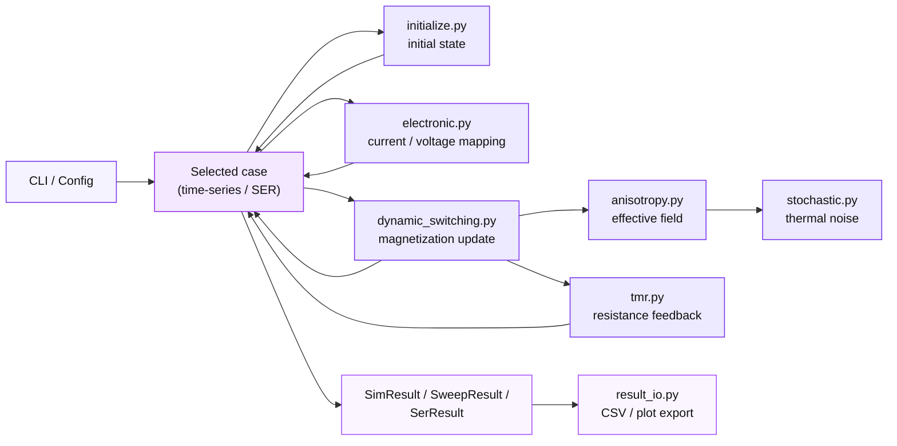

# vgsot-sim

A physics-based simulation toolkit for **VGSOT-MTJ (Voltage-Gated Spin-Orbit Torque Magnetic Tunnel Junction) and SOT-MTJ** switching dynamics. 

The simulator couples several physical effects into a time-domain switching model:

- Electronic transport (`V_MTJ`, `I_SOT`)
- Voltage-controlled magnetic anisotropy (**VCMA**)
- Thermal fluctuation field
- Analytical one-step **LLG magnetization update**
- **TMR resistance feedback**

This enables simulation of magnetization switching under realistic electrical excitation waveforms.

The package can be used either:

- as a **command-line simulator**
- as a **Python simulation library**


---

## Installation

Clone the repository and install in editable mode:

```bash
pip install -e .
```

Requirements (automatically installed):

- numpy
- matplotlib
- tqdm


---

## Information flow



This structure separates **physics kernels**, **experiment orchestration**, and **output utilities**, making the project usable both as a CLI simulator and as a reusable Python library.

For more details, please refer to: [Project structure](docs/structure.md)


---

## Running Simulation Cases

All experiments are exposed through a unified CLI:

```
vgsot-sim <case_name>
```

By default, outputs are written to:

- `./result/*.png` (figures)
- `./result/*.csv` (time series / sweep results)

You can change output directory via:

```
vgsot-sim <case_name> --out_dir my_results
```

Disable progress bars:

```
vgsot-sim <case_name> --no_progress
```

### Available cases

You can run all cases below (names match `src/vgsot_sim/cli.py`):

```
# 1) Three-terminal voltage control (V1,V2,V3 -> I_SOT,V_MTJ)
vgsot-sim terminal_voltage_control

# 2) Baseline: SOT-only, constant current pulse (V_MTJ=0)
vgsot-sim sot_only_constant_current

# 3) No-VCMA SOT switching: sweep I_SOT and overlay mz(t)
vgsot-sim sot_switching_no_vcma

# 4) SER vs I_SOT: no-VCMA + thermal noise (Monte-Carlo)
vgsot-sim ser_sot_no_vcma_thermal

# 5) VCMA-assisted: fix V_MTJ, sweep I_SOT and overlay mz(t)
vgsot-sim vcma_assisted_switching_isot_sweep

# 6) VCMA-assisted: fix I_SOT, sweep V_MTJ and overlay mz(t)
vgsot-sim vcma_assisted_switching_vmtj_sweep

# 7) optimized two-pulse scheme: sweep (t1,t2) and overlay mz(t)
vgsot-sim optimized_vgsot_switching

# 8) SER vs t1 for optimized scheme: thermal noise (Monte-Carlo)
vgsot-sim ser_optimized_vgsot
```

For more information, please refer to: [Simulation Cases and Their Physical Meaning](docs/cases.md)

Default parameters are listed in: [Default parameters by case](docs/parameters.md)


---

## Using as a Python library (recommended)

Besides running from command line, you can **import and run each case directly in your own Python scripts**, and override parameters as needed. The recommended workflow is:

1. Create a **configuration dataclass**
2. Run a **simulation case**
3. Optionally save results using `result_io`

---

### 1. Basic Python API usage

Quick start (minimal example)

```python
from vgsot_sim import sot_only_constant_current

res = sot_only_constant_current()
print(res.mz[-1])
```

Example: run a VCMA-assisted switching simulation.

```python
from vgsot_sim import (
    vcma_assisted_switching_isot_sweep,
    VcmaAssistedSwitchingIsotSweepConfig,
)

cfg = VcmaAssistedSwitchingIsotSweepConfig(
    v_mtj=1.1,
    i_sot_list=[-40e-6, -30e-6, -20e-6],
)

result = vcma_assisted_switching_isot_sweep(cfg)

print(result.time_s.shape)

print(result.mz_curves.keys())
print(result.r_mtj_curves.keys())
print(result.pulse_curves.keys())
```

Returned object:

| field             | type                    | description                |
| ----------------- | ----------------------- | -------------------------- |
| `time_s`          | `np.ndarray`            | simulation time axis       |
| `mz_curves`       | `dict[str, np.ndarray]` | magnetization trajectories |
| `r_mtj_curves`    | `dict[str, np.ndarray]` | MTJ resistance vs time     |
| `pulse_curves`    | `dict[str, np.ndarray]` | applied pulse waveform     |
| `switch_energy_j` | `dict[str, float]`      | switching energy           |
| `pulse_ylabel`    | `str`                   | label for pulse plot       |

Each entry in `curves` corresponds to one sweep parameter.

------

### 2. plotting results (optional)

```python
import matplotlib.pyplot as plt

for label, mz in result.mz_curves.items():
    plt.plot(result.time_s, mz, label=label)

plt.xlabel("time (s)")
plt.ylabel("mz")
plt.legend()
plt.show()
```

------

### 3. Running Monte-Carlo SER simulations

Example:

```python
from vgsot_sim import (
    ser_sot_no_vcma_thermal,
    SerSotNoVcmaThermalConfig,
)

cfg = SerSotNoVcmaThermalConfig(
    trials=500,
    i_sot_list=[-100e-6, -95e-6, -90e-6],
)

res = ser_sot_no_vcma_thermal(cfg)

print(res.x)      # I_SOT values
print(res.ser)    # switching error rate
```

Returned object:

```
SerResult
 ├── x   : ndarray
 ├── ser : ndarray
 └── x_label : str
```

------

### 4. Low-level simulation kernels (advanced users)

If you want full control over excitation waveforms, you can call the internal kernels directly:

```
run_piecewise_terminal_voltage(...)
run_piecewise_direct_excitation(...)
run_two_pulse_proposed(...)
```

Example:

```python
from vgsot_sim import run_piecewise_direct_excitation

res = run_piecewise_direct_excitation(
    sim_start_step=1,
    sim_mid1_step=2000,
    sim_mid2_step=3500,
    sim_end_step=5000,

    pap=1,

    v_mtj_stage1=0.0,
    v_mtj_stage2=0.0,
    v_mtj_stage3=0.0,

    i_sot_stage1=-90e-6,
    i_sot_stage2=0.0,
    i_sot_stage3=0.0,

    estt_stage1=0,
    esot_stage1=1,

    estt_stage2=0,
    esot_stage2=1,

    estt_stage3=0,
    esot_stage3=1,

    vnv=1,
    non=1,

    r_sot_fl_dl=0.83,
)

print(res.time_s)
print(res.mz)
```

These kernels return a `SimResult` dataclass containing the full time evolution of the system.

For full API documentation, please refer to: [API document](docs/api.md)

For more detailed API usage, please refer to: [CASES GUIDE](notebooks/docs_cases_notebook.ipynb)


------

### Notes

- `I_SOT` units: **Ampere**
- `V_MTJ` units: **Volt**
- time units: **seconds**

The simulation time step is defined in: 

```
vgsot_sim/constants.py
```

via:

```
constants.t_step
```

For reproducible Monte-Carlo runs:

```
import numpy as np
np.random.seed(0)
```


---

## Citation

If you use this simulator in academic research, please cite:

```
Zhang Jincheng. (2026). VGSOT-SIM: A VGSOT switching simulation toolkit [Computer software]. GitHub.
```

For more technical details, please refer to: [Technical Details](docs/technical_details.md)


