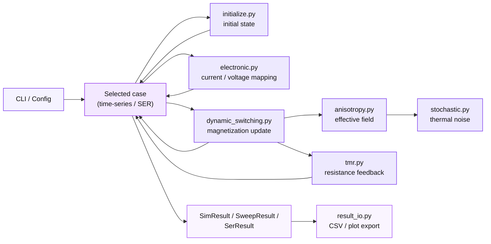
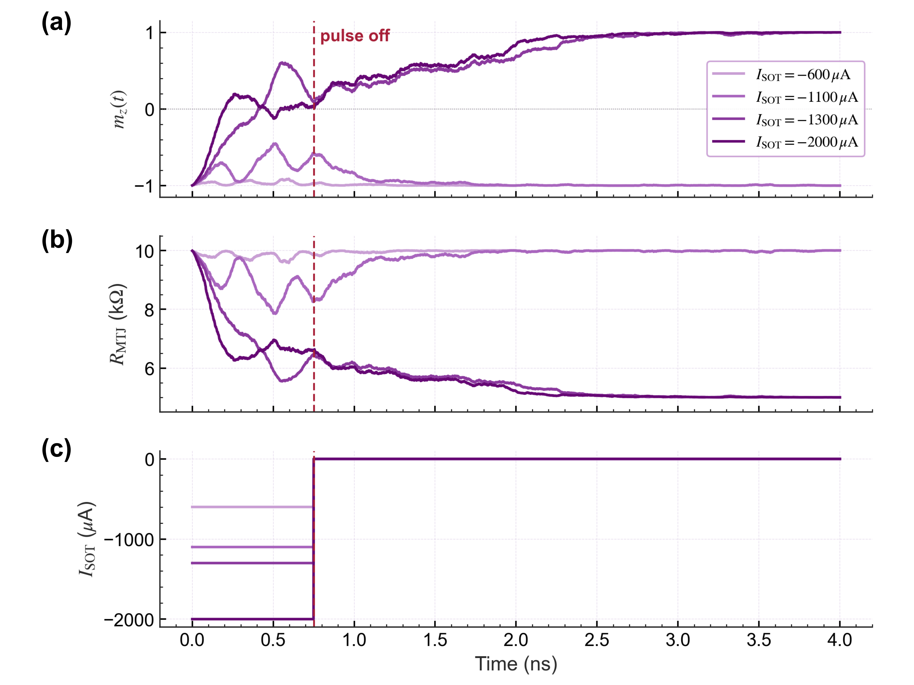
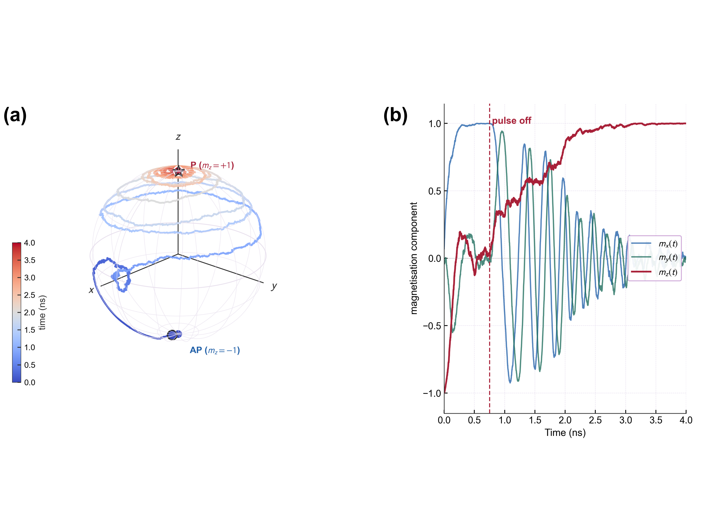
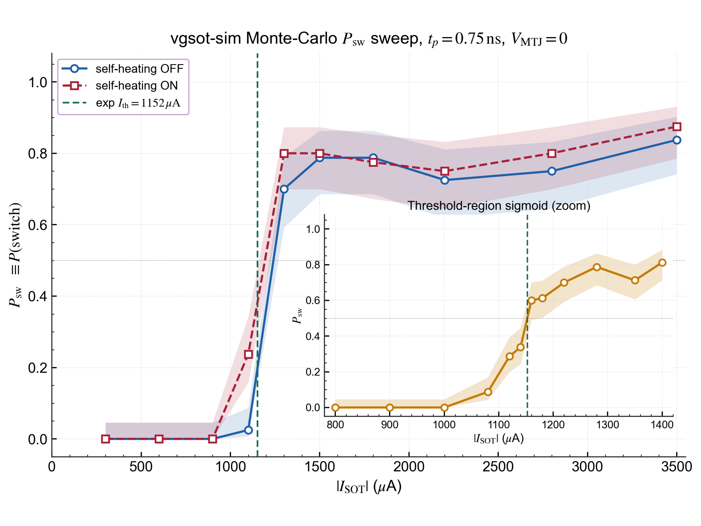

# vgsot-sim

A physics-based simulation toolkit for **VGSOT-MTJ (Voltage-Gated Spin-Orbit Torque Magnetic Tunnel Junction) and SOT-MTJ** switching dynamics, calibrated to the 80 nm β-W / CoFeB devices.

The simulator couples the following physical effects into a single time-domain
switching model:

- Three-terminal electronic transport (`V1, V2, V3` → `I_SOT`, `V_MTJ`)
- Voltage-controlled magnetic anisotropy (**VCMA**)
- Spin-transfer torque (STT) and damping-/field-like spin-orbit torque (SOT)
- Stochastic thermal-fluctuation field obeying the FDT (Brown 1963)
- PMA + demagnetisation (thin-disk **and** exact oblate-ellipsoid tensor)
- Coupled **self-heating RC dynamics** with `M_s(T)`, `K_i(T)` feedback
- Bias-dependent **TMR(V)** (Lorentzian or PDK 3-parameter form) with optional
  series-resistance toggle
- Two LLG integrators: legacy spherical-Euler (`(θ, φ)` closed form) and a
  norm-preserving **Cayley vector** stepper with explicit `σ̂_SH`

This combination reproduces the chapter §2.3.3 Sigmoid-shaped P_sw(V) curves at
the 0.75 ns operating point, the Néel–Brown V_th(t_w) trend, and the
process-variability budget of §2.3.5.

The package can be used either:

- as a **command-line simulator** (`vgsot-sim <case>`)
- as a **Python simulation library** (high-level case API + low-level kernels)
- or invoked from the **chapter-figure pipeline** under `scripts/`

For implementation status and release history, see:

- [Implementation status](docs/IMPLEMENTATION_STATUS.md) — physics-feature coverage map
- [Version notes](docs/version_notes.md) — release-by-release physics changes
- [Project structure](docs/structure.md) — package layout
- [Technical details](docs/technical_details.md) — full physics derivations & calibration notes


## Installation

Clone the repository and install in editable mode:

```bash
pip install -e .
```

Requirements (automatically installed):

- numpy
- scipy
- matplotlib
- tqdm

Tested on Python 3.10+. The chapter scripts under `scripts/09_simulation_figures/`
additionally mirror each rendered PNG into `article/00_chapter_drafts/figs/`
(the canonical chapter folder), so the manuscript and the code stay in
lock-step. Run them from inside a checkout that has those directories, or
delete the trailing `shutil.copy` line if you only want the local figure.


---

## Information flow


```mermaid
flowchart LR
    classDef io fill:#f5f3ff,stroke:#7c3aed,stroke-width:1.2px,color:#111;
    classDef case fill:#f3e8ff,stroke:#9333ea,stroke-width:1.2px,color:#111;
    classDef kernel fill:#ede9fe,stroke:#7c3aed,stroke-width:1.2px,color:#111;
    classDef out fill:#faf5ff,stroke:#a855f7,stroke-width:1.2px,color:#111;

    CLI["CLI / Config"]:::io
    CASE["Selected case<br/>(time-series / SER)"]:::case

    INIT["initialize.py<br/>initial state"]:::kernel
    ELEC["electronic.py<br/>current / voltage mapping"]:::kernel
    DYN["dynamic_switching.py<br/>magnetization update"]:::kernel
    ANI["anisotropy.py<br/>effective field"]:::kernel
    STO["stochastic.py<br/>thermal noise"]:::kernel
    TMR["tmr.py<br/>resistance feedback"]:::kernel

    RES["SimResult / SweepResult /<br/>SerResult"]:::out
    SAVE["result_io.py<br/>CSV / plot export"]:::out

    CLI --> CASE
    CASE --> INIT
    CASE --> ELEC
    CASE --> DYN
    DYN --> ANI
    ANI --> STO
    DYN --> TMR

    INIT --> CASE
    ELEC --> CASE
    DYN --> CASE
    TMR --> CASE

    CASE --> RES
    RES --> SAVE
```

This structure separates **physics kernels**, **experiment orchestration**, and **output utilities**, making the project usable both as a CLI simulator and as a reusable Python library.

For more details, please refer to: [Project structure](docs/structure.md)


---

## Running Simulation Cases

All experiments are exposed through a unified CLI:

```
vgsot-sim <case_name>
```

By default, outputs are written to:

- `./result/Chapter02_local_24.png` ... `Chapter02_local_27.png` (figures)
- `./result/*.csv` (time series / sweep results)

You can change output directory via:

```
vgsot-sim <case_name> --out_dir my_results
```

Disable progress bars:

```
vgsot-sim <case_name> --no_progress
```

### Available cases

The CLI now exposes only the four cases that map to the chapter §2.3.3 Device A
P→AP experimental protocol (same-batch detailed-`P_sw` measurement, `t_w = 0.75 ns`
write pulse, `V_MTJ = 0`):

```
# 1) Three-terminal voltage control — device demo (§2.1.1 T-circuit)
vgsot-sim terminal_voltage_control

# 2) Baseline: SOT-only, constant current pulse (V_MTJ=0)
vgsot-sim sot_only_constant_current

# 3) No-VCMA SOT switching: sweep I_SOT and overlay mz(t)
vgsot-sim sot_switching_no_vcma

# 4) Monte-Carlo P_sw vs |I_SOT| at 0.75 ns (chapter §2.3.3 main case)
vgsot-sim ser_sot_no_vcma_thermal
```

> **2026-05 pruning.** The earlier VCMA-assisted and two-pulse VGSOT cases
> (`vcma_assisted_switching_{isot,vmtj}_sweep`, `optimized_vgsot_switching`,
> `ser_optimized_vgsot`) have been removed: they came from the upstream
> Verilog-A port and have no counterpart in the same-batch Device A
> measurements that the package is now calibrated against. The
> [process-variability sweep](#5-process-variability-sweep-built-in-analysis-api)
> remains available as a Python-only API via `vgsot_sim.ser_cases.variability_sweep`.

> **Calibration note (2026-05).** Default `theta_SH = 0.066` (chapter §2.3.4
> calibration to Device A P→AP, V_th @ 0.75 ns ≈ 894 mV). With this default the
> deterministic switching threshold sits around `|I_SOT| ≈ 1.1 mA`, so the
> default `i_sot_list` brackets `0.7 – 1.5 mA` — not the µA range used by
> older versions. Pass `theta_SH=0.25` (literature β-W) explicitly when you
> need the bare-material regime.

For more information, please refer to: [Simulation Cases and Their Physical Meaning](docs/cases.md)

Default parameters are listed in: [Default parameters by case](docs/parameters.md)

### Chapter figure scripts (`scripts/`)

The `scripts/` folder is organised by thesis chapter section. Each subdirectory
mixes a small Python driver with the figures it produces, and the calibrated
defaults of `vgsot_sim` are the contract between them:

| Folder | Section | Purpose |
|---|---|---|
| `02_pdk/` | §2.2 | Hikstor 40 nm PDK behavioural model (`.scs` + `.va`) reference |
| `04_thermal_nonidealities/` | §2.2.2 | Thermal transients, M_s(T)/K_i(T) sweep, self-heating trajectory |
| `05_experimental_raw_data/` | §2.3 | Raw wafer-measurement data files |
| `06_psw_t_fitting/` | §2.3.3 | Hysteresis → V_th → Néel-Brown (Δ, V_c0) extraction |
| `07_process_variability/` | §2.3.5 | Brinkman CV(Δ) budget + D2D Monte-Carlo |
| `08_sampling_effect/` | §2.3.6 | Wilson coverage + MC sampling-size sensitivity |
| `09_simulation_figures/` | §2.3.3–2.3.4 | **New (2026-05): vgsot-sim chapter figures** |

The §2.3 analysis math previously inlined in scripts 06/07/08 is also exposed
as an importable API under `vgsot_sim.analysis` (`nb_fit`, `sigmoid_fit`,
`variability`, `sampling`). See [`src/vgsot_sim/analysis/__init__.py`](src/vgsot_sim/analysis/__init__.py).

#### `scripts/09_simulation_figures/` — vgsot-sim chapter figures

This is the latest research output: a small driver bundle that feeds the
calibrated `vgsot_sim` library through the §2.3.3 detailed-P_sw protocol
(`t_w = 0.75 ns` write pulse, `V_MTJ = 0`, P→AP) and renders three figures used
in the chapter.

| Script | Output figure | Demonstrates |
|---|---|---|
| `plot_single_trajectory.py` | `Chapter02_local_08.png` | Single-trajectory `(m_z, R_MTJ, I_SOT)` for sub-/just-above/super-threshold I_SOT, **self-heating ON**, with `M_s(T)` / `K_i(T)` feedback |
| `plot_3d_trajectory.py` | `Chapter02_local_09.png` | Magnetisation vector `m(t)` traced on the unit sphere + time-encoded colour, plus `m_x, m_y, m_z` time series |
| `plot_ser_mc.py` | `Chapter02_local_10.png` | Monte-Carlo P_sw vs `|I_SOT|` sweep at 0.75 ns with Wilson 95% CI, self-heating OFF/ON comparison, and a threshold-zoom inset around the experimental I_th ≈ 1152 µA |
| `calibrate_to_experiment.py` | (stdout) | θ_SH calibration scan against Device A V_th(0.75 ns) = 894 mV — produces the table that selected the `theta_SH = 0.066` default |

`plot_ser_mc.py` accepts CLI toggles that exercise the new physics options:

```bash
python plot_ser_mc.py --metric=psw          # default: report P_sw = 1 − SER (chapter convention)
python plot_ser_mc.py --metric=ser          # legacy: report SER directly
python plot_ser_mc.py --rng-mode=generator  # multiprocessing-friendly RNG (default: "legacy")
python plot_ser_mc.py --integrator=cayley   # norm-preserving Cartesian stepper (default: "euler_spherical")
```

Each driver writes to its own folder *and* mirrors the figure into
`article/00_chapter_drafts/figs/`, so the manuscript and the code stay in
lock-step. For the physics defaults these figures rely on (`theta_SH=0.066`,
`TMR=1.0`, `RA=16.6e-12 Ω·m²`, etc.) see [docs/technical_details.md §2.3](docs/technical_details.md).

Preview of the latest 09 outputs (full size + ON/OFF + Wilson CI inset are in
the script folder):

| Single trajectory | 3D magnetisation | Monte-Carlo P_sw |
|---|---|---|
|  |  |  |
| `Chapter02_local_08.png` | `Chapter02_local_09.png` | `Chapter02_local_10.png` |

For the upstream §2.2 device-physics figures see also:
[T-circuit](article/00_chapter_drafts/figs/Chapter02_local_01.png) ·
[behavioural layers](article/00_chapter_drafts/figs/Chapter02_local_02.png) ·
[vgsot-sim architecture](article/00_chapter_drafts/figs/Chapter02_local_07.png) ·
[self-heating trajectory](article/00_chapter_drafts/figs/Chapter02_local_06.png).


---

## Using as a Python library (recommended)

Besides running from command line, you can **import and run each case directly in your own Python scripts**, and override parameters as needed. The recommended workflow is:

1. Create a **configuration dataclass**
2. Run a **simulation case**
3. Optionally save results using `result_io`

---

### 1. Basic Python API usage

Quick start (minimal example)

```python
from vgsot_sim import sot_only_constant_current

res = sot_only_constant_current()
print(res.mz[-1])
```

Example: run a deterministic SOT sweep at the chapter §2.3.3 operating point.

```python
from vgsot_sim import (
    sot_switching_no_vcma,
    SotSwitchingNoVcmaConfig,
)

cfg = SotSwitchingNoVcmaConfig(
    # Defaults already use the §2.3.3 protocol; override I_SOT if you like.
    i_sot_list=[-1500e-6, -1200e-6, -1100e-6, -1000e-6, -800e-6],
)

result = sot_switching_no_vcma(cfg)

print(result.time_s.shape)

print(result.mz_curves.keys())
print(result.r_mtj_curves.keys())
print(result.pulse_curves.keys())
```

Returned object:

| field             | type                    | description                |
| ----------------- | ----------------------- | -------------------------- |
| `time_s`          | `np.ndarray`            | simulation time axis       |
| `mz_curves`       | `dict[str, np.ndarray]` | magnetization trajectories |
| `r_mtj_curves`    | `dict[str, np.ndarray]` | MTJ resistance vs time     |
| `pulse_curves`    | `dict[str, np.ndarray]` | applied pulse waveform     |
| `switch_energy_j` | `dict[str, float]`      | switching energy           |
| `pulse_ylabel`    | `str`                   | label for pulse plot       |

Each entry in `curves` corresponds to one sweep parameter.

------

### 2. plotting results (optional)

```python
import matplotlib.pyplot as plt

for label, mz in result.mz_curves.items():
    plt.plot(result.time_s, mz, label=label)

plt.xlabel("time (s)")
plt.ylabel("mz")
plt.legend()
plt.show()
```

------

### 3. Running Monte-Carlo SER simulations

Example:

```python
from vgsot_sim import (
    ser_sot_no_vcma_thermal,
    SerSotNoVcmaThermalConfig,
)

cfg = SerSotNoVcmaThermalConfig(
    trials=500,
    # Default theta_SH=0.066 puts the threshold near ~1.1 mA; pick the sweep range accordingly.
    i_sot_list=[-1500e-6, -1200e-6, -1100e-6, -1000e-6, -800e-6],
)

res = ser_sot_no_vcma_thermal(
    cfg,
    seed=2026,                # reproducible per-trial seeding
    enable_self_heating=True, # couple T(t) into M_s, K_i each step
    T_ambient_K=300.0,
)

print(res.x)      # I_SOT values (A)
print(res.ser)    # switching error rate
print(res.psw)    # equivalent switching success probability (1 − SER)
```

Returned object:

```
SerResult
 ├── x        : ndarray   # I_SOT values
 ├── ser      : ndarray   # switching error rate
 ├── psw      : property  # 1 − ser, the chapter-§2.3.3 convention
 └── x_label  : str
```

#### Reproducibility & integrator toggles

For Monte-Carlo runs that need to be byte-reproducible (regression tests,
chapter figures), pass `seed=` plus either `rng_mode="legacy"` (default, calls
`np.random.seed(...)` once per trial — matches the chapter figures bit-for-bit)
or `rng_mode="generator"` (independent `np.random.default_rng` per trial,
multiprocessing-friendly). Both modes derive the per-trial seeds from the same
`_trial_seed(seed, i_sot, trial_idx)` formula, so the *sequence* of seeds is
identical.

You can also force the LLG step type on the SER case:

```python
res = ser_sot_no_vcma_thermal(
    cfg, seed=2026,
    rng_mode="generator",        # "legacy" | "generator"
    integrator="cayley",         # None (stepper default) | "euler_spherical" | "cayley"
    enable_self_heating=True,
)
```

The Cayley vector stepper preserves `|m|=1` to machine precision and takes
`σ̂_SH` as an explicit 3-vector argument (default `[-1, 0, 0]`). After the
FL-SOT `dφ/dt` sign fix it shares the same right-hand side as the
spherical-Euler stepper (they agree to <1e-4; `tests/test_integrator_consistency.py`)
and is now the library stepper default; the effective `theta_SH` was
recalibrated to `0.066` against it. (The old euler-vs-Cayley note claimed only
~10 %; the true FL-SOT bug effect on V_th was ~40 %, the 0.066/0.04 ratio.)

------

### 4. Low-level simulation kernels (advanced users)

If you want full control over excitation waveforms, you can call the internal kernels directly:

```
run_piecewise_terminal_voltage(...)
run_piecewise_direct_excitation(...)
```

Example:

```python
from vgsot_sim import run_piecewise_direct_excitation

res = run_piecewise_direct_excitation(
    sim_start_step=1,
    sim_mid1_step=750,      # 0.75 ns write pulse  (at t_step = 1 ps)
    sim_mid2_step=4000,     # 3.25 ns relaxation tail
    sim_end_step=4000,

    pap=1,

    v_mtj_stage1=0.0, v_mtj_stage2=0.0, v_mtj_stage3=0.0,
    i_sot_stage1=-2000e-6,  # super-threshold pulse for the calibrated theta_SH=0.066
    i_sot_stage2=0.0,
    i_sot_stage3=0.0,

    estt_stage1=0, esot_stage1=1,
    estt_stage2=0, esot_stage2=1,
    estt_stage3=0, esot_stage3=1,

    vnv=0, non=1, r_sot_fl_dl=0.83,

    # ── New opt-in toggles (all default to the chapter behaviour) ──────────
    enable_self_heating=True,        # couple T(t) -> M_s(T), K_i(T) per step
    T_ambient_K=300.0,
    integrator="euler_spherical",    # or "cayley" for explicit sigma_SH
    sigma_SH=None,                   # default [-1, 0, 0]; Cayley only
    rng=None,                        # pass np.random.default_rng(seed) for byte-repro
)

print(res.time_s)
print(res.mz)
print(res.T_K)                       # populated when enable_self_heating=True
print(res.Ms_T, res.Ki_T)            # T-corrected material params per step
```

These kernels return a `SimResult` dataclass containing the full time evolution
of the system. With `enable_self_heating=True` the result additionally carries
`T_K`, `Ms_T`, `Ki_T` arrays for post-hoc inspection of the thermal coupling.

For full API documentation, please refer to: [API document](docs/api.md)

For more detailed API usage, please refer to: [CASES GUIDE](notebooks/docs_cases_notebook.ipynb)

### 5. Process-variability sweep (built-in `analysis` API)

Since 2026-05 the §2.3.5 Brinkman / MC variability budget is also exposed as a
first-class case so it can be re-derived in one call without the external
`07_process_variability` script:

```python
from vgsot_sim.ser_cases import variability_sweep

res = variability_sweep(
    Delta=5.15,      # thermal stability factor (chapter §2.3.3 NB fit)
    Vc0=0.884,       # zero-temperature critical voltage (V)
    tw_ns=0.75,      # pulse width
    beta_meas=44.6,  # Device A P→AP measured Sigmoid slope (V⁻¹)
)

print(res.cv_sweep)        # CV(Δ) values scanned
print(res.beta_combined)   # η_c · F(CV) · β_NB^fit, the joint D2D+C2C prediction
```

The lower-level math (`nb_fit`, `sigmoid_fit`, `variability`, `sampling`) is
also importable from `vgsot_sim.analysis`.


------

### Notes

- `I_SOT` units: **Ampere**
- `V_MTJ` units: **Volt**
- time units: **seconds**
- `pap=1` initialises in the **anti-parallel** state (`mz ≈ −1`); the
  resistance flat at the start of the simulation is `R_AP`, not `R_P`. This
  matches the chapter convention but surprises some readers — see
  [docs/IMPLEMENTATION_STATUS.md](docs/IMPLEMENTATION_STATUS.md) "Known caveats".

For reproducible Monte-Carlo runs, prefer the explicit-`rng=` plumbing over the
legacy global seed:

```python
import numpy as np
from vgsot_sim import run_piecewise_direct_excitation

rng = np.random.default_rng(seed=42)
res = run_piecewise_direct_excitation(..., rng=rng)
```

The legacy `np.random.seed(100)` path still works for older scripts when
`rng=None`. See [docs/technical_details.md §2.7](docs/technical_details.md) for
the full reproducibility model.


---

## Citation

If you use this simulator in academic research, please cite:

```
Zhang Jincheng. (2026). VGSOT-SIM: A VGSOT switching simulation toolkit [Computer software]. GitHub.
```

For more technical details, please refer to: [Technical Details](docs/technical_details.md)


