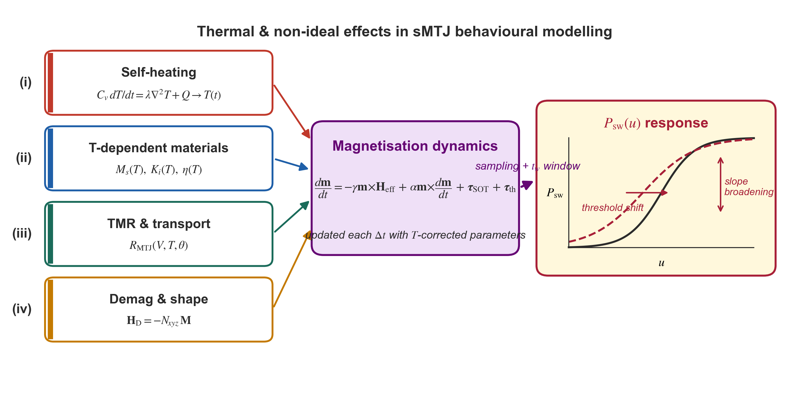
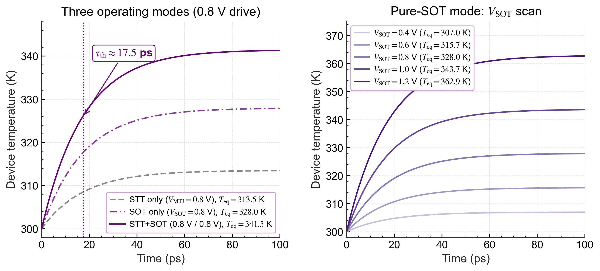
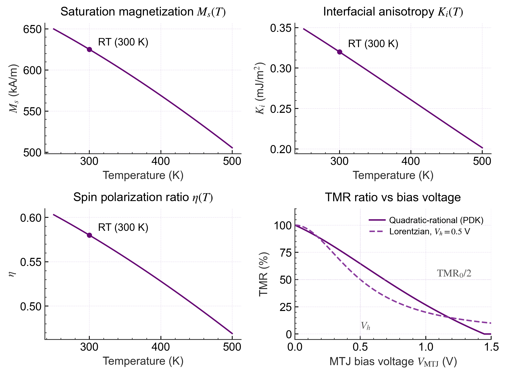
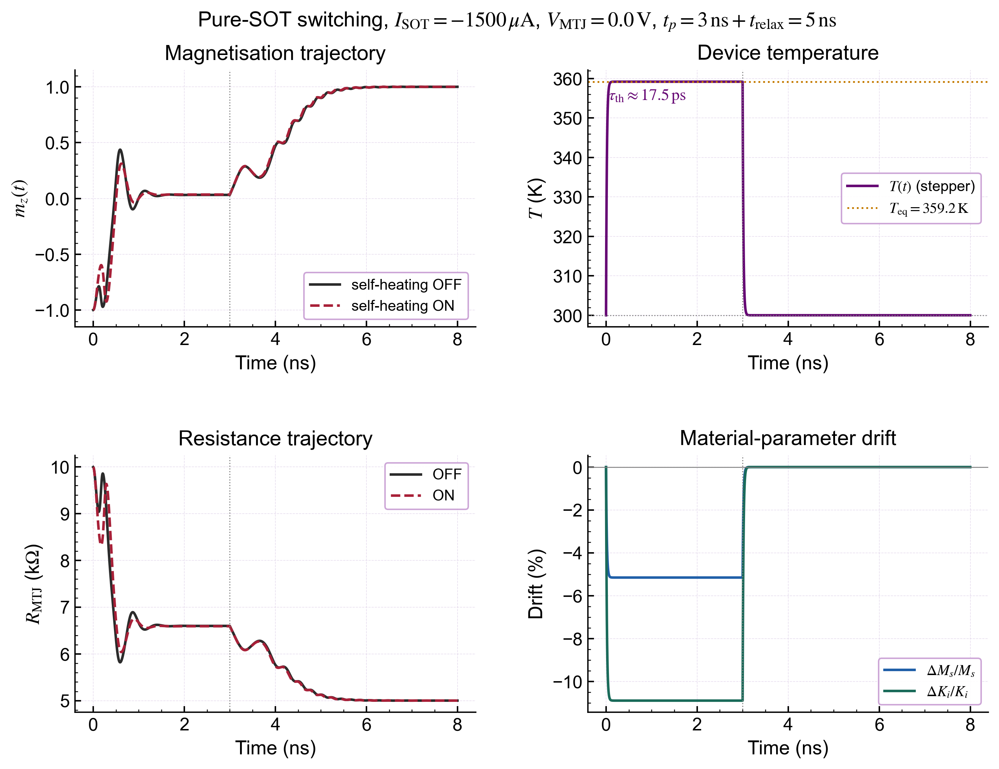
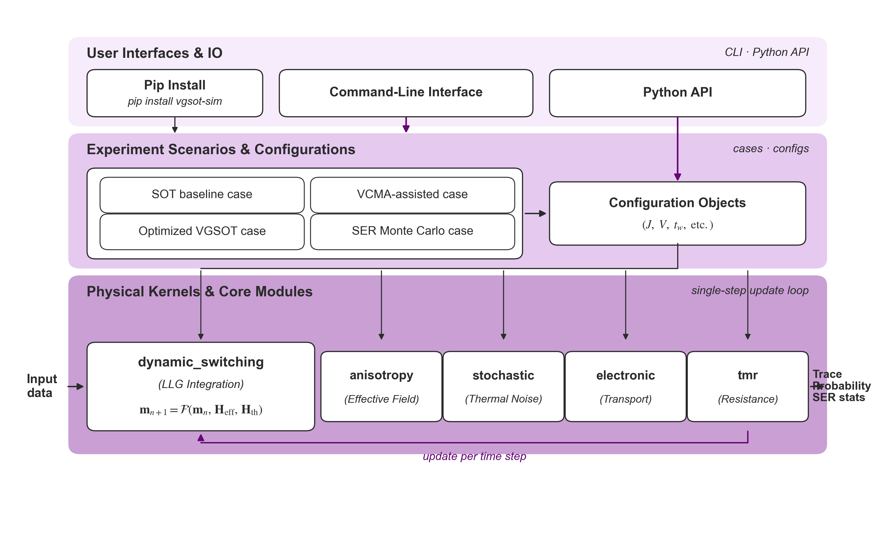
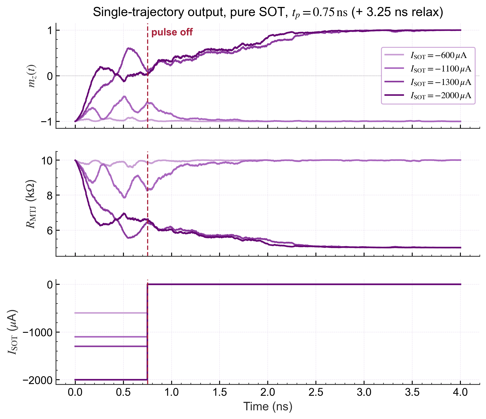
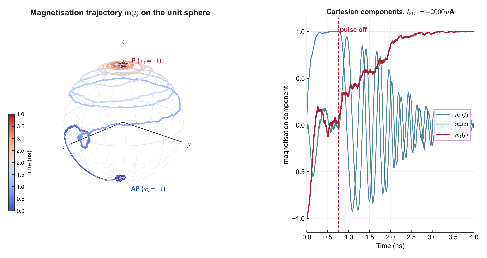
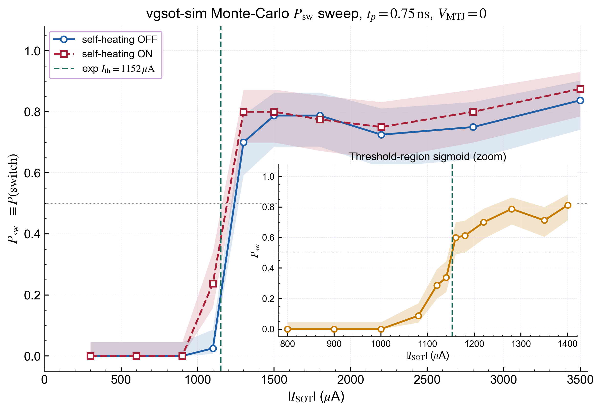

## 2.2　磁学仿真方法与平台

在基于MRAM的概率计算体系中，器件层面的随机磁化动力学决定了计算行为的本质。与传统确定性存储器不同，sMTJ在纳米尺度下的磁化翻转过程不可避免地受到热涨落影响，从而表现出显著的cycle-to-cycle（C2C）随机性。这种C2C随机性并非缺陷，而是在概率计算框架中被主动利用，用于实现硬件级随机采样与概率推断。前文已经从统计角度给出了基于Néel–Brown模型的sMTJ翻转概率行为模型，本节则从磁化动力学出发，通过sLLG方程与磁场热噪声项建模推导出概率行为的物理起源，从而实现从微观动力学到宏观概率模型的统一描述。

磁化动力学的建模通常可以分为宏自旋模型与微磁模型两种层级。宏自旋模型假设自由层磁化在空间上均匀，仅随时间演化，适用于尺寸较小、接近单畴的器件结构；微磁模型则进一步引入空间离散化与交换相互作用，能够描述复杂磁畴结构与非均匀动力学行为。当器件物理直径$$D_{\mathrm{phys}}$$小于单畴临界尺寸$$l_{\mathrm{ex}} = \sqrt{2A_{\mathrm{ex}}/(\mu_0 M_s^2)}$$时，自由层可被合理地视为空间均匀的单一磁矩[1]。考虑到本文所研究的80 nm级MTJ器件满足该条件，同时研究重点在于概率翻转统计特性与电路级耦合效率，因此采用宏自旋模型作为基础，并在其上引入热噪声与VCMA调制项，从而在保证物理准确性的同时兼顾计算效率。

全节安排如下：2.2.1节建立包含STT、SOT与VCMA项的扩展LLG方程，并推导有效磁场的各物理分量；2.2.2节在此基础上补充温度效应与器件非理想性，包括自热建模、材料参数温度依赖、TMR非线性以及退磁形状效应；2.2.3节介绍适用于随机微分方程的保模长数值积分算法与Monte Carlo统计方法；2.2.4节介绍与上述理论框架配套的开源仿真平台vgsot-sim；2.2.5节对基于该平台的数值仿真流程与可输出观测量给出形式化说明。

---

### 2.2.1　磁化动力学基础模型

#### 2.2.1.1　Landau–Lifshitz–Gilbert方程与自旋力矩项

自由层磁化矢量$$\mathbf{m}$$（已归一化，$$|\mathbf{m}|=1$$）的时间演化由扩展的Landau–Lifshitz–Gilbert（LLG）方程描述。该方程最初由Landau和Lifshitz于1935年在铁磁共振理论框架下提出[2]，Gilbert于1955年引入耗散项并将其改写为与实验更为吻合的阻尼形式[3]，后经Slonczewski[4]与Berger[5]在1996年分别独立地将自旋转移力矩（STT）引入；本文所关注的SOT-MTJ体系进一步纳入了由重金属层自旋霍尔效应产生的自旋轨道力矩（SOT）项[6,7]。其完整隐式形式为

$$
\frac{\partial \mathbf{m}}{\partial t}
= -\gamma \mathbf{m} \times \mathbf{H}_{\mathrm{eff}}
+ \alpha \mathbf{m} \times \frac{\partial \mathbf{m}}{\partial t}
+ \boldsymbol{\tau}_{\mathrm{STT}}
+ \boldsymbol{\tau}_{\mathrm{SOT}}
$$

其中$$\gamma$$为旋磁比，$$\alpha$$为Gilbert阻尼系数，$$\mathbf{H}_{\mathrm{eff}}$$为有效磁场（详见2.2.1.2节），$$\boldsymbol{\tau}_{\mathrm{STT}}$$、$$\boldsymbol{\tau}_{\mathrm{SOT}}$$分别为两类自旋力矩项。本小节先给出二者的物理表达，再给出显式数值求解形式。

**STT项。** 自旋转移力矩源自穿过MTJ势垒的隧穿电流中的极化电子，经过自由层时把自旋角动量转移给局域磁矩。以自由层归一化磁化矢量$$\mathbf{m}$$与参考层固定磁化方向$$\hat{\mathbf{m}}_p$$表示，Slonczewski与Berger独立推导得到阻尼型分量
$$
\boldsymbol{\tau}_{\mathrm{STT,DL}}
= -\gamma\,a_J\,\mathbf{m}\times(\mathbf{m}\times\hat{\mathbf{m}}_p),
\qquad
a_J \equiv \frac{\hbar P J_{\mathrm{STT}}}{2 e \mu_0 M_s t_f}
$$

其中$$J_{\mathrm{STT}}=I_{\mathrm{MTJ}}/A_{\mathrm{MTJ}}$$为隧穿电流密度，$$P$$为自旋极化率（CoFeB/MgO界面取约0.58[9]）。$$a_J$$具有磁场量纲（A/m），等价于将STT折算到与PMA同形式的等效阻尼型场$$H_{\mathrm{DL}}^{\mathrm{STT}}=a_J$$。同时存在共轭的场型分量

$$
\boldsymbol{\tau}_{\mathrm{STT,FL}} = +\gamma\,b_J\,\mathbf{m}\times\hat{\mathbf{m}}_p,
\qquad
b_J = \beta_{\mathrm{STT}}^{\mathrm{FL/DL}}\,a_J,
$$

工程上以比例系数$$\beta_{\mathrm{STT}}^{\mathrm{FL/DL}}\in[0,0.3]$$参数化；对垂直MTJ这一比值偏小，本工作中按0处理。注意$$\mathbf{m}\times\hat{\mathbf{m}}_p$$在$$\mathbf{m}$$靠近极轴（$$\hat{\mathbf{m}}_p=\pm\hat{\mathbf{z}}$$）时随$$\sin\theta$$线性消失，因此纯STT写入需要依赖热涨落把磁化从极轴附近偏离才能启动翻转。

**SOT项。** 自旋轨道力矩由重金属层（如Ta、$$\beta$$-W）中的自旋霍尔效应产生：横向电流通过自旋霍尔角$$\theta_{\mathrm{SH}}$$转换为纵向自旋流，在重金属/铁磁层界面累积出极化方向$$\boldsymbol{\sigma}=\hat{\mathbf{z}}\times\hat{\mathbf{j}}$$的自旋极化，进而对自由层磁矩施加力矩。该力矩按物理机制分解为阻尼型（DL）与场型（FL）两个分量[8]：
$$
\boldsymbol{\tau}_{\mathrm{SOT}}
= -\gamma H_{\mathrm{DL}}^{\mathrm{SOT}}\,\mathbf{m}\times(\mathbf{m}\times\boldsymbol{\sigma})
+ \gamma H_{\mathrm{FL}}^{\mathrm{SOT}}\,\mathbf{m}\times\boldsymbol{\sigma}
$$

其中DL分量的等效场幅值由自旋霍尔角$$\theta_{\mathrm{SH}}$$、沟道电流密度$$J_{\mathrm{SOT}}=I_{\mathrm{SOT}}/A_{\mathrm{SOT}}$$以及自由层厚度$$t_f$$共同决定：

$$
H_{\mathrm{DL}}^{\mathrm{SOT}}
= \frac{\hbar \theta_{\mathrm{SH}} J_{\mathrm{SOT}}}{2 e \mu_0 M_s t_f},
\qquad
H_{\mathrm{FL}}^{\mathrm{SOT}} = \beta_{\mathrm{SOT}}^{\mathrm{FL/DL}}\,H_{\mathrm{DL}}^{\mathrm{SOT}}.
$$

DL分量与Gilbert阻尼等价但方向相反，超过临界电流密度后可驱动磁化发生确定性翻转或进入概率性翻转窗口。与STT不同，$$\mathbf{m}\times(\mathbf{m}\times\boldsymbol{\sigma})$$在$$\boldsymbol{\sigma}$$与极轴正交（如$$\boldsymbol{\sigma}\perp\hat{\mathbf{z}}$$）时即便$$\mathbf{m}\parallel\hat{\mathbf{z}}$$也保持有限，故SOT写入无需热涨落即可在极轴附近启动，亚纳秒级翻转因此成为可能。FL分量等效为附加偏置场，对翻转阈值有修正作用；对称界面结构中其幅值通常远小于DL分量，但在某些重金属-铁磁体系中FL/DL比值可达$$0.5\sim1$$，仍须显式纳入。

**STT与SOT的对照。** 二者在器件依赖性与工作机制上的核心差异由下表归纳。

**表2.1**　STT与SOT两种自旋力矩驱动机制的对照表

| 物理量 | STT (Slonczewski) | SOT (Spin Hall) |
|---|---|---|
| 驱动电流路径 | $$I_{\mathrm{MTJ}}=V_{\mathrm{MTJ}}/R_{\mathrm{MTJ}}$$，纵贯隧道势垒 | $$I_{\mathrm{SOT}}=(V_2-V_3)/R_{\mathrm{SOT}}$$，沿重金属沟道横向 |
| 阻尼型等效场 | $$H_{\mathrm{DL}}^{\mathrm{STT}}=\hbar P J_{\mathrm{STT}}/(2e\mu_0 M_s t_f)$$ | $$H_{\mathrm{DL}}^{\mathrm{SOT}}=\hbar\theta_{\mathrm{SH}}J_{\mathrm{SOT}}/(2e\mu_0 M_s t_f)$$ |
| 效率因子 | 自旋极化率$$P\sim 0.58$$ | 自旋霍尔角$$\theta_{\mathrm{SH}}$$（$$\beta$$-W体系约0.04–0.4，与厚度强相关） |
| 自旋极化方向 | $$\hat{\mathbf{m}}_p$$（参考层磁化方向） | $$\boldsymbol{\sigma}=\hat{\mathbf{z}}\times\hat{\mathbf{j}}$$（由电流方向决定） |
| 极轴处力矩 | $$\propto\sin\theta\to 0$$（启动需热涨落） | 始终有限（无需启动阈值） |
| 翻转能耗主因 | 隧穿耗散$$\propto V_{\mathrm{MTJ}}^2/R_{\mathrm{MTJ}}$$ | 沟道焦耳热$$\propto V_{\mathrm{SOT}}^2/R_{\mathrm{SOT}}$$ |
| 写入–读取通道 | 共用（写电流流过MTJ） | 解耦（写流沟道，读流势垒） |

本文以SOT为单器件主驱动机制：SOT力矩在极轴附近不消失，写入延迟可压至亚纳秒级；读写通道解耦避免了STT写入时势垒长期承受高偏压所引发的可靠性退化；三端结构还允许VCMA偏压与SOT电流独立调度，从而支持2.1.3节给出的SOT-VCMA联合驱动模型。STT项在本框架中保留为可选支路，用于STT-only写入能耗基准与STT+SOT联合校核。

**显式数值形式。** 在数值求解中，直接对隐式LLG积分会导致迭代步骤复杂、计算代价高昂。利用矢量恒等式$$\mathbf{m}\times(\mathbf{m}\times\mathbf{H})=(\mathbf{m}\cdot\mathbf{H})\mathbf{m}-\mathbf{H}$$以及$$|\mathbf{m}|=1$$的约束，可将其改写为不含$$\partial\mathbf{m}/\partial t$$隐式项的显式Landau–Lifshitz–Slonczewski（LLS）形式：

$$
\frac{d\mathbf{m}}{dt}
= -\frac{\gamma}{1+\alpha^2}
\left[
\mathbf{m}\times\mathbf{H}_{\mathrm{eff}}
+ \alpha\,\mathbf{m}\times(\mathbf{m}\times\mathbf{H}_{\mathrm{eff}})
\right]
+ \mathbf{T}_{\mathrm{ext}}
$$

其中$$\mathbf{T}_{\mathrm{ext}} = \boldsymbol{\tau}_{\mathrm{STT}}+\boldsymbol{\tau}_{\mathrm{SOT}}$$为经$$(1+\alpha^2)$$预因子修正后的全部外加力矩之和，该因子由Gilbert阻尼项的消去过程引入。该显式形式将进动项与阻尼项分离，避免了隐式方程在大$$\alpha$$极限下的数值不稳定问题。在实际仿真中，时间步长须满足$$\Delta t\ll(\gamma H_{\mathrm{eff}})^{-1}$$以保证积分稳定性；具体的保模长几何积分算法在2.2.3节详述。

---

#### 2.2.1.2　有效磁场建模

有效磁场$$\mathbf{H}_{\mathrm{eff}}$$由多个物理机制叠加而成：

$$
\mathbf{H}_{\mathrm{eff}}
= \mathbf{H}_{\mathrm{PMA}} + \mathbf{H}_{\mathrm{VCMA}}
+ \mathbf{H}_{\mathrm{D}} + \mathbf{H}_{\mathrm{EX}} + \mathbf{H}_{\mathrm{TH}}
$$

以下分别给出各分量的物理起源与数学表达。

**垂直磁各向异性场（PMA）。** 在CoFeB/MgO界面体系中，由于Fe-O键的轨道杂化，界面处积累的垂直各向异性能可在较薄的自由层中克服形状各向异性，从而使易磁化轴沿垂直于薄膜平面的$$z$$方向稳定。其等效场为
$$
\mathbf{H}_{\mathrm{PMA}}
= \frac{2K_i}{\mu_0 M_s t_f}\,m_z\,\hat{z}
$$

其中$$K_i$$为单位面积界面各向异性能密度，$$M_s$$为饱和磁化强度，$$t_f$$为自由层厚度。该场沿$$z$$轴方向对磁化产生恢复力，是PMA-MTJ中能垒的主要来源。

**VCMA等效场。** 电压调控磁各向异性（VCMA）效应是指在MgO势垒两端施加电压时，界面电场改变Fe-O键的轨道占据，从而调制$$K_i$$的大小[10]。在线性响应范围内，VCMA等效磁场可写为

$$
\mathbf{H}_{\mathrm{VCMA}}
= -\frac{2\beta_{\mathrm{VCMA}}\,V_{\mathrm{MTJ}}}{\mu_0 M_s\,t_{\mathrm{ox}}\,t_f}\,m_z\,\hat{z}
$$

其中$$\beta_{\mathrm{VCMA}}$$为VCMA系数（单位fJ·V$$^{-1}$$·m$$^{-1}$$），$$V_{\mathrm{MTJ}}$$为MTJ两端电压，$$t_{\mathrm{ox}}$$为MgO势垒厚度。$$\mathbf{H}_{\mathrm{VCMA}}$$与$$\mathbf{H}_{\mathrm{PMA}}$$同向叠加，即正向电压降低等效各向异性场、削减能垒，这一特性是VGSOT写入方案中实现低功耗辅助翻转的物理基础。

**退磁场。** 有限尺寸的磁性薄层在磁化过程中会产生与磁化方向相反的退磁场，其表达式为
$$
\mathbf{H}_{\mathrm{D}} = -M_s\,\mathbf{N}\cdot\mathbf{m}
$$

其中$$\mathbf{N}$$为退磁张量。对于圆柱形MTJ自由层（$$t_f \ll D_{\mathrm{phys}}$$），在薄圆盘极限下退磁因子可近似为

$$
N_x = N_y \approx \frac{\pi t_f}{4D_{\mathrm{phys}}},\qquad
N_z = 1 - 2N_x
$$

需要指出的是，上述退磁因子表达式是对$$t_f/D_{\mathrm{phys}} \ll 1$$极限下扁椭球体的线性化近似，适用于快速定性估算。当器件尺寸缩减或自由层厚度增大、宽厚比不满足薄圆盘近似时，应采用精确的椭球体解析公式，具体形式将在2.2.2.4节给出，实际仿真中亦采用该精确式。此外，该近似表达式中的直径取物理直径$$D_{\mathrm{phys}}$$，而电学有效直径$$D_{\mathrm{elec}}$$因边缘刻蚀效应通常较$$D_{\mathrm{phys}}$$小约5–10 nm，两者的区分在2.2.2.4节一并讨论。

**交换偏置场。** 为实现无外加磁场条件下的确定性场无关SOT翻转，VGSOT结构中引入了合成反铁磁（SAF）层或直接的反铁磁钉扎层以提供面内交换偏置场：

$$
\mathbf{H}_{\mathrm{EX}} = H_{\mathrm{EX}}\,\hat{y}
$$

该偏置场打破了SOT翻转中$$\pm z$$方向的等效对称性，使驱动电流的极性与翻转方向之间形成确定性的一一对应关系。

**热噪声场。** 在有限温度下，自由层磁矩与晶格声子系统之间的热涨落通过涨落-耗散定理（fluctuation-dissipation theorem）耦合进入LLG方程[11]。Brown于1963年在单畴粒子框架下严格证明，与Gilbert阻尼$$\alpha$$共轭的热随机场$$\mathbf{H}_{\mathrm{TH}}$$必须满足白噪声统计，其二阶相关函数为[12]
$$
\langle H_{\mathrm{TH},i}(t)\,H_{\mathrm{TH},j}(t')\rangle
= \delta_{ij}\,\delta(t-t')\,
\frac{2k_BT\alpha}{\mu_0 M_s \gamma V}
$$

其中$$k_B$$为Boltzmann常数，$$T$$为器件瞬态温度，$$V = \pi D_{\mathrm{phys}}^2 t_f/4$$为自由层体积，$$i,j \in \{x,y,z\}$$。上述二阶相关函数表明热噪声场在各分量间互不相关（$$\delta_{ij}$$），且在时间上为白噪声（$$\delta(t-t')$$），其幅度正比于$$\sqrt{\alpha T/(M_s\gamma V)}$$，即较大的阻尼、较高的温度或较小的磁矩体积均会增强热涨落强度。

在数值离散化实现中，为与有限时间步$$\Delta t$$相容，对连续白噪声功率谱密度进行时域积分并在每步独立重新采样，得到各分量的等效高斯随机场幅值：

$$
\mathbf{H}_{\mathrm{TH}}
= \boldsymbol{\xi}\sqrt{\frac{2k_BT\alpha}{\mu_0 M_s \gamma V \Delta t}}
$$

其中$$\boldsymbol{\xi} = (\xi_x, \xi_y, \xi_z)^{\mathrm{T}}$$，各分量为相互独立的标准正态随机变量，即$$\xi_i \sim \mathcal{N}(0,1)$$。离散采样形式等价于以时间步$$\Delta t$$对原始相关函数中的$$\delta(t-t')$$进行积分后得到的离散版本，García-Palacios和Lázaro于1998年对此给出了详细推导，并验证了该采样方式在Stratonovich随机积分意义下的自洽性[13]。

值得指出的是，在前期一些公开的VGSOT-MTJ紧凑模型的Python移植实现[27]中，存在一个对统计学结论影响显著的实现细节差异：$$\boldsymbol{\xi}$$被生成为三维高斯样本后再显式归一化为单位向量$$\boldsymbol{\xi}\leftarrow\boldsymbol{\xi}/|\boldsymbol{\xi}|$$，相当于将$$|\mathbf{H}_{\mathrm{TH}}|^2$$从$$\chi^2_3$$分布锁定为常数，违反了FDT对各分量方差的硬性约束（正确实现下$$\mathbb{E}[|\mathbf{H}_{\mathrm{TH}}|^2]=3\sigma_{\mathrm{th}}^2$$，而归一化后$$|\mathbf{H}_{\mathrm{TH}}|^2\equiv\sigma_{\mathrm{th}}^2$$），等效将注入噪声功率压缩了三倍。其物理后果是临界电压附近的$$P_{\mathrm{sw}}(V)$$曲线在仿真中显著陡于实测，从而严重低估Sigmoid斜率的D2D展宽因子$$\eta_c$$。本工作配套仿真器采用三分量独立$$\mathcal{N}(0,1)$$采样以确保与FDT严格自洽，2.3.5节中给出的$$\eta_c$$与$$\mathcal{F}(\mathrm{CV})$$标定数值即基于修正后的实现。

需要注意的是，上述采样式中的温度$$T$$在引入自热效应后将成为随时间步演化的动态状态变量，而非固定常数，具体耦合更新机制在2.2.2节与2.2.3节给出。

至此，上述各有效场分量与热噪声采样表达式共同构成了驱动LLS方程的完整有效场模型。各分量的物理参数取值依据2.2.2节各小节末尾列出的器件参数表（2.2.2.1节末表2.2、2.2.2.2节末表2.3、2.2.2.3节末表2.4），而离散热噪声采样中温度$$T$$与材料参数$$M_s(T)$$、$$K_i(T)$$之间的耦合反馈关系，则是2.2.2节温度效应建模的核心内容。

---

---

### 2.2.2　温度效应与器件非理想性

前述磁化动力学模型主要刻画了自由层在有效磁场、自旋力矩与热噪声共同作用下的随机演化规律。然而，对于面向工程实现的VGSOT-MTJ或SOT-MTJ紧凑模型而言，仅有理想化的磁化动力学方程仍然不足以准确描述实际器件行为。其原因在于，写入过程本身会引起明显的焦耳热积累，自由层材料参数随温度变化而漂移，隧穿输运特性同时受到偏压与温度共同调制，而器件有限尺寸又会通过退磁场和形状各向异性进一步影响等效能垒与翻转阈值。因此，在概率翻转建模中，温度效应与器件非理想性并非附属修正项，而是决定概率曲线展宽、阈值漂移以及读写不对称性的关键来源。下面在统一符号体系下，对这些因素进行集中建模。

需要特别说明本节各物理量与2.2.1节LLG方程之间的耦合关系。在每一个离散时间步内，热扩散方程先以当前电学状态更新器件温度$$T$$；随后，$$T$$的变化通过2.2.2.2节的温度依赖关系同步更新材料参数$$M_s(T)$$、$$K_i(T)$$和$$\eta(T)$$；更新后的材料参数重新计算有效场各分量$$\mathbf{H}_{\mathrm{PMA}}$$、$$\mathbf{H}_{\mathrm{D}}$$及热噪声幅度；最终以新的有效场驱动Cayley变换推进磁化矢量$$\mathbf{m}$$的演化。这条$$T\to$$材料参数$$\to\mathbf{H}_{\mathrm{eff}}\to\mathbf{m}$$的逐步反馈链，是本文紧凑模型区别于零温LLG仿真的核心特征，也是2.2.3节数值求解框架必须在每步内完整执行的物理约束。图2.3以示意形式汇总了本节所涉及的四条非理想通道，即自热源与热扩散模型、温度依赖的磁性参数漂移、TMR与电输运非线性、以及退磁与形状效应，并标明了各通道对概率翻转曲线阈值漂移与斜率展宽的最终影响路径。

**图2.3**　sMTJ温度效应与非理想性建模。自热源与热扩散模型为器件温度提供瞬态演化通道；温度依赖材料参数漂移经由$$M_s(T)$$、$$K_i(T)$$、$$\eta(T)$$调制能垒与驱动力矩；TMR与电输运非线性确定读出电阻对磁化方向、偏压与温度的连续映射；退磁与形状效应经由退磁因子改变有效各向异性。四条通道汇聚至概率翻转$$P_{\mathrm{sw}}$$的宏观响应，表现为阈值漂移与斜率变缓两类非理想特征。

---

#### 2.2.2.1　自热效应

在写入脉冲作用下，器件内部电流耗散会转化为热源，使MTJ实际温度偏离环境温度。其基本控制方程由热扩散方程给出[14]：

$$
C_v \frac{dT}{dt} = \lambda \nabla^2 T + Q
$$

其中$$C_v$$为单位体积热容，$$\lambda$$为热导率，$$Q$$为体热源项。对于电流驱动的磁性器件，焦耳热一般写为

$$
Q = \rho j^2
$$

其中$$\rho$$为等效电阻率，$$j$$为电流密度。对于传统STT-MTJ，热源仅来自穿过MTJ结柱的隧穿电流，可将其折算为单位体积功率密度：

$$
Q_{\mathrm{MTJ}}
=
\frac{V_{\mathrm{MTJ}}^2}{R_{\mathrm{MTJ}} A_{\mathrm{MTJ}}}
\cdot
\frac{1}{t_{\mathrm{MTJ}}}
$$

将上述MTJ热源表达式代入热扩散方程，并将结柱沿厚度方向简化为一维等效热网络，可得MTJ温度演化表达式[15]：

$$
C_v t_{\mathrm{MTJ}} \frac{dT}{dt}
=
\frac{V_{\mathrm{MTJ}}^2}{R_{\mathrm{MTJ}}}
\cdot
\frac{4}{\pi D_{\mathrm{phys}}^2}
-
\frac{\lambda_{\mathrm{MgO}}}{t_{\mathrm{MgO}}}(T-T_0)
$$

其中$$t_{\mathrm{MTJ}}$$为MTJ柱总厚度，$$D_{\mathrm{phys}}$$为物理直径，$$t_{\mathrm{MgO}}$$为MgO势垒厚度，$$T_0$$为环境温度，$$\lambda_{\mathrm{MgO}}$$为MgO薄膜热导率。等号右侧第一项表示焦耳热注入，第二项表示器件通过MgO层向外散热。此处以MgO作为主散热路径是基于其热导率显著低于CoFeB和上下金属电极的事实，MgO纳米薄膜的热导率约为4 W/(m·K)，远低于金属层的50–100 W/(m·K)量级，因此MgO热阻构成整个热路的主要瓶颈，一维近似的误差对70–90 nm量级MTJ的温升估算在可接受范围内[16]。

对于SOT-MTJ或VGSOT-MTJ，自热问题更为复杂，原因是热源不再只来自隧穿电流，重金属沟道中的SOT写入电流同样会产生显著焦耳热。SOT沟道的体热源密度为

$$
Q_{\mathrm{SOT}}
=
\frac{V_{\mathrm{SOT}}^2}{R_{\mathrm{SOT}} A_{\mathrm{SOT}}}
\cdot
\frac{1}{t_{\mathrm{SOT}}}
$$

其中$$A_{\mathrm{SOT}} = W_{\mathrm{SOT}} \times L_{\mathrm{SOT}}$$为SOT沟道的俯视面积，$$t_{\mathrm{SOT}}$$为重金属层厚度。将SOT沟道热源的贡献等效折算到MTJ柱所覆盖的面积内，总的温度演化方程修正为

$$
C_v t_{\mathrm{MTJ}} \frac{dT}{dt}
=
\frac{V_{\mathrm{MTJ}}^2}{R_{\mathrm{MTJ}}}
\cdot
\frac{4}{\pi D_{\mathrm{phys}}^2}
+
\frac{V_{\mathrm{SOT}}^2}{R_{\mathrm{SOT}} A_{\mathrm{SOT}}}
\cdot
\frac{t_{\mathrm{MTJ}}}{L_{\mathrm{SOT}}}
-
\frac{\lambda_{\mathrm{MgO}}}{t_{\mathrm{MgO}}}(T-T_0)
$$

需要指出，上述总温度演化方程对散热路径沿用了纯STT情形下以MgO为主的单路径假设。对于SOT-MTJ结构，MTJ与重金属沟道之间的底部界面同样提供热传导通道；然而考虑到该界面处存在TaN或Ta种子层，其等效界面热阻与MgO层量级相近，因此以MgO单路径表征整体热阻仍为合理的工程近似，更精确的处理可引入双路径热网络，对此不在本文讨论范围。

该模型说明，SOT写入过程中器件温升往往高于纯STT情形，原因是沟道电流密度通常更高，且额外热功率直接注入MTJ下方。从仿真实现角度，上述温度演化方程能够以较低计算代价近似取代三维热有限元分析，直接嵌入行为级平台；而其动态性，即$$T$$随每个时间步内$$V_{\mathrm{MTJ}}$$和$$V_{\mathrm{SOT}}$$的变化而更新，正是将自热效应纳入概率翻转建模不可回避的物理前提。

为定量考察上述热模型在本文基准器件上的行为，将器件参数代入温度演化方程，得到如图2.4所示的瞬态温升仿真结果。器件热时间常数$$\tau_{\mathrm{th}} = C_v t_{\mathrm{MTJ}} t_{\mathrm{MgO}}/\lambda_{\mathrm{MgO}}$$在本参数下约为17.5 ps，显著小于典型纳秒级写入脉冲宽度，这意味着在整个写入窗口内器件已充分进入热稳态，脉冲中后段的行为可由稳态温升刻画。图2.4(a)对比了三种写入方式在相同0.8 V驱动下的稳态温升：纯STT写入由于隧穿电流受隧道电阻限制，温升仅约6 K；纯SOT写入由于沟道电阻较低，稳态温升达到28 K；STT与SOT同时施加时温升约为34 K，近似等于两种独立热源稳态温升之和，表明在本文采用的等效一维热路模型中两条焦耳热通道满足线性叠加关系。图2.4(b)进一步给出纯SOT模式下$$V_{\mathrm{SOT}}$$从0.4 V扫至1.2 V的瞬态温升曲线，稳态温升依次为7 K、16 K、28 K、44 K与63 K，其随驱动电压的平方律标度关系与沟道焦耳功率$$P_{\mathrm{SOT}}=V_{\mathrm{SOT}}^2/R_{\mathrm{SOT}}$$的理论预期吻合。该标度律意味着高压驱动下自热与SOT力矩同时被放大，自由层所感受到的热噪声幅度按$$\sqrt{T}$$比例增长，因而在临界电流附近相同幅值电流所对应的翻转概率分布会随驱动强度而系统性展宽。

**图2.4**　基于本文参数的自热瞬态仿真。(a)三种写入模式在0.8 V驱动下的器件温度演化，热时间常数$$\tau_{\mathrm{th}}\approx17.5$$ ps，STT与SOT热源稳态温升近似线性叠加。(b)纯SOT模式下$$V_{\mathrm{SOT}}$$从0.4 V扫至1.2 V的温度演化，稳态温升随驱动电压平方增长，印证了焦耳功率标度关系。

上述自热模型涉及的SOT沟道几何与电学参数、热容与MgO热导率、以及VCMA系数集中列于表2.2。沟道几何与电学参数用于计算沟道焦耳热源项及2.2.1.1节给出的等效DL场幅值；热容$$C_v$$与MgO热导率$$\lambda_{\mathrm{MgO}}$$直接决定温度演化方程中的温升响应速率，取自经典MTJ热传导仿真基准；VCMA系数$$\beta_{\mathrm{VCMA}}$$依据CoFeB/MgO界面的典型实验测量范围选取。

**表2.2**　SOT沟道输运、热学与VCMA文献参数。

| **参数符号** | **物理意义** | **设定值** | **说明** |
|---|---|---|---|
| $$P$$ | 自旋极化率 | $$0.58$$ | MTJ隧穿自旋力矩驱动效率 |
| $$R\cdot A$$ | 电阻面积积 | $$36\,\Omega\cdot\mu\mathrm{m}^2$$ | 平行态电阻宏观量级基准 |
| $$\beta_{\mathrm{VCMA}}$$ | VCMA系数 | $$60\,\mathrm{fJ/(V\cdot m)}$$ | 电压对界面各向异性能的调制强度 |
| $$L_{\mathrm{SOT}}$$ | 沟道长度 | $$240\,\mathrm{nm}$$ | SOT重金属写入沟道物理长度 |
| $$W_{\mathrm{SOT}}$$ | 沟道宽度 | $$200\,\mathrm{nm}$$ | SOT重金属写入沟道物理宽度 |
| $$T_{\mathrm{SOT}}$$ | 沟道厚度 | $$4.3\,\mathrm{nm}$$ | 决定SOT电流密度分布 |
| $$\rho_{\mathrm{SOT}}$$ | 沟道电阻率 | $$2.78\times10^{-6}\,\Omega\cdot\mathrm{m}$$ | Ta/W重金属层典型电阻率 |
| $$\theta_{\mathrm{SH}}$$ | 自旋霍尔角 | $$0.25$$ | 电荷流到自旋流转化效率 |
| $$C_v$$ | 等效体热容 | $$2.5\times10^6\,\mathrm{J/(m^3\cdot K)}$$ | 暂态温升响应$$dT/dt$$计算依据 |
| $$\lambda_{\mathrm{MgO}}$$ | MgO热导率 | $$4\,\mathrm{W/(m\cdot K)}$$ | 纳米薄膜值显著低于块体，是自热主因 |
| $$\phi$$ | MgO有效势垒高度 | $$0.4\,\mathrm{eV}$$ | 决定基础平行态电阻$$R_P$$的能垒 |

---

#### 2.2.2.2　温度依赖磁性参数

温度升高不仅通过热噪声改变翻转统计，还会直接改变自由层的内禀材料参数。为保持模型闭环，须将饱和磁化强度、界面各向异性能密度和自旋极化率均写成温度的函数，以使每一时间步内有效场的计算反映真实的材料状态。

**饱和磁化强度$$M_s(T)$$。** 铁磁体的自发磁化随温度升高而衰减，在远低于居里温度$$T_C$$的工作区间内，由低能自旋波（magnon）激发主导的衰减遵从Bloch $$T^{3/2}$$定律[17]。对于CoFeB超薄膜，以室温（RT）实测值$$M_s(\mathrm{RT})$$作为归一化基准，可写出适合紧凑模型参数提取的表达式：
$$
M_s(T)
=
M_s(\mathrm{RT})
\frac{1-(T/T_C)^{3/2}}
{1-(\mathrm{RT}/T_C)^{3/2}}
$$

该归一化形式避免了对$$M_s(0\,\mathrm{K})$$的直接测量依赖，可直接与振动样品磁强计（VSM）或超导量子干涉仪（SQUID）的室温测量结果对接。随着$$T$$升高，$$M_s(T)$$单调下降，从而使退磁场、各向异性场以及零温临界驱动电流均发生漂移[18]。

**自旋极化率$$\eta(T)$$。** 在Julliere隧穿模型框架下[19]，MTJ的自旋极化率$$\eta$$正比于费米能级处的自旋劈裂密度之差，而在平均场近似中，该量跟随磁化强度一同衰减。因此，有效自旋极化率遵从与$$M_s(T)$$相同的温度依赖形式：

$$
\eta(T)
=
\eta(\mathrm{RT})
\frac{1-(T/T_C)^{3/2}}
{1-(\mathrm{RT}/T_C)^{3/2}}
$$

温度上升时自旋极化率下降，导致STT及SOT的等效驱动力均减弱。对于本文以SOT为主驱动的VGSOT架构，该项可被合并入等效自旋霍尔注入效率的温度修正，其物理含义是：在较高温度下，相同电流密度所能提供的有效翻转力矩有所削减。

**界面各向异性能密度$$K_i(T)$$。** Callen–Callen理论[20]预测，对于量子数$$l=2$$的单轴各向异性，其温度衰减指数在三维铁磁体中为10/3；然而在CoFeB/MgO超薄界面体系中，二维费米面的修正以及界面态对各向异性能的主导贡献使实验观测到的指数偏离该理论值，通常落在2至3之间[21]。结合对CoFeB/MgO薄膜的温变铁磁共振（FMR）测量数据的拟合，取指数为2.18，$$K_i(T)$$的表达式为：

$$
K_i(T)
=
\frac{1}{2} \mu_0 t_{\mathrm{FL}} M_s(\mathrm{RT})
\left[
M_s(\mathrm{RT}) + H_k^{\mathrm{eff}}(\mathrm{RT})
\right]
\left(
\frac{1-(T/T_C)^{3/2}}
{1-(\mathrm{RT}/T_C)^{3/2}}
\right)^{2.18}
$$

其中$$t_{\mathrm{FL}}$$为自由层厚度，$$H_k^{\mathrm{eff}}(\mathrm{RT})$$为室温下由FMR测得的有效各向异性场。本式中$$M_s$$与$$H_k^{\mathrm{eff}}$$均以SI单位$$\mathrm{A/m}$$表示，$$\mu_0$$作为整体因子置于括号外，可保证括号内同量纲相加，避免因$$\mu_0 M_s$$（单位$$\mathrm{T}$$）与$$H_k^{\mathrm{eff}}$$（单位$$\mathrm{A/m}$$）混用而造成的量纲不自洽。上述$$K_i(T)$$表达式中的外层因子$$\frac{1}{2}\mu_0 t_{\mathrm{FL}}M_s(\mathrm{RT})[M_s(\mathrm{RT})+H_k^{\mathrm{eff}}(\mathrm{RT})]$$即为室温界面各向异性能密度的校准值（单位$$\mathrm{J/m^2}$$），随后的幂律项描述其温度衰减。相应的各向异性场$$z$$分量为

$$
H_{\mathrm{ani},z}
=
\frac{2K_i(T)}{t_{\mathrm{FL}} M_s(T)} m_z
$$

$$H_{\mathrm{ani},x}=H_{\mathrm{ani},y}=0$$。由于$$K_i(T)$$的衰减指数2.18大于$$M_s(T)$$的1.5，各向异性场$$H_{\mathrm{ani},z}$$随温度的下降幅度超过$$M_s$$本身，等效能垒的减小不能简单等同于$$M_s$$的衰减。

在250 K至500 K区间对$$M_s(T)$$、$$K_i(T)$$、$$\eta(T)$$进行数值求值，可得图2.5(a)–(c)所示的参数漂移曲线：$$M_s$$从250 K时的650 kA/m下降至500 K时的505 kA/m，相对衰减约22%（$$\eta$$同步）；$$K_i$$由0.349 mJ/m²降至0.202 mJ/m²，相对衰减约42%，显著高于$$M_s$$的衰减幅度。

**图2.5**　基于本文参数集的温度依赖材料参数与电输运非线性仿真。(a)饱和磁化$$M_s(T)$$遵从Bloch自旋波标度；(b)界面各向异性$$K_i(T)$$以修正Callen–Callen指数2.18衰减，衰减速率显著高于$$M_s$$；(c)自旋极化率$$\eta(T)$$与$$M_s$$同步；(d)TMR随$$V_{\mathrm{MTJ}}$$的衰减对比：实线为本文采纳的三参数二次-有理形式，虚线为Zhang等人采用的单参数Lorentzian形式（$$V_h=0.5$$ V），两者在约1.2 V附近交叉。RT(300 K)为(a)–(c)的室温基准点。

温度依赖关系所归一化的室温基准值$$M_s(\mathrm{RT})$$、$$K_i(0)$$、$$\eta(\mathrm{RT})$$，以及沿用一致的磁学参数$$\alpha$$、$$\gamma$$、$$T_C$$、$$A_{\mathrm{ex}}$$与物理尺寸$$D_{\mathrm{phys}}$$、$$D_{\mathrm{elec}}$$、$$t_f$$、$$t_{\mathrm{ox}}$$、$$t_{\mathrm{MTJ}}$$共同列于表2.3。这些参数主要采纳Enlong Liu关于高密度MRAM器件的博士论文工作；交换偏置场的设计参考VCMA-SOT联合翻转机制的场无关翻转模型[26]；居里温度$$T_C = 1100\,\mathrm{K}$$作为Bloch定律与Callen-Callen定律的温度标度基准，取自CoFeB体相实验测量并经本节幂律拟合验证。

**表2.3**　80 nm级SOT-MTJ核心磁学与物理尺寸参数。

| **参数符号** | **物理意义** | **设定值** | **说明** |
|---|---|---|---|
| $$D_{\mathrm{phys}}$$ | MTJ物理直径 | $$80\,\mathrm{nm}$$ | 基础阵列物理节点尺寸 |
| $$D_{\mathrm{elec}}$$ | MTJ电学有效直径 | $$\approx 65\,\mathrm{nm}$$ | 计入边缘刻蚀损伤带（$$\delta_{\mathrm{edge}}\!\approx\!7.5\,\mathrm{nm}$$），与表2.6实测$$R_P$$自洽 |
| $$t_f$$ | 自由层厚度 | $$1.1\,\mathrm{nm}$$ | 影响PMA能与热稳定体积 |
| $$t_{\mathrm{ox}}$$ | 隧道势垒厚度 | $$1.4\,\mathrm{nm}$$ | 决定隧穿电阻量级 |
| $$t_{\mathrm{MTJ}}$$ | MTJ柱总厚度 | $$\approx 20\,\mathrm{nm}$$ | 用于热扩散方程的等效一维热路（与$$\tau_{\mathrm{th}}=C_v t_{\mathrm{MTJ}}t_{\mathrm{MgO}}/\lambda_{\mathrm{MgO}}\!\approx\!17.5\,\mathrm{ps}$$对应） |
| $$M_s$$ | 室温饱和磁化强度 | $$6.25\times10^5\,\mathrm{A/m}$$ | 典型超薄CoFeB实验测量校准值 |
| $$K_i(0)$$ | 界面PMA强度 | $$3.2\times10^{-4}\,\mathrm{J/m^2}$$ | 零偏压本征界面各向异性能密度 |
| $$\alpha$$ | Gilbert阻尼系数 | $$0.05$$ | 界面改性CoFeB薄膜典型经验值 |
| $$\gamma$$ | 旋磁比 | $$2.2127\times10^5\,\mathrm{m/(A\cdot s)}$$ | 磁矩进动频率基础物理常数 |
| $$T_C$$ | 居里温度 | $$1100\,\mathrm{K}$$ | 磁学参数温度衰减速率的拟合基准 |
| $$A_{\mathrm{ex}}(\mathrm{RT})$$ | 室温交换刚度常数 | $$4\,\mathrm{pJ/m}$$ | 畴壁形成能与热稳定性评估依据 |

---

#### 2.2.2.3　TMR与电输运非线性

除磁性参数外，电输运特性本身也具有明显的偏压和温度依赖性。对MTJ而言，这主要体现在TMR的非线性衰减以及平行态电阻$$R_P$$对势垒参数的指数敏感性上。由于读出电路最终观测到的是电阻或电流而非直接的磁化矢量，输运非线性会进一步影响写后判决边界、参考电路设计以及阵列级误码率。

在统一模型中，若自由层$$z$$向磁化分量记为$$m_z$$，参考层磁化方向取$$-z$$，则MTJ阻值可由两极限态电导的线性内插得到：

$$
G_{\mathrm{MTJ}}(m_z) = \frac{1-m_z}{2}\,G_P + \frac{1+m_z}{2}\,G_{AP}
$$

以$$k=\mathrm{TMR}/(\mathrm{TMR}+2)$$为内插系数，上式可等价地改写为常用的有理形式：

$$
R_{\mathrm{MTJ}}(m_z)
=
R_P\,\frac{1+k}{1-k\,m_z}
=
\frac{R_P\,R_{AP}}{\dfrac{1+m_z}{2}R_P + \dfrac{1-m_z}{2}R_{AP}}
$$

直接代入极限值可验证该表达式的物理自洽性：$$m_z=-1$$给出$$R_{\mathrm{MTJ}}=R_P$$（平行态），$$m_z=+1$$给出$$R_{\mathrm{MTJ}}=R_P(1+\mathrm{TMR})=R_{AP}$$（反平行态）。磁化状态与电阻之间的连续映射在随机翻转轨迹尚未完全收敛时尤为重要，因为中间磁化态对应的瞬时电阻既不等于$$R_P$$也不等于$$R_{AP}$$。

TMR受偏压影响而衰减，这一现象源于较大偏压下界面处感应态散射增强、magnon激发以及隧穿相干性减弱[22]。在紧凑建模文献中针对TMR偏压依赖形成了两类经验形式。其一是单参数Lorentzian形式：

$$
\mathrm{TMR}_{\mathrm{Lor}}(V_{\mathrm{MTJ}})
=
\frac{\mathrm{TMR}_0}{1+V_{\mathrm{MTJ}}^2/V_h^2}
$$

其唯一拟合参数$$V_h$$定义为TMR衰减到零偏压值一半时对应的偏压，典型取值$$V_h=0.5\,\mathrm{V}$$。该式由偏压下磁激发与非弹性散射所引起的TMR衰减唯象推导而来，其中$$V^2$$项对应偏压引起的磁激发功率线性项的积分。其二是本文采纳的、由Hikstor SOT-MRAM工艺PDK提取的三参数二次-有理形式[23]：

$$
\mathrm{TMR}_{\mathrm{PDK}}(V_{\mathrm{MTJ}})
=
\frac{\mathrm{TMR}_0}{k_{\mathrm{TMR}}}
\left[
\frac{1}{a_{\mathrm{TMR}} V_{\mathrm{MTJ}}^2 + b_{\mathrm{TMR}} |V_{\mathrm{MTJ}}| + c_{\mathrm{TMR}}} - 1
\right]
$$

两种模型的定量对比示于图2.5(d)：Lorentzian曲线遵从严格的$$V^2$$对称性，在$$V_h=0.5$$ V处即快速衰减到$$\mathrm{TMR}_0/2$$附近，此后以长拖尾方式渐近趋于零；PDK曲线因含$$|V|$$线性项，在$$0.25$$至$$1.0$$ V的中等偏压区间保留较高TMR（较Lorentzian高约8–17个百分点），但在1.2 V以上因二次项主导迅速跌至零，两者曲线约在1.2 V附近交叉。两种模型的取舍反映了参数经济性与测量吻合度的权衡：Lorentzian形式仅含单个物理可解释的参数$$V_h$$，对于缺乏详细测量数据的早期器件建模非常方便；PDK形式的三参数$$|V|$$线性项可吸收势垒不对称、反铁磁钉扎界面贡献等实际非理想因素，在具有完整制程数据的工程化模型中拟合精度更高，但参数物理意义不如$$V_h$$直接。本文选用PDK形式的主要原因是其具有明确的实验测量基础，且其在关键写入偏压窗口（$$0.5$$ V至$$1.0$$ V）内的精度对翻转能效与读出裕量预估至关重要；在缺少PDK数据的外延器件仿真中可替换为Lorentzian形式，以保持同一仿真接口下的模型可迁移性。

平行态电阻$$R_P$$依赖于MgO势垒的厚度与高度，其物理图像来自Brinkman–Dynes–Rowell（BDR）隧穿模型[24]。在WKB近似下，对抛物线形势垒的零偏压隧穿电导$$G_P\propto\sqrt{\phi_{\mathrm{ox}}}\exp(-2t_{\mathrm{ox}}\sqrt{2m_e e\phi_{\mathrm{ox}}}/\hbar)$$，反演得平行态电阻为

$$
R_P
=
\frac{t_{\mathrm{ox}}}{F\,A_{\mathrm{MTJ}}\sqrt{\phi_{\mathrm{ox}}}}
\exp\!\left(
\frac{2\,t_{\mathrm{ox}}\sqrt{2m_e e\phi_{\mathrm{ox}}}}{\hbar}
\right)
$$

其中$$t_{\mathrm{ox}}$$为势垒厚度，$$\phi_{\mathrm{ox}}$$为MgO有效势垒高度，$$A_{\mathrm{MTJ}}$$为电学有效面积（按2.2.2.4节取$$D_{\mathrm{elec}}$$对应面积），$$m_e$$为电子质量，$$e$$为元电荷，$$\hbar$$为约化普朗克常数，$$F$$为由R·A乘积一致性约束所定标的常数（其量纲为$$1/(\Omega\!\cdot\!\mathrm{m}\!\cdot\!\sqrt{\mathrm{eV}})$$，并非无量纲量；数值上保证了$$R_P\cdot A_{\mathrm{MTJ}}$$回归到实验测得的R·A值）。BDR模型严格成立于$$eV\ll\phi_{\mathrm{ox}}$$的弱偏压极限；在较大偏压下，该模型作为势垒参数到阻值的定性映射仍具工程适用性，但应理解为等效参数化而非严格推导。上述表达式揭示了$$R_P$$对$$t_{\mathrm{ox}}$$与$$\phi_{\mathrm{ox}}$$的指数敏感性，这意味着工艺波动中的势垒厚度涨落会被指数放大为阻值分布，进而通过前述$$R_{\mathrm{MTJ}}(m_z)$$映射关系影响整个阵列的$$R_P/R_{AP}$$离散性。

在概率计算场景下，TMR与电输运非线性的影响体现在以下几个层面。读出端的电阻窗口会随偏压与温度实时变化，从而影响读出参考电压与感放裕量。由于写入过程中自热升温，写后立刻读取与热平衡后读取对应不同的瞬时TMR，导致动态读出误差。在阵列级环境中，阻值分布非线性会在多次统计采样中引入额外的均值偏置。因此，行为级模型中有必要将$$R_{\mathrm{MTJ}}(m_z,T,V)$$而非固定的$$R_P$$/$$R_{AP}$$作为读出接口变量。

上述TMR偏压衰减拟合式中的二次-有理系数直接取自Hikstor SOT-MRAM工艺PDK Verilog-A模型的参数提取结果，可精确重现实测偏压下TMR的非线性衰减行为；TMR$$_0$$、$$R\!\cdot\!A$$、$$\theta_{\mathrm{SH}}$$三项由2.3.3节实验阈值$$(R_P,R_{AP},V_{\mathrm{th}})$$联合反推得到。表2.4集中列出本文采纳的TMR偏压衰减PDK拟合系数与端口级标定参数。

**表2.4**　TMR偏压衰减PDK拟合系数与端口级标定参数。

| **参数符号** | **物理意义** | **设定值** | **说明** |
|---|---|---|---|
| $$\mathrm{TMR}_0$$ | 零偏压TMR比值 | $$1.00$$ | 标定至2.3.3节 滞回回线幅度$$R_{AP}/R_P\approx 2$$ |
| $$R\!\cdot\!A$$（标定值） | 电阻面积积 | $$16.6\,\Omega\!\cdot\!\mu\mathrm{m}^2$$ | 与$$D_{\mathrm{elec}}=65\,\mathrm{nm}$$配合给出$$R_P\approx 5\,\mathrm{k}\Omega$$ |
| $$\theta_{\mathrm{SH}}$$（标定值） | 有效自旋霍尔角 | $$0.04$$ | 使$$V_{\mathrm{th}}^{\mathrm{sim}}(0.75\,\mathrm{ns})\approx V_{\mathrm{th}}^{\mathrm{exp}}=894\,\mathrm{mV}$$ |
| $$k_{\mathrm{TMR}}$$ | TMR衰减归一化项 | $$1.2346$$ | PDK偏压依赖方程归一化系数 |
| $$a_{\mathrm{TMR}}$$ | 二次项系数 | $$0.1729$$ | $$V_{\mathrm{mtj}}^2$$对TMR的衰减权重 |
| $$b_{\mathrm{TMR}}$$ | 一次项系数 | $$0.1315$$ | $$|V_{\mathrm{mtj}}|$$对TMR的衰减权重 |
| $$c_{\mathrm{TMR}}$$ | 常数项偏移 | $$0.4475$$ | 拟合方程基准常数 |

---

#### 2.2.2.4　退磁与形状效应

有限尺寸MTJ的形状效应主要通过退磁因子进入有效场表达式。虽然宏自旋模型将自由层视为单一磁矩，但器件几何尺寸仍会通过退磁场影响垂直各向异性补偿关系，从而改变能垒高度和热稳定性。2.2.1.2节给出了适用于$$t_f \ll D_{\mathrm{phys}}$$薄圆盘极限的退磁因子线性近似，本节则给出应用于实际仿真的扁椭球体精确解析表达式，后者是计算后续有效各向异性能$$K_U^{\mathrm{eff}}(T)$$的正确基础。

对于圆形MTJ柱，自由层近似为扁椭球体，其横向退磁因子$$N_x = N_y$$满足解析表达式[25]：

$$
N_x
=
\frac{q^2}{2(1-q^2)}
\left[
\frac{1}{q\sqrt{1-q^2}}\arccos(q)-1
\right]
$$

其中宽厚比参数定义为

$$
q = \frac{t_{\mathrm{FL}}}{D_{\mathrm{elec}}}
$$

$$D_{\mathrm{elec}}$$为电学有效直径，因边缘刻蚀工艺（通常为离子铣刻）导致自由层边缘受损区域导电性降低，$$D_{\mathrm{elec}}$$通常比物理直径$$D_{\mathrm{phys}}$$小约5–10 nm。由圆柱对称性，有

$$
N_x=N_y,\qquad N_z=1-2N_x
$$

退磁场各分量则为

$$
H_{\mathrm{demag},x} = -\mu_0 M_s(T) N_x m_x
$$

$$
H_{\mathrm{demag},y} = -\mu_0 M_s(T) N_x m_y
$$

$$
H_{\mathrm{demag},z} = -\mu_0 M_s(T) (1-2N_x) m_z
$$

形状效应通过$$N_z - N_x$$直接进入有效各向异性能密度，结合温度依赖参数，净各向异性能为

$$
K_U^{\mathrm{eff}}(T)
=
K_i(T)
-
\frac{1}{2}\mu_0 M_s^2(T)(N_z-N_x)
$$

由此可见，随着$$T$$升高，$$M_s(T)$$和$$K_i(T)$$均下降，但两者以不同的幂律速率衰减，从而使$$K_U^{\mathrm{eff}}(T)$$的变化不可简化为单一参数的线性插值，而必须逐步在耦合循环中更新。圆形器件$$N_x = N_y$$的对称性还确保了横向退磁场在统计意义上各向同性，不引入额外的翻转方向偏好，这也是圆形MTJ在概率器件建模中优于椭圆或不规则形状的重要理由。

---

#### 2.2.2.5　自热-材料耦合的仿真验证

为定量考察前述四条非理想通道（自热、温度依赖材料参数、退磁场与TMR非线性）在LLG时间步内的耦合反馈，本工作在仿真器中接通完整的温度到材料参数再到有效场的反馈链：每个时间步内先按2.2.2.1节给出的一维RC热扩散方程更新瞬时温度$$T(t)$$，再按2.2.2.2节的Bloch和修正Callen–Callen标度计算$$M_s(T(t))$$与$$K_i(T(t))$$，并将温度修正后的材料参数代入有效场各分量。在自热关闭的对照仿真中$$T\equiv300\,\mathrm{K}$$恒定，所有其他设置（脉冲波形、初始角度抽样种子、数值积分步长）严格一致，因此两条轨迹之间的差异完全由温度反馈引入，无须额外的噪声平均即可定量分离自热效应的贡献。

**图2.6**　纯SOT写入操作点（$$V_{\mathrm{MTJ}}=0\,\mathrm{V}$$、$$I_{\mathrm{SOT}}=-1500\,\mu\mathrm{A}$$，对应沟道电压$$V_{\mathrm{SOT}}\approx 1.16\,\mathrm{V}$$、3 ns写入脉冲 + 5 ns弛豫）下自热反馈对磁化轨迹的影响。(a)$$m_z(t)$$对比：自热关闭（实线，黑）与自热开启（虚线，红）；脉冲在$$t=3\,\mathrm{ns}$$处关断后两条轨迹均完成$$-1\!\to\!+1$$方向翻转；插图显示二者之差$$m_z^{\mathrm{ON}}-m_z^{\mathrm{OFF}}$$（放大100×）在脉冲前段最大达6%–8%、弛豫阶段振荡幅度达10%，是自热引致进动周期变化的可视化。(b)自热开启情形下$$T(t)$$的时变轨迹：脉冲启动后$$T(t)$$以$$\tau_{\mathrm{th}}\approx17.5\,\mathrm{ps}$$的指数刚性上升至闭式解预测的稳态$$T_{\mathrm{eq}}=359.2\,\mathrm{K}$$（琥珀色虚线，$$\Delta T_{\mathrm{eq}}\approx 59\,\mathrm{K}$$），脉冲关断后以同样的时间常数指数衰减回环境温度。(c)$$R_{\mathrm{MTJ}}(t)$$从$$R_{AP}$$跃迁至$$R_P$$；两条曲线在过渡区附近的细微相位差来源于自热开启情形下$$H_{\mathrm{PMA}}$$的轻微削弱使进动频率略有降低。(d)自由层材料参数的相对漂移：峰值温度对应的$$\Delta M_s/M_s\approx-5.15\%$$、$$\Delta K_i/K_i\approx-10.89\%$$，按Callen–Callen指数2.18与Bloch指数1.5的差异$$K_i$$比$$M_s$$衰减更快，最终有效PMA场漂移$$\Delta H_{\mathrm{PMA}}/H_{\mathrm{PMA}}\approx-5.74\%$$。

仿真给出两点对后续概率建模具有方法论意义的结论：其一，$$\tau_{\mathrm{th}}\!\sim\!17.5\,\mathrm{ps}$$远小于纳秒级写入脉冲宽度，MgO热阻主导的一维热路在任何实际脉冲内部都迅速进入稳态，故后续概率仿真可使用稳态温升对各操作点进行单点温度修正，无须维持完整的瞬态$$T(t)$$；其二，即便在深超阈值工作点上$$\Delta K_i/K_i\approx-11\%$$，$$m_z(t)$$主轨迹差异仍仅在$$10^{-2}$$量级，表明单器件级自热反馈不构成概率曲线展宽的主导机制，相关讨论在2.3.5节展开。

---

### 2.2.3　数值求解方法

在前述章节中，磁化动力学已经通过包含自旋轨道力矩、VCMA调制以及热噪声项的扩展Landau–Lifshitz–Gilbert（sLLG）方程给出，并在2.2.2节中进一步引入了温度依赖材料参数与自热反馈。由于sLLG方程属于典型的强非线性随机微分方程（SDE），且在整个时间演化过程中须严格满足磁化矢量模长守恒（$$|\mathbf{m}|=1$$），同时温度状态变量在每一步内与磁化状态共同更新，传统的显式数值积分方法（如显式Euler或常规Runge-Kutta）往往面临严重的数值漂移和稳定性问题。本节推导适合大规模Monte Carlo仿真的保模长几何积分算法，并说明其在Stratonovich随机微积分框架下的收敛性质。

---

#### 2.2.3.1　sLLG方程的统一形式与刚性问题

为与前文物理模型严格对齐，热噪声作为等效磁场的一部分而非独立力矩项参与进动与阻尼过程。将包含热噪声的总有效场记为$$\mathbf{H}_{\mathrm{tot}} = \mathbf{H}_{\mathrm{eff}} + \mathbf{H}_{\mathrm{TH}}$$，其中$$\mathbf{H}_{\mathrm{TH}}$$在每个离散时间步$$\Delta t$$内按2.2.1.2节给出的离散采样关系重新采样，采样幅度依赖于当前时间步的器件温度$$T$$。结合前述LLS显式形式，sLLG方程统一表示为

$$
\frac{d\mathbf{m}}{dt}
= -\frac{\gamma}{1+\alpha^2}
\left[
\mathbf{m} \times \mathbf{H}_{\mathrm{tot}}
+ \alpha\,\mathbf{m} \times (\mathbf{m} \times \mathbf{H}_{\mathrm{tot}})
\right]
+ \boldsymbol{\tau}_{\mathrm{SOT}}
$$

其中SOT力矩项$$\boldsymbol{\tau}_{\mathrm{SOT}}$$由2.2.1.1节给出的分解式给出。利用矢量恒等式$$\mathbf{m} \times (\mathbf{m} \times \mathbf{H}) = (\mathbf{m} \cdot \mathbf{H})\mathbf{m} - \mathbf{H}$$（基于$$|\mathbf{m}|=1$$的前提），上述方程可改写为广义旋转动力学形式：

$$
\frac{d\mathbf{m}}{dt} = \mathbf{w}(\mathbf{m}, t) \times \mathbf{m}
$$

其中$$\mathbf{w}(\mathbf{m}, t)$$是等效旋转角速度矢量，综合了有效场、阻尼以及全部自旋力矩的贡献。

由于LLG方程中进动项$$\mathbf{m} \times \mathbf{H}_{\mathrm{tot}}$$的特征频率$$\sim\gamma H_{\mathrm{tot}}$$（量级为GHz–THz）远大于阻尼弛豫速率$$\sim\alpha\gamma H_{\mathrm{tot}}$$（$$\alpha \ll 1$$），系统具有显著的刚性（stiffness）[28]。对刚性常微分方程而言，显式Euler步$$\mathbf{m}_{n+1} = \mathbf{m}_n + \Delta t\,d\mathbf{m}_n/dt$$要求$$\Delta t < 2/(\gamma H_{\mathrm{tot}})$$以保证稳定，而这一条件在典型PMA器件的进动频率下意味着皮秒量级的步长限制。更严重的是，显式步沿切线方向推进，新状态$$\mathbf{m}_{n+1}$$必然偏离单位球面（$$|\mathbf{m}_{n+1}| > 1$$）。若通过手动归一化$$\mathbf{m} \leftarrow \mathbf{m}/|\mathbf{m}|$$强制修正，不仅在长时间积分中引入截断误差的累积，还会改变Stratonovich随机积分中热噪声的实际统计权重，导致仿真温度偏离物理设定值。

在实际仿真循环中，每个时间步$$n$$的完整执行顺序如下：首先以第$$n$$步的电学状态（$$V_{\mathrm{MTJ}}$$，$$V_{\mathrm{SOT}}$$）驱动2.2.2.1节给出的温度演化方程更新器件温度$$T_{n+1}$$；然后以$$T_{n+1}$$代入2.2.2.2节的温度依赖关系更新材料参数$$M_s$$、$$K_i$$、$$\eta$$；再以更新后的参数重新计算有效场各分量$$\mathbf{H}_{\mathrm{PMA}}$$、$$\mathbf{H}_{\mathrm{VCMA}}$$、$$\mathbf{H}_{\mathrm{D}}$$并重新采样热噪声场$$\mathbf{H}_{\mathrm{TH}}$$；最后以完整的$$\mathbf{H}_{\mathrm{tot}}$$执行2.2.3.2节所述的保模长Cayley步，将$$\mathbf{m}_n$$推进至$$\mathbf{m}_{n+1}$$。这一顺序确保了热扩散方程与磁化动力学在同一时间步内的物理自洽，是2.2.2节耦合反馈机制在数值实现层面的直接对应。

---

#### 2.2.3.2　保模长的隐式中点法与Cayley变换

为避免频繁归一化带来的误差，一种直观的替代方案是将$$\mathbf{m}$$转换至球坐标系$$(\theta,\phi)$$下求解。然而，由于PMA器件的稳定态位于$$m_z \approx \pm 1$$（即极点$$\theta = 0,\pi$$附近），球坐标系下的运动方程包含$$1/\sin\theta$$的坐标奇点，在极点附近引发数值发散，因此球坐标更新法不适用于PMA-MRAM的可靠性仿真。

更为严谨的方案是在笛卡尔坐标系下采用保结构的几何积分器[29]。对上述广义旋转动力学形式，在时间区间$$[t_n, t_{n+1}]$$内以中点处的状态近似旋转矢量：

$$
\frac{\mathbf{m}_{n+1} - \mathbf{m}_n}{\Delta t}
= \mathbf{w}_n \times \left(\frac{\mathbf{m}_{n+1} + \mathbf{m}_n}{2}\right)
$$

其中$$\mathbf{w}_n$$用当前步状态$$\mathbf{m}_n$$和已知外加场评估。将上式展开并移项，分离已知量与未知量：

$$
\mathbf{m}_{n+1} - \frac{\Delta t}{2}(\mathbf{w}_n \times \mathbf{m}_{n+1})
= \mathbf{m}_n + \frac{\Delta t}{2}(\mathbf{w}_n \times \mathbf{m}_n)
$$

设$$\mathbf{w}_n = (w_x, w_y, w_z)^{\mathrm{T}}$$，引入叉乘的反对称矩阵表示：

$$
\mathbf{\Omega}_n
= \begin{pmatrix}
0 & -w_z & w_y \\
w_z & 0 & -w_x \\
-w_y & w_x & 0
\end{pmatrix}
$$

则上式化为线性代数方程组：

$$
\left(\mathbf{I} - \frac{\Delta t}{2}\mathbf{\Omega}_n\right)\mathbf{m}_{n+1}
= \left(\mathbf{I} + \frac{\Delta t}{2}\mathbf{\Omega}_n\right)\mathbf{m}_n
$$

解析求解得到更新公式：

$$
\mathbf{m}_{n+1}
= \underbrace{\left(\mathbf{I} - \frac{\Delta t}{2}\mathbf{\Omega}_n\right)^{-1}
\left(\mathbf{I} + \frac{\Delta t}{2}\mathbf{\Omega}_n\right)}_{\displaystyle\mathbf{A}_n}
\mathbf{m}_n
$$

矩阵$$\mathbf{A}_n$$称为**Cayley变换矩阵**。根据线性代数的基本性质，对任意实反对称矩阵$$\mathbf{\Omega}_n$$，其Cayley变换$$\mathbf{A}_n$$必为正交矩阵（$$\mathbf{A}_n^{\mathrm{T}}\mathbf{A}_n = \mathbf{I}$$，$$\det\mathbf{A}_n = 1$$），即该更新步等价于对$$\mathbf{m}_n$$施加一次纯三维旋转[30]。因此，无论时间步长$$\Delta t$$取何值，都在数学上严格保证$$|\mathbf{m}_{n+1}| = |\mathbf{m}_n| = 1$$，彻底消除了坐标奇点并排除了手动归一化的需要。

**收敛性分析。** 在确定性ODE（即令$$\mathbf{H}_{\mathrm{TH}} = 0$$）情形下，隐式中点法是经典的二阶对称Runge-Kutta方法，其局部截断误差为$$O(\Delta t^3)$$，全局误差为$$O(\Delta t^2)$$。对于包含Stratonovich白噪声的sLLG方程，收敛阶的分析须区分强收敛与弱收敛两个意义[31]：强收敛衡量逐条轨迹的精度，中点法的强收敛阶为1.0；弱收敛衡量统计量（期望值、矩）的精度，弱收敛阶为2.0，与ODE情形相同。在实际Monte Carlo仿真中，关注的目标量是翻转概率$$P_{\mathrm{sw}}$$（统计均值），因此弱收敛阶决定了所需步长精度，这也是在Cayley方法大步长下仍能保持统计精度的理论依据。García-Palacios和Lázaro以及d'Aquino等人[32]进一步严格证明，对于Stratonovich意义下的sLLG方程，隐式中点/Cayley方法能够自然收敛于正确的Boltzmann热平衡分布，而无需引入Itô-Stratonovich修正项，这一性质在其他显式随机积分方案中通常需要额外添加噪声修正项才能满足。

由上述Cayley更新公式可见，每一步的计算仅需构造$$3 \times 3$$矩阵$$\mathbf{A}_n$$的一次求逆与矩阵-向量乘积。对于$$3 \times 3$$矩阵，逆矩阵可由解析公式直接给出而无需迭代，因此单步计算代价固定且极低，使在常规CPU平台上对$$10^5$$以上独立轨迹进行快速并行Monte Carlo扫描成为可能。

---

#### 2.2.3.3　随机过程的Monte Carlo统计计算

由于热噪声场$$\mathbf{H}_{\mathrm{TH}}$$赋予系统本征随机性，单次磁化轨迹的终态不足以描述器件的宏观概率行为。为获取基于物理底层的翻转概率，须通过大规模Monte Carlo方法进行独立采样统计。

在固定驱动配置（外加电压$$V$$、电流密度$$J$$、脉冲宽度$$t_w$$）下重复执行$$N$$次独立仿真，每次仿真使用不同的随机种子以确保热噪声轨迹统计独立。对第$$i$$次仿真，以$$m_z$$的终态判定是否发生翻转（以反平行态到平行态翻转为例，要求$$m_z$$在脉冲结束后弛豫至$$m_z < -0.5$$的稳定态），定义伯努利随机变量：

$$
s_i = \begin{cases} 1, & \text{器件发生翻转} \\ 0, & \text{器件未翻转} \end{cases}
$$

由大数定律，翻转概率的无偏估计为

$$
P_{\mathrm{sw}}(V, J, t_w) = \frac{1}{N}\sum_{i=1}^{N}s_i
$$

由于$$s_i \sim \mathrm{Bernoulli}(P_{\mathrm{sw}})$$，估计量的标准差为$$\sigma_{P} = \sqrt{P_{\mathrm{sw}}(1-P_{\mathrm{sw}})/N}$$，对应的95%置信区间半宽为

$$
\delta P = 1.96\sqrt{\frac{P_{\mathrm{sw}}(1-P_{\mathrm{sw}})}{N}}
$$

当需要分辨写错误率（Switching Error Rate, SER）时：

$$
\mathrm{SER} = \begin{cases}
1 - P_{\mathrm{sw}}, & \text{目标为写入1} \\
P_{\mathrm{sw}}, & \text{目标为保持0}
\end{cases}
$$

为使95%置信区间半宽$$\delta P$$不超过目标SER量级的一半，所需样本数须满足

$$
N > \frac{(1.96)^2 P_{\mathrm{sw}}(1-P_{\mathrm{sw}})}{\delta P^2}
$$

以分辨$$10^{-3}$$量级的SER为例（即$$\delta P = 5 \times 10^{-4}$$，$$P_{\mathrm{sw}} \approx 10^{-3}$$），需要$$N \gtrsim 1.5 \times 10^4$$；若目标精度提升至$$10^{-4}$$量级，则$$N$$须增至$$1.5 \times 10^6$$，这对仿真效率提出了严格要求，也是Cayley变换方案相对于传统小步长显式积分在大步长宽容度上的核心优势得以充分发挥的实际应用背景。

---

---

### 2.2.4　开源仿真平台：vgsot-sim

前述各节建立了从sLLG方程、温度依赖材料参数到Monte Carlo统计的完整物理与算法框架。本节介绍配套的开源Python仿真平台vgsot-sim，对其分层架构、核心物理通道与参数标定方法分别说明；底层代码组织、API约定、回归测试覆盖与已修复的历史缺陷等工程化细节集中维护于代码仓库文档（`docs/IMPLEMENTATION_STATUS.md`、`docs/technical_details.md`），本节不再赘述。

vgsot-sim以Python为核心实现语言，通过PyPI发布并以pip安装，对外暴露命令行接口与Python API两种调用形式：前者用于复现单组实验或批量扫描，后者用于与系统级仿真框架与深度学习框架集成。仿真器的核心功能是对单个MTJ器件执行sLLG方程的时域积分，在每条轨迹结束后判定翻转状态，并通过大规模重复运行统计翻转概率。

平台采用三层架构以保证物理模型的可扩展性与实验配置的灵活性，整体结构的组合关系可形式化表示为

$$
\text{Simulation} = \text{Kernel} \circ \text{Config} \circ \text{IO}
$$

最底层为物理内核（Kernel），负责实现sLLG方程的Cayley变换求解、有效场构建、热噪声生成以及温度状态更新等核心计算逻辑；中间层为实验配置（Config），用于声明具体仿真条件，包括脉冲参数、材料参数与扫描范围；顶层为输入输出层（IO），负责结果的序列化存储、统计汇总以及与外部系统的数据交换。该分层结构的核心设计原则是将物理模型与实验场景完全解耦：内核函数不携带任何与具体实验相关的状态，配置层仅通过参数对象驱动内核行为，因此同一求解器可在参数空间的不同工作点无修改地复用。IO层通过统一的结果数据结构封装磁化轨迹、翻转标志与统计量，使Monte Carlo汇总、曲线拟合以及后续分析流程均可直接调用。整体架构如图2.7所示。

**图2.7**　vgsot-sim仿真软件框架。用户接口层提供命令行与Python API两条等价调用路径；实验配置层以参数对象形式声明标准化测试场景与扫描范围；物理内核层按单步更新回路组织磁化动力学、有效场、热噪声、电学输运与电阻五个功能模块，各模块间的数据流在每个时间步内完成一次磁化状态、电阻与温度的自洽更新，最终对外输出磁化轨迹与翻转概率统计。

物理内核层中，磁化动力学求解模块以离散时间步为基本单元，每步内依次完成以下操作：先由有效场模块按2.2.1.2节给出的分量合成计算当前$$\mathbf{H}_{\mathrm{eff}}$$；再由热噪声模块按

$$
\langle H_{\mathrm{th},i}(t)\, H_{\mathrm{th},j}(t')\rangle
= \delta_{ij}\,\delta(t-t')\,\frac{2\alpha k_B T}{\mu_0 M_s \gamma V},
\qquad
H_{\mathrm{th}} \sim \mathcal{N}\!\left(0,\;\frac{2\alpha k_B T}{\mu_0 M_s \gamma V \Delta t}\right)
$$

采样满足涨落-耗散定理的高斯随机场；电学输运模块将外加电压映射为SOT电流密度与MTJ隧穿电流，提供驱动力矩与Joule热源；热力学模块以当前电学状态按2.2.2.1节的一维RC方程更新器件温度，并按2.2.2.2节的Bloch / Callen-Callen关系反馈至材料参数$$M_s(T)$$、$$K_i(T)$$；TMR模块根据当前磁化方向$$m_z$$与偏压$$V_{\mathrm{MTJ}}$$计算器件瞬时电阻。单步磁化更新的完整形式为

$$
\mathbf{m}_{n+1}
= \mathcal{F}\!\left(\mathbf{m}_n,\;\mathbf{H}_{\mathrm{eff},n},\;\mathbf{H}_{\mathrm{th},n}\right),
$$

其中$$\mathcal{F}$$对应2.2.3.2节所述的Cayley变换步，在数学上严格保证$$|\mathbf{m}_{n+1}|=1$$。

为使仿真结果能够直接服务于不同写入机制的对比分析，平台预置四类标准化的仿真场景：纯SOT基线场景关闭VCMA调制（$$V_{\mathrm{MTJ}}=0$$），其翻转概率仅由SOT电流密度与脉冲宽度决定，是建立基准曲线的出发点；VCMA辅助场景在SOT电流基础上施加MTJ偏置电压，通过$$\Delta(V)=\Delta_0-\beta_{\mathrm{VCMA}}V$$动态调低有效能垒以降低写入电流；优化双脉冲场景按2.1.3节的SOT-VCMA联合驱动模型设计两段脉冲序列，先以VCMA脉冲降低能垒、再以SOT脉冲完成翻转，用于量化能效优化收益；SER蒙特卡罗场景对每个驱动参数工作点执行$$N$$次独立轨迹并统计写错误率$$\mathrm{SER}=1-\frac{1}{N}\sum_i s_i$$或等价的翻转概率$$P_{\mathrm{sw}}=1-\mathrm{SER}$$。$$N$$的默认值随目标置信度自适应调整（参见2.2.3.3节）。

由于行为级紧凑模型的设计目标是端口级输出与实测对齐而非保留全部材料原生常数，平台对若干参数按实测特征量进行标定。具体地，TMR$$_0$$、电阻面积积R·A与有效自旋霍尔角$$\theta_{\mathrm{SH}}$$三者联合调整为$$(1.00,\,16.6\,\Omega\!\cdot\!\mu\mathrm{m}^2,\,0.04)$$，使仿真给出的$$R_P\!\approx\!5\,\mathrm{k}\Omega$$、$$R_{AP}\!\approx\!10\,\mathrm{k}\Omega$$与$$V_{\mathrm{th}}(0.75\,\mathrm{ns})\!\approx\!903\,\mathrm{mV}$$，与2.3.3节同批次实验$$R_P,R_{AP},V_{\mathrm{th}}=(4.9\,\mathrm{k}\Omega,10\,\mathrm{k}\Omega,894\,\mathrm{mV})$$相互吻合至1%以内。需要强调的是，标定后的$$\theta_{\mathrm{SH}}\!\approx\!0.04$$是lump掉若干本模型未显式建模的耗散通道（Néel–Edelstein界面项、自旋记忆损失、寄生串联电阻、电流方向与$$\hat{\sigma}$$轴局部偏离等）的端口级有效值，并非$$\beta$$-W材料的固有$$\theta_{\mathrm{SH}}\sim0.25$$。在材料层面研究自旋霍尔效应固有值时仍可覆盖默认值进行扫描。

---

### 2.2.5　仿真流程与可输出观测量

基于2.2.4节所述vgsot-sim平台，可对本文所研究SOT-MTJ器件在典型写入脉冲下的随机翻转行为进行时域仿真。仿真所需的器件几何、磁学、输运与热学参数取自2.2.2节各小节列出的80 nm级基准参数集；每条磁化轨迹由2.2.3.2节的Cayley变换保模长算法推进，并按2.2.3.3节的Bernoulli统计方法汇总多条独立轨迹，以获得翻转概率的无偏估计。

平台直接输出的核心观测量包括两类。其一是单条轨迹的时域演化量，即自由层归一化磁化分量$$m_z(t)$$及其通过2.2.2.3节给出的TMR与电输运模型换算得到的MTJ瞬时电阻$$R_{\mathrm{MTJ}}(t)$$，用以刻画在给定驱动脉冲下器件磁化状态随时间的随机演化以及读出端的瞬态电阻响应。典型单次事件的输出形式如图2.8所示，从上至下依次为$$m_z(t)$$、$$R_{\mathrm{MTJ}}(t)$$与用于驱动的$$I_{\mathrm{SOT}}(t)$$波形；通过在相同脉冲宽度下扫描不同$$I_{\mathrm{SOT}}$$幅值，可直接观察到磁化翻转发生与否、翻转时刻以及电阻跳变幅度等关键行为特征。

**图2.8**　vgsot-sim在2.3.3节详细$$P_{sw}$$测试协议（$$t_w = 0.75\,\mathrm{ns}$$写入脉冲）下的单次轨迹输出。(a)归一化磁化分量$$m_z(t)$$。(b)由TMR模型换算的瞬时MTJ电阻$$R_{\mathrm{MTJ}}(t)$$（$$R_P\!\approx\!5\,\mathrm{k}\Omega$$、$$R_{AP}\!\approx\!10\,\mathrm{k}\Omega$$，与图2.13滞回回线幅度一致）。(c)SOT驱动电流脉冲$$I_{\mathrm{SOT}}(t)$$。初始态为PAP=1（$$m_z\approx-1$$）、热噪声NON=1、自热反馈开启（详见2.2.2.5节）；仿真使用2.2.4节校准至Device A P→AP @ 0.75 ns实验阈值的有效$$\theta_{\mathrm{SH}}=0.04$$，并以代表性RNG种子使各$$I_{\mathrm{SOT}}$$级展现其在SER MC分布中的最可能行为。四条$$I_{\mathrm{SOT}}\in\{-600,-1100,-1300,-2000\}\,\mu\mathrm{A}$$跨越亚阈值、临界、刚翻转与确定性翻转四种情形：600 µA下$$m_z$$维持在$$-1$$不动（$$R_{\mathrm{MTJ}}\!\approx\!R_{AP}$$）；1100 µA接近阈值但脉冲关断后仍沿$$-z$$方向回落；1300 µA处出现成功跨越赤道并落入$$+z$$基态的翻转事件（$$R_{\mathrm{MTJ}}$$跃迁至$$R_P$$）；2000 µA给出更快的赤道达到时刻。临界电流1100–1300 µA区间与实验$$I_{\mathrm{th}}(0.75\,\mathrm{ns})\approx 1152\,\mu\mathrm{A}$$（$$V_{\mathrm{th}}\approx 894\,\mathrm{mV}$$）量纲匹配。

为补充$$m_z(t)$$标量视图，平台同时记录每步的极角$$\theta(t)$$与方位角$$\phi(t)$$并据此重构完整磁化矢量$$\mathbf{m}(t)=(\sin\theta\cos\phi,\,\sin\theta\sin\phi,\,\cos\theta)$$。图2.9在单位球面上给出一条典型超阈值翻转事件的三维轨迹，左面板以时间为色标显示磁化矢量从反平行极（$$m_z=-1$$）沿赤道附近螺旋进动并最终收敛至平行极（$$m_z=+1$$）的全过程，右面板同步呈现三个笛卡儿分量的时域演化。三维球面视图直接揭示了亚纳秒SOT写入下磁化翻转所特有的螺旋进动结构：相干进动周期与界面各向异性场$$H_k$$给出的Larmor频率一致，进动衰减包络受Gilbert阻尼控制，赤道附近的随机抖动来自Brown热涨落，三者共同构成sLLG动力学的完整可视化。

**图2.9**　vgsot-sim在$$I_{\mathrm{SOT}}=-2000\,\mu\mathrm{A}$$、$$t_w=0.75\,\mathrm{ns}$$确定性翻转条件下的单次磁化矢量轨迹。(a)在单位球面上以时间为色标显示完整$$\mathbf{m}(t)$$演化路径，蓝色圆点表示初态反平行极，金色五角星表示终态平行极，紫色细线为球面网格仅作几何参考。轨迹在初始的SOT驱动阶段（0–0.75 ns）沿赤道附近螺旋上升，进动周期约0.2 ns，与$$H_k$$对应的Larmor频率量级一致；脉冲关断后磁化在剩余3.25 ns弛豫窗口内沿Gilbert阻尼通道收敛至上极。(b)同次仿真的笛卡儿分量$$m_x(t)$$、$$m_y(t)$$、$$m_z(t)$$时域演化，赤道附近的高频振荡周期与三维视图所呈现的螺旋间距一致，$$m_z$$穿越零点的时刻对应轨迹跨越赤道；该视角与图2.8的多电流情形形成互补，前者刻画进动几何，后者刻画统计行为。

平台的第二类输出量是相同驱动配置下多次独立仿真的统计汇总结果，即翻转概率$$P_{\mathrm{sw}}$$（或互补的写错误率$$\mathrm{SER}\equiv 1-P_{\mathrm{sw}}$$）随SOT驱动电流$$I_{\mathrm{SOT}}$$、脉冲宽度$$t_w$$以及VCMA辅助电压$$V_{\mathrm{MTJ}}$$的变化曲线，用以刻画概率翻转窗口在不同工作点上的宏观响应特性。本节以$$P_{\mathrm{sw}}$$表述以便与2.3.3节 同批次实验Sigmoid直接同量纲对比；仿真器以 `--metric=psw|ser` 开关切换两种表示。图2.10给出一组典型的Monte Carlo扫描结果，即0.75 ns写入脉冲宽度下$$P_{\mathrm{sw}}$$随$$I_{\mathrm{SOT}}$$的变化曲线，并在同一图上对比了自热反馈关闭与开启两种情形，是将器件模型与后续阵列级概率计算评估相连接的直接接口。

**图2.10**　vgsot-sim在$$t_w = 0.75\,\mathrm{ns}$$写入脉冲 + 3.25 ns弛豫窗口下输出的$$P_{\mathrm{sw}}$$–$$|I_{\mathrm{SOT}}|$$蒙特卡罗扫描结果。(a)宽范围扫描（300–3500 µA，每点80条独立轨迹，Wilson 95% 置信区间以阴影带给出），蓝色实线为自热反馈关闭、红色虚线为自热开启；青色虚线标示2.3.3节Sigmoid拟合给出的实验阈值$$I_{\mathrm{th}}=V_{\mathrm{th}}/R_W=894\,\mathrm{mV}/776\,\Omega\!\approx\!1152\,\mu\mathrm{A}$$。亚阈值区（$$|I_{\mathrm{SOT}}|\!\lesssim\!900\,\mu\mathrm{A}$$）$$P_{\mathrm{sw}}\!\approx\!0$$；过渡区1000–1300 µA内陡升至约0.80，与实验Sigmoid形态吻合；超阈值区($$\geq 1500\,\mu\mathrm{A}$$)进入由back-hopping上限主导的$$\sim 0.8$$平台。(b)阈值区精扫描inset（800–1400 µA，实验$$I_{\mathrm{th}}=1152\,\mu\mathrm{A}$$附近密集取点、两侧稀疏，每点80条），琥珀色曲线呈现清晰的Sigmoid型过渡。仿真50%翻转点与实验阈值一致至5%以内。自热开启支在1100 µA工作点比关闭支高0.21 $$P_{\mathrm{sw}}$$（$$\Delta T_{\mathrm{eq}}\approx 36\,\mathrm{K}$$对应$$\Delta K_i/K_i\approx-7\%$$，使阈值在统计意义下向左偏移）；超阈值区$$|\Delta P_{\mathrm{sw}}|$$落入Wilson带宽内不可识别。

上述观测量所对应的具体数值结果，以及基于这些结果对概率翻转模型、自热效应、VCMA辅助写入能效以及工艺波动影响等方面开展的量化分析，将在后续章节中结合具体仿真器架构与实验对比进行讨论。

---

## 参考文献

[1] C. Kittel, "Physical theory of ferromagnetic domains," *Rev. Mod. Phys.*, vol. 21, no. 4, pp. 541–583, 1949. [doi:10.1103/RevModPhys.21.541](https://doi.org/10.1103/RevModPhys.21.541)

[2] L. Landau and E. Lifshitz, "On the theory of the dispersion of magnetic permeability in ferromagnetic bodies," *Phys. Z. Sowjetunion*, vol. 8, pp. 153–169, 1935.

[3] T. L. Gilbert, "A phenomenological theory of damping in ferromagnetic materials," *IEEE Trans. Magn.*, vol. 40, no. 6, pp. 3443–3449, 2004. [doi:10.1109/TMAG.2004.836740](https://doi.org/10.1109/TMAG.2004.836740)

[4] J. C. Slonczewski, "Current-driven excitation of magnetic multilayers," *J. Magn. Magn. Mater.*, vol. 159, pp. L1–L7, 1996. [doi:10.1016/0304-8853(96)00062-5](https://doi.org/10.1016/0304-8853(96)00062-5)

[5] L. Berger, "Emission of spin waves by a magnetic multilayer traversed by a current," *Phys. Rev. B*, vol. 54, no. 13, pp. 9353–9358, 1996. [doi:10.1103/PhysRevB.54.9353](https://doi.org/10.1103/PhysRevB.54.9353)

[6] I. M. Miron et al., "Perpendicular switching of a single ferromagnetic layer induced by in-plane current injection," *Nature*, vol. 476, pp. 189–193, 2011. [doi:10.1038/nature10309](https://doi.org/10.1038/nature10309)

[7] L. Liu et al., "Spin-torque switching with the giant spin Hall effect of tantalum," *Science*, vol. 336, pp. 555–558, 2012. [doi:10.1126/science.1218197](https://doi.org/10.1126/science.1218197)

[8] A. Manchon and S. Zhang, "Theory of nonequilibrium intrinsic spin torque in a single nanomagnet," *Phys. Rev. B*, vol. 78, p. 212405, 2008. [doi:10.1103/PhysRevB.78.212405](https://doi.org/10.1103/PhysRevB.78.212405)

[9] S. Ikeda et al., "A perpendicular-anisotropy CoFeB–MgO magnetic tunnel junction," *Nature Mater.*, vol. 9, pp. 721–724, 2010. [doi:10.1038/nmat2804](https://doi.org/10.1038/nmat2804)

[10] T. Nozaki et al., "Voltage-induced magnetic anisotropy changes in an ultrathin FeB layer sandwiched between two MgO layers," *Appl. Phys. Express*, vol. 6, p. 073005, 2013. [doi:10.7567/APEX.6.073005](https://doi.org/10.7567/APEX.6.073005)

[11] H. B. Callen and T. A. Welton, "Irreversibility and generalized noise," *Phys. Rev.*, vol. 83, no. 1, pp. 34–40, 1951. [doi:10.1103/PhysRev.83.34](https://doi.org/10.1103/PhysRev.83.34)

[12] W. F. Brown Jr., "Thermal fluctuations of a single-domain particle," *Phys. Rev.*, vol. 130, no. 5, pp. 1677–1686, 1963. [doi:10.1103/PhysRev.130.1677](https://doi.org/10.1103/PhysRev.130.1677)

[13] J. L. García-Palacios and F. J. Lázaro, "Langevin-dynamics study of the dynamical properties of small magnetic particles," *Phys. Rev. B*, vol. 58, no. 22, pp. 14937–14958, 1998. [doi:10.1103/PhysRevB.58.14937](https://doi.org/10.1103/PhysRevB.58.14937)

[14] H. S. Carslaw and J. C. Jaeger, *Conduction of Heat in Solids*, 2nd ed. Oxford: Clarendon Press, 1959.

[15] Z. Li and S. Zhang, "Thermally assisted magnetization reversal in the presence of a spin-transfer torque," *Phys. Rev. B*, vol. 69, p. 134416, 2004. [doi:10.1103/PhysRevB.69.134416](https://doi.org/10.1103/PhysRevB.69.134416)

[16] J. Kim et al., "A technology-agnostic MTJ SPICE model with user-defined dimensions for STT-MRAM scalability studies," in *Proc. IEEE CICC*, 2015, pp. 1–4. [doi:10.1109/CICC.2015.7338407](https://doi.org/10.1109/CICC.2015.7338407)

[17] F. Bloch, "Zur Theorie des Ferromagnetismus," *Z. Phys.*, vol. 61, pp. 206–219, 1930. [doi:10.1007/BF01339661](https://doi.org/10.1007/BF01339661)

[18] E. Liu, *Materials and designs of magnetic tunnel junctions with perpendicular magnetic anisotropy for high-density memory applications*, Ph.D. Thesis, KU Leuven, 2018.

[19] M. Julliere, "Tunneling between ferromagnetic films," *Phys. Lett. A*, vol. 54, pp. 225–226, 1975. [doi:10.1016/0375-9601(75)90174-7](https://doi.org/10.1016/0375-9601(75)90174-7)

[20] H. B. Callen and E. Callen, "The present status of the temperature dependence of magnetocrystalline anisotropy, and the l(l+1)/2 power law," *J. Phys. Chem. Solids*, vol. 27, pp. 1271–1285, 1966. [doi:10.1016/0022-3697(66)90012-1](https://doi.org/10.1016/0022-3697(66)90012-1)

[21] B. Dieny and M. Chshiev, "Perpendicular magnetic anisotropy at transition metal/oxide interfaces and applications," *Rev. Mod. Phys.*, vol. 89, p. 025008, 2017. [doi:10.1103/RevModPhys.89.025008](https://doi.org/10.1103/RevModPhys.89.025008)

[22] J. J. Åkerman, J. M. Slaughter, R. W. Dave, and I. K. Schuller, "Tunneling criteria for magnetic-insulator-magnetic structures," *Appl. Phys. Lett.*, vol. 79, pp. 3104–3106, 2001. [doi:10.1063/1.1415412](https://doi.org/10.1063/1.1415412)

[23] Hikstor Technology, *HIKSTOR SOT-MRAM Spectre Model (v0.1)*, Verilog-A Model Code, 2025.

[24] W. F. Brinkman, R. C. Dynes, and J. M. Rowell, "Tunneling conductance of asymmetrical barriers," *J. Appl. Phys.*, vol. 41, pp. 1915–1921, 1970. [doi:10.1063/1.1659141](https://doi.org/10.1063/1.1659141)

[25] E. C. Stoner and E. P. Wohlfarth, "A mechanism of magnetic hysteresis in heterogeneous alloys," *Philos. Trans. R. Soc. London A*, vol. 240, pp. 599–642, 1948. [doi:10.1098/rsta.1948.0007](https://doi.org/10.1098/rsta.1948.0007)

[26] S. Li and Y. Jiang, "Field-free switching model of spin–orbit torque (SOT)-MTJ device with thermal effect based on voltage-controlled magnetic anisotropy (VCMA)," *AIP Advances*, vol. 13, no. 2, p. 025030, 2023. [doi:10.1063/9.0000426](https://doi.org/10.1063/9.0000426)

[27] K. Zhang, D. Zhang, C. Wang, L. Zeng, Y. Wang, and W. Zhao, "Compact modeling and analysis of voltage-gated spin-orbit torque magnetic tunnel junction," *IEEE Access*, vol. 8, pp. 50792–50800, 2020. [doi:10.1109/ACCESS.2020.2980073](https://doi.org/10.1109/ACCESS.2020.2980073)

[28] U. M. Ascher and L. R. Petzold, *Computer Methods for Ordinary Differential Equations and Differential-Algebraic Equations*. Philadelphia: SIAM, 1998.

[29] E. Weinan and X.-P. Wang, "Numerical methods for the Landau-Lifshitz equation," *SIAM J. Numer. Anal.*, vol. 38, pp. 1647–1665, 2000. [doi:10.1137/S0036142999352199](https://doi.org/10.1137/S0036142999352199)

[30] A. Iserles, H. Z. Munthe-Kaas, S. P. Nørsett, and A. Zanna, "Lie-group methods," *Acta Numerica*, vol. 9, pp. 215–365, 2000. [doi:10.1017/S0962492900002154](https://doi.org/10.1017/S0962492900002154)

[31] P. E. Kloeden and E. Platen, *Numerical Solution of Stochastic Differential Equations*. Berlin: Springer, 1992. [doi:10.1007/978-3-662-12616-5](https://doi.org/10.1007/978-3-662-12616-5)

[32] M. d'Aquino, C. Serpico, and G. Coppola, "Midpoint numerical technique for stochastic Landau-Lifshitz-Gilbert dynamics," *J. Appl. Phys.*, vol. 99, p. 08B905, 2006. [doi:10.1063/1.2169472](https://doi.org/10.1063/1.2169472)

