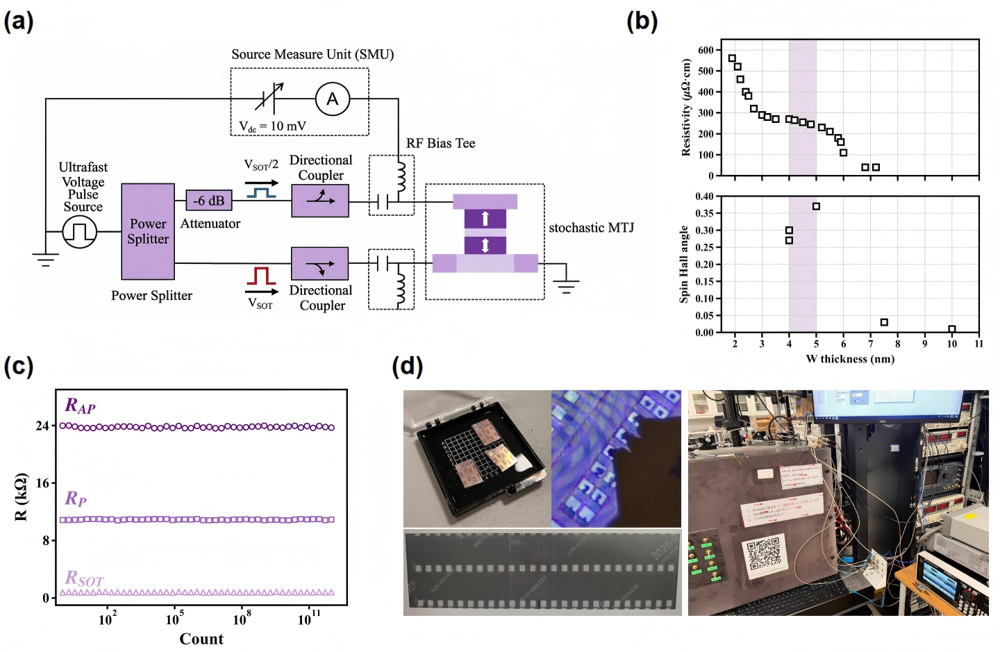
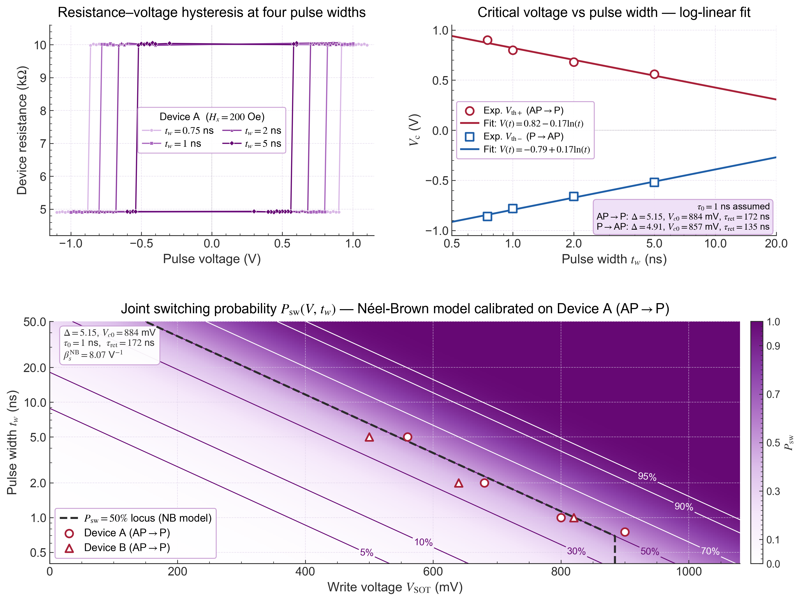
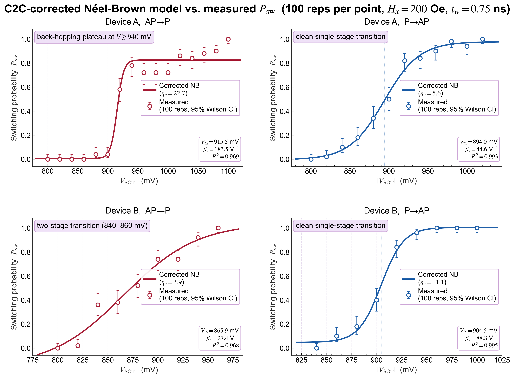
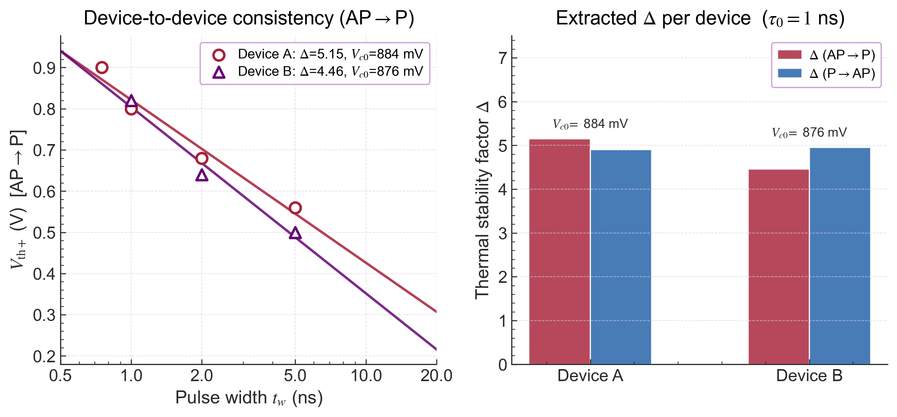
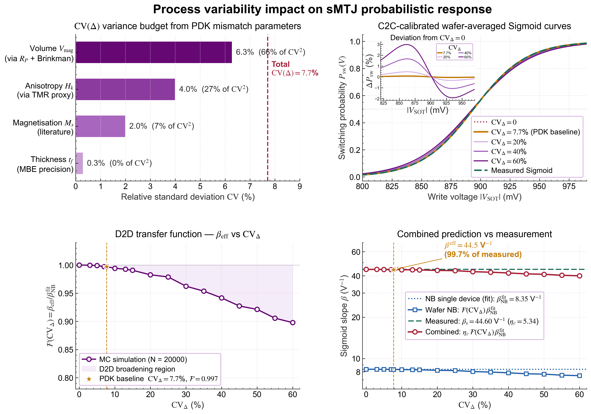
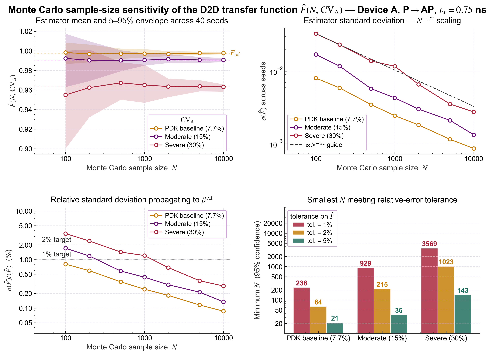
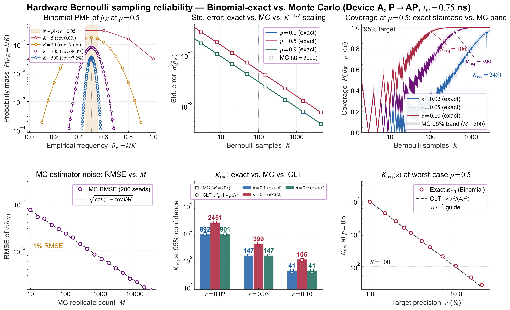

# 2.3 sMTJ器件实验验证与联合写入概率模型

本节通过直接测量sMTJ单器件的电学特性并结合300 mm晶圆工艺数据，建立从物理器件到概率计算原语的可靠映射。前文已从微磁动力学模型与行为级建模角度系统分析了SOT器件在热涨落作用下的随机翻转特性，但仿真方法难以全面反映真实器件中的工艺波动、材料缺陷、界面粗糙度以及寄生电阻网络等非理想因素，这些因素均会直接影响翻转概率分布及其稳定性。本节通过实验测量对行为级模型进行参数校准，并进一步评估工艺波动对阵列级概率一致性的影响。

在基于MRAM的概率计算体系中，热激活驱动的随机磁化翻转过程构成伯努利分布的物理随机源，器件的翻转概率$$P_{\mathrm{sw}}(V, t)$$不再作为误差来源，而是作为可控计算资源被主动利用[1]。该计算范式对器件提出特定工作要求，例如，在亚阈值或近阈值偏置条件下翻转概率应呈现稳定、连续且可精确建模的电压响应，器件还应具备足够的耐久性与晶圆级工艺一致性以支撑阵列规模下的统计均匀性。

---



**图2.11** SOT-MTJ器件实验平台与统计表征综合视图。(a)高速测试系统原理框图：超快电压脉冲经功率分配器分为两路（上路可选$$-6\,\mathrm{dB}$$衰减），射频偏置器合并高频脉冲与10 mV直流偏置后施加于器件顶层或底层电极，定向耦合器监测信号状态，SMU在顶层电极处采集电流响应。(b)重金属钨(W)层电阻率与自旋霍尔角随厚度的变化关系，紫色阴影区域(4–5 nm)标示了兼顾自旋电荷转化效率与沟道电阻的最佳厚度窗口。(c)高周疲劳耐久性测试结果，$$R_{AP}$$、$$R_P$$和$$R_{\mathrm{SOT}}$$在超过$$10^{11}$$次翻转循环后仍保持极高的稳定性，无明显退化。(d)实物照片：芯片样品、器件阵列光学显微镜照片及探针台测试系统。

## 2.3.1高速测试系统架构与器件信息

本研究所采用的器件为驰拓(HIKSTOR)在300 mm晶圆工艺平台上实现的三端SOT-MTJ，MTJ柱采用top-pinned堆叠（$$\mathrm{CoFeB}/\mathrm{MgO}/\mathrm{CoFeB}/\mathrm{spacer}/\mathrm{SAF}$$）、标称直径80 nm；SOT通道为$$\beta$$-W薄膜；器件几何与隧穿/输运参数的完整列表参见2.1.1节T型电路定义与2.2.2节仿真参数表（含$$R\!\cdot\!A=36\,\Omega\!\cdot\!\mu\mathrm{m}^2$$、$$\mathrm{TMR}=100\text{--}120\%$$、$$\theta_{\mathrm{SH}}=0.25$$等标称量），本节不再重复。下面侧重测试平台架构与器件耐久性、阵列均值等实测特征。

为实现纳秒尺度器件动态行为的精确测量，本实验构建了一套高速电学测试平台，核心组件包括超快脉冲电压源、高带宽示波器、射频探针台及高精度源表。脉冲电压源可产生最小宽度达亚纳秒级的写入脉冲，示波器实时捕捉测试链路中的电压与电流波形。射频链路引入功率分配器、衰减器及定向耦合器实现信号调制与测量隔离，并通过偏置器将直流偏置与高频脉冲叠加以支持多模式测试。

测试链路中超快电压脉冲经功率分配器分为两路，上路可选择性接入$$-6\,\mathrm{dB}$$衰减器；射频偏置器(RF Bias Tee)将高频脉冲与来自Keysight B2901源表(SMU)的10 mV直流偏置合并后施加于被测器件的顶层或底层电极，定向耦合器实时监测链路信号状态，SMU的电流测量端则接于顶层电极以捕获器件响应。射频线缆、连接器与探针存在频率响应，输入脉冲在传输过程中会发生幅值衰减与波形畸变，因此需在断开探针条件下测量脉冲源输出与示波器接收信号之间的转换关系，提取电压校正系数以恢复实际施加于器件端口的有效电压，保证测量结果的定量准确性。

写入路径中电流经SOT通道注入，利用自旋霍尔效应在自由层中产生垂直自旋流从而驱动磁矩翻转。为保证翻转方向的确定性，沿电流方向施加约200 Oe量级的外部面内磁场以打破自由层面内对称性并控制翻转手性，该方法在三端SOT-MRAM实验研究中已被广泛证明能够显著改善写入的方向一致性[5]。

**表2.5** 器件阵列测试统计均值

| 特征 | 测量数值 |
|:-----|:--------|
| 矫顽场$$\mu_0 H_c$$ | 75 mT |
| 偏置场$$\mu_0 H_{\mathrm{offset}}$$ | 0.36 mT |
| MTJ平行态电阻$$R_P$$ | 10.89 kΩ |
| SOT沟道电阻$$R_{\mathrm{SOT}}$$ | 776 Ω |

需要指出，2.2.2节表中所给$$R\!\cdot\!A=36\,\Omega\!\cdot\!\mu\mathrm{m}^2$$与表2.5所列$$R_P=10.89\,\mathrm{k}\Omega$$之间存在表观差异：若简单以物理直径$$D_{\mathrm{phys}}=80\,\mathrm{nm}$$推算几何面积$$A_{\mathrm{phys}}=\pi D_{\mathrm{phys}}^2/4\approx5.03\times10^{-3}\,\mu\mathrm{m}^2$$，对应平行态电阻为$$R\!\cdot\!A/A_{\mathrm{phys}}\approx7.16\,\mathrm{k}\Omega$$，与实测均值低约34%。两者的差异主要源于电学有效直径与物理直径不重合：离子铣刻、再沉积及侧壁损伤使MTJ柱靠近边缘约$$5\text{--}10\,\mathrm{nm}$$环带的电学有效性显著降低，按2.2.2.4节定义可记电学有效直径$$D_{\mathrm{elec}}\approx D_{\mathrm{phys}}-2\delta_{\mathrm{edge}}$$。反演表2.5的实测值，所需的电学有效面积为$$A_{\mathrm{elec}}=R\!\cdot\!A/R_P\approx3.31\times10^{-3}\,\mu\mathrm{m}^2$$，对应$$D_{\mathrm{elec}}\approx64.9\,\mathrm{nm}$$，与上述刻蚀损伤估计自洽。因此，本工作中Brinkman--Dynes--Rowell模型与$$R_{\mathrm{MTJ}}(m_z)$$映射均以$$D_{\mathrm{elec}}$$（而非$$D_{\mathrm{phys}}$$）代入计算，以保持电学量与几何参数之间的自洽。

---

## 2.3.2 sMTJ器件写入特性测量结果

本节基于同一测量窗口下在Device A与Device B两个器件上取得的完整数据集，依次给出临界电压随脉宽的对数依赖、单次写入能耗，以及$$t_w = 0.75\,\mathrm{ns}$$条件下四组概率翻转曲线。

**临界写入电压的脉宽依赖。** 在固定外加面内磁场$$H_x = 200\,\mathrm{Oe}$$条件下，施加脉冲宽度$$t_w = 0.75\,\mathrm{ns}$$、$$1\,\mathrm{ns}$$、$$2\,\mathrm{ns}$$、$$5\,\mathrm{ns}$$的写入脉冲，在每个脉宽下扫描脉冲电压幅值$$V_{\mathrm{SOT}}\in[-1.1, 1.1]\,\mathrm{V}$$，获取完整的电阻-电压滞回回线。每个扫描点先将器件初始化至已知磁化状态，施加单次写入脉冲，随后通过SMU读取MTJ电阻状态以判断翻转是否发生。

实验滞回回线如图2.12(a)所示。器件在正向脉冲作用下由反平行态($$R_{AP}\approx 10\,\mathrm{k\Omega}$$)翻转至平行态($$R_P\approx 4.9\,\mathrm{k\Omega}$$)，在负向脉冲作用下则由平行态翻转至反平行态。随脉冲宽度减小翻转所需的电压阈值单调增大。Device A的5 ns脉冲下正向翻转阈值$$V_{\mathrm{th}+}\approx 0.56\,\mathrm{V}$$，在亚纳秒的0.75 ns条件下升至约0.90 V；反向阈值$$V_{\mathrm{th}-}$$呈现对称变化规律。两方向阈值在绝对值上存在约3%–5%的差异，与阵列级测得的参考层偏置场$$\mu_0 H_{\mathrm{offset}} = 0.36\,\mathrm{mT}$$对两态能垒的非对称调制一致。

由滞回回线的电阻跳变点提取各脉宽下的正负向临界电压后，以$$\ln(t_w)$$为自变量绘制$$V_{\mathrm{th}}$$的依赖关系，得到如图2.12(b)所示的严格线性趋势。对Device A两个方向分别进行线性回归得到拟合关系式

$$
V_{\mathrm{AP\to P}}(t_w) = 0.82 - 0.17\ln(t_w/\mathrm{ns})\ \mathrm{V},\qquad V_{\mathrm{P\to AP}}(t_w) = -0.79 + 0.18\ln(t_w/\mathrm{ns})\ \mathrm{V},
$$

两个方向的决定系数$$R^2$$均在0.995以上，证实在所测0.75–5 ns范围内临界写入电压与脉冲宽度的对数呈严格线性依赖。该对数依赖关系是热激活翻转区的核心特征，是后续反推Néel-Brown模型参数的直接依据。

**写入能耗估算。** SOT-MRAM的写入电流主要流经重金属通道，单次写入能耗由SOT通道上的欧姆耗散主导。以最短脉宽$$t_w = 0.75\,\mathrm{ns}$$、正向临界写入电压$$V_{\mathrm{th}+}\approx 0.90\,\mathrm{V}$$为例，结合SOT通道电阻$$R_{\mathrm{SOT}}\approx 776\,\Omega$$，单次写入能耗可估算为
$$
E_{\mathrm{write}} = \frac{V^2}{R_{\mathrm{SOT}}}\cdot t_w = \frac{(0.90\,\mathrm{V})^2}{776\,\Omega}\times 0.75\,\mathrm{ns}\approx 0.78\,\mathrm{pJ}.
$$

对应电流密度约$$J_c\approx 1.0\times 10^{12}\,\mathrm{A/m^2}$$，与文献中先进SOT-MTJ器件在亚纳秒脉冲下的典型值处于同一量级。该能耗水平满足嵌入式高速存储与边缘概率计算场景对写入功耗的约束。

**$$t_w = 0.75\,\mathrm{ns}$$概率翻转特性。** 固定脉冲宽度为$$t_w = 0.75\,\mathrm{ns}$$，对Device A和Device B各以正、负两个方向扫描写入电压，每个幅值独立重复执行100次写入操作，以成功翻转次数占比定义翻转概率$$P_{\mathrm{sw}}$$。该测量与前述滞回扫描在同一批次内完成（同一器件、同一连续测试窗口），构成与NB参数反推直接对应的基准数据。四条$$P_{\mathrm{sw}}(V)$$曲线如图2.13所示，对每条曲线独立进行四参数Sigmoid拟合
$$
P_{\mathrm{sw}}(V) = y_0 + \frac{L}{1+\exp[-(|V|-V_{\mathrm{th}})/k]},
$$

其中$$k$$为尺度参数，对应的logistic斜率参数$$\beta_s = 1/k$$。拟合结果列于表2.6。

**表2.6** $$t_w = 0.75\,\mathrm{ns}$$的四条Sigmoid拟合结果

| 器件 | 方向 | $$V_{\mathrm{th}}$$ (mV) | $$k$$ (mV) | $$\beta_s$$ (V⁻¹) | $$R^2$$ | 备注 |
|:---:|:---:|:---:|:---:|:---:|:---:|:---|
| A | AP→P | 915.5 | 5.45 | 183.5 | 0.969 | $$V\gtrsim 940$$ mV出现回跳平台，拟合受扰 |
| A | P→AP | 894.0 | 22.43 | 44.6 | 0.993 | 干净单段过渡 |
| B | AP→P | 865.9 | 36.54 | 27.4 | 0.968 | 840–860 mV附近出现两段过渡 |
| B | P→AP | 904.5 | 11.26 | 88.8 | 0.995 | 干净单段过渡 |

Device A的AP→P曲线在$$V > 940\,\mathrm{mV}$$出现明显回跳平台，$$P_{\mathrm{sw}}$$在900–1000 mV间维持约0.72直到$$V \gtrsim 1020\,\mathrm{mV}$$才重新上升至1。该现象在高电压SOT翻转中已被报告为back-hopping机制：SOT脉冲结束后磁矩因热辅助再次跃过势垒回到初态，导致名义翻转率饱和在低于1的水平。该非理想行为使单一Sigmoid拟合在高V区偏离数据，$$R^2 = 0.969$$低于其他三条，表中Device A AP→P方向的$$\beta_s$$值偏大且不确定度较高。Device B的AP→P曲线在840–860 mV附近出现约20 mV宽的平台，$$P_{\mathrm{sw}}$$在0.36–0.38之间几乎不变，可能与亚畴先后分步翻转相关。两条P→AP曲线（Device A与Device B）均表现出干净的单段过渡，$$R^2$$均达0.993以上，是用于Sigmoid参数提取的主力数据。

综合以上四组曲线的拟合质量与物理一致性，本节采用Device A、P→AP、$$t_w = 0.75\,\mathrm{ns}$$的Sigmoid拟合结果作为后续联合模型的主基准($$V_{\mathrm{th}} = 894\,\mathrm{mV}$$，$$\beta_s = 44.6\,\mathrm{V}^{-1}$$，$$R^2 = 0.993$$)。该选择基于两点考虑。Device A为参数反推依赖的主器件，可保证拟合所得$$\Delta$$、$$V_{c0}$$与Sigmoid参数来自同一物理对象。P→AP方向数据无非理想行为干扰，拟合精度最高。四条曲线的整体图景同时覆盖AP→P与P→AP两方向、Device A与Device B两器件，共同提供了Sigmoid形态的器件间与方向间变异性特征，为后续定量比较与工艺容差分析提供完整证据基础。

---



**图2.12** sMTJ器件在不同脉冲宽度下的写入特性与Néel-Brown联合概率模型。(a)$$t_w = 0.75\,\mathrm{ns}$$、$$1\,\mathrm{ns}$$、$$2\,\mathrm{ns}$$、$$5\,\mathrm{ns}$$条件下测得Device A的电阻-脉冲电压滞回回线，随脉冲持续时间缩短翻转电压窗口逐渐展宽。(b)临界翻转电压$$V_{\mathrm{th}\pm}$$随脉冲宽度的对数依赖关系，空心符号为实验数据点，实线为对数线性拟合$$V = a\mp b\ln(t_w/\mathrm{ns})$$；内嵌注释给出由$$\tau_0 = 1\,\mathrm{ns}$$先验反推得到的两方向Néel-Brown参数$$(\Delta, V_{c0}, \tau_{\rm ret})$$。(c)基于反推NB参数构建的二维联合翻转概率分布$$P_{\mathrm{sw}}(V, t_w)$$热力图(AP→P方向)，紫色等概率轮廓在低概率区可读，白色等概率轮廓在高概率区可读，黑色虚线为50%等概率轨迹即$$V_{\mathrm{th}}(t_w)$$；空心圆(Device A)与三角(Device B)标示两器件的滞回提取点，与50%轨迹吻合。

---



**图2.13** $$t_w = 0.75\,\mathrm{ns}$$、$$H_x = 200\,\mathrm{Oe}$$条件下100次重复Sigmoid测量与C2C-修正后的Néel-Brown模型对比。(a)Device A AP→P：实测在$$V \gtrsim 940\,\mathrm{mV}$$出现back-hopping回跳平台。(b)Device A P→AP：干净单段过渡($$R^2 > 0.99$$)，作为主基准曲线。(c)Device B AP→P：840–860 mV附近出现两段过渡。(d)Device B P→AP：干净单段过渡($$R^2 > 0.99$$)。空心符号为实验数据点(误差线为二项分布的Wilson 95%置信区间)，实线为C2C-修正NB曲线（数学上等价于四参数Sigmoid拟合），各面板内嵌注释给出$$\eta_c = \beta_s/\beta^{\mathrm{NB}}$$与该曲线的物理特征。Sigmoid拟合对四条曲线的$$V_{\mathrm{th}}$$预测精度均优于+7.4%，但未修正NB预测的斜率(约8 V⁻¹)普遍低于实测数倍，必须以$$\eta_c$$因子作C2C修正方能重现实测分布陡度。

---



**图2.14** Device A 与 Device B 两个器件的Néel-Brown参数一致性对比。(a)正向(AP→P)临界翻转电压$$V_{\mathrm{th}+}$$随脉冲宽度$$t_w$$的对数线性依赖；Device A（红色圆点）与Device B（紫色三角）数据点近似落在同一条对数直线上，两器件的$$\Delta$$与$$V_{c0}$$拟合值在5%–15%范围内一致。(b)以$$\tau_0 = 1\,\mathrm{ns}$$先验反推得到的两方向热稳定性因子$$\Delta$$柱状图，AP→P（红色）与P→AP（蓝色）方向在同一器件上数值接近(器件A的两方向$$\Delta$$分别为5.15与4.91、器件B分别为4.46与4.95)，对应零温临界电压$$V_{c0}$$分别为884 mV（器件A）与876 mV（器件B），证实sMTJ作为概率单元具备良好的器件间均匀性，为后续阵列级建模与工艺容差分析提供同批次基线参考。

## 2.3.3 Néel-Brown模型参数的反推

前述$$V_{\mathrm{th}}$$对数线性依赖关系与前文建立的Néel-Brown翻转概率模型在数学上严格等价，可由实验系数反推底层物理参数。取线性势垒近似$$n=1$$，翻转概率满足

$$
P_{\mathrm{sw}}(t_w, V) = 1 - \exp\!\left[-\frac{t_w}{\tau_0}\exp\!\left(-\Delta\left(1-\frac{V}{V_{c0}}\right)\right)\right],
$$

其中$$\tau_0$$为尝试频率倒数、$$\Delta = E_b/k_BT$$为热稳定性因子、$$V_{c0}$$为零温临界电压。令$$P_{\mathrm{sw}}(t_w, V_{\mathrm{th}}) = 0.5$$解得

$$
V_{\mathrm{th}}(t_w) = V_{c0}\left[1 - \frac{1}{\Delta}\ln\!\left(\frac{t_w}{\tau_0\ln 2}\right)\right] = \underbrace{\left[V_{c0} + \frac{V_{c0}}{\Delta}\ln(\tau_0\ln 2)\right]}_{a} - \underbrace{\frac{V_{c0}}{\Delta}}_{b}\ln(t_w).
$$

比对实验拟合$$V_{\mathrm{th}} = a - b\ln(t_w)$$的两个系数可建立$$(\tau_0,\Delta, V_{c0})$$与$$(a,b)$$之间的映射关系。

**模型无关的物理可观测量。** 实验对数线性拟合提供两个独立约束，可直接转换为两个不依赖$$\tau_0$$先验假设的物理量。对数斜率$$b = V_{c0}/\Delta$$给出脉宽每增加一个$$e$$倍所需降低的写入电压，是器件翻转灵敏度的量纲化度量。令$$V_{\mathrm{th}}(t^*) = 0$$即可解得纯热涨落下的50%自发翻转时间$$t^* = \exp(a/b)$$，由此定义零驱动保持时间
$$
\tau_{\mathrm{ret}} \equiv \tau_0\, e^{\Delta} = \frac{t^*}{\ln 2} = \frac{1}{\ln 2}\exp\!\left(\frac{a}{b}\right).
$$

该量仅由拟合截距与斜率共同决定，无需假设$$\tau_0$$。Device A两方向的提取结果如表2.7所示。

**表2.7** Device A模型无关物理可观测量

| 方向 | 对数斜率$$b = V_{c0}/\Delta$$ | $$t^*$$ | 零驱动保持时间$$\tau_{\mathrm{ret}}$$ |
|:---:|:---:|:---:|:---:|
| AP→P | 172 mV | 120 ns | 172 ns |
| P→AP | 175 mV | 94 ns | 135 ns |

AP→P方向的$$\tau_{\mathrm{ret}}$$较P→AP方向长约27%，AP态自发稳定性略高于P态，与参考层杂散偶极场对两态能垒的差异性调制相一致。两方向$$\tau_{\mathrm{ret}}$$均处于百纳秒量级，远低于传统存储MRAM所要求的年量级保持时间[^2]，是sMTJ作为低势垒概率采样单元的典型物理特征[7]。

**热稳定性因子与零温临界电压。** Néel-Brown模型含三个自由参数而对数线性拟合仅提供两个约束，系统欠定，存在一族以$$\tau_0$$为参数的合法解，族内所有解给出相同的$$\tau_{\mathrm{ret}}$$和$$V_{c0}/\Delta$$。若要进一步分离$$\Delta$$与$$V_{c0}$$的绝对数值需引入$$\tau_0$$的先验约束。对于CoFeB/MgO基自由层，文献中报道的尝试频率$$f_0 = 1/\tau_0$$处于1–10 GHz量级[6]，本文采用$$\tau_0 = 1\,\mathrm{ns}$$作为标准假设值，得器件Néel-Brown模型参数如表2.8所示。

**表2.8** 反推得到的Device A Néel-Brown模型参数($$\tau_0 = 1\,\mathrm{ns}$$)

| 参数 | AP→P | P→AP | 单位 | 物理含义 |
|:---:|:---:|:---:|:---:|:---|
| $$\tau_0$$ | 1.0 | 1.0 | ns | 尝试频率倒数(先验假设) |
| $$\Delta$$ | 5.15 | 4.91 | — | 热稳定性因子 |
| $$V_{c0}$$ | 884 | 857 | mV | 零温临界电压 |
| $$E_b = \Delta k_BT$$ | 133 | 127 | meV | 能垒高度(300 K) |
| $$\tau_{\mathrm{ret}}$$ | 172 | 135 | ns | 零驱动保持时间 |
| $$\beta_s^{\mathrm{NB}} = 2\Delta\ln 2/V_{c0}$$ | 8.08 | 7.94 | V⁻¹ | NB模型预测的Sigmoid斜率 |

两方向反推得到的$$\Delta$$均约为5，对应能垒$$E_b\approx 130\,\mathrm{meV}$$，处于sMTJ概率工作区间的典型参数窗口，可充分抑制短时自发翻转以保证可编程性，又远低于存储MRAM的势垒(约1.5 eV)以实现纳秒级热激活响应。

**映射至有效各向异性场。** 反推得到的$$\Delta_0$$可进一步映射至器件微观物理量以验证其物理合理性。在PMA构型的宏自旋近似下，自由层能垒满足$$E_b = K_{\mathrm{eff}}V_{\mathrm{mag}} = \frac{1}{2}\mu_0 H_k^{\mathrm{eff}} M_s V_{\mathrm{mag}}$$，其中$$K_{\mathrm{eff}}$$为有效单轴各向异性能密度、$$H_k^{\mathrm{eff}}$$为有效各向异性场、$$M_s$$为饱和磁化强度、$$V_{\mathrm{mag}}$$为自由层磁性体积。反解得

$$
H_k^{\mathrm{eff}} = \frac{2\Delta_0 k_BT}{\mu_0 M_s V_{\mathrm{mag}}}.
$$

代入实验参数(以AP→P方向为例)，$$\Delta_0 = 5.15$$对应$$E_b = 133\,\mathrm{meV} = 2.13\times 10^{-20}\,\mathrm{J}$$；自由层几何取标称值$$D = 80\,\mathrm{nm}$$、$$t_f = 1.4\,\mathrm{nm}$$得$$V_{\mathrm{mag}} = \pi D^2 t_f/4 \approx 7.0\times 10^{-24}\,\mathrm{m}^3$$；取典型CoFeB饱和磁化强度$$M_s \approx 1.0\times 10^6\,\mathrm{A/m}$$，得$$H_k^{\mathrm{eff}} \approx 4.8\times 10^3\,\mathrm{A/m} \approx 60\,\mathrm{Oe}$$。

该$$H_k^{\mathrm{eff}}$$值显著低于传统存储型MRAM器件的$$H_k$$(约200–500 mT)，与器件被设计为低势垒sMTJ的物理定位一致。$$H_k^{\mathrm{eff}}$$亦低于阵列级测得的准静态矫顽场，原因在于本文提取$$\Delta_0$$所依赖的实验数据在200 Oe面内破对称场条件下测得，而$$H_c$$在无面内偏置的准静态条件下测量，两者描述不同工作配置下的能垒，存在差异属于预期结果。典型CoFeB参数先验下得到的$$H_k^{\mathrm{eff}}$$量级与已报道的低势垒SOT-MTJ器件一致，确认了行为级模型反推参数的物理自洽性。

## 2.3.4 Sigmoid实测与NB外推的定量比较

将前节反推得到的Néel-Brown参数代入NB阈值公式，外推至$$t_w = 0.75\,\mathrm{ns}$$概率测量点，可对NB模型在跨观测量一致性方面进行严格检验。Sigmoid斜率由$$\beta_s^{\mathrm{NB}} = 2\Delta\ln 2/V_{c0}$$给出，仅取决于反推的$$\Delta$$与$$V_{c0}$$而与$$t_w$$无关。四条曲线的NB外推值与Sigmoid拟合结果逐项对比列于表2.9。

**表2.9** $$t_w = 0.75\,\mathrm{ns}$$下NB外推与Sigmoid实测的逐项对比

| 器件 | 方向 | $$V_{\mathrm{th}}^{\mathrm{NB}}$$ | $$V_{\mathrm{th}}^{\mathrm{meas}}$$ | $$V_{\mathrm{th}}$$偏差 | $$\beta_s^{\mathrm{NB}}$$ | $$\beta_s^{\mathrm{meas}}$$ | $$\eta_c = \beta_s^{\mathrm{meas}}/\beta_s^{\mathrm{NB}}$$ |
|:---:|:---:|:---:|:---:|:---:|:---:|:---:|:---:|
| A | AP→P | 870 mV | 915.5 mV | +5.2% | 8.08 V⁻¹ | 183.5 V⁻¹ | 22.7 |
| A | P→AP | 843 mV | 894.0 mV | +6.0% | 7.94 V⁻¹ | 44.6 V⁻¹ | 5.6 |
| B | AP→P | 861 mV | 865.9 mV | +0.6% | 7.06 V⁻¹ | 27.4 V⁻¹ | 3.9 |
| B | P→AP | 842 mV | 904.5 mV | +7.4% | 8.02 V⁻¹ | 88.8 V⁻¹ | 11.1 |

表中体现两类性质不同的对比结果。NB模型对四条曲线的$$V_{\mathrm{th}}$$预测偏差仅+0.6%至+7.4%，处于典型热激活拟合的外推精度之内，由实验上验证NB模型能够正确描述器件的均值翻转行为，即翻转电压对脉宽的$$\ln(t_w)$$标度关系。NB模型对四条曲线的$$\beta_s$$预测均为约8 V⁻¹[^3]，而实测$$\beta_s$$跨四条曲线从27.4到183.5 V⁻¹不等，定义的C2C经验收窄因子$$\eta_c = \beta_s^{\mathrm{meas}}/\beta_s^{\mathrm{NB}}$$范围为3.9–22.7、中位数8.3，呈现NB模型对概率分布宽度的系统性过度估计。

Device A、P→AP的$$\eta_c = 5.6$$被选为主基准，理由仍是Device A为参数反推主器件、P→AP方向数据无非理想行为。两条干净P→AP曲线的均值$$\eta_c \approx 8.4$$与中位数一致；包含器件间与方向间变异性在内的整体$$\eta_c$$约$$10\pm 7$$。同平台的$$t_w = 5\,\mathrm{ns}$$ Sigmoid测量给出$$\beta_s = 56.9\,\mathrm{V}^{-1}$$、$$\eta_c \approx 7.0$$，与中位数一致。$$\eta_c$$在跨脉宽测量中保持同一量级，支持其作为器件级C2C分布形态参数的稳定性。

**NB框架下的$$\Delta$$参数反推。** NB模型表达式$$P_{\mathrm{sw}}(t_w, V) = 1 - \exp[-(t_w/\tau_0)\exp(-\Delta(1-V/V_{c0}))]$$包含三个待定参数$$(\tau_0, \Delta, V_{c0})$$。实验为$$\Delta$$提取提供了两条独立的相空间约束，由这两类约束分别尝试反解$$\Delta$$时所得到的数值不同。

脉宽扫描法以$$V_{\mathrm{th}}$$对数斜率$$b = V_{c0}/\Delta$$与$$\tau_0$$先验联立解出$$\Delta$$，记为$$\Delta_{\mathrm{pulse}}$$。该路径直接验证NB模型最具鉴别力的标度律，即对数时窗依赖$$V_{\mathrm{th}} \propto \ln(t_w)$$，并在所测$$0.75\text{-}5\,\mathrm{ns}$$窗口内由$$R^2 > 0.995$$的严格线性度独立检验通过。所提取的$$\Delta_{\mathrm{pulse}}$$严格对应单畴热激活势垒高度$$E_b/k_BT$$，是有明确热力学含义的物理量。在Device A、P→AP方向得$$\Delta_{\mathrm{pulse}} = 4.91$$，对应$$E_b \approx 127\,\mathrm{meV}$$、零驱动保持时间$$\tau_{\mathrm{ret}} = \tau_0 e^{\Delta} \approx 135\,\mathrm{ns}$$，与器件实际表现的纳秒级热激活响应一致。

$$P_{\mathrm{sw}}$$斜率法将NB预测的Sigmoid斜率$$\beta_s^{\mathrm{NB}} = 2\Delta\ln 2/V_{c0}$$与实测斜率$$\beta_s^{\mathrm{meas}}$$等同，反解得$$\Delta_{\mathrm{slope}} = \beta_s^{\mathrm{meas}} V_{c0}/(2\ln 2)$$。该步骤隐含一项重要附加假设，即实验C2C分布严格服从NB双指数函数对应的Gumbel形态。后文将分析的多种微观机制（亚畴协同跃迁、热辅助进动翻转过渡、尝试频率的弱电压依赖）均使C2C分布相对Gumbel基线收窄，故$$\Delta_{\mathrm{slope}}$$实际上是热激活势垒与C2C分布锐化效应的混合参数。仍以Device A、P→AP为例，$$\Delta_{\mathrm{slope}} = 44.6 \times 0.857/(2\ln 2) \approx 27.6$$，若强行解释为热稳定因子将给出$$E_b \approx 715\,\mathrm{meV}$$、$$\tau_{\mathrm{ret}}^{\mathrm{slope}} = \tau_0 e^{27.6} \approx 10^{12}\,\mathrm{ns} \approx 17\,\mathrm{min}$$，相对实际器件的纳秒响应偏离十二个数量级，物理上不可接受。

两路径之比$$\Delta_{\mathrm{slope}}/\Delta_{\mathrm{pulse}} = \beta_s^{\mathrm{meas}}/\beta_s^{\mathrm{NB}} \equiv \eta_c$$即为前文定义的C2C收窄因子，所反映的是NB Gumbel分布相对实验分布的过度展宽幅度。该恒等式给出$$\eta_c$$的另一组等价物理解释：同一组实验数据若分别按NB标度律与NB分布形态解读，得到的$$\Delta$$估计值差$$\eta_c$$倍。这一定量关系使NB模型表观的内部不一致问题转化为可控的双层分解。脉宽法$$\Delta = \Delta_{\mathrm{pulse}}$$描述热激活势垒并保留全部物理内涵，C2C分布形态相对Gumbel基线的偏差则单独通过乘性因子$$\eta_c$$描述。两者在数学上正交，在工程上各司其职：$$\Delta_{\mathrm{pulse}}$$作为热稳定参数进入工艺容差与可靠性分析，$$\eta_c$$作为分布形态参数进入Bernoulli采样精度估计。

由此澄清表观的Δ歧义。脉宽法$$\Delta$$是器件唯一具有热力学定义的稳定因子；斜率倒推所得的$$\Delta_{\mathrm{slope}}$$是数学上自洽但物理上空虚的拟合中间量，不应作为独立物理参数报告。本节后续工艺容差分析与下节联合写入概率模型均以$$\Delta_{\mathrm{pulse}}$$与$$\eta_c$$为两个独立的标定输入；混淆二者将导致对工艺余量、保持时间与热可靠性的根本性误判。

$$\eta_c$$的物理意义需结合两类独立随机性机制进行解释，二者对概率曲线形态的影响方向截然相反。器件间离散(D2D，device-to-device)源于工艺波动，体现为不同器件的$$(\Delta, V_{c0})$$存在晶圆级统计分布。由Jensen不等式及NB双指数函数的凸性可严格证明晶圆平均曲线的等效斜率$$\beta_{\mathrm{eff}} \leq \beta_s^{\mathrm{NB}}$$，D2D离散只能使阵列平均曲线变缓而不会变陡。循环间离散(C2C，cycle-to-cycle)是同一器件重复写入时由热涨落与随机初态引入的固有随机性，直接决定单器件$$P_{\mathrm{sw}}(V)$$曲线的陡度。纯NB单畴动力学对C2C的预测呈Gumbel型分布，在逻辑斯蒂过渡区具有确定的斜率$$\beta_s^{\mathrm{NB}}$$。本节所得$$\eta_c > 1$$是同一器件重复写入测出的斜率，反映的是C2C分布形态相对NB Gumbel的系统性收窄，不可能归因于D2D展宽。D2D与C2C的区分在后节进一步通过工艺容差仿真明确体现。

**$$\eta_c > 1$$的物理来源。** NB单畴Gumbel分布对C2C的过度展宽以及实测$$\eta_c$$随器件与方向变化的散布，反映多种微观机制的综合效应。Néel-Brown模型隐含严格单畴翻转假设，真实sMTJ在临界区可能经历亚畴协同跃迁，后者在电压维度的翻转分布较Gumbel更集中。$$t_w = 0.75\,\mathrm{ns}$$已进入热辅助进动翻转过渡区，介于纯热激活（长脉宽、低电压）与纯进动翻转（短脉宽、高电压）之间的机制交叉区，翻转事件获得部分相干性从而使C2C分布窄于纯热激活Gumbel极限。该过渡机制在多种SOT-MTJ单次翻转动力学表征中被一致报告，是在纳秒量级脉宽下最可能的主导机制。AP→P方向同时出现回跳平台与两段过渡而P→AP方向基本不出现的事实，提示参考层杂散场对正反两方向翻转动力学的非对称调制。

从工程角度看$$\eta_c \approx 5\text{-}10$$的C2C收窄对概率计算应用构成有利特性。相同电压噪声水平下更大的$$\beta_s$$对应更精确的概率编码，作为硬件Bernoulli采样单元时编码分辨率更高。但C2C分布形态依赖于具体器件设计与操作条件，对新器件结构须以实测Sigmoid为准，不可简单套用NB理论值。

## 2.3.5工艺波动对晶圆平均概率曲线的影响

**工艺波动作为概率计算原语稳定性的核心约束。** 前节确定了同一器件内部C2C分布相对NB Gumbel基线的收窄因子$$\eta_c$$，该量描述单器件层面的概率响应陡度。概率计算阵列由多个独立的Bernoulli采样单元构成，单器件实测特性能否在阵列层面统计地保持，取决于器件间(D2D)参数离散对晶圆平均概率响应的展宽幅度。从工程视角看，热稳定因子的相对涨落$$\mathrm{CV}(\Delta) \equiv \sigma_\Delta/\mu_\Delta$$是连接foundry失配数据与阵列级随机计算精度的关键传递参数。在固定写入电压下，$$\Delta$$的D2D离散直接转化为阵列内Bernoulli概率的器件间偏离，进而以二阶矩形式进入网络等效噪声方差，影响推断精度上界。

热稳定因子由几何体积、界面各向异性与饱和磁化共同决定，将$$\mathrm{CV}(\Delta)$$按物理来源分解便于明确工艺优化的优先级：若主要方差贡献来自几何刻蚀，则提升线宽控制的边际收益超过磁性材料优化；反之亦然。该分解不依赖于具体器件结构的微观参数细节，仅利用foundry PDK中直接可得的局部失配参数与隧穿电学模型即可完成，因此具有跨平台的迁移性。下文从sMTJ PDK中的电学失配出发，经Brinkman隧穿模型反推为几何与界面失配，进而合成$$\mathrm{CV}(\Delta)$$的物理基线，并定量评估该基线对晶圆平均概率响应的影响幅度。

**基于PDK失配参数的$$\mathrm{CV}(\Delta)$$反推。** 驰拓300 mm sMTJ PDK针对局部失配定义三个独立的Gaussian扰动参数，节选自器件模型process block如下：

```spectre
parameters Rsot_mis = 1
parameters Rp_mis   = 1
parameters TMR_mis  = 1
statistics {
    process {
        vary Rsot_mis dist = gauss std = 0.07
        vary Rp_mis   dist = gauss std = 0.07
        vary TMR_mis  dist = gauss std = 0.04
    }
}
```

扰动以乘法方式作用于标称值，std值即对应的相对标准差，给出$$\mathrm{CV}(R_P) = 7\%$$、$$\mathrm{CV}(R_{\mathrm{SOT}}) = 7\%$$、$$\mathrm{CV}(\mathrm{TMR}) = 4\%$$。

平行态MTJ电阻可写为$$R_P = (R\cdot A)/A$$，其中$$R\cdot A$$为隧穿电阻面积积（仅取决于势垒特性）、$$A = \pi D^2/4$$为MTJ面积（仅取决于几何）。两类涨落相互独立，故$$\mathrm{CV}^2(R_P) = \mathrm{CV}^2(R\cdot A) + [2\mathrm{CV}(D)]^2$$。Brinkman低偏压近似[10]给出$$\ln(R\cdot A) = \kappa t_{\mathrm{ox}}\sqrt{\bar\varphi} + \mathrm{const.}$$，其中$$\kappa = 2\sqrt{2m^*}/\hbar \approx 10.25\,\mathrm{nm^{-1}\cdot eV^{-1/2}}$$。对CoFeB/MgO接口取标称值$$t_{\mathrm{ox}} \approx 1\,\mathrm{nm}$$、$$\bar\varphi \approx 0.6\,\mathrm{eV}$$，Brinkman灵敏度系数为$$\partial\ln(R\cdot A)/\partial t_{\mathrm{ox}} = \kappa\sqrt{\bar\varphi} \approx 7.94\,\mathrm{nm^{-1}}$$与$$\partial\ln(R\cdot A)/\partial\bar\varphi = \kappa t_{\mathrm{ox}}/(2\sqrt{\bar\varphi}) \approx 6.62\,\mathrm{eV^{-1}}$$。取局部失配尺度下$$\sigma_{t_{\mathrm{ox}}}/t_{\mathrm{ox}} \approx 0.3\%$$、$$\sigma_{\bar\varphi}/\bar\varphi \approx 0.5\%$$得$$\mathrm{CV}(R\cdot A) \approx 3.1\%$$。从$$\mathrm{CV}(R_P) = 7\%$$中扣除势垒贡献后得几何贡献$$\mathrm{CV}(A) \approx 6.3\%$$，对应$$\mathrm{CV}(D) \approx 3.1\%$$，即$$D = 80\,\mathrm{nm}$$时$$\sigma_D \approx 2.5\,\mathrm{nm}$$，与300 mm高产平台双重曝光与精细刻蚀的线宽控制能力一致。

自由层磁性体积$$V_{\mathrm{mag}} = \pi D^2 t_f/4$$的相对涨落为$$\mathrm{CV}(V_{\mathrm{mag}}) = \sqrt{[2\mathrm{CV}(D)]^2 + \mathrm{CV}^2(t_f)}$$；取$$\mathrm{CV}(t_f) \approx 0.3\%$$（MBE沉积厚度精度）得$$\mathrm{CV}(V_{\mathrm{mag}}) \approx 6.3\%$$，几乎完全由$$\mathrm{CV}(D)$$主导而$$t_f$$贡献可忽略。界面各向异性场$$H_k$$与MgO/CoFeB界面质量直接相关，PDK将该界面效应投影到TMR失配上，故取$$\mathrm{CV}(H_k) \approx \mathrm{CV}(\mathrm{TMR}) = 4\%$$作为代理。饱和磁化强度$$M_s$$主要由CoFeB成分决定，取典型值$$\mathrm{CV}(M_s) \approx 2\%$$。

**方差合成与变异系数的几何加和规则。** 由$$\Delta \propto H_k M_s V_{\mathrm{mag}}$$对小相对扰动展开，$$\delta\Delta/\Delta = \delta H_k/H_k + \delta M_s/M_s + \delta V_{\mathrm{mag}}/V_{\mathrm{mag}} + \mathcal{O}(\mathrm{CV}^2)$$。诸误差项相互独立，方差线性可加而标准差按平方和的平方根合成：

$$
\mathrm{CV}^2(\Delta) = \mathrm{CV}^2(H_k) + \mathrm{CV}^2(M_s) + \mathrm{CV}^2(V_{\mathrm{mag}}),
$$

$$
\mathrm{CV}(\Delta) = \sqrt{0.040^2 + 0.020^2 + 0.063^2} = \sqrt{0.00598} \approx 7.7\%.
$$

此处需特别强调几何加和规则与代数加和规则的区别。诸单源CV值$$\{0.063, 0.040, 0.020\}$$的代数和为12.3%，而方差和（每项CV的平方相加）为0.0060，开方后为7.7%。两者差异源于独立随机变量的方差（而非标准差）可加性，是统计学基础结论而非近似简化。标准差作为概率分布的一阶矩量纲量，在独立线性叠加下不满足代数可加性；方差作为二阶矩，在独立线性叠加下严格满足$$\mathrm{Var}(X+Y) = \mathrm{Var}(X) + \mathrm{Var}(Y)$$。该规则使总CV小于诸单源CV代数和但大于其中任一项，是工艺方差预算的标准合成方式。

各物理源对$$\mathrm{CV}^2(\Delta)$$的份额见表2.10。几何体积扰动$$V_{\mathrm{mag}}$$贡献66%总方差，界面各向异性$$H_k$$贡献27%，饱和磁化$$M_s$$贡献7%。该分解直接指向工艺优化优先级：将$$\mathrm{CV}(D)$$从3.1%进一步压缩至2%即可使$$V_{\mathrm{mag}}$$贡献的方差减半，对应$$\mathrm{CV}(\Delta)$$从7.7%降至约5.5%；同等比例改善$$M_s$$或$$H_k$$的影响约为前者的1/4–1/2。

**表2.10** $$\mathrm{CV}(\Delta)$$方差预算分解（独立来源平方和合成）

| 贡献源 | 相对标准差CV | $$\mathrm{CV}^2$$贡献 | 占总方差比例 |
|:---|:---:|:---:|:---:|
| 几何体积$$V_{\mathrm{mag}}$$（由$$\mathrm{CV}(R_P)$$经Brinkman模型分解，含直径与厚度合成扰动） | 6.3% | 0.0040 | 66% |
| 界面各向异性$$H_k$$（由$$\mathrm{CV}(\mathrm{TMR})$$作为界面质量代理） | 4.0% | 0.0016 | 27% |
| 饱和磁化$$M_s$$（CoFeB成分涨落，取自文献典型值） | 2.0% | 0.0004 | 7% |
| 平方和合成$$\mathrm{CV}(\Delta) = \sqrt{\sum\mathrm{CV}_i^2}$$ | 7.7% | 0.0060 | 100% |

注：$$V_{\mathrm{mag}}$$的6.3%已由$$\mathrm{CV}(V_{\mathrm{mag}}) = \sqrt{[2\mathrm{CV}(D)]^2 + \mathrm{CV}^2(t_f)}$$合成，几何上由$$\mathrm{CV}(D) \approx 3.1\%$$主导，厚度涨落$$\mathrm{CV}(t_f) \approx 0.3\%$$对$$\mathrm{CV}^2(V_{\mathrm{mag}})$$的相对贡献仅约0.2%，本预算中不再单列。

**翻转概率对$$\Delta$$扰动的解析灵敏度。** 工艺波动对晶圆平均概率响应的影响幅度并不直接由$$\mathrm{CV}(\Delta)$$本身决定，而由$$\mathrm{CV}(\Delta)$$与$$P_{\mathrm{sw}}$$对$$\Delta$$灵敏度的乘积控制。NB双指数函数形式使该灵敏度具有简洁的解析表达，可在Monte Carlo仿真之前给出工艺裕度的解析估计。

记$$f(V) = (t_w/\tau_0)\exp[-\Delta(1-V/V_{c0})]$$，则$$P_{\mathrm{sw}} = 1 - \exp(-f)$$。对$$\Delta$$求偏导得

$$
\frac{\partial P_{\mathrm{sw}}}{\partial \Delta} = (1 - P_{\mathrm{sw}})\, f \cdot \left(\frac{V}{V_{c0}} - 1\right).
$$

该表达式在NB$$P_{\mathrm{sw}} = 0.5$$点取得简洁形式：此处$$\exp(-f) = 1/2$$给出$$f = \ln 2$$、$$1 - P_{\mathrm{sw}} = 0.5$$，并由NB阈值条件$$V_{\mathrm{th}}/V_{c0} = 1 - \ln(t_w/(\tau_0 \ln 2))/\Delta$$得

$$
\left.\frac{\partial P_{\mathrm{sw}}}{\partial \Delta}\right|_{V_{\mathrm{th}}} = -\frac{\ln 2}{2}\cdot\frac{1}{\Delta}\ln\!\left(\frac{t_w}{\tau_0 \ln 2}\right).
$$

灵敏度仅取决于无量纲组合$$\xi(t_w) \equiv \ln(t_w/(\tau_0\ln 2))/\Delta$$，即工作脉宽相对零驱动保持时间$$\tau_{\mathrm{ret}} = \tau_0 e^\Delta$$的对数距离。极限行为有清晰的物理对应。$$t_w \to \tau_0\ln 2$$时$$\xi \to 0$$，灵敏度趋零，此即确定性翻转极限$$V_{\mathrm{th}} \to V_{c0}$$。$$t_w \to \tau_{\mathrm{ret}}$$时$$\xi \to 1$$，灵敏度趋$$\ln 2/2 \approx 0.35$$，此即完全热激活极限。

代入Device A、P→AP、$$t_w = 0.75\,\mathrm{ns}$$、$$\tau_0 = 1\,\mathrm{ns}$$、$$\Delta = 4.91$$：$$\ln(0.75/0.693) \approx 0.0792$$，$$\xi = 0.0792/4.91 \approx 0.0161$$，故

$$
\left.\frac{\partial P_{\mathrm{sw}}}{\partial \Delta}\right|_{V_{\mathrm{th}}} \approx -5.6 \times 10^{-3}.
$$

由该灵敏度可解析估计单器件层面工艺扰动引入的$$P_{\mathrm{sw}}$$方差：$$\sigma_{P_{\mathrm{sw}}}|_{V_{\mathrm{th}}} \approx |\partial P_{\mathrm{sw}}/\partial \Delta| \cdot \sigma_\Delta = 5.6 \times 10^{-3} \cdot \mathrm{CV}_\Delta \cdot \Delta$$。在PDK基线$$\mathrm{CV}_\Delta = 7.7\%$$下，单器件$$P_{\mathrm{sw}}$$扰动幅度仅0.21%；即使在极端工艺条件$$\mathrm{CV}_\Delta = 60\%$$下亦不超过1.7%，与图2.15(b)的插图给出的晶圆平均偏离幅度在数值上同阶（晶圆平均还含Sigmoid曲率效应的二阶贡献，故略大）。

灵敏度的极小并非数值精度损失，而是器件物理工作点选择的直接结果。亚纳秒脉宽下sMTJ被驱动至接近确定性翻转区($$V_{\mathrm{th}}/V_{c0} \approx 0.984$$)，此时$$P_{\mathrm{sw}}$$对势垒高度的微调几乎不敏感，写入概率主要由电压相对$$V_{c0}$$的位置决定。该特性是低势垒sMTJ作为概率原语的核心优势，以纳秒级脉宽换取阵列级概率一致性，而工艺容差被自动压缩。

将该灵敏度估计与传统存储MRAM对比，若以保持时间$$t_w \sim \tau_{\mathrm{ret}} \sim 10^{17}\,\mathrm{ns}$$（10年）作为评估点，则$$\xi \to 1$$、$$\partial P_{\mathrm{sw}}/\partial \Delta \to -\ln 2/2$$，此时$$\mathrm{CV}(\Delta) = 7.7\%$$即可使保持失败概率发生$$\sim 0.35 \times 0.077 \times \Delta = \mathcal{O}(1)$$量级变化，工艺容差极为苛刻。本节器件位于另一极端的纳秒激活区，对$$\Delta$$扰动具有内在低灵敏度，工艺余量天然宽裕。

**Monte Carlo数值验证与工艺裕度。** 对$$\Delta \sim \mathcal{N}(\mu_\Delta, \sigma_\Delta^2)$$的器件集合，晶圆级平均概率曲线为
$$
\bar{P}_{\mathrm{sw}}(V, t_w) = \int P_{\mathrm{sw}}(V, t_w \mid \Delta)\, f_\Delta(\Delta)\,\mathrm{d}\Delta,
$$

对该平均曲线重新进行Sigmoid拟合得等效斜率$$\beta_{\mathrm{eff}}$$。定义D2D传递函数$$\mathcal{F}(\mathrm{CV}_\Delta) \equiv \beta_{\mathrm{eff}}/\beta_{\mathrm{NB}}^{\mathrm{fit}}$$，其中$$\beta_{\mathrm{NB}}^{\mathrm{fit}}$$为$$\mathrm{CV}_\Delta = 0$$极限下NB单器件曲线用logistic函数拟合得到的斜率(Device A、P→AP、$$t_w = 0.75\,\mathrm{ns}$$条件下约8.35 V$$^{-1}$$)。对$$\mathrm{CV}_\Delta \in \{0, 3\%, \ldots, 60\%\}$$每个值生成$$N = 2 \times 10^4$$个Gaussian样本计算晶圆平均曲线并拟合，得$$\mathcal{F}(\mathrm{CV}_\Delta)$$的数值函数。

由Jensen不等式与NB双指数函数对$$\Delta$$的凸性可严格证明$$\mathcal{F}(\mathrm{CV}_\Delta) \leq 1$$对所有$$\mathrm{CV}_\Delta \geq 0$$成立。D2D离散单调展宽阵列平均曲线，与前节解析灵敏度$$\partial P_{\mathrm{sw}}/\partial \Delta < 0$$给出的方向一致。考虑前节确定的C2C收窄因子$$\eta_c = 5.34$$[^4]后，阵列级Sigmoid斜率的联合预测为

$$
\beta^{\mathrm{eff}}(\mathrm{CV}_\Delta) = \eta_c \cdot \mathcal{F}(\mathrm{CV}_\Delta) \cdot \beta_{\mathrm{NB}}^{\mathrm{fit}}.
$$

仿真结果如图2.15所示。在PDK基线$$\mathrm{CV}_\Delta = 7.7\%$$处$$\mathcal{F} = 0.997$$，联合预测$$\beta^{\mathrm{eff}} = 44.5\,\mathrm{V^{-1}}$$，为实测$$\beta_s = 44.6\,\mathrm{V^{-1}}$$的99.7%。该0.3%的修正幅度可由前节解析灵敏度估计独立验证：在PDK基线下单器件$$\sigma_{P_{\mathrm{sw}}} \approx 0.21\%$$，按晶圆平均的Jensen修正，斜率退化预期约$$(\sigma_{P_{\mathrm{sw}}}/0.5)^2 \cdot \mathcal{O}(1) \sim 0.2\%$$，与MC数值结果同阶。三层证据（PDK-Brinkman反推$$\mathrm{CV}_\Delta$$、解析灵敏度估计、Monte Carlo数值仿真）相互支撑，确认双层分解框架的定量自洽性。

工艺裕度评估见表2.11。工艺容差保留度随$$\mathrm{CV}_\Delta$$增大缓慢下降，$$\geq 99\%$$、$$\geq 95\%$$、$$\geq 90\%$$三档保留度目标对应的容差边界分别为15.4%、36.5%、58.6%。PDK基线7.7%已位于强保留度区(99.7%)内部，工艺余量充裕。该宽容差正是前节灵敏度分析揭示的物理后果：纳秒激活工作点$$\xi(0.75\,\mathrm{ns}) = 0.016$$将$$P_{\mathrm{sw}}$$对$$\Delta$$扰动的响应压制到亚百分之级，即便工艺$$\mathrm{CV}_\Delta$$扩大到接近一倍($$\sim 60\%$$)，阵列平均斜率退化仍在10%以内。

**表2.11** 工艺裕度：阵列$$\beta^{\mathrm{eff}}$$相对单器件$$\beta_s$$的保持度与所需$$\mathrm{CV}_\Delta$$上限(Device A、P→AP、$$t_w = 0.75\,\mathrm{ns}$$)

| $$\beta^{\mathrm{eff}}/\beta_s^{\mathrm{meas}}$$目标 | 所需$$\mathrm{CV}_\Delta$$上限 |
|:---:|:---:|
| $$\geq 99\%$$ | 15.4% |
| $$\geq 95\%$$ | 36.5% |
| $$\geq 90\%$$ | 58.6% |

将该结果置于工程语境，PDK基线对应单器件$$\beta_s$$保持率99.7%，远高于多数概率计算应用的$$\geq 95\%$$精度门槛。保持率退化的主要风险源不在D2D工艺波动，而在器件级可靠性退化（如长循环耐久性、写入电压温漂等），后者属于运行时稳定性而非工艺裕度问题。这一定量结论表明sMTJ作为Bernoulli采样原语在300 mm平台上已具备阵列级部署的工艺成熟度，工艺优化的下一阶段重点应转向C2C分布形态的器件级稳定化（即$$\eta_c$$的器件间均匀性）而非进一步压缩$$\mathrm{CV}(\Delta)$$。

需要指出，本节基于PDK标称失配参数推导得到的$$P_{\mathrm{sw}}$$响应是一条统计意义下的等效Sigmoid曲线，其形状由$$(\mathrm{CV}_\Delta, \eta_c)$$两个标量参数决定，无法刻画实测中观察到的back-hopping平台、两段过渡等单器件级畸变。换言之，实测$$P_{\mathrm{sw}}$$相对PDK推导基线存在的局部漂变要大于PDK单参数化所给出的展宽幅度。这一偏差并非框架的局限，而是PDK推导本身的设计定位：PDK失配参数描述的是晶圆级工艺涨落的一阶矩与二阶矩，旨在为工艺优化提供量化指导（哪一项CV的压缩边际收益最高），而非逐器件复现真实$$P_{\mathrm{sw}}$$曲线。完整的非理想性建模——包括back-hopping、亚畴协同跃迁、尝试频率电压依赖等微观机制——已在2.2节vgsot-sim平台中通过sLLG动力学求解器、温度依赖材料参数反馈与TMR/电输运非线性等模块完整实现，可在系统仿真前端逐器件注入实测中观察到的所有畸变特征，从而保证阵列级建模与实验的端到端对齐。PDK-Brinkman双层框架与vgsot-sim动力学求解在本章中各司其职：前者作为工艺优化路线图的物理依据，后者作为器件级响应的高保真生成器。

---



**图2.15** 工艺波动对sMTJ概率响应的综合影响，基于PDK失配的方差预算与Monte Carlo验证，以Device A、P→AP、$$t_w = 0.75\,\mathrm{ns}$$实测为基准。(a)$$\mathrm{CV}(\Delta) = 7.7\%$$方差预算分解，$$V_{\mathrm{mag}}$$贡献约66%方差、$$H_k$$约27%、$$M_s$$约7%、$$t_f$$贡献已归并入$$V_{\mathrm{mag}}$$；红色虚线标示按平方和合成法则得到的总$$\mathrm{CV}(\Delta) = 7.7\%$$位置[^5]。(b)不同$$\mathrm{CV}_\Delta$$下的C2C校准晶圆平均Sigmoid曲线族，CV=0按构造等于实测（青色虚线），PDK基线$$\mathrm{CV}_\Delta = 7.7\%$$（琥珀色）与实测几乎完全重合，CV扩展至60%以体现极端工艺条件下的微弱展宽；插图给出各曲线相对CV=0的偏差$$\Delta P_{\mathrm{sw}}$$（单位%），呈现典型的双叶结构（过渡区前后符号相反，对应Sigmoid斜率减缓），PDK基线偏差<0.3%、CV=60%偏差达约$$\pm 3\%$$，与解析灵敏度$$\partial P_{\mathrm{sw}}/\partial \Delta \approx -5.6 \times 10^{-3}$$的预测一致。(c)D2D传递函数$$\mathcal{F}(\mathrm{CV}_\Delta) = \beta_{\mathrm{eff}}/\beta_{\mathrm{NB}}^{\mathrm{fit}}$$的Monte Carlo数值，PDK基线处$$\mathcal{F} = 0.997$$（琥珀色星号），$$\mathrm{CV}_\Delta = 60\%$$时降至约0.90，单调下降反映Jensen不等式的渐进生效。(d)四组参考的联合对比（对数y轴），蓝色虚线为NB单器件拟合斜率（约8.35 V$$^{-1}$$）、蓝色方块为晶圆NB预测$$\mathcal{F}\cdot\beta_{\mathrm{NB}}^{\mathrm{fit}}$$、青色虚线为实测$$\beta_s = 44.6\,\mathrm{V^{-1}}$$、红色圆线为联合预测$$\eta_c\mathcal{F}\beta_{\mathrm{NB}}^{\mathrm{fit}}$$；PDK基线处联合预测44.5 V$$^{-1}$$为实测99.7%，验证双层分解框架的定量自洽性。曲线在面板内挤压程度小这一点本身即是物理结果：$$t_w = 0.75\,\mathrm{ns}$$工作点($$V_{\mathrm{th}}/V_{c0} \approx 0.984$$)已接近NB确定性极限，对$$\Delta$$扰动的灵敏度天然较低，因此即便$$\mathrm{CV}_\Delta$$高至60%，阵列平均斜率退化也仅10%量级。

## 2.3.6采样数对概率估计精度的影响

2.3.5至2.3.5节建立的联合写入概率模型在两种尺度上都依赖于采样操作。第一种是2.3.5节用于将PDK失配参数向晶圆平均Sigmoid响应映射的Monte Carlo仿真，每个$$\mathrm{CV}_\Delta$$值下对$$\Delta\sim\mathcal{N}(\mu_\Delta, \sigma_\Delta^2)$$抽取$$N$$个样本计算晶圆平均曲线并拟合$$\beta_{\mathrm{eff}}$$，由此得到D2D传递函数$$\mathcal{F}(\mathrm{CV}_\Delta)$$，此为建模端采样。第二种是sMTJ作为硬件Bernoulli随机源在运行时的物理采样，固定偏置$$(V, t_w)$$下重复执行$$K$$次写入-读取循环，以经验频率$$\hat p_K$$估计$$p = P_{\mathrm{sw}}(V, t_w)$$，此为硬件端采样。两者虽同为采样但物理含义与优化目标截然不同：建模端的$$N$$取决于所需建模精度与仿真预算，与器件运行无关；硬件端的$$K$$取决于每概率输出的能耗-精度预算，每次采样消耗0.78 pJ能量并占用0.75 ns时间。本节分两小节依次给出两种采样数的量化分析。2.3.7.1节以PDK工艺工况为映射锚点，通过Monte Carlo多次独立重复给出$$\hat{\mathcal{F}}(N,\mathrm{CV}_\Delta)$$的偏差-方差预算与推荐$$N$$值；2.3.7.2节对运行时采样则利用Binomial分布可解析的特性直接以精确覆盖率表达式求解最小$$K$$，同时以Monte Carlo路径与CLT近似作为对照验证精确解的必要性。

**建模端：$$\hat{\mathcal{F}}(N, \mathrm{CV}_\Delta)$$估计量对MC采样数$$N$$的敏感度。** 2.3.5节以$$N = 20000$$次Gaussian采样作为建模基线，确保$$\mathcal{F}(\mathrm{CV}_\Delta)$$的一次性标定精度。但若将该双层框架嵌入电路级行为仿真、PBNN训练前端的器件mismatch注入、或硬件在环工艺校准回路，$$\mathcal{F}(\cdot)$$可能需反复求值成百上千次，此时$$N$$直接决定总体仿真时间。以此视角，$$N$$越小越好，但需量化有限$$N$$引入的估计方差是否可接受，并给出与PDK工艺工况匹配的最小采样数建议。

固定操作点为主基准Device A, P→AP, $$t_w = 0.75\,\mathrm{ns}$$；选取三档代表性PDK工况，即$$\mathrm{CV}_\Delta = 7.7\%$$(PDK基线，2.3.5节经Brinkman反推得到的实际工艺水平)、15%(中等工艺恶化，对应2.3.5节表2.11中$$\beta$$保持度≥99%的边界)、30%(严重工艺恶化，对应$$\beta$$保持度约96%)；在$$N\in\{100, 200, 500, 1000, 2000, 5000, 10000\}$$对数网格上以$$R = 40$$个独立随机种子重复执行MC估计，记录每次估计值

$$
\hat{\mathcal{F}}(N,\mathrm{CV}_\Delta) = \frac{\hat\beta_{\mathrm{eff}}(N, \mathrm{CV}_\Delta)}{\beta_{\mathrm{NB}}^{\mathrm{fit}}},\qquad \hat\beta_{\mathrm{eff}} = \mathrm{Sigmoid\,fit\,of}\ \frac{1}{N}\sum_{i=1}^N P_{\mathrm{sw}}(V\mid\Delta_i),\ \Delta_i\sim\mathcal{N}(\mu_\Delta, \sigma_\Delta^2),
$$

以$$N_{\mathrm{ref}} = 50000$$的单次估计作为参考真值$$\mathcal{F}_{\mathrm{ref}}$$，记录$$\hat{\mathcal{F}}$$在不同$$N$$下的均值(偏差指标)与种子间标准差(方差指标)。晶圆平均曲线$$\bar P_{\mathrm{sw}}(V) = N^{-1}\sum_i P_{\mathrm{sw}}(V\mid\Delta_i)$$在每个电压点$$V$$上是$$N$$个独立随机变量的算术平均，由中心极限定理其标准误按$$N^{-1/2}$$衰减；Sigmoid拟合将该逐点噪声映射到斜率参数$$\hat\beta_{\mathrm{eff}}$$，继承相同的$$N^{-1/2}$$标度。采样数敏感性仿真结果汇总于表2.12、图示于图2.16。

**表2.12** 不同$$(\mathrm{CV}_\Delta, N)$$组合下的估计量性能($$R = 40$$次独立种子，$$\mathcal{F}_{\mathrm{ref}}$$由$$N_{\mathrm{ref}} = 50000$$给出)

| $$\mathrm{CV}_\Delta$$ | $$N$$ | $$\mathcal{F}_{\mathrm{ref}}$$ | $$\langle\hat{\mathcal{F}}\rangle$$ | 偏差 | $$\sigma(\hat{\mathcal{F}})$$ | $$\sigma/\langle\hat{\mathcal{F}}\rangle$$ | $$P[\text{rel.err.}<2\%]$$ |
|:---:|:---:|:---:|:---:|:---:|:---:|:---:|:---:|
| 7.7% (PDK基线) | 100 | 0.9973 | 0.9983 | +0.10% | 0.0080 | 0.81% | 100.0% |
| 7.7% | 1000 | 0.9973 | 0.9971 | −0.02% | 0.0024 | 0.24% | 100.0% |
| 7.7% | 10000 | 0.9973 | 0.9977 | +0.04% | 0.0009 | 0.09% | 100.0% |
| 15% (中等) | 100 | 0.9901 | 0.9923 | +0.22% | 0.0170 | 1.71% | 80.0% |
| 15% | 200 | 0.9901 | 0.9904 | +0.03% | 0.0117 | 1.18% | 87.5% |
| 15% | 10000 | 0.9901 | 0.9906 | +0.05% | 0.0013 | 0.13% | 100.0% |
| 30% (严重) | 100 | 0.9629 | 0.9549 | −0.82% | 0.0328 | 3.43% | 30.0% |
| 30% | 2000 | 0.9629 | 0.9635 | +0.06% | 0.0066 | 0.69% | 100.0% |
| 30% | 10000 | 0.9629 | 0.9633 | +0.04% | 0.0028 | 0.28% | 100.0% |

关键观察有三项。其一，$$\sigma(\hat{\mathcal{F}})$$在对数-对数坐标下与$$\propto N^{-1/2}$$参考虚线严格重合(图2.16(b))，偏差$$|\langle\hat{\mathcal{F}}\rangle - \mathcal{F}_{\mathrm{ref}}|$$在所有$$(N, \mathrm{CV}_\Delta)$$组合下均小于1%，证实$$\hat{\mathcal{F}}$$为近似无偏估计量。其二，相对标准差$$\sigma(\hat{\mathcal{F}})/\langle\hat{\mathcal{F}}\rangle$$在固定$$N$$下随$$\mathrm{CV}_\Delta$$近似线性增长(图2.16(c))，符合总方差$$\mathrm{Var}(\hat{\mathcal{F}})\propto\mathrm{CV}_\Delta^2/N$$的理论预期；PDK基线工况在$$N\geq 100$$即可持续低于1%相对误差水平。其三，$$N_{\mathrm{rec}}$$的精确求解采用两阶段迭代算法：首先对主扫$$\sigma(N)$$数据做$$\sigma = C\cdot N^{-1/2}$$对数线性回归提取标度系数$$C$$，由覆盖率表达式$$2\Phi(\mathrm{tol}\cdot F_{\mathrm{ref}}/\sigma(N)) - 1 \geq 1-\alpha$$解析反推种子点$$N_{\mathrm{seed}} = (Cz/(\mathrm{tol}\cdot F_{\mathrm{ref}}))^2$$；其次在$$N_{\mathrm{seed}}$$附近以$$R_{\mathrm{verify}} = 150$$个独立种子执行持久单调二分搜索，直接给出整数精度下的最小采样数(图2.16(d))：

$$
\begin{array}{c|ccc}
\text{tolerance} & \mathrm{CV}_\Delta = 7.7\% & 15\% & 30\% \\ \hline
1\% & 236 & 1083 & 3569 \\
2\% & 57 & 215 & 1023 \\
5\% & 21 & 36 & 143
\end{array}
$$

推荐$$N$$值在三档工况下近似按$$\mathrm{CV}_\Delta^2$$标度增长，以2%精度行为例57:215:1023约为1:3.8:18，与理论比1:3.8:15吻合；偏离反映Sigmoid拟合在过渡区的轻度非线性放大效应。该标度意味着PDK工艺所处的工艺水平直接决定合适的MC预算：量产工艺维持PDK基线水平时$$N_{\mathrm{rec}} = 57$$即可达2%精度，若工艺恶化至CV≤15%(仍在2.3.5节表2.11允许工艺裕度内)$$N$$需升至约215，仅当工艺显著退化(CV≥30%)时才需$$N\sim 10^3$$量级。相对于2.3.5节的$$N = 20000$$建模基线，PDK基线工况可压缩$$N$$达350倍，由于MC的主要计算量为$$N\times|V_{\mathrm{grid}}|$$规模的元素级指数与均值运算，所得加速比直接线性正比于$$N$$的压缩倍数，可直接转化为电路仿真的实际时间节约。若精度基准放宽至5%相对误差，全部三档工况$$N_{\mathrm{rec}}\leq 143$$[^1]。实用部署中建议在工艺监控中同步跟踪$$\mathrm{CV}_\Delta$$、按上述$$N_{\mathrm{rec}}$$表自适应调整嵌入式MC采样数；若工艺控制稳定在PDK基线附近则可将建模采样预算大幅压缩，为上层应用释放计算资源。

---



**图2.16** D2D传递函数$$\hat{\mathcal{F}}(N,\mathrm{CV}_\Delta)$$估计量对Monte Carlo采样数$$N$$的敏感度($$R = 40$$独立种子，Device A, P→AP, $$t_w = 0.75\,\mathrm{ns}$$；$$\mathcal{F}_{\mathrm{ref}}$$由$$N_{\mathrm{ref}} = 50000$$给出)。(a)$$\hat{\mathcal{F}}$$的种子平均值与5至95%分位带随$$N$$的变化，三条水平点线为对应$$\mathcal{F}_{\mathrm{ref}}$$，PDK基线(琥珀)分位带最窄、严重工况(红)最宽但均围绕各自参考值收敛。(b)种子间标准差$$\sigma(\hat{\mathcal{F}})$$对数-对数图，三条实线与$$\propto N^{-1/2}$$参考虚线(黑)斜率相同，验证中心极限定理标度。(c)相对标准差$$\sigma(\hat{\mathcal{F}})/\langle\hat{\mathcal{F}}\rangle$$(百分比)映射到$$\beta^{\mathrm{eff}}$$预测的相对误差，两条横向点线标示1%与2%精度目标；PDK基线在$$N\geq 100$$即可持续低于1%水平。(d)不同精度容差(1%, 2%, 5%)下满足95%置信度的最小$$N$$柱状图，数值由$$N^{-1/2}$$标度拟合与持久单调二分搜索精确迭代得到，整数精度；PDK基线下2%精度仅需$$N = 57$$，5%精度全部三档工况均可压缩至$$N\leq 143$$。

**硬件端：sMTJ作为Bernoulli随机源的运行时采样数。** 硬件端的采样与建模端存在本质差异：每次采样对应器件的一次物理写入-读取循环，受限于能耗0.78 pJ/次、延迟0.75 ns/次与器件耐久性。在概率表征阶段$$K$$决定$$P_{\mathrm{sw}}$$曲线拟合的置信度(2.3.2节采用$$K = 100$$)，在随机比特流算术中$$K$$决定数值精度与比特流长度，在PBNN推断中$$K$$决定单次前向传播中每个节点的采样次数，$$K$$的压缩直接映射到每概率输出的能耗与吞吐率。与建模端不同，硬件采样问题存在可解析的精确解：$$\hat p_K = K^{-1}\sum_{i=1}^K X_i$$中的$$X_i\sim\mathrm{Ber}(p)$$独立同分布，$$K\hat p_K\sim\mathrm{Bin}(K, p)$$，覆盖率可由Binomial CDF直接求出。下面并列对比三条分析路径(精确Binomial、Monte Carlo、CLT近似)以明确各自的有效性边界。

对任意容差$$\varepsilon > 0$$与置信度$$1-\alpha$$，Binomial精确覆盖率为

$$
\mathrm{cov}(K, p, \varepsilon) \equiv P\!\left(|\hat p_K - p| < \varepsilon\right) = F_{\mathrm{Bin}(K,p)}(k_{\mathrm{hi}}) - F_{\mathrm{Bin}(K,p)}(k_{\mathrm{lo}} - 1),
$$

其中$$k_{\mathrm{lo}} = \lfloor K(p-\varepsilon)\rfloor + 1$$、$$k_{\mathrm{hi}} = \lceil K(p+\varepsilon)\rceil - 1$$为严格不等式$$|\hat p_K - p| < \varepsilon$$对应的整数界，此路径无任何抽样噪声。Monte Carlo路径则对$$(K, p, \varepsilon)$$执行$$M$$次独立Bernoulli(K, p)采样得$$\hat{\mathrm{cov}}_{\mathrm{MC}}$$，本身为Binomial(M, cov)/M型估计量、RMSE按$$M^{-1/2}$$缩放。CLT近似路径给出$$\mathrm{cov} \approx 2\Phi(\varepsilon\sqrt{K/(p(1-p))}) - 1$$以及样本复杂度$$K_{\mathrm{CLT}} = z_{\alpha/2}^2 p(1-p)/\varepsilon^2$$，$$z_{\alpha/2} = 1.960$$对应95%置信度、最坏情况$$p = 0.5$$时$$K_{\mathrm{CLT}}\leq z^2/(4\varepsilon^2)$$。图2.17(a)通过$$K\in\{5, 20, 100, 500\}$$的Binomial PMF直观展示Sigmoid中段的离散性：$$K = 5$$时可达频率集合$$\{0, 0.2, 0.4, 0.6, 0.8, 1.0\}$$中无任何值落入$$\varepsilon = 0.05$$窗口$$(0.45, 0.55)$$、覆盖率为$$0\%$$，这是CLT连续近似完全失效的极端离散区。

CLT公式仅为渐近近似，在$$K$$较小的区间内Binomial覆盖率呈显著的离散阶梯结构：每当$$K$$跨过某个整数阈值使新的可达频率$$k/K$$进入或离开误差带$$(p-\varepsilon, p+\varepsilon)$$时覆盖率发生阶跃，阶梯局部可能出现短暂倒退(即$$K$$增大反而覆盖率下降1至2个百分点；图2.17(c)在$$\varepsilon = 0.02$$、$$K\in[200]$$范围锯齿振幅最大达$$\pm 10\%$$)。简单的网格搜索或单点阈值判定容易在此类局部涨落处给出偏小的$$K$$估计而在实际部署中无法持续满足精度要求。为获得对后续运行持续可靠的采样数下限，定义持久单调阈值

$$
K_{\mathrm{req}}(p, \varepsilon, \alpha) = \min\!\left\{K^*\in\mathbb{N}: \mathrm{cov}(K', p, \varepsilon)\geq 1-\alpha\quad\forall K'\geq K^*\right\},
$$

即从$$K^*$$起覆盖率始终不再跌破目标置信度$$1-\alpha$$的最小整数。该定义下$$K_{\mathrm{req}}$$是真正的安全下限；求解算法为两步迭代：首先以CLT估计值的四倍为初始上界$$K_{\mathrm{hi}}$$并倍增扩展直至稳定合格，其次对$$[1, K_{\mathrm{hi}}]$$逐点计算覆盖率、自右向左取后缀最小值$$\mathrm{cov}_{\min}(K) \equiv \min_{K\leq K'\leq K_{\mathrm{hi}}}\mathrm{cov}(K')$$，$$\{K: \mathrm{cov}_{\min}(K)\geq 1-\alpha\}$$的最小元即$$K_{\mathrm{req}}$$。基于SciPy `binom.cdf`的精确数值评估下典型工作点总运行时间毫秒级。同一算法可平行作用于$$\hat{\mathrm{cov}}_{\mathrm{MC}}$$得到MC版本$$\hat K_{\mathrm{req}}^{\mathrm{MC}}$$，后者由于MC估计量的随机涨落既可能高估也可能低估真实$$K_{\mathrm{req}}$$。

将上述框架应用于主基准Sigmoid($$V_{\mathrm{th}} = 894\,\mathrm{mV}$$，$$\beta_s = 44.6\,\mathrm{V}^{-1}$$)，选取代表性工作点$$p\in\{0.1, 0.5, 0.9\}$$；由$$V(p) = V_{\mathrm{th}} + \beta_s^{-1}\ln[p/(1-p)]$$得对应偏置电压分别为844.7 mV、894.0 mV、943.3 mV，覆盖Sigmoid的低、中、高概率区。精确、MC、CLT三种估计器的并列求解结果见表2.13。

**表2.13** 不同工作点$$p$$与精度$$\varepsilon$$组合下三种估计器的$$K_{\mathrm{req}}$$对比(95%置信度，MC以$$M = 2\times 10^4$$计算)

| 工作点$$p$$ | 精度$$\varepsilon$$ | $$K_{\mathrm{req}}^{\mathrm{exact}}$$ | $$K_{\mathrm{req}}^{\mathrm{MC}}$$ | $$K_{\mathrm{CLT}}$$ | MC偏差 | CLT偏差 |
|:---:|:---:|:---:|:---:|:---:|:---:|:---:|
| 0.1 | 0.02 | **892** | 916 | 864.3 | +2.7% | −3.1% |
| 0.1 | 0.05 | **147** | 147 | 138.3 | 0.0% | −5.9% |
| 0.1 | 0.10 | **41** | 41 | 34.6 | 0.0% | −15.6% |
| 0.5 | 0.02 | **2451** | 2472 | 2400.9 | +0.9% | −2.0% |
| 0.5 | 0.05 | **399** | 410 | 384.1 | +2.8% | −3.7% |
| **0.5** | **0.10** | **106** | 101 | 96.0 | **−4.7%** | −9.4% |
| 0.9 | 0.02 | **901** | 901 | 864.3 | 0.0% | −4.1% |
| 0.9 | 0.05 | **147** | 147 | 138.3 | 0.0% | −5.9% |
| 0.9 | 0.10 | **41** | 41 | 34.6 | 0.0% | −15.6% |

精确算法通过严格单调性核验：以$$(p=0.5, \varepsilon=0.02)$$为例，$$\mathrm{cov}(2450) = 0.9500$$、$$\mathrm{cov}(2451) = 0.9523$$，且2451之后覆盖率始终维持或超过目标。表2.13揭示下列几项规律。其一，精度与$$K_{\mathrm{req}}$$呈严格$$\varepsilon^{-2}$$标度。对固定$$p$$将$$\varepsilon$$从0.02放宽至0.10，$$K_{\mathrm{req}}$$由892(或2451)降至41(或106)，与理论比值25吻合至$$\pm 5\%$$；图2.17(d)以双对数坐标给出$$p = 0.5$$下$$K_{\mathrm{req}}(\varepsilon)$$从$$\varepsilon = 0.01$$延伸至$$\varepsilon = 0.20$$的完整关系，与$$\varepsilon^{-2}$$参考虚线吻合，为系统设计师提供简洁的容差-采样数换算工具。其二，$$p = 0.5$$对采样数最不友好。在同一$$\varepsilon$$下$$K_{\mathrm{req}}(0.5)$$约为$$K_{\mathrm{req}}(0.1)$$或$$K_{\mathrm{req}}(0.9)$$的2.6至2.7倍，与$$p(1-p)$$在$$p = 0.5$$达最大值0.25的理论预期(最坏比值$$0.25/0.09\approx 2.78$$)吻合。该现象在PBNN推断中意味着Sigmoid中段(判决边界)周围节点采样成本显著高于两端饱和区，合理调度采样资源的优先顺序应由工作点位置决定。其三，MC与CLT的有效性边界截然不同。MC方法($$M = 2\times 10^4$$)在所有9个组合上与精确解偏差均在$$\pm 5\%$$以内，但偏差方向不确定；尤其在$$(p, \varepsilon) = (0.5, 0.10)$$一例MC给出$$\hat K_{\mathrm{req}}^{\mathrm{MC}} = 101 < 106 = K_{\mathrm{req}}^{\mathrm{exact}}$$，MC因自身噪声可能给出不安全的低估，若直接用作部署阈值存在实际失效风险。CLT近似在全区间则系统性低估：$$K$$较大时($$K\geq 400$$)偏差小于4%可接受，$$K$$降至约100时偏差达10%、进一步降至约40时达16%，显示CLT在亚百采样区对Binomial离散阶梯的平滑近似不再充分。

2.3.2节对每个电压幅值采用$$K = 100$$次重复测量。由表2.13可推出隐含精度：$$p = 0.5$$时$$K = 100$$对应95% CI半宽约$$\varepsilon\approx 0.100$$；$$p = 0.1$$或$$p = 0.9$$时$$\varepsilon\approx 0.060$$。图2.13实验曲线所叠加的Wilson误差线宽度与该精度预期一致，验证$$K = 100$$作为表征用采样数的合理性。以$$E_{\mathrm{write}} = 0.78\,\mathrm{pJ}$$为基本代价单位，硬件Bernoulli采样的每概率输出总能耗$$E_{\mathrm{total}} = K\cdot E_{\mathrm{write}}$$，针对Sigmoid中段($$p = 0.5$$)10%, 5%, 2%精度分别对应83 pJ, 311 pJ, 1.91 nJ，两侧饱和区在同一精度下能耗减少约2.6倍。这一数值关系为PBNN推断的异构采样调度提供直接定量依据：决策边界节点需更多采样、饱和节点可显著压缩、整体能耗可在同等精度下获得显著改进。

---



**图2.17** sMTJ硬件Bernoulli采样可靠性分析(Binomial精确解与MC、CLT对照，Device A, P→AP, $$t_w = 0.75\,\mathrm{ns}$$主基准工作点)。六个子面板按两行三列排列。(a)$$p = 0.5$$工作点下$$\hat p_K$$的Binomial概率质量函数在$$K\in\{5, 20, 100, 500\}$$时的离散分布，琥珀阴影带标示$$\varepsilon = 0.05$$误差带，$$K = 5$$时覆盖率为0%、$$K = 500$$达97.2%接近Gaussian极限。(b)$$\sigma(\hat p_K) = \sqrt{p(1-p)/K}$$对数-对数图，三条实线为Binomial精确值、正方形为$$M = 3000$$次MC实测，$$p = 0.1$$与$$p = 0.9$$曲线因对称性完全重合，MC markers与精确线吻合于$$K\geq 3$$全区间。(c)$$p = 0.5$$下精确覆盖率的离散阶梯曲线(三条$$\varepsilon$$水平)与$$M = 500$$的MC 95%置信带叠加，清晰展示局部非单调的阶梯倒退，五角星标示持久单调算法求解的精确$$K_{\mathrm{req}}$$。(d)MC覆盖率估计器在$$(K, p, \varepsilon) = (100, 0.5, 0.10)$$(真值$$\mathrm{cov}_{\mathrm{exact}} = 0.9431$$)的RMSE随replicate数$$M$$的衰减，200次独立seed测得的RMSE与理论$$\sqrt{\mathrm{cov}(1-\mathrm{cov})/M}$$完全吻合，1% RMSE目标对应$$M\approx 500$$。(e)三工作点$$\times$$三精度下三种估计器的$$K_{\mathrm{req}}$$对比(实心柱为精确Binomial、空心正方为MC $$M = 2\times 10^4$$、空心菱形为CLT近似)，MC与精确解符合至$$\pm 5\%$$以内而CLT全区间系统性低估、在$$K\leq 100$$区偏差达15%以上。(f)$$p = 0.5$$下精确$$K_{\mathrm{req}}(\varepsilon)$$从$$\varepsilon = 0.01$$至0.20的双对数曲线，紫色点线标示$$\propto\varepsilon^{-2}$$参考标度，水平点线标示2.3.2节的$$K = 100$$位置。

[^1]: 此处推荐的$$N$$值以"在统计意义下恢复理想$$P_{\mathrm{sw}}(V)$$曲线全形态"作为评判基准，即要求$$\hat{\mathcal{F}}$$在95%置信度内逼近$$N\rightarrow\infty$$的连续概率响应。在第三章伊辛节点退火与第四章PBNN训练等下游应用中，算法仅依赖工作区内$$P_{\mathrm{sw}}$$的局部线性灵敏度而非全形态精度，所需采样次数可进一步压缩至更小量级，相关定量结果将在对应章节给出。
[^2]: 存储MRAM典型$$\tau_{\mathrm{ret}}>10\,\mathrm{yr}$$对应$$\Delta>60$$。
[^3]: 线性势垒近似下$$\beta_s^{\mathrm{NB}} = 2\Delta\ln 2/V_{c0}$$只取决于$$\Delta$$与$$V_{c0}$$，与$$t_w$$无关。
[^4]: 5.34为Monte Carlo数值拟合所得Device A、P→AP方向值；以表2.8解析参数代入$$\beta_s^{\mathrm{meas}}/\beta_s^{\mathrm{NB,\,analytic}} = 44.6/7.94 = 5.62$$，两者差异源于MC实现对NB拟合的轻度有限$$N$$偏差，不影响下游分析结论。
[^5]: 该合成值小于诸单源CV代数和12.3%，原因在于独立随机变量按方差而非标准差线性叠加：$$\sqrt{\mathrm{Var}(X+Y)} = \sqrt{\mathrm{Var}(X)+\mathrm{Var}(Y)}\leq\sqrt{\mathrm{Var}(X)}+\sqrt{\mathrm{Var}(Y)}$$。

## 参考文献

[1] W. A. Borders, A. Z. Pervaiz, S. Fukami, K. Y. Camsari, H. Ohno, and S. Datta, "Integer factorization using stochastic magnetic tunnel junctions," *Nature*, vol. 573, pp. 390–393, 2019. [doi:10.1038/s41586-019-1557-9](https://doi.org/10.1038/s41586-019-1557-9)

[2] C.-F. Pai, L. Liu, Y. Li, H. W. Tseng, D. C. Ralph, and R. A. Buhrman, "Spin transfer torque devices utilizing the giant spin Hall effect of tungsten," *Appl. Phys. Lett.*, vol. 101, p. 122404, 2012. [doi:10.1063/1.4753947](https://doi.org/10.1063/1.4753947)

[5] E. Grimaldi, V. Krizakova, G. Sala, F. Yasin, S. Couet, G. S. Kar, K. Garello, and P. Gambardella, "Single-shot dynamics of spin-orbit torque and spin transfer torque switching in three-terminal magnetic tunnel junctions," *Nat. Nanotechnol.*, vol. 15, pp. 111–117, 2020. [doi:10.1038/s41565-019-0607-7](https://doi.org/10.1038/s41565-019-0607-7)

[6] W. F. Brown Jr., "Thermal fluctuations of a single-domain particle," *Phys. Rev.*, vol. 130, no. 5, pp. 1677–1686, 1963. [doi:10.1103/PhysRev.130.1677](https://doi.org/10.1103/PhysRev.130.1677)

[7] K. Y. Camsari, R. Faria, B. M. Sutton, and S. Datta, "Stochastic p-bits for invertible logic," *Phys. Rev. X*, vol. 7, p. 031014, 2017. [doi:10.1103/PhysRevX.7.031014](https://doi.org/10.1103/PhysRevX.7.031014)

[10] W. F. Brinkman, R. C. Dynes, and J. M. Rowell, "Tunneling conductance of asymmetrical barriers," *J. Appl. Phys.*, vol. 41, no. 5, pp. 1915–1921, 1970. [doi:10.1063/1.1659141](https://doi.org/10.1063/1.1659141)
