# 第2章 三端SOT-sMTJ器件建模、仿真与实验验证

第一章所提出的全自旋三位一体架构与时域展开范式以sMTJ作为唯一的硬件单元，把存储、随机源与乘加三类功能统一在同一MRAM工艺之下。该架构能否落地，首先取决于sMTJ自身能否提供一个可参数化、可工艺标定，并且与算法语义直接对接的Bernoulli采样接口；否则上层的伊辛求解与PBNN推断都只能停留在概念可行而工程不成立的层面。本章因此把第三、四章共同依赖的器件层物理基础前置完成，将三端SOT-sMTJ从器件端口、磁化动力学、统计翻转行为与实验标定四个层面接成同一套可调用模型，使后续两类任务在器件层共享单一、可信、可复现的物理基础。

本章围绕两条接口展开。第一条是高势垒纳秒写入接口：由T型端口与SOT-VCMA联合驱动定义可控翻转概率，再通过sLLG平台和同批次实测Sigmoid把阈值、斜率、D2D-C2C分解与采样预算落到同一参数口径。第二条是低势垒RTN接口：沿用同一Néel-Brown速率律，把自由演化的两态跳变写成$$\tanh$$非线性和衰落记忆，为时序储备池保留入口。由此，本章为后续伊辛、PBNN与储备池任务建立统一、可复用的物理对象。

## 2.1三端SOT-sMTJ器件模型

sMTJ的器件层模型需要在端口电学、磁化动力学、写入概率和行为抽象之间保持自洽，才能支撑后续阵列级建模。本节的目的，是给出最小可调用接口：读写端口如何解耦，外部驱动如何改变能垒，翻转概率如何在工作区收敛为Sigmoid参数。后续公式均围绕这一接口建立，而不把材料细节扩展为独立叙事。[^ref-brown-thermal]

### 2.1.1三端SOT-sMTJ器件结构与基础电学模型

三端SOT-sMTJ由垂直磁各向异性 (PMA) 的MTJ堆叠 (参考层/隧穿势垒/自由层) 置于重金属 (HM) 沟道之上构成。MTJ顶端为读出端$$T_1$$，沟道两端分别为$$T_2$$与$$T_3$$。该拓扑使读出与写入路径在物理上分离：读出操作仅在$$T_1$$与沟道接地端之间施加低偏压，依靠TMR效应产生与磁化态相关的隧穿电流；写入操作则将大电流沿$$T_2$$至$$T_3$$流过HM沟道，由自旋霍尔效应产生的横向自旋积累驱动自由层翻转。读写解耦避免了STT-MTJ读写共用同一隧穿路径所引起的可靠性退化问题[^ref-liu-sot-prl]，是SOT-sMTJ作为可编程随机源的结构基础。

将MTJ等效为电阻$$R_{MTJ}$$、HM沟道沿长度方向均分为两段电阻$$R_{SOT}/2$$，三端器件可建模为T型电阻网络，其中沟道电阻由几何与材料参数给定

$$
R_{SOT} = \frac{\rho_{SOT} L_{SOT}}{W_{SOT} T_{SOT}},
$$

$$\rho_{SOT}$$、$$L_{SOT}$$、$$W_{SOT}$$与$$T_{SOT}$$分别为HM沟道的电阻率、长度、宽度与厚度。

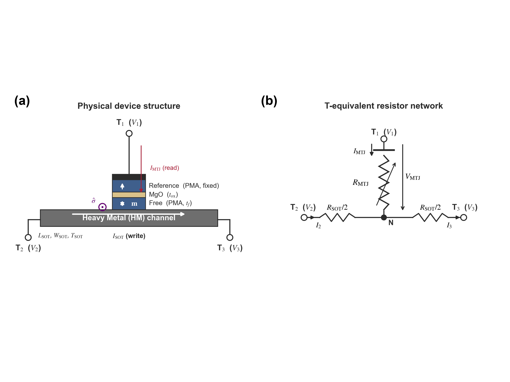

**图2.1：三端SOT-sMTJ器件结构与T型等效电路网络。** (a)器件物理堆叠结构，包括位于顶端的MTJ (参考层/MgO势垒/自由层) 与底部的HM沟道；MTJ顶电极对应端口$$T_1$$，HM沟道两端分别引出端口$$T_2$$与$$T_3$$。(b)T型电阻网络，$$R_{MTJ}$$表示自由层与参考层之间的隧穿电阻，沟道被等分为两段$$R_{SOT}/2$$分别接$$T_2$$与$$T_3$$，三段电阻在中间节点N处汇合。读出操作通过$$T_1$$施加小偏压获取$$R_{MTJ}$$状态，写入操作通过$$T_2$$、$$T_3$$沿沟道施加大电流产生SOT，两条电流路径在物理上解耦。

设端口$$T_1$$、$$T_2$$、$$T_3$$电压分别为$$V_1$$、$$V_2$$、$$V_3$$，中间节点电压为$$V_N$$。节点N处的KCL给出

$$
\frac{V_1-V_N}{R_{MTJ}} + \frac{V_2-V_N}{R_{SOT}/2} + \frac{V_3-V_N}{R_{SOT}/2} = 0,
$$

解得$$V_N = [R_{SOT}V_1 + 2R_{MTJ}(V_2+V_3)]/(R_{SOT}+4R_{MTJ})$$。代入欧姆关系即可得到流过MTJ的电流

$$
I_{MTJ} = \frac{V_1-V_N}{R_{MTJ}} = \frac{4V_1 - 2V_2 - 2V_3}{4R_{MTJ}+R_{SOT}},
$$

以及流入端口$$T_2$$、$$T_3$$的电流

$$
I_2 = \frac{V_2-V_3}{R_{SOT}} - \frac{1}{2}I_{MTJ}, \qquad I_3 = -\frac{V_2-V_3}{R_{SOT}} - \frac{1}{2}I_{MTJ}.
$$

后两式中的$$\pm\tfrac{1}{2}I_{MTJ}$$项分别对应$$I_{MTJ}$$经由沟道向$$T_2$$与$$T_3$$对称分流的部分。这两段分流在沟道左右两侧方向相反，所产生的横向自旋积累在自由层下方相互抵消，对SHE-SOT效应没有净贡献。驱动自由层翻转的有效SOT电流由$$T_2$$至$$T_3$$的贯穿分量给出

$$
I_{SOT} = \frac{V_2-V_3}{R_{SOT}}.
$$

该表达式从电路层面验证了三端结构的读写解耦：施加于$$T_1$$的MTJ偏压$$V_{MTJ} = V_1 - V_N$$即使较大也不会改变$$I_{SOT}$$的方向与幅值，从而允许将$$V_{MTJ}$$独立用作VCMA能垒调制变量 (详见2.1.3节)。

MTJ的隧穿电阻由Brinkman模型描述，该模型基于WKB近似处理梯形势垒的电压依赖隧穿[^ref-brinkman-bdr]。在低偏压下，平行态电阻可表为势垒厚度与势垒高度的函数

$$
R_P = \frac{t_{ox}}{F \cdot A_{MTJ} \cdot \phi_{ox}}\exp\!\left(\frac{2 t_{ox}}{\hbar}\sqrt{2 m_e e\, \phi_{ox}}\right),
$$

其中$$t_{ox}$$与$$\phi_{ox}$$分别为隧穿势垒层厚度与势垒高度，$$F$$为根据电阻—面积乘积$$RA$$标定的拟合因子，$$A_{MTJ}$$为MTJ截面积，$$e$$为元电荷，$$m_e$$为电子质量，$$\hbar$$为约化普朗克常数。指数因子主导了真实$$R_P$$对势垒厚度的强敏感性，$$t_{ox}$$每变化$$0.1\,\mathrm{nm}$$量级即可使$$R_P$$变化数倍，构成MTJ阻值工艺难以精细控制的根本来源之一 (就本行为级实现而言，拟合因子$$F$$经R·A约束后$$R_P$$解析地退化为$$\mathrm{R\!\cdot\!A}/A_{MTJ}$$、由实测R·A直接定标，详见2.2.2.3节及[^note-dev-bdr])。
[^note-dev-bdr]: 将$$F=\dfrac{t_{\mathrm{ox}}}{\mathrm{R\!\cdot\!A}\,\sqrt{\phi_{\mathrm{ox}}}}\exp\!\big(2t_{\mathrm{ox}}\sqrt{2m_e e\phi_{\mathrm{ox}}}/\hbar\big)$$代回正文$$R_P$$表达式，两处$$\exp$$因子、$$t_{\mathrm{ox}}$$与$$\sqrt{\phi_{\mathrm{ox}}}$$逐项相消，得$$R_P=\mathrm{R\!\cdot\!A}/A_{\mathrm{MTJ}}$$，与$$\phi_{\mathrm{ox}}$$、$$t_{\mathrm{ox}}$$均无关。这一等效说明正文公式在行为级模型中承担R·A定标与灵敏度解释作用；若需以势垒参数为自变量正向预测R·A，应使用未将R·A吸收进$$F$$的Simmons/BDR形式。

反平行态电阻$$R_{AP}$$由TMR比定义。在Jullière二流模型下，理论TMR可由两侧铁磁电极的有效自旋极化率$$P$$给出

$$
\mathrm{TMR}_0 = \frac{R_{AP}-R_P}{R_P} = \frac{2P^2}{1-P^2}.
$$

实际TMR随MTJ两端电压$$V_{MTJ}$$增大而衰减，主要源自界面处的非弹性磁子辅助隧穿过程，即磁子吸收/发射通道随偏压打开后破坏了自旋守恒[^ref-moodera-tmr]。Moodera等的实验观测显示，TMR随$$V_{MTJ}$$近似呈Lorentzian形衰减，常用的工程参数化形式为

$$
\mathrm{TMR}(V_{MTJ}) = \frac{\mathrm{TMR}_0}{1 + V_{MTJ}^2/V_h^2},
$$

其中特征电压$$V_h$$定义为TMR下降至理论值一半时所对应的偏压，CoFeB/MgO/CoFeB体系中典型值约为$$0.3\text{--}0.7\,\mathrm{V}$$。当自由层与参考层磁化方向夹角为$$\theta$$时，MTJ电阻满足如下含偏压依赖的角度公式

$$
R_{MTJ}(V_{MTJ},\theta) = R_P\,\frac{1+V_{MTJ}^2/V_h^2 + \mathrm{TMR}_0}{1+V_{MTJ}^2/V_h^2 + 0.5\,\mathrm{TMR}_0(1+\cos\theta)}.
$$

在$$\theta = 0$$ (平行) 时分子分母相同，$$R_{MTJ} = R_P$$；在$$\theta = \pi$$ (反平行) 且$$V_{MTJ} \ll V_h$$时，$$R_{MTJ} \to R_P(1+\mathrm{TMR}_0) = R_{AP}$$。该公式同时刻画了TMR随偏压的压缩与随磁化夹角的连续变化，是磁动力学求解过程中读出电流计算的基础。

$$V_{MTJ}$$与$$I_{SOT}$$在端口拓扑上解耦，却经共享自由层的能垒调制在磁化层内相互耦合，其协同决定动态翻转概率的关系见2.1.3节。

### 2.1.2自由层磁化动力学与热激活翻转概率

亚临界写入下sMTJ的翻转由热涨落主导，可在宏自旋近似下由Néel–Brown热激活模型与受驱动调制的能垒缩减表达式描述。

对具有PMA的MTJ自由层，热稳定因子定义为$$\Delta = E_b/(k_B T)$$，度量两稳定磁化态之间的能垒高度，其中$$E_b = K_{\mathrm{eff}}V \approx \tfrac{1}{2}\mu_0 H_k M_s V$$，$$V$$为自由层体积，$$K_{\mathrm{eff}}$$为有效各向异性能密度，$$H_k$$为等效各向异性场，$$M_s$$为饱和磁化强度。在亚临界写入条件下，sMTJ的翻转受热涨落主导，由Néel–Brown热激活模型描述[^ref-brown-thermal]：磁化在能垒约束下发生热激活逃逸，平均停留时间满足Arrhenius关系$$\tau = \tau_0 \exp(\Delta)$$，其中$$\tau_0$$为亚纳秒至纳秒量级的尝试时间，典型取值约为$$1\,\mathrm{ns}$$。在持续时间为$$t_w$$的写脉冲下以泊松过程近似，翻转概率为

$$
P_{\mathrm{sw}}(t_w) = 1 - \exp\!\left(-\frac{t_w}{\tau_0 e^{\Delta}}\right).
$$

外场、自旋转移矩或SOT驱动存在时，常将其等效为能垒压低$$\Delta_{\mathrm{eff}} = \Delta(1-I/I_{c0})^n$$ ($$I < I_{c0}$$)，其中$$I_{c0}$$为零温临界驱动，指数$$n$$由器件物理工作区间决定：亚临界热激活区 (驱动远低于$$I_{c0}$$、热涨落主导翻转) 能垒随驱动呈线性压低，对应$$n = 1$$；接近零温弹道极限 (驱动接近$$I_{c0}$$、热涨落可忽略) 能垒压低呈抛物线行为，对应$$n = 2$$。概率计算工作区位于亚临界热激活区，故下文取$$n = 1$$。综合得带驱动的翻转概率

$$
P_{\mathrm{sw}}(t_w, I) = 1 - \exp\!\left[-\frac{t_w}{\tau_0}\exp\!\left(-\Delta\!\left(1-\frac{I}{I_{c0}}\right)^n\right)\right].
$$

定义二值随机变量$$m \in \{0,1\}$$表示器件翻转事件，则$$m \sim \operatorname{Bernoulli}(P_{\mathrm{sw}})$$，sMTJ即成为以驱动量为参数的可编程伯努利源。该模型与器件实测的吻合度见2.3节。

### 2.1.3 SOT与VCMA联合驱动模型

SOT-MRAM的写入电流流经HM沟道，由自旋霍尔效应或Rashba–Edelstein效应产生横向自旋积累，对自由层施加阻尼型等效场

$$
H_{\mathrm{DL}} = \frac{\hbar \theta_{\mathrm{SH}} I_{SOT}}{2 e \mu_0 M_s t_f A_c},
$$

其中$$\theta_{\mathrm{SH}}$$为有效自旋霍尔角，$$I_{SOT}$$即2.1.1节由$$(V_2-V_3)/R_{SOT}$$给出的沟道贯穿电流，$$t_f$$为自由层厚度，$$A_c$$为沟道截面积。零温近似下临界SOT电流标度为

$$
I_{c0}^{\mathrm{SOT}} \propto \frac{2e}{\hbar}\,\frac{\alpha M_s t_f A_c}{\theta_{\mathrm{SH}}}\,H_k,
$$

降低$$M_s$$、$$t_f$$、阻尼系数$$\alpha$$或提高$$\theta_{\mathrm{SH}}$$均可减小写入电流[^ref-krizakova-sot-review]。

VCMA机制通过MTJ两端的偏压$$V_{MTJ}$$改变自由层/氧化层界面的各向异性，界面各向异性能面密度$$K_i$$随电场线性变化[^ref-nozaki-vcma]

$$
K_i(V_{MTJ}) = K_i(0) - \xi\,\frac{V_{MTJ}}{t_{ox}},
$$

其中$$\xi$$为VCMA系数 (量纲$$\mathrm{fJ/(V\cdot m)}$$)，$$t_{ox}$$已由2.1.1节给出。此处$$V_{MTJ}$$正是2.1.1节T型等效电路中$$T_1$$与中点N之间的电压降，电学模型与磁动力学模型由此通过共享变量自然衔接。将界面项折算到体各向异性后，能垒变为

$$
E_b(V_{MTJ}) = \left[K_{\mathrm{eff}}(0) - \frac{\xi}{t_f}\,\frac{V_{MTJ}}{t_{ox}}\right]V,
$$

代入Néel–Brown模型可得VCMA辅助下的翻转概率

$$
P_{\mathrm{sw}}(t_w, V_{MTJ}) = 1 - \exp\!\left(-\frac{t_w}{\tau_0}\exp\!\left[-\Delta_0 + \beta_{\mathrm{VCMA}} V_{MTJ}\right]\right),
$$

其中$$\Delta_0 = E_b(0)/(k_B T)$$，$$\beta_{\mathrm{VCMA}} = \xi V/(k_B T \cdot t_f t_{ox})$$。VCMA将翻转概率曲线沿$$V_{MTJ}$$方向左移，使较低写入能量下即可获得可控的随机翻转。

VCMA与SOT联合作用时，自然的建模顺序是VCMA先降低各向异性与能垒 ($$H_k \to H_k(V_{MTJ})$$)，SOT再提供翻转驱动力，由此得到偏压依赖的SOT临界电流$$I_{c0}^{\mathrm{VCMA}}(V_{MTJ})$$及联合翻转概率

$$
P_{\mathrm{sw}}(t_w, I_{SOT}, V_{MTJ}) = 1 - \exp\!\left[-\frac{t_w}{\tau_0}\exp\!\left(-(\Delta_0 - \beta_{\mathrm{VCMA}}V_{MTJ})\!\left(1-\frac{I_{SOT}}{I_{c0}^{\mathrm{VCMA}}(V_{MTJ})}\right)^n\right)\right].
$$

由于$$H_k(V_{MTJ})$$随VCMA偏压下降，$$I_{c0}^{\mathrm{VCMA}}$$亦相应降低，VCMA辅助SOT得以减小写电流与写能耗[^ref-zhang-vgsot]。该联合模型给出了三端sMTJ作为可编程伯努利源的完整描述：外部电路只需指定脉宽$$t_w$$、SOT电流$$I_{SOT}$$与MTJ偏压$$V_{MTJ}$$这一三元组，器件即输出对应概率的随机比特。

### 2.1.4工作区Sigmoid近似

联合翻转概率$$P_{\mathrm{sw}}$$是驱动量的指数嵌套函数，严格数学形式属于Gumbel型累积分布而非标准Sigmoid (Logistic) 函数。但在临界过渡区 ($$P_{\mathrm{sw}} \approx 0.05$$至$$0.95$$) 高阶项影响甚小，可作Sigmoid近似。设等效驱动变量$$u$$综合脉宽、SOT电流与VCMA偏压的影响，将有效能垒在工作点$$u_0$$附近一阶展开$$\Delta E_{\mathrm{eff}}(u) \approx \Delta E_{\mathrm{eff}}(u_0) - \kappa(u-u_0)$$，其中$$\kappa = -\partial \Delta E_{\mathrm{eff}}/\partial u|_{u_0}$$为能垒压低效率，则

$$
P_{\mathrm{sw}}(u) = 1 - \exp[-A\exp(B(u-u_0))], \qquad B = \frac{\kappa}{k_B T}.
$$

定义中值翻转点$$u_{\mathrm{th}}$$满足$$P_{\mathrm{sw}}(u_{\mathrm{th}}) = 0.5$$，将$$P_{\mathrm{sw}}$$转换到logit域$$L(u) = \ln[P_{\mathrm{sw}}/(1-P_{\mathrm{sw}})]$$并在$$u_{\mathrm{th}}$$处一阶泰勒展开 (零次项$$L(u_{\mathrm{th}}) = 0$$)，得$$L(u) \approx 2B\ln 2 \cdot (u-u_{\mathrm{th}})$$。记$$\beta_s = 2\kappa\ln 2/(k_B T)$$，还原概率形式即得过渡区Sigmoid近似

$$
P_{\mathrm{sw}}(u) \approx \sigma(\beta_s(u-u_{\mathrm{th}})) = \frac{1}{1 + e^{-\beta_s(u-u_{\mathrm{th}})}}.
$$

参数$$u_{\mathrm{th}}$$为等效中值翻转点，随脉宽增加、温度升高或VCMA/SOT效率增大而左移；$$\beta_s$$控制曲线陡峭程度，热稳定因子越高、器件离散性越小则$$\beta_s$$越大，工艺波动导致的曲线展宽等效为$$\beta_s$$下降。微观上自旋翻转由随机Landau-Lifshitz-Gilbert (sLLG) 方程主导，对应Fokker-Planck框架下概率团在双稳态势阱中的演化，其严格求解的计算代价在SPICE仿真或阵列级评估中难以承受。Sigmoid近似将这一微观随机过程压缩为$$(u_{\mathrm{th}}, \beta_s)$$两个兼具物理意义与工程可测性的拟合参数，输出位于$$[0,1]$$而无需额外裁剪，便于在SPICE紧凑模型与系统级仿真中直接调用。改写为$$P_{\mathrm{sw}}(u) \approx \sigma(\beta_s u + b)$$形式时，截距$$b = -\beta_s u_{\mathrm{th}}$$；增益$$\beta_s$$由热稳定因子$$\Delta$$、VCMA系数$$\xi$$、SHE效率$$\theta_{\mathrm{SH}}$$等底层物理参数共同决定，参数$$(\beta_s, u_{\mathrm{th}})$$因此可由工艺标定直接给出。

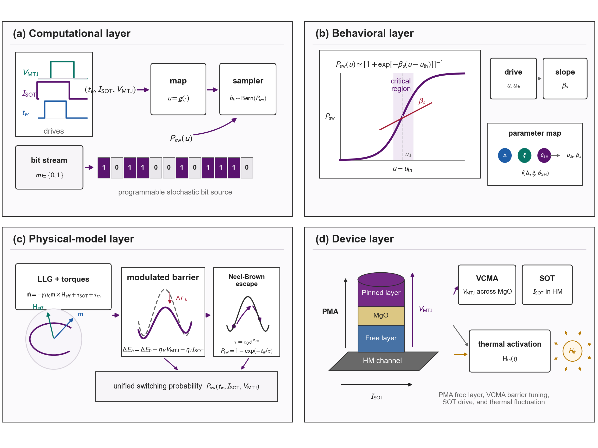

**图2.2：面向概率计算的sMTJ行为级模型分层架构。** 自上而下四个层次。(a)计算层：从外部驱动量$$(t_w, I_{SOT}, V_{MTJ})$$到等效驱动$$u$$的映射，以及基于sMTJ随机性的伯努利采样，输出由$$P_{\mathrm{sw}}(u)$$参数化的随机比特流，作为可编程随机源供后续电路与系统级使用。(b)行为层：临界过渡区内$$P_{\mathrm{sw}}$$的Sigmoid近似，由等效驱动量$$u$$、阈值$$u_{\mathrm{th}}$$与斜率$$\beta_s$$定义，并展示其与底层物理参数$$\Delta$$、$$\xi$$、$$\theta_{\mathrm{SH}}$$的依赖关系。(c)物理模型层：包含SOT与热力矩的LLG方程、综合VCMA能垒压低与SOT驱动的调制能垒$$\Delta E_b$$，以及用于推导统一翻转概率$$P_{\mathrm{sw}}$$的Néel–Brown模型。(d)器件层：具有PMA的sMTJ结构与三类物理驱动机制，包括施加于MgO势垒两端的VCMA偏压$$V_{MTJ}$$、流经HM沟道的SOT电流$$I_{SOT}$$以及热涨落。

## 2.2 磁学仿真方法与平台

本节把2.1节的概率翻转抽象落到可复现实算的物理引擎上。sMTJ的C2C随机性来自热涨落驱动下的磁化动力学；仿真链路须同时保留热噪声、自热反馈、温度依赖材料参数与端口电学耦合，才能为后续实验拟合得到的Sigmoid参数提供可解释的物理来源。

本文采用宏自旋sLLG模型作为主求解层级。研究对象是80 nm级、接近单畴的sMTJ概率单元[^ref-kittel-domain]，关注量是翻转概率、能耗和阵列级参数传递。以建立一条从有效场、随机热场、温度反馈到$$P_{\mathrm{sw}}$$统计量的闭合链路，并将其实现为后续实验校准和系统评估都可调用的仿真平台。

---

### 2.2.1 磁化动力学基础模型

#### 2.2.1.1 Landau–Lifshitz–Gilbert方程与自旋力矩项

自由层磁化矢量$$\mathbf{m}$$ (已归一化，$$|\mathbf{m}|=1$$) 的时间演化由扩展的Landau–Lifshitz–Gilbert (LLG) 方程描述。该方程最初由Landau和Lifshitz于1935年在铁磁共振理论框架下提出[^ref-landau-lifshitz]，Gilbert于1955年引入耗散项并将其改写为与实验更为吻合的阻尼形式[^ref-gilbert-damping]，后经Slonczewski[^ref-slonczewski-stt]与Berger[^ref-berger-stt]在1996年分别独立地将自旋转移力矩 (STT) 引入；本文所关注的SOT-MTJ体系进一步纳入了由重金属层自旋霍尔效应产生的自旋轨道力矩 (SOT) 项[^ref-miron-sot][^ref-liu-spin-hall]。其完整隐式形式为

$$
\frac{\partial \mathbf{m}}{\partial t}
= -\gamma \mathbf{m} \times \mathbf{H}_{\mathrm{eff}}
+ \alpha \mathbf{m} \times \frac{\partial \mathbf{m}}{\partial t}
+ \boldsymbol{\tau}_{\mathrm{STT}}
+ \boldsymbol{\tau}_{\mathrm{SOT}}
$$

其中$$\gamma$$为旋磁比，$$\alpha$$为Gilbert阻尼系数，$$\mathbf{H}_{\mathrm{eff}}$$为有效磁场 (详见2.2.1.2节)，$$\boldsymbol{\tau}_{\mathrm{STT}}$$、$$\boldsymbol{\tau}_{\mathrm{SOT}}$$分别为两类自旋力矩项。

**STT项。** 自旋转移力矩源自穿过MTJ势垒的隧穿电流中的极化电子，经过自由层时把自旋角动量转移给局域磁矩。以自由层归一化磁化矢量$$\mathbf{m}$$与参考层固定磁化方向$$\hat{\mathbf{m}}_p$$表示，Slonczewski与Berger独立推导得到阻尼型分量
$$
\boldsymbol{\tau}_{\mathrm{STT,DL}}
= -\gamma\,a_J\,\mathbf{m}\times(\mathbf{m}\times\hat{\mathbf{m}}_p),
\qquad
a_J \equiv \frac{\hbar P J_{\mathrm{STT}}}{2 e \mu_0 M_s t_f}
$$

其中$$J_{\mathrm{STT}}=I_{\mathrm{MTJ}}/A_{\mathrm{MTJ}}$$为隧穿电流密度，$$P$$为自旋极化率 (CoFeB/MgO界面取约0.58[^ref-ikeda-pma])。$$a_J$$具有磁场量纲 (A/m)，等价于将STT折算到与PMA同形式的等效阻尼型场$$H_{\mathrm{DL}}^{\mathrm{STT}}=a_J$$。同时存在共轭的场型分量

$$
\boldsymbol{\tau}_{\mathrm{STT,FL}} = +\gamma\,b_J\,\mathbf{m}\times\hat{\mathbf{m}}_p,
\qquad
b_J = \beta_{\mathrm{STT}}^{\mathrm{FL/DL}}\,a_J,
$$

工程上以比例系数$$\beta_{\mathrm{STT}}^{\mathrm{FL/DL}}\in[0,0.3]$$参数化；对垂直MTJ这一比值偏小，本工作中按0处理。注意$$\mathbf{m}\times\hat{\mathbf{m}}_p$$在$$\mathbf{m}$$靠近极轴 ($$\hat{\mathbf{m}}_p=\pm\hat{\mathbf{z}}$$) 时随$$\sin\theta$$线性消失，因此纯STT写入需要依赖热涨落把磁化从极轴附近偏离才能启动翻转。

**SOT项。** 自旋轨道力矩由重金属层 (如Ta、$$\beta$$-W) 中的自旋霍尔效应产生：横向电流通过自旋霍尔角$$\theta_{\mathrm{SH}}$$转换为纵向自旋流，在重金属/铁磁层界面累积出极化方向$$\boldsymbol{\sigma}=\hat{\mathbf{z}}\times\hat{\mathbf{j}}$$的自旋极化，进而对自由层磁矩施加力矩。该力矩按物理机制分解为阻尼型 (DL) 与场型 (FL) 两个分量[^ref-manchon-sot]：
$$
\boldsymbol{\tau}_{\mathrm{SOT}}
= -\gamma H_{\mathrm{DL}}^{\mathrm{SOT}}\,\mathbf{m}\times(\mathbf{m}\times\boldsymbol{\sigma})
+ \gamma H_{\mathrm{FL}}^{\mathrm{SOT}}\,\mathbf{m}\times\boldsymbol{\sigma}
$$

其中DL分量的等效场幅值由自旋霍尔角$$\theta_{\mathrm{SH}}$$、沟道电流密度$$J_{\mathrm{SOT}}=I_{\mathrm{SOT}}/A_{\mathrm{SOT}}$$以及自由层厚度$$t_f$$共同决定：

$$
H_{\mathrm{DL}}^{\mathrm{SOT}}
= \frac{\hbar \theta_{\mathrm{SH}} J_{\mathrm{SOT}}}{2 e \mu_0 M_s t_f},
\qquad
H_{\mathrm{FL}}^{\mathrm{SOT}} = \beta_{\mathrm{SOT}}^{\mathrm{FL/DL}}\,H_{\mathrm{DL}}^{\mathrm{SOT}}.
$$

DL分量与Gilbert阻尼等价但方向相反，超过临界电流密度后可驱动磁化发生确定性翻转或进入概率性翻转窗口。与STT不同，$$\mathbf{m}\times(\mathbf{m}\times\boldsymbol{\sigma})$$在$$\boldsymbol{\sigma}$$与极轴正交 (如$$\boldsymbol{\sigma}\perp\hat{\mathbf{z}}$$) 时即便$$\mathbf{m}\parallel\hat{\mathbf{z}}$$也保持有限，故SOT写入无需热涨落即可在极轴附近启动，亚纳秒级翻转因此成为可能。FL分量等效为附加偏置场，对翻转阈值有修正作用；对称界面结构中其幅值通常远小于DL分量，但在某些重金属-铁磁体系中FL/DL比值可达$$0.5\sim1$$，仍须显式纳入。

**STT与SOT的对照。** 二者在器件依赖性与工作机制上的核心差异由下表归纳。

**表2.1** STT与SOT两种自旋力矩驱动机制的对照表

| 物理量 | STT (Slonczewski) | SOT (Spin Hall) |
|---|---|---|
| 驱动电流路径 | $$I_{\mathrm{MTJ}}=V_{\mathrm{MTJ}}/R_{\mathrm{MTJ}}$$，纵贯隧道势垒 | $$I_{\mathrm{SOT}}=(V_2-V_3)/R_{\mathrm{SOT}}$$，沿重金属沟道横向 |
| 阻尼型等效场 | $$H_{\mathrm{DL}}^{\mathrm{STT}}=\hbar P J_{\mathrm{STT}}/(2e\mu_0 M_s t_f)$$ | $$H_{\mathrm{DL}}^{\mathrm{SOT}}=\hbar\theta_{\mathrm{SH}}J_{\mathrm{SOT}}/(2e\mu_0 M_s t_f)$$ |
| 效率因子 | 自旋极化率$$P\sim 0.58$$ | 自旋霍尔角$$\theta_{\mathrm{SH}}$$ (文献$$\beta$$-W本征值约0.25–0.4、与厚度强相关；本模型端口级有效标定值$$\approx0.066$$) |
| 自旋极化方向 | $$\hat{\mathbf{m}}_p$$ (参考层磁化方向) | $$\boldsymbol{\sigma}=\hat{\mathbf{z}}\times\hat{\mathbf{j}}$$ (由电流方向决定) |
| 极轴处力矩 | $$\propto\sin\theta\to 0$$ (启动需热涨落) | 始终有限 (无需启动阈值) |
| 翻转能耗主因 | 隧穿耗散$$\propto V_{\mathrm{MTJ}}^2/R_{\mathrm{MTJ}}$$ | 沟道焦耳热$$\propto V_{\mathrm{SOT}}^2/R_{\mathrm{SOT}}$$ |
| 写入–读取通道 | 共用 (写电流流过MTJ) | 解耦 (写流沟道，读流势垒) |

本文以SOT为单器件主驱动机制：SOT力矩在极轴附近不消失，写入延迟可压至亚纳秒级；读写通道解耦避免了STT写入时势垒长期承受高偏压所引发的可靠性退化；三端结构还允许VCMA偏压与SOT电流独立调度，从而支持2.1.3节给出的SOT-VCMA联合驱动模型。STT项在本框架中保留为可选支路，用于STT-only写入能耗基准与STT+SOT联合校核。

**显式数值形式。** 在数值求解中，直接对隐式LLG积分会导致迭代步骤复杂、计算代价高昂。利用矢量恒等式$$\mathbf{m}\times(\mathbf{m}\times\mathbf{H})=(\mathbf{m}\cdot\mathbf{H})\mathbf{m}-\mathbf{H}$$以及$$|\mathbf{m}|=1$$的约束，可将其改写为不含$$\partial\mathbf{m}/\partial t$$隐式项的显式Landau–Lifshitz–Slonczewski (LLS) 形式：
$$
\frac{d\mathbf{m}}{dt}
= -\frac{\gamma}{1+\alpha^2}
\left[
\mathbf{m}\times\mathbf{H}_{\mathrm{eff}}
+ \alpha\,\mathbf{m}\times(\mathbf{m}\times\mathbf{H}_{\mathrm{eff}})
\right]
+ \mathbf{T}_{\mathrm{ext}}
$$

其中$$\mathbf{T}_{\mathrm{ext}} = \boldsymbol{\tau}_{\mathrm{STT}}+\boldsymbol{\tau}_{\mathrm{SOT}}$$为经$$(1+\alpha^2)$$预因子修正后的全部外加力矩之和，该因子由Gilbert阻尼项的消去过程引入。该显式形式将进动项与阻尼项分离，避免了隐式方程在大$$\alpha$$极限下的数值不稳定问题。在实际仿真中，时间步长须满足$$\Delta t\ll(\gamma H_{\mathrm{eff}})^{-1}$$以保证积分稳定性；具体的保模长几何积分算法在2.2.3节详述。

---

#### 2.2.1.2 有效磁场建模

有效磁场$$\mathbf{H}_{\mathrm{eff}}$$由多个物理机制叠加而成：

$$
\mathbf{H}_{\mathrm{eff}}
= \mathbf{H}_{\mathrm{PMA}} + \mathbf{H}_{\mathrm{VCMA}}
+ \mathbf{H}_{\mathrm{D}} + \mathbf{H}_{\mathrm{EX}} + \mathbf{H}_{\mathrm{TH}}
$$

**垂直磁各向异性场 (PMA)。** 在CoFeB/MgO界面体系中，由于Fe-O键的轨道杂化，界面处积累的垂直各向异性能可在较薄的自由层中克服形状各向异性，从而使易磁化轴沿垂直于薄膜平面的$$z$$方向稳定。其等效场为
$$
\mathbf{H}_{\mathrm{PMA}}
= \frac{2K_i}{\mu_0 M_s t_f}\,m_z\,\hat{z}
$$

其中$$K_i$$为单位面积界面各向异性能密度，$$M_s$$为饱和磁化强度，$$t_f$$为自由层厚度。该场沿$$z$$轴方向对磁化产生恢复力，是PMA-MTJ中能垒的主要来源。

**VCMA等效场。** 电压调控磁各向异性 (VCMA) 效应是指在MgO势垒两端施加电压时，界面电场改变Fe-O键的轨道占据，从而调制$$K_i$$的大小[^ref-nozaki-vcma-feb]。在线性响应范围内，VCMA等效磁场可写为

$$
\mathbf{H}_{\mathrm{VCMA}}
= -\frac{2\beta_{\mathrm{VCMA}}\,V_{\mathrm{MTJ}}}{\mu_0 M_s\,t_{\mathrm{ox}}\,t_f}\,m_z\,\hat{z}
$$

其中$$\beta_{\mathrm{VCMA}}$$为VCMA系数 (单位fJ·V$$^{-1}$$·m$$^{-1}$$)，$$V_{\mathrm{MTJ}}$$为MTJ两端电压，$$t_{\mathrm{ox}}$$为MgO势垒厚度。$$\mathbf{H}_{\mathrm{VCMA}}$$与$$\mathbf{H}_{\mathrm{PMA}}$$同向叠加，即正向电压降低等效各向异性场、削减能垒，这一特性是VGSOT写入方案中实现低功耗辅助翻转的物理基础。

**退磁场。** 有限尺寸的磁性薄层在磁化过程中会产生与磁化方向相反的退磁场，其表达式为
$$
\mathbf{H}_{\mathrm{D}} = -M_s\,\mathbf{N}\cdot\mathbf{m}
$$

其中$$\mathbf{N}$$为退磁张量。对于圆柱形MTJ自由层 ($$t_f \ll D_{\mathrm{phys}}$$)，在薄圆盘极限下退磁因子可近似为

$$
N_x = N_y \approx \frac{\pi t_f}{4D_{\mathrm{phys}}},\qquad
N_z = 1 - 2N_x
$$

上述退磁因子表达式是对$$t_f/D_{\mathrm{phys}} \ll 1$$极限下扁椭球体的线性化近似，适用于快速定性估算。当器件尺寸缩减或自由层厚度增大、宽厚比不满足薄圆盘近似时，应采用精确的椭球体解析公式，具体形式将在2.2.2.4节给出，实际仿真中亦采用该精确式。此外，该近似表达式中的直径取物理直径$$D_{\mathrm{phys}}$$，而电学有效直径$$D_{\mathrm{elec}}$$因边缘刻蚀效应通常较$$D_{\mathrm{phys}}$$小约5–10 nm，两者的区分在2.2.2.4节一并讨论。

**交换偏置场。** 为实现无外加磁场条件下的确定性场无关SOT翻转，VGSOT结构中引入了合成反铁磁 (SAF) 层或直接的反铁磁钉扎层以提供面内交换偏置场：

$$
\mathbf{H}_{\mathrm{EX}} = H_{\mathrm{EX}}\,\hat{y}
$$

该偏置场打破了SOT翻转中$$\pm z$$方向的等效对称性，使驱动电流的极性与翻转方向之间形成确定性的一一对应关系[^note-dev-hex]。
[^note-dev-hex]: 该垂直关系在标定中被确认为模型的一处方向敏感点：交换偏置场一旦偏离与$$\hat{\sigma}_{\mathrm{SH}}$$ (本仿真器默认$$-\hat{x}$$) 垂直的设置，仿真SER即塌缩为约$$0.5$$的随机比特平台，器件退化为不再受驱动电流极性确定性偏置的无偏硬币 (与上述对称性破缺机制互为印证)。故实现中将$$\mathbf{H}_{\mathrm{EX}}$$严格约束为垂直于$$\hat{\sigma}_{\mathrm{SH}}$$，默认取沿$$-\hat{y}$$的$$-50\,\mathrm{Oe}$$。

**热噪声场。** 在有限温度下，自由层磁矩与晶格声子系统之间的热涨落通过涨落-耗散定理 (fluctuation-dissipation theorem) 耦合进入LLG方程[^ref-callen-welton]。Brown于1963年在单畴粒子框架下严格证明，与Gilbert阻尼$$\alpha$$共轭的热随机场$$\mathbf{H}_{\mathrm{TH}}$$必须满足白噪声统计，其二阶相关函数为[^ref-brown-thermal]
$$
\langle H_{\mathrm{TH},i}(t)\,H_{\mathrm{TH},j}(t')\rangle
= \delta_{ij}\,\delta(t-t')\,
\frac{2k_BT\alpha}{\mu_0 M_s \gamma V}
$$

其中$$k_B$$为Boltzmann常数，$$T$$为器件瞬态温度，$$V = \pi D_{\mathrm{phys}}^2 t_f/4$$为自由层体积，$$i,j \in \{x,y,z\}$$。上述二阶相关函数表明热噪声场在各分量间互不相关 ($$\delta_{ij}$$)，且在时间上为白噪声 ($$\delta(t-t')$$)，其幅度正比于$$\sqrt{\alpha T/(M_s\gamma V)}$$，即较大的阻尼、较高的温度或较小的磁矩体积均会增强热涨落强度。

在数值离散化实现中，为与有限时间步$$\Delta t$$相容，对连续白噪声功率谱密度进行时域积分并在每步独立重新采样，得到各分量的等效高斯随机场幅值：

$$
\mathbf{H}_{\mathrm{TH}}
= \boldsymbol{\xi}\sqrt{\frac{2k_BT\alpha}{\mu_0 M_s \gamma V \Delta t}}
$$

其中$$\boldsymbol{\xi} = (\xi_x, \xi_y, \xi_z)^{\mathrm{T}}$$，各分量为相互独立的标准正态随机变量，即$$\xi_i \sim \mathcal{N}(0,1)$$。离散采样形式等价于以时间步$$\Delta t$$对原始相关函数中的$$\delta(t-t')$$进行积分后得到的离散版本，García-Palacios和Lázaro于1998年对此给出了详细推导，并验证了该采样方式在Stratonovich随机积分意义下的自洽性[^ref-garcia-palacios-sllg]。

前期一些公开的VGSOT-MTJ紧凑模型Python移植实现[^ref-zhang-vgsot]中，存在一个对统计学结论影响显著的实现细节差异：$$\boldsymbol{\xi}$$被生成为三维高斯样本后再显式归一化为单位向量$$\boldsymbol{\xi}\leftarrow\boldsymbol{\xi}/|\boldsymbol{\xi}|$$，相当于将$$|\mathbf{H}_{\mathrm{TH}}|^2$$从$$\chi^2_3$$分布锁定为常数，违反了FDT对各分量方差的硬性约束 (正确实现下$$\mathbb{E}[|\mathbf{H}_{\mathrm{TH}}|^2]=3\sigma_{\mathrm{th}}^2$$，而归一化后$$|\mathbf{H}_{\mathrm{TH}}|^2\equiv\sigma_{\mathrm{th}}^2$$)，等效将注入噪声功率压缩了三倍。其物理后果是临界电压附近的$$P_{\mathrm{sw}}(V)$$曲线在仿真中显著陡于实测，从而严重低估Sigmoid斜率的D2D展宽因子$$\eta_c$$。本工作配套仿真器采用三分量独立$$\mathcal{N}(0,1)$$采样以确保与FDT严格自洽，2.3.5节中给出的$$\eta_c$$与$$\mathcal{F}(\mathrm{CV})$$标定数值即基于修正后的实现。引入自热效应后，上述采样式中的温度$$T$$将随时间步演化，而非保持为固定常数；具体耦合更新机制在2.2.2节与2.2.3节给出。

有效场各分量的物理参数取值依据2.2.2节各小节末尾列出的器件参数表 (2.2.2.1节末表2.2、2.2.2.2节末表2.3、2.2.2.3节末表2.4)，而离散热噪声采样中温度$$T$$与材料参数$$M_s(T)$$、$$K_i(T)$$之间的耦合反馈关系，则是2.2.2节温度效应建模的核心内容。

---

---

### 2.2.2 温度效应与器件非理想性

前述磁化动力学模型主要刻画了自由层在有效磁场、自旋力矩与热噪声共同作用下的随机演化规律。实际VGSOT/SOT-MTJ中，写入焦耳热、材料参数温漂、隧穿输运非线性与有限尺寸退磁共同决定概率曲线的展宽、阈值漂移与读写不对称。本节在统一符号体系下对这些因素集中建模。

本节各物理量通过如下反馈链与2.2.1节LLG方程耦合：每一个离散时间步内，热扩散方程先以当前电学状态更新器件温度$$T$$；随后，$$T$$的变化通过2.2.2.2节的温度依赖关系同步更新材料参数$$M_s(T)$$、$$K_i(T)$$和$$\eta(T)$$；更新后的材料参数重新计算有效场各分量$$\mathbf{H}_{\mathrm{PMA}}$$、$$\mathbf{H}_{\mathrm{D}}$$及热噪声幅度；最终以新的有效场驱动Cayley变换推进磁化矢量$$\mathbf{m}$$的演化。这条$$T\to$$材料参数$$\to\mathbf{H}_{\mathrm{eff}}\to\mathbf{m}$$的逐步反馈链，是本文紧凑模型区别于零温LLG仿真的核心特征，也是2.2.3节数值求解框架必须在每步内完整执行的物理约束。图2.3以示意形式汇总了本节所涉及的四条非理想通道，即自热源与热扩散模型、温度依赖的磁性参数漂移、TMR与电输运非线性、以及退磁与形状效应，并标明了各通道对概率翻转曲线阈值漂移与斜率展宽的最终影响路径。

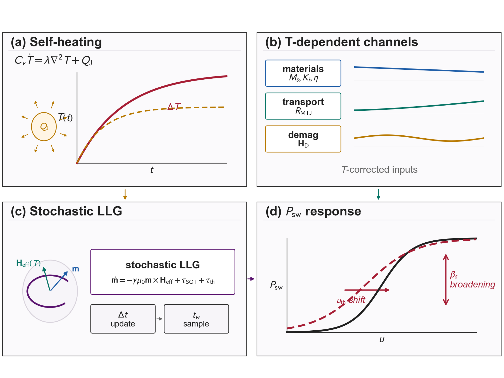

**图2.3** sMTJ温度效应与非理想性建模。自热源与热扩散模型为器件温度提供瞬态演化通道；温度依赖材料参数漂移经由$$M_s(T)$$、$$K_i(T)$$、$$\eta(T)$$调制能垒与驱动力矩；TMR与电输运非线性确定读出电阻对磁化方向、偏压与温度的连续映射；退磁与形状效应经由退磁因子改变有效各向异性。四条通道汇聚至概率翻转$$P_{\mathrm{sw}}$$的宏观响应，表现为阈值漂移与斜率变缓两类非理想特征。

---

#### 2.2.2.1 自热效应

在写入脉冲作用下，器件内部电流耗散会转化为热源，使MTJ实际温度偏离环境温度。其基本控制方程由热扩散方程给出[^ref-li-zhang-thermal]：

$$
C_v \frac{dT}{dt} = \lambda \nabla^2 T + Q
$$

其中$$C_v$$为单位体积热容，$$\lambda$$为热导率，$$Q$$为体热源项。对于电流驱动的磁性器件，焦耳热一般写为

$$
Q = \rho j^2
$$

其中$$\rho$$为等效电阻率，$$j$$为电流密度。对于传统STT-MTJ，热源仅来自穿过MTJ结柱的隧穿电流，可将其折算为单位体积功率密度：

$$
Q_{\mathrm{MTJ}}
=
\frac{V_{\mathrm{MTJ}}^2}{R_{\mathrm{MTJ}} A_{\mathrm{MTJ}}}
\cdot
\frac{1}{t_{\mathrm{MTJ}}}
$$

将上述MTJ热源表达式代入热扩散方程，并将结柱沿厚度方向简化为一维等效热网络，可得MTJ温度演化表达式[^ref-li-zhang-thermal]：

$$
C_v t_{\mathrm{MTJ}} \frac{dT}{dt}
=
\frac{V_{\mathrm{MTJ}}^2}{R_{\mathrm{MTJ}}}
\cdot
\frac{4}{\pi D_{\mathrm{phys}}^2}
-
\frac{\lambda_{\mathrm{MgO}}}{t_{\mathrm{MgO}}}(T-T_0)
$$

其中$$t_{\mathrm{MTJ}}$$为MTJ柱总厚度，$$D_{\mathrm{phys}}$$为物理直径，$$t_{\mathrm{MgO}}$$为MgO势垒厚度，$$T_0$$为环境温度，$$\lambda_{\mathrm{MgO}}$$为MgO薄膜热导率。等号右侧第一项表示焦耳热注入，第二项表示器件通过MgO层向外散热。此处以MgO作为主散热路径是基于其热导率显著低于CoFeB和上下金属电极的事实，MgO纳米薄膜的热导率约为4 W/(m·K)，远低于金属层的50–100 W/(m·K)量级，因此MgO热阻构成整个热路的主要瓶颈，一维近似的误差对70–90 nm量级MTJ的温升估算在可接受范围内[^ref-kim-mtj-spice]。

对于SOT-MTJ或VGSOT-MTJ，自热问题更为复杂，原因是热源不再只来自隧穿电流，重金属沟道中的SOT写入电流同样会产生显著焦耳热。SOT沟道的体热源密度为

$$
Q_{\mathrm{SOT}}
=
\frac{V_{\mathrm{SOT}}^2}{R_{\mathrm{SOT}} A_{\mathrm{SOT}}}
\cdot
\frac{1}{t_{\mathrm{SOT}}}
$$

其中$$A_{\mathrm{SOT}} = W_{\mathrm{SOT}} \times L_{\mathrm{SOT}}$$为SOT沟道的俯视面积，$$t_{\mathrm{SOT}}$$为重金属层厚度。将SOT沟道热源的贡献等效折算到MTJ柱所覆盖的面积内，总的温度演化方程修正为

$$
C_v t_{\mathrm{MTJ}} \frac{dT}{dt}
=
\frac{V_{\mathrm{MTJ}}^2}{R_{\mathrm{MTJ}}}
\cdot
\frac{4}{\pi D_{\mathrm{phys}}^2}
+
\frac{V_{\mathrm{SOT}}^2}{R_{\mathrm{SOT}} A_{\mathrm{SOT}}}
\cdot
\frac{t_{\mathrm{MTJ}}}{L_{\mathrm{SOT}}}
-
\frac{\lambda_{\mathrm{MgO}}}{t_{\mathrm{MgO}}}(T-T_0)
$$

上述总温度演化方程对散热路径沿用了纯STT情形下以MgO为主的单路径假设。对于SOT-MTJ结构，MTJ与重金属沟道之间的底部界面同样提供热传导通道；然而考虑到该界面处存在TaN或Ta种子层，其等效界面热阻与MgO层量级相近，因此以MgO单路径表征整体热阻仍为合理的工程近似，更精确的处理可引入双路径热网络，对此不在本文讨论范围。

SOT写入温升往往高于纯STT情形，因沟道电流密度通常更高且额外热功率直接注入MTJ下方。上述温度演化方程以较低计算代价近似取代三维热有限元分析，可直接嵌入行为级平台；其动态性，即$$T$$随每个时间步内$$V_{\mathrm{MTJ}}$$和$$V_{\mathrm{SOT}}$$的变化而更新，是将自热效应纳入概率翻转建模的物理前提。

将基准器件参数代入上述热模型后，图2.4给出两个与概率写入直接相关的判断：一是器件热响应远快于纳秒级写入窗口，脉冲中后段可近似按稳态温升理解；二是SOT沟道热源相对MTJ隧穿热源更容易主导温升，且温升随驱动电压呈焦耳功率标度。具体温升数值保留在图2.4中，正文只强调其物理后果：高压写入同时放大SOT力矩和热噪声幅度，使临界区翻转概率随驱动强度出现系统性漂移。

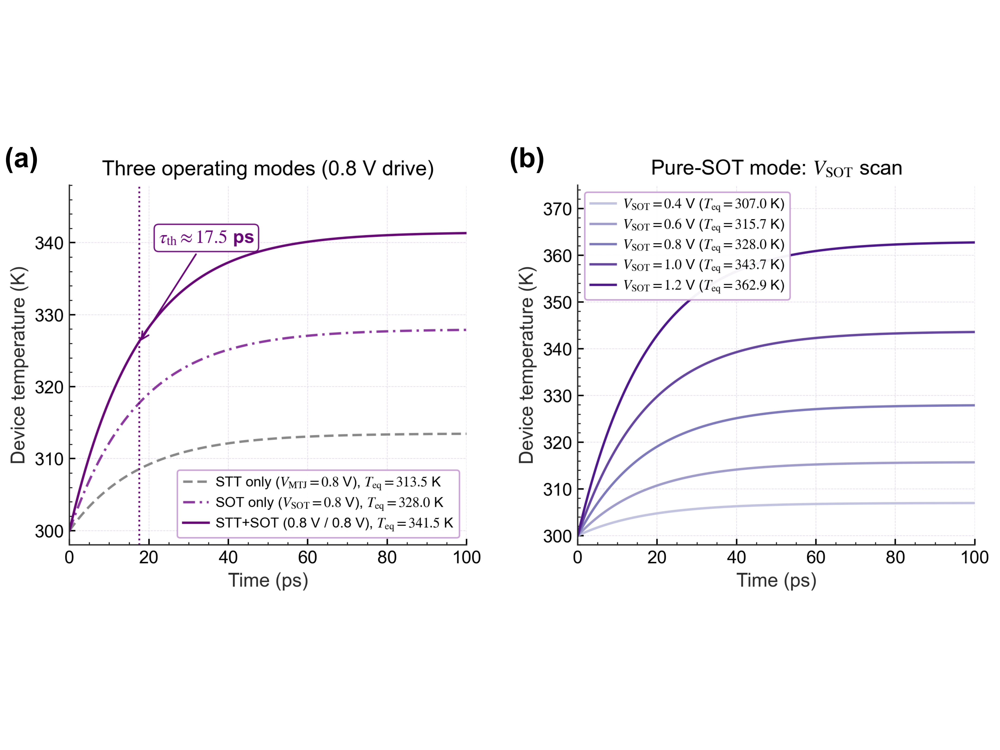

**图2.4** 基于本文参数的自热瞬态仿真。(a)三种写入模式在0.8 V驱动下的器件温度演化，热时间常数$$\tau_{\mathrm{th}}\approx17.5$$ ps，STT与SOT热源稳态温升近似线性叠加。(b)纯SOT模式下$$V_{\mathrm{SOT}}$$从0.4 V扫至1.2 V的温度演化，稳态温升随驱动电压平方增长，印证了焦耳功率标度关系。

上述自热模型涉及的SOT沟道几何与电学参数、热容与MgO热导率、以及VCMA系数集中列于表2.2。沟道几何与电学参数用于计算沟道焦耳热源项及2.2.1.1节给出的等效DL场幅值；热容$$C_v$$与MgO热导率$$\lambda_{\mathrm{MgO}}$$直接决定温度演化方程中的温升响应速率，取自经典MTJ热传导仿真基准；VCMA系数$$\beta_{\mathrm{VCMA}}$$依据CoFeB/MgO界面的典型实验测量范围选取。

**表2.2** SOT沟道输运、热学与VCMA文献参数。

| **参数符号** | **物理意义** | **设定值** | **说明** |
|---|---|---|---|
| $$P$$ | 自旋极化率 | $$0.58$$ | MTJ隧穿自旋力矩驱动效率 |
| $$\beta_{\mathrm{VCMA}}$$ | VCMA系数 | $$60\,\mathrm{fJ/(V\cdot m)}$$ | 电压对界面各向异性能的调制强度 |
| $$L_{\mathrm{SOT}}$$ | 沟道长度 | $$240\,\mathrm{nm}$$ | SOT重金属写入沟道物理长度 |
| $$W_{\mathrm{SOT}}$$ | 沟道宽度 | $$200\,\mathrm{nm}$$ | SOT重金属写入沟道物理宽度 |
| $$T_{\mathrm{SOT}}$$ | 沟道厚度 | $$4.3\,\mathrm{nm}$$ | 决定SOT电流密度分布 |
| $$\rho_{\mathrm{SOT}}$$ | 沟道电阻率 | $$2.78\times10^{-6}\,\Omega\cdot\mathrm{m}$$ | Ta/W重金属层典型电阻率 |
| $$C_v$$ | 等效体热容 | $$2.5\times10^6\,\mathrm{J/(m^3\cdot K)}$$ | 暂态温升响应$$dT/dt$$计算依据 |
| $$\lambda_{\mathrm{MgO}}$$ | MgO热导率 | $$4\,\mathrm{W/(m\cdot K)}$$ | 纳米薄膜值显著低于块体，是自热主因 |
| $$\phi$$ | MgO有效势垒高度 | $$0.4\,\mathrm{eV}$$ | 决定基础平行态电阻$$R_P$$的能垒 |

---

#### 2.2.2.2 温度依赖磁性参数

温度升高不仅通过热噪声改变翻转统计，还会直接改变自由层的内禀材料参数。为保持模型闭环，须将饱和磁化强度、界面各向异性能密度和自旋极化率均写成温度的函数，以使每一时间步内有效场的计算反映真实的材料状态。

**饱和磁化强度$$M_s(T)$$。** 铁磁体的自发磁化随温度升高而衰减，在远低于居里温度$$T_C$$的工作区间内，由低能自旋波 (magnon) 激发主导的衰减遵从Bloch $$T^{3/2}$$定律[^ref-bloch-law]。对于CoFeB超薄膜，以室温 (RT) 实测值$$M_s(\mathrm{RT})$$作为归一化基准，可写出适合紧凑模型参数提取的表达式：
$$
M_s(T)
=
M_s(\mathrm{RT})
\frac{1-(T/T_C)^{3/2}}
{1-(\mathrm{RT}/T_C)^{3/2}}
$$

该归一化形式避免了对$$M_s(0\,\mathrm{K})$$的直接测量依赖，可直接与振动样品磁强计 (VSM) 或超导量子干涉仪 (SQUID) 的室温测量结果对接。随着$$T$$升高，$$M_s(T)$$单调下降，从而使退磁场、各向异性场以及零温临界驱动电流均发生漂移[^ref-dieny-pma-review]。

**自旋极化率$$\eta(T)$$。** 在Julliere隧穿模型框架下[^ref-julliere-tmr]，MTJ的自旋极化率$$\eta$$正比于费米能级处的自旋劈裂密度之差，而在平均场近似中，该量跟随磁化强度一同衰减。因此，有效自旋极化率遵从与$$M_s(T)$$相同的温度依赖形式：

$$
\eta(T)
=
\eta(\mathrm{RT})
\frac{1-(T/T_C)^{3/2}}
{1-(\mathrm{RT}/T_C)^{3/2}}
$$

温度上升时自旋极化率下降，导致STT及SOT的等效驱动力均减弱。对于本文以SOT为主驱动的VGSOT架构，该项可被合并入等效自旋霍尔注入效率的温度修正，其物理含义是：在较高温度下，相同电流密度所能提供的有效翻转力矩有所削减。

**界面各向异性能密度$$K_i(T)$$。** Callen–Callen理论[^ref-callen-callen]预测，对于量子数$$l=2$$的单轴各向异性，其温度衰减指数在三维铁磁体中为10/3；然而在CoFeB/MgO超薄界面体系中，二维费米面的修正以及界面态对各向异性能的主导贡献使实验观测到的指数偏离该理论值，通常落在2至3之间[^ref-dieny-pma-review]。结合对CoFeB/MgO薄膜的温变铁磁共振 (FMR) 测量数据的拟合，取指数为2.18，$$K_i(T)$$的表达式为：

$$
K_i(T)
=
\frac{1}{2} \mu_0 t_{\mathrm{FL}} M_s(\mathrm{RT})
\left[
M_s(\mathrm{RT}) + H_k^{\mathrm{eff}}(\mathrm{RT})
\right]
\left(
\frac{1-(T/T_C)^{3/2}}
{1-(\mathrm{RT}/T_C)^{3/2}}
\right)^{2.18}
$$

其中$$t_{\mathrm{FL}}$$为自由层厚度，$$H_k^{\mathrm{eff}}(\mathrm{RT})$$为室温下由FMR测得的有效各向异性场。本式中$$M_s$$与$$H_k^{\mathrm{eff}}$$均以SI单位$$\mathrm{A/m}$$表示，$$\mu_0$$作为整体因子置于括号外，可保证括号内同量纲相加，避免因$$\mu_0 M_s$$ (单位$$\mathrm{T}$$) 与$$H_k^{\mathrm{eff}}$$ (单位$$\mathrm{A/m}$$) 混用而造成的量纲不自洽。上述$$K_i(T)$$表达式中的外层因子$$\frac{1}{2}\mu_0 t_{\mathrm{FL}}M_s(\mathrm{RT})[M_s(\mathrm{RT})+H_k^{\mathrm{eff}}(\mathrm{RT})]$$即为室温界面各向异性能密度的校准值 (单位$$\mathrm{J/m^2}$$)，随后的幂律项描述其温度衰减。相应的各向异性场$$z$$分量为

$$
H_{\mathrm{ani},z}
=
\frac{2K_i(T)}{t_{\mathrm{FL}} M_s(T)} m_z
$$

$$H_{\mathrm{ani},x}=H_{\mathrm{ani},y}=0$$。由于$$K_i(T)$$的衰减指数2.18大于$$M_s(T)$$的1.5，各向异性场$$H_{\mathrm{ani},z}$$随温度的下降幅度超过$$M_s$$本身，等效能垒的减小不能简单等同于$$M_s$$的衰减。

图2.5(a)–(c)汇总了$$M_s(T)$$、$$K_i(T)$$与$$\eta(T)$$的温度漂移：$$K_i$$随温度衰减快于$$M_s$$，自热首先削弱有效PMA场和能垒，再通过热噪声幅度共同改变临界区的翻转概率。

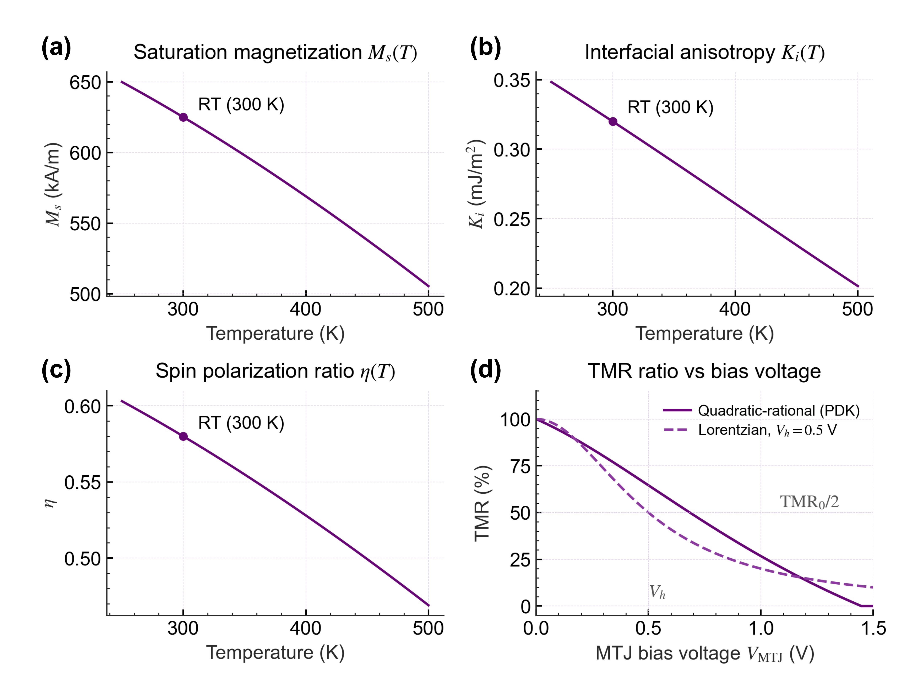

**图2.5** 基于本文参数集的温度依赖材料参数与电输运非线性仿真。(a)饱和磁化$$M_s(T)$$遵从Bloch自旋波标度；(b)界面各向异性$$K_i(T)$$以修正Callen–Callen指数2.18衰减，衰减速率显著高于$$M_s$$；(c)自旋极化率$$\eta(T)$$与$$M_s$$同步；(d)TMR随$$V_{\mathrm{MTJ}}$$的衰减对比：实线为本文采纳的三参数二次-有理形式，虚线为Zhang等人采用的单参数Lorentzian形式 ($$V_h=0.5$$ V)，两者在约1.2 V附近交叉。RT(300 K)为(a)–(c)的室温基准点。

温度依赖关系所归一化的室温基准值$$M_s(\mathrm{RT})$$、$$K_i(0)$$、$$\eta(\mathrm{RT})$$，以及沿用一致的磁学参数$$\alpha$$、$$\gamma$$、$$T_C$$、$$A_{\mathrm{ex}}$$与物理尺寸$$D_{\mathrm{phys}}$$、$$D_{\mathrm{elec}}$$、$$t_f$$、$$t_{\mathrm{ox}}$$、$$t_{\mathrm{MTJ}}$$共同列于表2.3。参数量级以CoFeB/MgO垂直各向异性MTJ的公开材料范围为约束[^ref-dieny-pma-review]，交换偏置场的设计参考VCMA-SOT联合翻转机制的场无关翻转模型[^ref-li-jiang-vcma-sot]；居里温度$$T_C = 1100\,\mathrm{K}$$作为Bloch定律与Callen-Callen定律的温度标度基准，并经本节幂律拟合验证。

**表2.3** 80 nm级SOT-MTJ核心磁学与物理尺寸参数。

| **参数符号** | **物理意义** | **设定值** | **说明** |
|---|---|---|---|
| $$D_{\mathrm{phys}}$$ | MTJ物理直径 | $$80\,\mathrm{nm}$$ | 基础阵列物理节点尺寸 |
| $$D_{\mathrm{elec}}$$ | MTJ电学有效直径 | $$\approx 65\,\mathrm{nm}$$ | 计入边缘刻蚀损伤带 ($$\delta_{\mathrm{edge}}\!\approx\!7.5\,\mathrm{nm}$$)，与表2.5实测$$R_P$$自洽 |
| $$t_f$$ | 自由层厚度 | $$1.1\,\mathrm{nm}$$ | 影响PMA能与热稳定体积 |
| $$t_{\mathrm{ox}}$$ | 隧道势垒厚度 | $$1.4\,\mathrm{nm}$$ | 决定隧穿电阻量级 |
| $$t_{\mathrm{MTJ}}$$ | MTJ柱总厚度 | $$\approx 20\,\mathrm{nm}$$ | 用于热扩散方程的等效一维热路 (与$$\tau_{\mathrm{th}}=C_v t_{\mathrm{MTJ}}t_{\mathrm{MgO}}/\lambda_{\mathrm{MgO}}\!\approx\!17.5\,\mathrm{ps}$$对应) |
| $$M_s$$ | 室温饱和磁化强度 | $$6.25\times10^5\,\mathrm{A/m}$$ | 典型超薄CoFeB实验测量校准值 |
| $$K_i(0)$$ | 界面PMA强度 | $$3.2\times10^{-4}\,\mathrm{J/m^2}$$ | 零偏压本征界面各向异性能密度 |
| $$\alpha$$ | Gilbert阻尼系数 | $$0.05$$ | 界面改性CoFeB薄膜典型经验值 |
| $$\gamma$$ | 旋磁比 | $$2.2127\times10^5\,\mathrm{m/(A\cdot s)}$$ | 磁矩进动频率基础物理常数 |
| $$T_C$$ | 居里温度 | $$1100\,\mathrm{K}$$ | 磁学参数温度衰减速率的拟合基准 |
| $$A_{\mathrm{ex}}(\mathrm{RT})$$ | 室温交换刚度常数 | $$4\,\mathrm{pJ/m}$$ | 畴壁形成能与热稳定性评估依据 |

---

#### 2.2.2.3 TMR与电输运非线性

除磁性参数外，电输运特性本身也具有明显的偏压和温度依赖性。对MTJ而言，这主要体现在TMR的非线性衰减以及平行态电阻$$R_P$$对势垒参数的指数敏感性上。由于读出电路最终观测到的是电阻或电流而非直接的磁化矢量，输运非线性会进一步影响写后判决边界、参考电路设计以及阵列级误码率。

在统一模型中，若自由层$$z$$向磁化分量记为$$m_z$$，参考层磁化方向取$$-z$$，则MTJ阻值可由两极限态电导的线性内插得到：

$$
G_{\mathrm{MTJ}}(m_z) = \frac{1-m_z}{2}\,G_P + \frac{1+m_z}{2}\,G_{AP}
$$

以$$k=\mathrm{TMR}/(\mathrm{TMR}+2)$$为内插系数，上式可等价地改写为常用的有理形式：

$$
R_{\mathrm{MTJ}}(m_z)
=
R_P\,\frac{1+k}{1-k\,m_z}
=
\frac{R_P\,R_{AP}}{\dfrac{1+m_z}{2}R_P + \dfrac{1-m_z}{2}R_{AP}}
$$

直接代入极限值可验证该表达式的物理自洽性：$$m_z=-1$$给出$$R_{\mathrm{MTJ}}=R_P$$ (平行态)，$$m_z=+1$$给出$$R_{\mathrm{MTJ}}=R_P(1+\mathrm{TMR})=R_{AP}$$ (反平行态)。磁化状态与电阻之间的连续映射在随机翻转轨迹尚未完全收敛时尤为重要，因为中间磁化态对应的瞬时电阻既不等于$$R_P$$也不等于$$R_{AP}$$。

TMR受偏压影响而衰减，这一现象源于较大偏压下界面处感应态散射增强、magnon激发以及隧穿相干性减弱[^ref-akerman-tmr]。在紧凑建模文献中针对TMR偏压依赖形成了两类经验形式。一种是单参数Lorentzian形式：

$$
\mathrm{TMR}_{\mathrm{Lor}}(V_{\mathrm{MTJ}})
=
\frac{\mathrm{TMR}_0}{1+V_{\mathrm{MTJ}}^2/V_h^2}
$$

其唯一拟合参数$$V_h$$定义为TMR衰减到零偏压值一半时对应的偏压，典型取值$$V_h=0.5\,\mathrm{V}$$。该式由偏压下磁激发与非弹性散射所引起的TMR衰减唯象推导而来，其中$$V^2$$项对应偏压引起的磁激发功率线性项的积分。本文采纳由Hikstor SOT-MRAM工艺PDK提取的三参数二次-有理形式：

$$
\mathrm{TMR}_{\mathrm{PDK}}(V_{\mathrm{MTJ}})
=
\frac{\mathrm{TMR}_0}{k_{\mathrm{TMR}}}
\left[
\frac{1}{a_{\mathrm{TMR}} V_{\mathrm{MTJ}}^2 + b_{\mathrm{TMR}} |V_{\mathrm{MTJ}}| + c_{\mathrm{TMR}}} - 1
\right]
$$

两种TMR偏压模型的差异见图2.5(d)。Lorentzian形式参数少、可解释性强，适合缺少制程数据时的早期估算；PDK形式用额外项吸收势垒不对称与界面非理想，在本文关注的写入偏压窗口内更贴近实测。本文选用PDK形式，是为了让读出电阻、写入能耗和后续实验标定使用同一制程口径；若迁移到缺少PDK的外延器件，仍可退回Lorentzian形式而不改变仿真接口。

平行态电阻$$R_P$$依赖于MgO势垒的厚度与高度，其物理图像来自Brinkman–Dynes–Rowell (BDR) 隧穿模型[^ref-brinkman-bdr]。在WKB近似下，对抛物线形势垒的零偏压隧穿电导$$G_P\propto\sqrt{\phi_{\mathrm{ox}}}\exp(-2t_{\mathrm{ox}}\sqrt{2m_e e\phi_{\mathrm{ox}}}/\hbar)$$，反演得平行态电阻为

$$
R_P
=
\frac{t_{\mathrm{ox}}}{F\,A_{\mathrm{MTJ}}\sqrt{\phi_{\mathrm{ox}}}}
\exp\!\left(
\frac{2\,t_{\mathrm{ox}}\sqrt{2m_e e\phi_{\mathrm{ox}}}}{\hbar}
\right)
$$

其中$$t_{\mathrm{ox}}$$为势垒厚度，$$\phi_{\mathrm{ox}}$$为MgO有效势垒高度，$$A_{\mathrm{MTJ}}$$为电学有效面积 (按2.2.2.4节取$$D_{\mathrm{elec}}$$对应面积)，$$m_e$$为电子质量，$$e$$为元电荷，$$\hbar$$为约化普朗克常数，$$F$$为由R·A乘积一致性约束所定标的常数 (其量纲为$$1/(\Omega\!\cdot\!\mathrm{m}\!\cdot\!\sqrt{\mathrm{eV}})$$，并非无量纲量；数值上保证了$$R_P\cdot A_{\mathrm{MTJ}}$$回归到实验测得的R·A值)。BDR模型严格成立于$$eV\ll\phi_{\mathrm{ox}}$$的弱偏压极限；在较大偏压下，该模型作为势垒参数到阻值的定性映射仍具工程适用性，但应理解为等效参数化而非严格推导。上式在物理上揭示了真实器件$$R_P$$对$$t_{\mathrm{ox}}$$与$$\phi_{\mathrm{ox}}$$的指数敏感性，工艺中的势垒厚度涨落被指数放大为阻值分布。然而需明确实现层面的一处等效：由于$$F$$被约束为复现实测R·A，上式中的WKB指数因子在解析上恰与$$t_{\mathrm{ox}}$$、$$\sqrt{\phi_{\mathrm{ox}}}$$逐项相消，本行为级模型的$$R_P$$实际退化为$$R_P=\mathrm{R\!\cdot\!A}/A_{\mathrm{MTJ}}$$，即由实测R·A直接定标、而非在运行时由势垒参数推算[^note-dev-bdr]。因此势垒涨落对阵列$$R_P/R_{AP}$$离散性的影响，在本模型中经由实测R·A的分布 (作为输入变异源) 进入，而非经由式中$$\phi_{\mathrm{ox}}$$的显式扰动；若需以势垒参数为自变量正向预测R·A，应改用未将R·A吸收进拟合因子的Simmons/BDR预测形式。该映射经由前述$$R_{\mathrm{MTJ}}(m_z)$$关系最终影响整个阵列的$$R_P/R_{AP}$$离散性。

在概率计算场景下，行为级模型须将$$R_{\mathrm{MTJ}}(m_z,T,V)$$而非固定的$$R_P$$/$$R_{AP}$$作为读出接口变量：读出电阻窗口随偏压与温度实时变化，影响读出参考电压与感放裕量；写入自热升温使写后立读与热平衡后读对应不同瞬时TMR，导致动态读出误差；阵列级阻值分布非线性在多次统计采样中引入额外均值偏置。

上述TMR偏压衰减拟合式中的二次-有理系数直接取自Hikstor SOT-MRAM工艺PDK Verilog-A模型的参数提取结果，可精确重现实测偏压下TMR的非线性衰减行为；TMR$$_0$$、$$R\!\cdot\!A$$、$$\theta_{\mathrm{SH}}$$三项由2.3.2节实验阈值$$(R_P,R_{AP},V_{\mathrm{th}})$$联合反推得到。表2.4集中列出本文采纳的TMR偏压衰减PDK拟合系数与端口级标定参数。

**表2.4** TMR偏压衰减PDK拟合系数与端口级标定参数。

| **参数符号** | **物理意义** | **设定值** | **说明** |
|---|---|---|---|
| $$\mathrm{TMR}_0$$ | 零偏压TMR比值 | $$1.00$$ | 标定至2.3.2节 滞回回线幅度$$R_{AP}/R_P\approx 2$$ |
| $$R\!\cdot\!A$$ (标定值) | 电阻面积积 | $$16.6\,\Omega\!\cdot\!\mu\mathrm{m}^2$$ | 与$$D_{\mathrm{elec}}=65\,\mathrm{nm}$$配合给出$$R_P\approx 5\,\mathrm{k}\Omega$$ |
| $$\theta_{\mathrm{SH}}$$ (标定值) | 有效自旋霍尔角 | $$0.066$$ | 使$$V_{\mathrm{th}}^{\mathrm{sim}}(0.75\,\mathrm{ns})\approx V_{\mathrm{th}}^{\mathrm{exp}}=894\,\mathrm{mV}$$ (Cayley积分器；文献本征值$$\approx0.3$$) |
| $$k_{\mathrm{TMR}}$$ | TMR衰减归一化项 | $$1.2346$$ | PDK偏压依赖方程归一化系数 |
| $$a_{\mathrm{TMR}}$$ | 二次项系数 | $$0.1729$$ | $$V_{\mathrm{mtj}}^2$$对TMR的衰减权重 |
| $$b_{\mathrm{TMR}}$$ | 一次项系数 | $$0.1315$$ | $$|V_{\mathrm{mtj}}|$$对TMR的衰减权重 |
| $$c_{\mathrm{TMR}}$$ | 常数项偏移 | $$0.4475$$ | 拟合方程基准常数 |

---

#### 2.2.2.4 退磁与形状效应

有限尺寸MTJ的形状效应主要通过退磁因子进入有效场表达式。虽然宏自旋模型将自由层视为单一磁矩，但器件几何尺寸仍会通过退磁场影响垂直各向异性补偿关系，从而改变能垒高度和热稳定性。2.2.1.2节给出了适用于$$t_f \ll D_{\mathrm{phys}}$$薄圆盘极限的退磁因子线性近似，本节则给出应用于实际仿真的扁椭球体精确解析表达式，后者是计算后续有效各向异性能$$K_U^{\mathrm{eff}}(T)$$的正确基础。

对于圆形MTJ柱，自由层近似为扁椭球体，其横向退磁因子$$N_x = N_y$$满足解析表达式[^ref-stoner-wohlfarth]：

$$
N_x
=
\frac{q^2}{2(1-q^2)}
\left[
\frac{1}{q\sqrt{1-q^2}}\arccos(q)-1
\right]
$$

其中宽厚比参数定义为

$$
q = \frac{t_{\mathrm{FL}}}{D_{\mathrm{elec}}}
$$

$$D_{\mathrm{elec}}$$为电学有效直径，因边缘刻蚀工艺 (通常为离子铣刻) 导致自由层边缘受损区域导电性降低，$$D_{\mathrm{elec}}$$通常比物理直径$$D_{\mathrm{phys}}$$小约5–10 nm。由圆柱对称性，有

$$
N_x=N_y,\qquad N_z=1-2N_x
$$

退磁场各分量则为

$$
H_{\mathrm{demag},x} = -\mu_0 M_s(T) N_x m_x
$$

$$
H_{\mathrm{demag},y} = -\mu_0 M_s(T) N_x m_y
$$

$$
H_{\mathrm{demag},z} = -\mu_0 M_s(T) (1-2N_x) m_z
$$

形状效应通过$$N_z - N_x$$直接进入有效各向异性能密度，结合温度依赖参数，净各向异性能为

$$
K_U^{\mathrm{eff}}(T)
=
\frac{K_i(T)}{t_{\mathrm{FL}}}
-
\frac{1}{2}\mu_0 M_s^2(T)(N_z-N_x)
$$

由此可见，随着$$T$$升高，$$M_s(T)$$和$$K_i(T)$$均下降，但两者以不同的幂律速率衰减，从而使$$K_U^{\mathrm{eff}}(T)$$的变化不可简化为单一参数的线性插值，而必须逐步在耦合循环中更新。圆形器件$$N_x = N_y$$的对称性还确保了横向退磁场在统计意义上各向同性，不引入额外的翻转方向偏好，这也是圆形MTJ在概率器件建模中优于椭圆或不规则形状的重要理由。

---

#### 2.2.2.5 自热-材料耦合的仿真验证

为验证前述非理想通道在求解器内是否真正形成闭环，本工作在仿真器中接通温度到材料参数再到有效场的反馈链，并与自热关闭的同种子轨迹对照。这样，两条轨迹之间的差异可归因于温度反馈本身，而不被噪声平均、脉冲波形或步长设置差异混入。

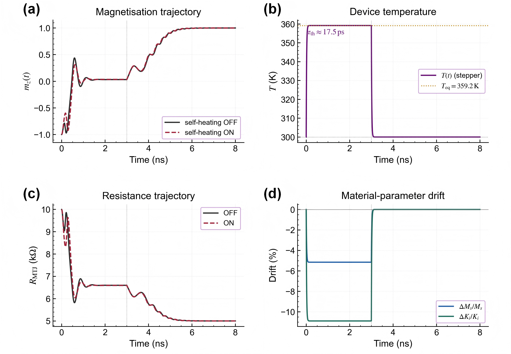

**图2.6** 纯SOT写入操作点 ($$V_{\mathrm{MTJ}}=0\,\mathrm{V}$$、$$I_{\mathrm{SOT}}=-1500\,\mu\mathrm{A}$$，对应沟道电压$$V_{\mathrm{SOT}}\approx 1.16\,\mathrm{V}$$、3 ns写入脉冲 + 5 ns弛豫) 下自热反馈对磁化轨迹的影响。(a)$$m_z(t)$$对比：自热关闭 (实线，黑) 与自热开启 (虚线，红) ；脉冲在$$t=3\,\mathrm{ns}$$处关断后两条轨迹均完成$$-1\!\to\!+1$$方向翻转；插图显示二者之差$$m_z^{\mathrm{ON}}-m_z^{\mathrm{OFF}}$$ (放大100×) 在脉冲前段最大达6%–8%、弛豫阶段振荡幅度达10%，是自热引致进动周期变化的可视化。(b)自热开启情形下$$T(t)$$的时变轨迹：脉冲启动后$$T(t)$$以$$\tau_{\mathrm{th}}\approx17.5\,\mathrm{ps}$$的指数刚性上升至闭式解预测的稳态$$T_{\mathrm{eq}}=359.2\,\mathrm{K}$$ (琥珀色虚线，$$\Delta T_{\mathrm{eq}}\approx 59\,\mathrm{K}$$)，脉冲关断后以同样的时间常数指数衰减回环境温度。(c)$$R_{\mathrm{MTJ}}(t)$$从$$R_{AP}$$跃迁至$$R_P$$；两条曲线在过渡区附近的细微相位差来源于自热开启情形下$$H_{\mathrm{PMA}}$$的轻微削弱使进动频率略有降低。(d)自由层材料参数的相对漂移：峰值温度对应的$$\Delta M_s/M_s\approx-5.15\%$$、$$\Delta K_i/K_i\approx-10.89\%$$，按Callen–Callen指数2.18与Bloch指数1.5的差异$$K_i$$比$$M_s$$衰减更快，最终有效PMA场漂移$$\Delta H_{\mathrm{PMA}}/H_{\mathrm{PMA}}\approx-5.74\%$$。

图2.6给出完整轨迹与温度响应。它对后续概率建模的作用有两点：自热响应可在纳秒脉冲内近似折算为稳态温升修正；在该超阈值样本中，温度反馈主要改变进动相位和材料参数，而没有形成足以解释实测Sigmoid展宽的主导机制。由此，后文把自热作为必要的物理修正保留，但将概率曲线宽度的主要来源转向C2C动力学与D2D工艺失配。

---

### 2.2.3 数值求解方法

在前述章节中，磁化动力学已经通过包含自旋轨道力矩、VCMA调制以及热噪声项的扩展Landau–Lifshitz–Gilbert (sLLG) 方程给出，并在2.2.2节中进一步引入了温度依赖材料参数与自热反馈。由于sLLG方程属于典型的强非线性随机微分方程 (SDE)，且在整个时间演化过程中须严格满足磁化矢量模长守恒 ($$|\mathbf{m}|=1$$)，同时温度状态变量在每一步内与磁化状态共同更新，传统的显式数值积分方法 (如显式Euler或常规Runge-Kutta) 往往面临严重的数值漂移和稳定性问题。本节推导适合大规模Monte Carlo仿真的保模长几何积分算法，并说明其在Stratonovich随机微积分框架下的收敛性质。

---

#### 2.2.3.1 sLLG方程的统一形式与刚性问题

为与前文物理模型严格对齐，热噪声作为等效磁场的一部分而非独立力矩项参与进动与阻尼过程。将包含热噪声的总有效场记为$$\mathbf{H}_{\mathrm{tot}} = \mathbf{H}_{\mathrm{eff}} + \mathbf{H}_{\mathrm{TH}}$$，其中$$\mathbf{H}_{\mathrm{TH}}$$在每个离散时间步$$\Delta t$$内按2.2.1.2节给出的离散采样关系重新采样，采样幅度依赖于当前时间步的器件温度$$T$$。结合前述LLS显式形式，sLLG方程统一表示为

$$
\frac{d\mathbf{m}}{dt}
= -\frac{\gamma}{1+\alpha^2}
\left[
\mathbf{m} \times \mathbf{H}_{\mathrm{tot}}
+ \alpha\,\mathbf{m} \times (\mathbf{m} \times \mathbf{H}_{\mathrm{tot}})
\right]
+ \boldsymbol{\tau}_{\mathrm{SOT}}
$$

其中SOT力矩项$$\boldsymbol{\tau}_{\mathrm{SOT}}$$由2.2.1.1节给出的分解式给出。利用矢量恒等式$$\mathbf{m} \times (\mathbf{m} \times \mathbf{H}) = (\mathbf{m} \cdot \mathbf{H})\mathbf{m} - \mathbf{H}$$ (基于$$|\mathbf{m}|=1$$的前提)，上述方程可改写为广义旋转动力学形式：

$$
\frac{d\mathbf{m}}{dt} = \mathbf{w}(\mathbf{m}, t) \times \mathbf{m}
$$

其中$$\mathbf{w}(\mathbf{m}, t)$$是等效旋转角速度矢量，综合了有效场、阻尼以及全部自旋力矩的贡献。

由于LLG方程中进动项$$\mathbf{m} \times \mathbf{H}_{\mathrm{tot}}$$的特征频率$$\sim\gamma H_{\mathrm{tot}}$$ (量级为GHz–THz) 远大于阻尼弛豫速率$$\sim\alpha\gamma H_{\mathrm{tot}}$$ ($$\alpha \ll 1$$)，系统具有显著的刚性 (stiffness) [^ref-ascher-petzold]。对刚性常微分方程而言，显式Euler步$$\mathbf{m}_{n+1} = \mathbf{m}_n + \Delta t\,d\mathbf{m}_n/dt$$要求$$\Delta t < 2/(\gamma H_{\mathrm{tot}})$$以保证稳定，而这一条件在典型PMA器件的进动频率下意味着皮秒量级的步长限制。更严重的是，显式步沿切线方向推进，新状态$$\mathbf{m}_{n+1}$$必然偏离单位球面 ($$|\mathbf{m}_{n+1}| > 1$$)。若通过手动归一化$$\mathbf{m} \leftarrow \mathbf{m}/|\mathbf{m}|$$强制修正，不仅在长时间积分中引入截断误差的累积，还会改变Stratonovich随机积分中热噪声的实际统计权重，导致仿真温度偏离物理设定值。

每个时间步内，先由第$$n$$步电学状态更新温度$$T_{n+1}$$、材料参数$$M_s$$/$$K_i$$/$$\eta$$与有效场各分量（含重采样$$\mathbf{H}_{\mathrm{TH}}$$），再以完整$$\mathbf{H}_{\mathrm{tot}}$$执行2.2.3.2节的保模长Cayley步推进$$\mathbf{m}_n$$至$$\mathbf{m}_{n+1}$$；该顺序确保热扩散与磁化动力学在同一时间步内自洽，是2.2.2节耦合反馈在数值实现层面的对应。

---

#### 2.2.3.2 保模长的隐式中点法与Cayley变换

一种直观替代方案是将$$\mathbf{m}$$转换至球坐标系$$(\theta,\phi)$$下求解，以减少逐步归一化带来的误差。然而，PMA器件的稳定态位于$$m_z \approx \pm 1$$ (即极点$$\theta = 0,\pi$$附近)，球坐标系下的运动方程包含$$1/\sin\theta$$坐标奇点，在极点附近容易触发数值发散，因此球坐标更新法不适用于PMA-MRAM的可靠性仿真[^note-dev-cayley]。

[^note-dev-cayley]: 此结论源于实现过程中的实测教训而非先验取舍。仿真器早期采用球坐标$$(\theta,\phi)$$下的显式Euler步，在PMA稳态$$m_z\approx\pm1$$ (即$$\theta\to0,\pi$$) 附近因运动方程的$$1/\sin\theta$$项触发数值发散；显式切线步还须逐步手动重归一化，反过来扰动热噪声场的Stratonovich统计权重，使等效仿真温度偏离设定值。后续实现改为笛卡尔形式的保模长Cayley步，并将自旋霍尔极化方向$$\hat{\sigma}_{\mathrm{SH}}$$作为显式三矢量输入，以支持任意偏置构型。进一步交叉校验发现，球坐标核的场样 (field-like) SOT项对$$\mathrm{d}\phi/\mathrm{d}t$$的$$\cos\theta\cos\phi$$分量存在一处符号错误，使其与笛卡尔Cayley核的右端项在方位方向最大相差约25%。改正后两套积分器在右端项层面一致，本文遂将默认积分器统一为Cayley。该符号误差此前在数值上人为锐化了$$P_{\mathrm{sw}}(V)$$过渡曲线；改正后的翻转概率在阈值工作区附近仍与实验Sigmoid相符，但过驱区的back-hopping回切平台更为显著、整体过渡略宽，提示以单宏自旋模型外推深过驱区写概率时须保留该平台修正而非简单沿用单调Sigmoid。

更为严谨的方案是在笛卡尔坐标系下采用保结构的几何积分器[^ref-weinan-wang]。对上述广义旋转动力学形式，在时间区间$$[t_n, t_{n+1}]$$内以中点处的状态近似旋转矢量：

$$
\frac{\mathbf{m}_{n+1} - \mathbf{m}_n}{\Delta t}
= \mathbf{w}_n \times \left(\frac{\mathbf{m}_{n+1} + \mathbf{m}_n}{2}\right)
$$

其中$$\mathbf{w}_n$$用当前步状态$$\mathbf{m}_n$$和已知外加场评估。将上式展开并移项，分离已知量与未知量：

$$
\mathbf{m}_{n+1} - \frac{\Delta t}{2}(\mathbf{w}_n \times \mathbf{m}_{n+1})
= \mathbf{m}_n + \frac{\Delta t}{2}(\mathbf{w}_n \times \mathbf{m}_n)
$$

设$$\mathbf{w}_n = (w_x, w_y, w_z)^{\mathrm{T}}$$，引入叉乘的反对称矩阵表示：

$$
\mathbf{\Omega}_n
= \begin{pmatrix}
0 & -w_z & w_y \\
w_z & 0 & -w_x \\
-w_y & w_x & 0
\end{pmatrix}
$$

则上式化为线性代数方程组：

$$
\left(\mathbf{I} - \frac{\Delta t}{2}\mathbf{\Omega}_n\right)\mathbf{m}_{n+1}
= \left(\mathbf{I} + \frac{\Delta t}{2}\mathbf{\Omega}_n\right)\mathbf{m}_n
$$

解析求解得到更新公式：

$$
\mathbf{m}_{n+1}
= \underbrace{\left(\mathbf{I} - \frac{\Delta t}{2}\mathbf{\Omega}_n\right)^{-1}
\left(\mathbf{I} + \frac{\Delta t}{2}\mathbf{\Omega}_n\right)}_{\displaystyle\mathbf{A}_n}
\mathbf{m}_n
$$

矩阵$$\mathbf{A}_n$$称为**Cayley变换矩阵**。根据线性代数的基本性质，对任意实反对称矩阵$$\mathbf{\Omega}_n$$，其Cayley变换$$\mathbf{A}_n$$必为正交矩阵 ($$\mathbf{A}_n^{\mathrm{T}}\mathbf{A}_n = \mathbf{I}$$，$$\det\mathbf{A}_n = 1$$)，即该更新步等价于对$$\mathbf{m}_n$$施加一次纯三维旋转[^ref-iserles-lie-group]。因此，无论时间步长$$\Delta t$$取何值，该闭式更新都在浮点精度内保持$$|\mathbf{m}_{n+1}| = |\mathbf{m}_n| = 1$$，消除了坐标奇点；实现中保留的一步归一化仅清除$$O(\varepsilon)$$舍入残差、非算法所必需 (实测裸格式在$$0.75\,\mathrm{ns}$$翻转轨迹上模长偏差不超过$$2\times10^{-15}$$)。

**收敛性分析。** 上式中旋转矢量$$\mathbf{w}_n$$在左端点$$\mathbf{m}_n$$处单次取值，该更新$$\mathbf{m}_{n+1}=\mathbf{A}_n\mathbf{m}_n$$为显式-$$\mathbf{w}$$几何积分格式：Cayley变换的正交性仅取决于$$\mathbf{\Omega}_n$$的反对称性、与取值点无关，故模长守恒对任意$$\Delta t$$严格成立；但时间精度受$$\mathbf{w}$$冻结的限制，在确定性极限 (即令$$\mathbf{H}_{\mathrm{TH}}=0$$) 下为全局一阶。若将$$\mathbf{w}$$改在中点$$(\mathbf{m}_n+\mathbf{m}_{n+1})/2$$处自洽取值 (对上式作数次不动点迭代)，即还原经典隐式中点法的时间对称性，局部截断误差为$$O(\Delta t^3)$$、全局误差降为$$O(\Delta t^2)$$[^ref-iserles-lie-group]。本文以自收敛数值实验核验了这一精度层次：关闭热噪声、固定物理时窗下扫描$$\Delta t$$，发布内核的全局收敛阶实测为$$1.01$$ ($$R^2=1.000$$)，与独立的球坐标-Euler锚点 ($$1.02$$) 相符，而由同一组原语构造的迭代中点格式给出$$2.00$$；在人为构造的常$$\mathbf{w}$$算例中显式格式亦精确达到二阶，表明一阶来自$$\mathbf{w}(\mathbf{m}(t))$$随轨迹时间变化被冻结，而非阻尼或Cayley映射本身。内核默认采用显式格式，从而获得与迭代次数无关的固定单步代价，为$$10^5$$量级轨迹的并行扫描提供效率保障；迭代中点格式则作为可选积分器`cayley_midpoint`提供，供确定性高精度算例使用。

**随机收敛阶与热平衡。** 对Monte Carlo可靠性评估而言，步长精度由随机意义下的收敛阶与稳态分布决定；对含Stratonovich白噪声的sLLG方程，须区分衡量逐条轨迹精度的强收敛与衡量统计量精度的弱收敛[^ref-kloeden-platen]。本文在噪声主导工况下以共享布朗路径耦合法实测显式-$$\mathbf{w}$$格式的强收敛阶为$$0.97$$ ($$95\%$$置信区间$$[0.95,1.00]$$)：粗步噪声增量由细步增量按方差守恒求和得到，参考解取比所有拟合层更细的独立中点格式，并以标量几何布朗运动算例先行校验测量能分辨$$0.5$$与$$1.0$$两个量级。弱收敛阶实测为$$1.98\text{–}2.04$$ (自-Cayley与独立中点两种参考构造互相印证)，施加横向对称破缺场后仍稳定于$$1.8$$以上，排除了轴对称抵消造成的假象；由于弱收敛阶决定统计均值的步长精度，该结果构成Cayley方案在平衡采样意义下大步长宽容度的实测依据。就热力学一致性而言，$$60\,\mathrm{ns}$$ (约$$90$$倍积分自相关时间) 零驱动弛豫给出的有效温度为$$T_{\mathrm{eff}}/T=0.98\text{–}1.01$$，$$\Delta t\to0$$外推截距$$0.979\pm0.014$$，即显式-$$\mathbf{w}$$的Cayley格式在$$1\text{–}2\%$$内自然收敛于正确的Boltzmann分布而无需Itô-Stratonovich修正[^ref-daquino-midpoint]。作为对照，球坐标-Euler格式因缺失噪声诱导漂移项而系统性采样于$$T/2$$，表明随机热力学一致性依赖于积分格式的保结构性。

左端点显式取值对多通道、非对易的乘性噪声一般引入Lévy面积残差，可预期强阶跌落至$$0.5$$；本文最初的快速探针确曾给出约$$0.5$$的读数，但经门控化 (几何布朗运动分辨力校验、确定性阶锚定、噪声主导比核验) 的正式测量表明，在本器件参数区间强阶实为$$\approx1.0$$，仅在最强噪声档的最细网格子区轻微下探至$$0.86$$。这一"预期$$0.5$$、实测$$1.0$$"的差异源于本工况下热场主要经进动通道以近似可加方式进入等效转速$$\mathbf{w}$$，非对易换位子的贡献居次要量级。下表汇总上述数值核验 (针对发布的显式-$$\mathbf{w}$$格式)：

| 性质 | 文献/理论 | 本文实测 | 核验方法 |
|---|---|---|---|
| 模长守恒$$\lvert\mathbf{m}\rvert=1$$ | 正交旋转精确 | $$\le 2\times10^{-16}$$ | 跨$$\Delta t$$、$$\lvert\mathbf{w}\rvert$$各十余量级直接测$$\big\lvert\lvert\mathbf{m}\rvert-1\big\rvert$$ |
| 确定性全局阶 | 中点法二阶 | 一阶$$1.01$$ (迭代中点恢复$$2.00$$) | 关噪声、$$\Delta t$$自收敛对细网格参考 |
| 强收敛阶 | $$1.0$$ | $$0.97\,[0.95,1.00]$$ | 共享布朗路径、GBM门控 |
| 弱收敛阶 | $$2.0$$ | $$1.98\text{–}2.04$$ (破缺后$$\ge1.8$$) | $$\mathbb{E}[m_z]$$、$$\mathbb{E}[m_z^2]$$对细参考 |
| Boltzmann有效温度 | $$T_{\mathrm{eff}}/T=1$$ | $$0.979\pm0.014$$ | $$60\,\mathrm{ns}$$零驱动、$$\Delta t\to0$$外推 |

由上述Cayley更新公式可见，每一步的计算仅需构造$$3 \times 3$$矩阵$$\mathbf{A}_n$$的一次求逆与矩阵-向量乘积。对于$$3 \times 3$$矩阵，逆矩阵可由解析公式直接给出而无需迭代，因此单步计算代价固定且极低，使在常规CPU平台上对$$10^5$$以上独立轨迹进行快速并行Monte Carlo扫描成为可能。

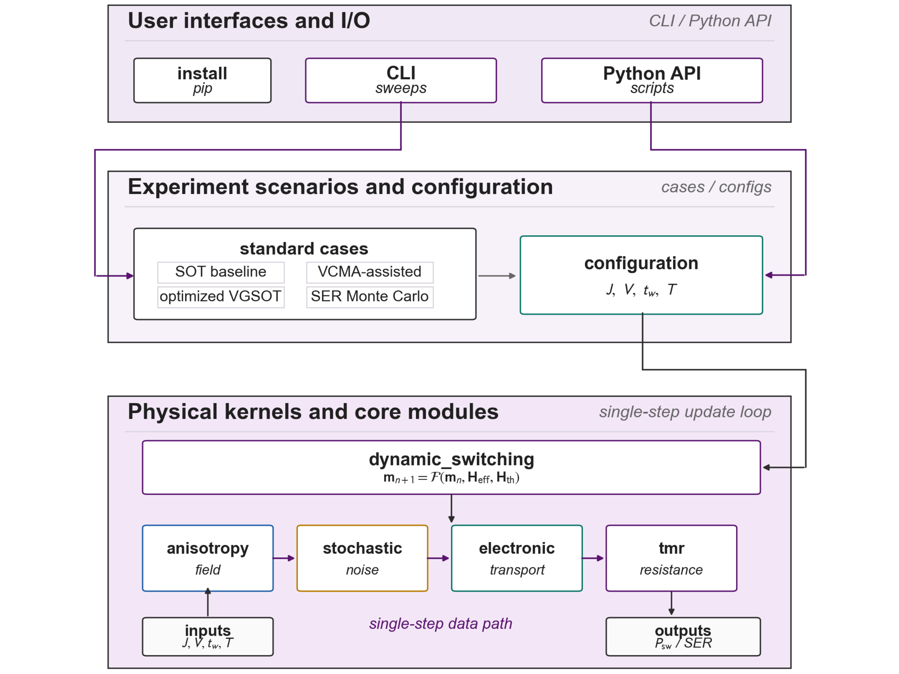

**图2.7** 保模长Cayley积分器的几何原理与数值验证。(a) 单位球面上的单步更新：显式切线步使模长按$$\sqrt{1+\Delta t^2|\mathbf{w}_\perp|^2}$$增长而离开球面，Cayley步等价于绕$$\Delta t\,\mathbf{w}$$的刚性旋转，对任意步长严格保持$$|\mathbf{m}|=1$$；旋转矢量$$\mathbf{w}$$的取值点决定时间精度，左端点取值 (内核默认) 为一阶，中点自洽取值恢复二阶。(b) 关闭热噪声、相对131072步中点参考解的确定性全局收敛阶 (斜率拟合取最细6档$$\Delta t$$)：左端点Cayley与$$(\theta,\phi)$$坐标卡Euler均为一阶 ($$p=1.01/1.02$$)，中点变体为二阶 ($$p=2.00$$)。(c) $$(\theta,\phi)$$坐标卡下缺失噪声诱导漂移$$D\cot\theta$$的后果：稳态密度失去$$\sin\theta$$的Jacobian权重，由$$p(x)\propto x\,e^{-x^2}$$退化为$$p(x)\propto e^{-x^2}$$ ($$x=\theta\sqrt{\Delta}$$，小角近似$$\sin\theta\approx\theta$$)；阶梯直方图为两类积分器在$$\Delta=48.5$$深势阱中实测采样的平衡分布，分别贴合对应解析律。(d) 60 ns零驱动弛豫平衡的有效温度：两种Cayley步的$$\Delta t\to0$$外推截距均为0.979 (1–2%内即Boltzmann分布)，$$(\theta,\phi)$$坐标卡Euler锁定于0.492$$\approx$$1/2；误差棒为48条轨迹的block-bootstrap $$1\sigma$$，星号为加权$$\Delta t\to0$$外推。

---

#### 2.2.3.3 随机过程的Monte Carlo统计计算

由于热噪声场$$\mathbf{H}_{\mathrm{TH}}$$赋予系统本征随机性，单次磁化轨迹的终态不足以描述器件的宏观概率行为。为获取基于物理底层的翻转概率，须通过大规模Monte Carlo方法进行独立采样统计。

在固定驱动配置 (外加电压$$V$$、电流密度$$J$$、脉冲宽度$$t_w$$) 下重复执行$$N$$次独立仿真，每次仿真使用不同的随机种子以确保热噪声轨迹统计独立。对第$$i$$次仿真，以$$m_z$$的终态判定是否发生翻转 (以反平行态到平行态翻转为例，要求$$m_z$$在脉冲结束后弛豫至$$m_z < -0.5$$的稳定态)，定义伯努利随机变量：

$$
s_i = \begin{cases} 1, & \text{器件发生翻转} \\ 0, & \text{器件未翻转} \end{cases}
$$

由大数定律，翻转概率的无偏估计为

$$
P_{\mathrm{sw}}(V, J, t_w) = \frac{1}{N}\sum_{i=1}^{N}s_i
$$

由于$$s_i \sim \mathrm{Bernoulli}(P_{\mathrm{sw}})$$，估计量的标准差为$$\sigma_{P} = \sqrt{P_{\mathrm{sw}}(1-P_{\mathrm{sw}})/N}$$，对应的95%置信区间半宽为

$$
\delta P = 1.96\sqrt{\frac{P_{\mathrm{sw}}(1-P_{\mathrm{sw}})}{N}}
$$

为使95%置信区间半宽$$\delta P$$不超过目标量级的一半，所需样本数须满足

$$
N > \frac{(1.96)^2 P_{\mathrm{sw}}(1-P_{\mathrm{sw}})}{\delta P^2}
$$

以分辨$$10^{-3}$$量级为例 (即$$\delta P = 5 \times 10^{-4}$$，$$P_{\mathrm{sw}} \approx 10^{-3}$$)，需要$$N \gtrsim 1.5 \times 10^4$$；若目标精度提升至$$10^{-4}$$量级，则$$N$$须增至$$1.5 \times 10^6$$，这对仿真效率提出了严格要求，也是Cayley变换方案相对于传统小步长显式积分在大步长宽容度上的核心优势得以充分发挥的实际应用背景。

---

---

### 2.2.4 开源仿真平台：vgsot-sim

vgsot-sim是与前述物理与算法框架配套的开源Python仿真平台。

vgsot-sim以Python为核心实现语言，通过PyPI发布并以pip安装，对外暴露命令行接口与Python API两种调用形式：前者用于复现单组实验或批量扫描，后者用于与系统级仿真框架与深度学习框架集成。仿真器的核心功能是对单个MTJ器件执行sLLG方程的时域积分，在每条轨迹结束后判定翻转状态，并通过大规模重复运行统计翻转概率。平台采用三层架构以保证物理模型的可扩展性与实验配置的灵活性，整体结构的组合关系可形式化表示为

$$
\text{Simulation} = \text{Kernel} \circ \text{Config} \circ \text{IO}
$$

最底层为物理内核 (Kernel)，负责实现sLLG方程的Cayley变换求解、有效场构建、热噪声生成以及温度状态更新等核心计算逻辑；中间层为实验配置 (Config)，用于声明具体仿真条件，包括脉冲参数、材料参数与扫描范围；顶层为输入输出层 (IO)，负责结果的序列化存储、统计汇总以及与外部系统的数据交换。该分层结构的核心设计原则是将物理模型与实验场景完全解耦：内核函数不携带任何与具体实验相关的状态，配置层仅通过参数对象驱动内核行为，因此同一求解器可在参数空间的不同工作点无修改地复用。IO层通过统一的结果数据结构封装磁化轨迹、翻转标志与统计量，使Monte Carlo汇总、曲线拟合以及后续分析流程均可直接调用。整体架构如图2.8所示。


**图2.8** vgsot-sim仿真软件框架。用户接口层提供命令行与Python API两条等价调用路径；实验配置层以参数对象形式声明标准化测试场景与扫描范围；物理内核层按单步更新回路组织磁化动力学、有效场、热噪声、电学输运与电阻五个功能模块，各模块间的数据流在每个时间步内完成一次磁化状态、电阻与温度的自洽更新，最终对外输出磁化轨迹与翻转概率统计。

物理内核层中，磁化动力学求解模块以离散时间步为基本单元，每步内依次完成以下操作：先由有效场模块按2.2.1.2节给出的分量合成计算当前$$\mathbf{H}_{\mathrm{eff}}$$；再由热噪声模块按

$$
\langle H_{\mathrm{th},i}(t)\, H_{\mathrm{th},j}(t')\rangle
= \delta_{ij}\,\delta(t-t')\,\frac{2\alpha k_B T}{\mu_0 M_s \gamma V},
\qquad
H_{\mathrm{th}} \sim \mathcal{N}\!\left(0,\;\frac{2\alpha k_B T}{\mu_0 M_s \gamma V \Delta t}\right)
$$

采样满足涨落-耗散定理的高斯随机场；电学输运模块将外加电压映射为SOT电流密度与MTJ隧穿电流，提供驱动力矩与Joule热源；热力学模块以当前电学状态按2.2.2.1节的一维RC方程更新器件温度，并按2.2.2.2节的Bloch / Callen-Callen关系反馈至材料参数$$M_s(T)$$、$$K_i(T)$$；TMR模块根据当前磁化方向$$m_z$$与偏压$$V_{\mathrm{MTJ}}$$计算器件瞬时电阻。单步磁化更新的完整形式为

$$
\mathbf{m}_{n+1}
= \mathcal{F}\!\left(\mathbf{m}_n,\;\mathbf{H}_{\mathrm{eff},n},\;\mathbf{H}_{\mathrm{th},n}\right),
$$

其中$$\mathcal{F}$$对应2.2.3.2节所述的Cayley变换步，在数学上严格保证$$|\mathbf{m}_{n+1}|=1$$。

为使仿真结果能够直接服务于不同写入机制的对比分析，平台预置四类标准化的仿真场景：纯SOT基线场景关闭VCMA调制 ($$V_{\mathrm{MTJ}}=0$$)，其翻转概率仅由SOT电流密度与脉冲宽度决定，是建立基准曲线的出发点；VCMA辅助场景在SOT电流基础上施加MTJ偏置电压，通过$$\Delta(V)=\Delta_0-\beta_{\mathrm{VCMA}}V$$动态调低有效能垒以降低写入电流；优化双脉冲场景按2.1.3节的SOT-VCMA联合驱动模型调度VCMA与SOT两路脉冲时序，以VCMA偏压降低能垒并使其与SOT写入脉冲保持重叠，能效收益的量化见2.2.5节；SER蒙特卡罗场景对每个驱动参数工作点执行$$N$$次独立轨迹并统计写错误率$$\mathrm{SER}=1-\frac{1}{N}\sum_i s_i$$或等价的翻转概率$$P_{\mathrm{sw}}=1-\mathrm{SER}$$。$$N$$的默认值随目标置信度自适应调整 (参见2.2.3.2节)。

行为级紧凑模型追求的是端口级输出与同批次实测对齐，平台因此以$$R_P$$、$$R_{AP}$$和0.75 ns写入阈值为共同标定靶点，得到端口级有效自旋霍尔角$$\theta_{\mathrm{SH}}\!\approx\!0.066$$[^note-dev-thetacalib]。该值应理解为集总后的等效力矩效率，吸收了界面自旋损失、寄生电阻与电流方向偏离等未显式建模通道；公开文献中的β-W/CoFeB材料参数[^ref-liu-chl][^ref-yang-300mm]只用于约束量级，本文的标定对象始终是2.3.2节同批次Device A的实测阈值、电阻幅度与Sigmoid响应。
[^note-dev-thetacalib]: 该有效值由一次自下而上的标定试错确定，并非直接取自文献。以文献β-W体系的$$\theta_{\mathrm{SH}}\approx0.25$$起步时，仿真给出的SER 50%阈值仅约$$140\,\mu\mathrm{A}$$ ($$V_{\mathrm{SOT}}\approx109\,\mathrm{mV}$$)，较同批次Device A P→AP实测的$$I_{\mathrm{th}}\approx1.09\,\mathrm{mA}$$ ($$V_{\mathrm{th}}(0.75\,\mathrm{ns})\approx844\,\mathrm{mV}$$) 低约$$4.7$$倍。依2.1.3节临界电流标度$$I_{c0}^{\mathrm{SOT}}\propto1/\theta_{\mathrm{SH}}$$，在$$\theta_{\mathrm{SH}}$$、$$K_i$$、$$M_s$$、$$\alpha$$、$$R_W$$五个候选调参量按灵敏度分级、每点数十条轨迹的短Monte Carlo试扫中，$$\theta_{\mathrm{SH}}$$被选为主调参量 ($$\alpha=0.05$$已达CoFeB典型上限不宜再增)。先调至$$0.07$$使$$t_w=5\,\mathrm{ns}$$点的$$V_{\mathrm{th}}^{\mathrm{sim}}\approx508\,\mathrm{mV}$$与实测$$511\,\mathrm{mV}$$吻合，再细调至$$0.04$$以转而命中$$0.75\,\mathrm{ns}/894\,\mathrm{mV}$$靶点。其后，2.2.3.2节积分核的场样SOT力矩符号勘误使翻转阈值整体上移约40%，依同一$$1/\theta_{\mathrm{SH}}$$标度以保模长Cayley积分器重新标定后，$$\theta_{\mathrm{SH}}$$终值由$$0.04$$调整为$$0.066$$，$$V_{\mathrm{th}}(0.75\,\mathrm{ns})$$恢复至$$895\,\mathrm{mV}$$；该值仍较正文引用的文献β-W本征$$\theta_{\mathrm{SH}}\approx0.3$$低约4.5倍，差额对应集总模型未显式建模的自旋力矩损耗通道。

---

### 2.2.5 仿真流程与可输出观测量

基于2.2.4节所述平台，本文将器件行为输出压缩为两类观测量。第一类是单条轨迹的$$m_z(t)$$与由TMR模型换算得到的$$R_{\mathrm{MTJ}}(t)$$，用于确认仿真轨迹是否呈现合理的翻转事件、读出电阻跳变和弛豫过程。图2.9给出代表性样本，用于检验物理过程是否自洽。为补充$$m_z(t)$$标量视图，平台还可同时记录极角与方位角并重构完整磁化矢量，如图2.10的三维轨迹。


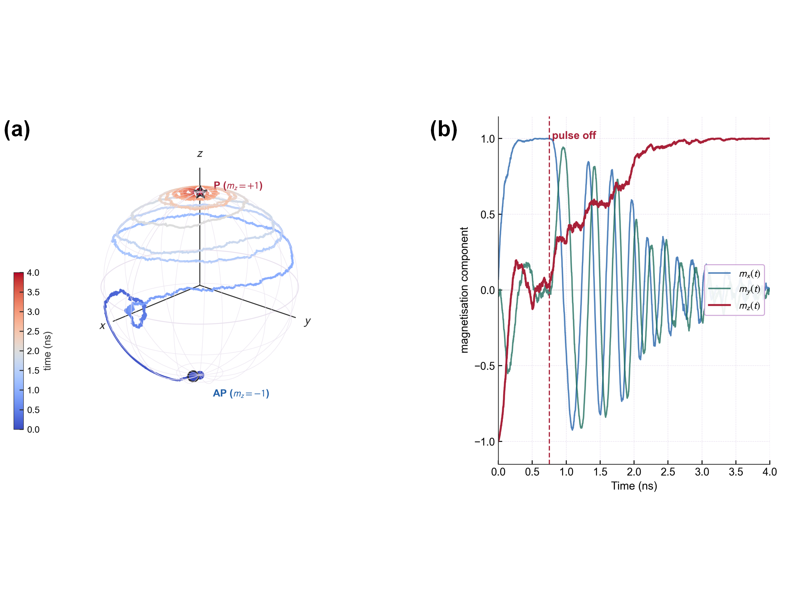

**图2.9** vgsot-sim在$$t_w = 0.75\,\mathrm{ns}$$写入脉冲下的单次轨迹输出。(a)归一化磁化分量$$m_z(t)$$。(b)由TMR模型换算的瞬时MTJ电阻$$R_{\mathrm{MTJ}}(t)$$ ($$R_P\!\approx\!5\,\mathrm{k}\Omega$$、$$R_{AP}\!\approx\!10\,\mathrm{k}\Omega$$，与图2.13滞回回线幅度一致)。(c)SOT驱动电流脉冲$$I_{\mathrm{SOT}}(t)$$。初始态为PAP=1 ($$m_z\approx-1$$) 、热噪声NON=1、自热反馈开启 (详见2.2.2.5节) ；仿真使用2.2.4节校准至Device A P→AP @ 0.75 ns实验阈值的有效$$\theta_{\mathrm{SH}}=0.066$$ (经2.2.3.2节保模长Cayley积分器标定)，并以代表性RNG种子使各$$I_{\mathrm{SOT}}$$级展现其在SER MC分布中的最可能行为。四条$$I_{\mathrm{SOT}}\in\{-600,-1100,-1300,-2000\}\,\mu\mathrm{A}$$跨越亚阈值、临界、刚翻转与确定性翻转四种情形：600 µA下$$m_z$$维持在$$-1$$不动 ($$R_{\mathrm{MTJ}}\!\approx\!R_{AP}$$) ；1100 µA接近阈值但脉冲关断后仍沿$$-z$$方向回落；1300 µA处出现成功跨越赤道并落入$$+z$$基态的翻转事件 ($$R_{\mathrm{MTJ}}$$跃迁至$$R_P$$) ；2000 µA给出更快的赤道达到时刻。临界电流1100–1300 µA区间与实验$$I_{\mathrm{th}}(0.75\,\mathrm{ns})\approx 1152\,\mu\mathrm{A}$$ ($$V_{\mathrm{th}}\approx 894\,\mathrm{mV}$$) 量纲匹配。

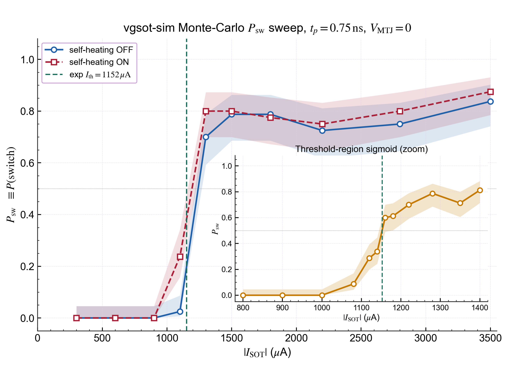

**图2.10** vgsot-sim在$$I_{\mathrm{SOT}}=-2000\,\mu\mathrm{A}$$、$$t_w=0.75\,\mathrm{ns}$$确定性翻转条件下的单次磁化矢量轨迹。(a)在单位球面上以时间为色标显示完整$$\mathbf{m}(t)$$演化路径，蓝色圆点表示初态反平行极，金色五角星表示终态平行极，紫色细线为球面网格仅作几何参考。轨迹在初始的SOT驱动阶段 (0–0.75 ns) 沿赤道附近螺旋上升，进动周期约0.2 ns，与$$H_k$$对应的Larmor频率量级一致；脉冲关断后磁化在剩余3.25 ns弛豫窗口内沿Gilbert阻尼通道收敛至上极。(b)同次仿真的笛卡儿分量$$m_x(t)$$、$$m_y(t)$$、$$m_z(t)$$时域演化，赤道附近的高频振荡周期与三维视图所呈现的螺旋间距一致，$$m_z$$穿越零点的时刻对应轨迹跨越赤道；该视角与图2.9的多电流情形形成互补，前者刻画进动几何，后者刻画统计行为。

第二类输出是多条独立轨迹汇总得到的$$P_{\mathrm{sw}}$$或$$\mathrm{SER}$$曲线。该输出才是本章与概率计算接口相连的核心：图2.11把宏自旋求解器给出的概率窗口与2.3.2节实测Sigmoid放到同一量纲下，并显示自热反馈会在阈值附近改变翻转概率。由此，$$P_{\mathrm{sw}}$$/SER曲线成为后续实验标定、工艺失配注入与Bernoulli采样预算分析的输入。

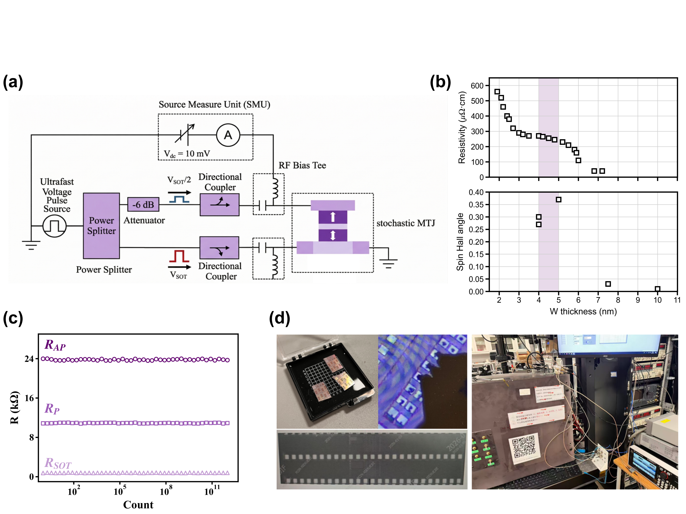

**图2.11** $$t_w = 0.75\,\mathrm{ns}$$写入脉冲 + 3.25 ns弛豫窗口下输出的$$P_{\mathrm{sw}}$$–$$|I_{\mathrm{SOT}}|$$蒙特卡罗扫描结果 (以2.2.3.2节保模长Cayley积分器、有效$$\theta_{\mathrm{SH}}=0.066$$标定值生成)。(a)宽范围扫描 (300–3500 µA，每点80条独立轨迹，Wilson 95% 置信区间以阴影带给出)，蓝色实线为自热反馈关闭、红色虚线为自热开启；青色虚线标示2.3.2节Sigmoid拟合给出的实验阈值$$I_{\mathrm{th}}=V_{\mathrm{th}}/R_W=894\,\mathrm{mV}/776\,\Omega\!\approx\!1152\,\mu\mathrm{A}$$。亚阈值区 ($$|I_{\mathrm{SOT}}|\!\lesssim\!900\,\mu\mathrm{A}$$) $$P_{\mathrm{sw}}\!\approx\!0$$；过渡区在阈值附近抬升后，超阈值区$$P_{\mathrm{sw}}$$进入由过驱进动回切 (back-hopping) 上限主导的$$\approx\!0.75$$–$$0.85$$平台，并延伸至数 mA 量级而始终低于1、不再单调升至饱和——此即2.2.3.2节场样SOT符号勘误后更忠实呈现的物理特征 (改正前该误差曾"人为锐化"过渡曲线并压窄该平台，见[^note-dev-cayley])。(b)阈值区精扫描inset (1100–1400 µA附近密集取点，每点80条)，琥珀色曲线给出50%翻转点$$\approx\!1160\,\mu\mathrm{A}$$，与实验$$I_{\mathrm{th}}=1152\,\mu\mathrm{A}$$一致至约1%。相对勘误前，改正后的过渡略宽、回切平台更显著，但工作区阈值定位精度反而提高。自热开启支在阈值工作点高于关闭支 ($$\Delta T_{\mathrm{eq}}\approx 36\,\mathrm{K}$$对应$$\Delta K_i/K_i\approx-7\%$$，使阈值在统计意义下向左偏移) ；超阈值区$$|\Delta P_{\mathrm{sw}}|$$落入Wilson带宽内不可识别。

图2.11的基线关闭了VCMA调制；将偏压支路接通 (vnv=1、仅写入段施加$$V_{\mathrm{MTJ}}$$) 后，同一求解器可直接给出2.1.3节联合驱动模型的器件级响应。五档偏压下的50%阈值电流与线性VCMA静态标度$$I_{c0}(V)/I_{c0}(0)=1-\beta_{\mathrm{VCMA}}V/(t_{\mathrm{ox}}t_f K_U^{\mathrm{eff}})$$的偏差不超过10%，在$$+0.8\,\mathrm{V}$$端点近乎重合 (0.431对0.434)：$$+0.4\,\mathrm{V}$$偏压使$$I_{\mathrm{th}}$$由$$1150\,\mu\mathrm{A}$$降至$$877\,\mu\mathrm{A}$$，$$P_{\mathrm{sw}}=0.5$$工作点的单次写能耗自$$0.77\,\mathrm{pJ}$$降至$$0.47\,\mathrm{pJ}$$ (含VCMA支路漏电耗散，降幅39%)，量化了联合驱动的能效收益；$$+0.8\,\mathrm{V}$$进一步把阈值压至$$496\,\mu\mathrm{A}$$，但超阈值回切平台同时失稳——$$P_{\mathrm{sw}}$$在$$0.55$$–$$1.23\,\mathrm{mA}$$整段仅在$$0.6$$–$$0.9$$间非单调起伏，较基线$$0.75$$–$$0.85$$的平台更低且波动更大，无法界定可靠写入窗口，故VCMA辅助存在最优偏压区间而非单调增益。作为对照，先施加1 ns、$$+0.8\,\mathrm{V}$$的纯VCMA预脉冲、撤压后再行SOT写入的顺序构型不产生可测收益 ($$I_{\mathrm{th}}=1169\,\mu\mathrm{A}$$，与基线差异在统计分辨率内)，与线性VCMA无记忆效应的物理图像一致：能垒调制只在偏压保持期间存在，辅助必须与写入脉冲重叠[^note-e3-vcma]。
[^note-e3-vcma]: 设置沿用图2.11口径 (Cayley积分器、自热开启、P→AP、0.75 ns写入+3.25 ns弛豫)，每偏压9–15个电流点、每点150条轨迹，50%阈值取原始$$P_{\mathrm{sw}}=0.5$$穿越点，基线$$I_{\mathrm{th}}=1150\,\mu\mathrm{A}$$与图2.11(b)的$$\approx1160\,\mu\mathrm{A}$$在统计分辨率内一致。五档$$V_{\mathrm{MTJ}}=-0.8/-0.4/0/+0.4/+0.8\,\mathrm{V}$$的$$I_{\mathrm{th}}=1636/1384/1150/877/496\,\mu\mathrm{A}$$，归一化$$1.423/1.204/1/0.762/0.431$$，静态标度预测$$1.566/1.283/1/0.717/0.434$$，阻碍侧略有压缩。能耗按$$E=I_{\mathrm{th}}^2R_Wt_w+V_{\mathrm{MTJ}}^2t_w/R_P$$计 ($$R_W=776\,\Omega$$、$$R_P\approx5.0\,\mathrm{k\Omega}$$)，$$0/+0.4/+0.8\,\mathrm{V}$$分别为$$0.77/0.47/0.24\,\mathrm{pJ}$$；$$+0.8\,\mathrm{V}$$虽进一步降低能耗但已无干净写窗，可用工作点位于中等偏压区间。阈值排序$$1636>1150>496\,\mu\mathrm{A}$$即正压助翻、负压阻翻，与2.2.1.2节$$\mathbf{H}_{\mathrm{VCMA}}$$的方向约定一致。

## 2.3 sMTJ器件实验验证与联合写入概率模型

### 2.3.1高速测试系统架构与器件信息

实验器件来自驰拓(HIKSTOR) 300 mm三端SOT-MTJ工艺平台，采用top-pinned MTJ堆叠与$$\beta$$-W SOT通道；几何、隧穿和输运标称参数已在2.1与2.2的模型参数表中给出。这里保留与概率标定直接相关的信息：高速脉冲测试平台能够在亚纳秒至数纳秒窗口内施加写入脉冲、读出MTJ状态，并通过链路校正恢复器件端有效电压；外加面内磁场用于破缺SOT写入的手性对称性[^ref-grimaldi-sot-mtj]。图2.12展示测试链路，表2.5给出阵列均值。

**表2.5** 器件阵列测试统计均值

| 特征 | 测量数值 |
|:-----|:--------|
| 矫顽场$$\mu_0 H_c$$ | 75 mT |
| 偏置场$$\mu_0 H_{\mathrm{offset}}$$ | 0.36 mT |
| MTJ平行态电阻$$R_P$$ | 10.89 kΩ |
| SOT沟道电阻$$R_{\mathrm{SOT}}$$ | 776 Ω |

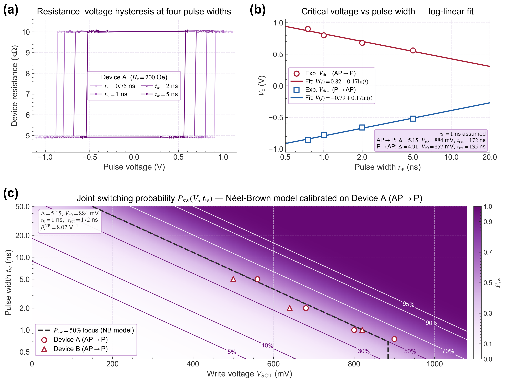

**图2.12** SOT-MTJ器件实验平台与统计表征综合视图。(a)高速测试系统原理框图：超快电压脉冲经功率分配器分为两路 (上路可选$$-6\,\mathrm{dB}$$衰减)，射频偏置器合并高频脉冲与10 mV直流偏置后施加于器件顶层或底层电极，定向耦合器监测信号状态，SMU在顶层电极处采集电流响应。(b)实物照片：芯片样品、器件阵列光学显微镜照片及探针台测试系统。

表2.5中的$$R_P$$还提供了一个重要的工艺校准锚点：按物理直径直接换算的Brinkman电阻低于实测值，说明参与隧穿的电学有效面积小于版图几何面积。由$$R\!\cdot\!A/R_P$$反推可得$$D_{\mathrm{elec}}\approx64.9\,\mathrm{nm}$$，与刻蚀损伤环带导致边缘电学失效的图像一致。因此，后续Brinkman电阻映射与阵列级失配分析均采用$$D_{\mathrm{elec}}$$而非$$D_{\mathrm{phys}}$$作为电学基准。

---

### 2.3.2 sMTJ器件写入特性测量结果

本节从同一测量窗口内的Device A与Device B数据中提取两类后续建模所需的信息：一类是临界电压随脉宽的对数依赖，用于反推Néel-Brown参数；另一类是$$t_w = 0.75\,\mathrm{ns}$$条件下的概率翻转曲线，用于标定Sigmoid接口。

**临界写入电压的脉宽依赖。** 在固定外加面内磁场$$H_x = 200\,\mathrm{Oe}$$条件下，施加脉冲宽度$$t_w = 0.75\,\mathrm{ns}$$、$$1\,\mathrm{ns}$$、$$2\,\mathrm{ns}$$、$$5\,\mathrm{ns}$$的写入脉冲，在每个脉宽下扫描脉冲电压幅值$$V_{\mathrm{SOT}}\in[-1.1, 1.1]\,\mathrm{V}$$，获取完整的电阻-电压滞回回线。每个扫描点先将器件初始化至已知磁化状态，施加单次写入脉冲，随后通过SMU读取MTJ电阻状态以判断翻转是否发生。

实验滞回回线如图2.13(a)所示。随脉冲宽度减小，翻转阈值单调上移；正反向阈值存在轻微不对称，与参考层杂散偏置场对两态能垒的调制一致。具体阈值由图2.13和后续拟合式给出，正文保留其物理判断：器件处于热激活辅助的纳秒写入区，脉宽变化能够稳定调制翻转阈值。

由滞回回线的电阻跳变点提取各脉宽下的正负向临界电压后，以$$\ln(t_w)$$为自变量绘制$$V_{\mathrm{th}}$$的依赖关系，得到如图2.13(b)所示的严格线性趋势。对Device A两个方向分别进行线性回归得到拟合关系式

$$
V_{\mathrm{AP\to P}}(t_w) = 0.82 - 0.17\ln(t_w/\mathrm{ns})\ \mathrm{V},\qquad V_{\mathrm{P\to AP}}(t_w) = -0.79 + 0.18\ln(t_w/\mathrm{ns})\ \mathrm{V},
$$

两个方向的决定系数$$R^2$$均在0.995以上，证实在所测0.75–5 ns范围内临界写入电压与脉冲宽度的对数呈严格线性依赖。该对数依赖关系是热激活翻转区的核心特征，是后续反推Néel-Brown模型参数的直接依据。

**写入能耗估算。** SOT-MRAM的写入电流主要流经重金属通道，单次写入能耗由SOT通道上的欧姆耗散主导。以最短脉宽$$t_w = 0.75\,\mathrm{ns}$$、正向临界写入电压$$V_{\mathrm{th}+}\approx 0.90\,\mathrm{V}$$为例，结合SOT通道电阻$$R_{\mathrm{SOT}}\approx 776\,\Omega$$，单次写入能耗可估算为
$$
E_{\mathrm{write}} = \frac{V^2}{R_{\mathrm{SOT}}}\cdot t_w = \frac{(0.90\,\mathrm{V})^2}{776\,\Omega}\times 0.75\,\mathrm{ns}\approx 0.78\,\mathrm{pJ}.
$$

该能耗量级与先进SOT-MTJ亚纳秒写入报道相符。

**$$t_w = 0.75\,\mathrm{ns}$$概率翻转特性。** 固定脉冲宽度为$$t_w = 0.75\,\mathrm{ns}$$，对Device A和Device B各以正、负两个方向扫描写入电压，每个幅值独立重复执行100次写入操作，以成功翻转次数占比定义翻转概率$$P_{\mathrm{sw}}$$。该测量与前述滞回扫描在同一批次内完成 (同一器件、同一连续测试窗口)，构成与NB参数反推直接对应的基准数据。四条$$P_{\mathrm{sw}}(V)$$曲线如图2.14所示，对每条曲线独立进行四参数Sigmoid拟合
$$
P_{\mathrm{sw}}(V) = y_0 + \frac{L}{1+\exp[-(|V|-V_{\mathrm{th}})/k]},
$$

其中$$k$$为尺度参数，对应的logistic斜率参数$$\beta_s = 1/k$$。表2.6列出全部拟合结果，正文只讨论与模型选择相关的差异。

**表2.6** $$t_w = 0.75\,\mathrm{ns}$$的四条Sigmoid拟合结果

| 器件 | 方向 | $$V_{\mathrm{th}}$$ (mV) | $$k$$ (mV) | $$\beta_s$$ (V⁻¹) | $$R^2$$ | 备注 |
|:---:|:---:|:---:|:---:|:---:|:---:|:---|
| A | AP→P | 915.5 | 5.45 | 183.5 | 0.969 | $$V\gtrsim 940$$ mV出现回跳平台，拟合受扰 |
| A | P→AP | 894.0 | 22.43 | 44.6 | 0.993 | 干净单段过渡 |
| B | AP→P | 865.9 | 36.54 | 27.4 | 0.968 | 840–860 mV附近出现两段过渡 |
| B | P→AP | 904.5 | 11.26 | 88.8 | 0.995 | 干净单段过渡 |

四组曲线并不完全等价。AP→P方向出现的back-hopping平台和两段过渡提示深过驱区存在宏自旋Sigmoid之外的动力学非理想性；两条P→AP曲线则呈现干净单段过渡，更适合作为行为级接口的标定对象。后续联合模型因此采用Device A、P→AP、$$t_w = 0.75\,\mathrm{ns}$$的Sigmoid拟合结果作为主基准，使Néel-Brown反推、Sigmoid斜率与工艺容差分析共用同一器件、方向与测量窗口。

---

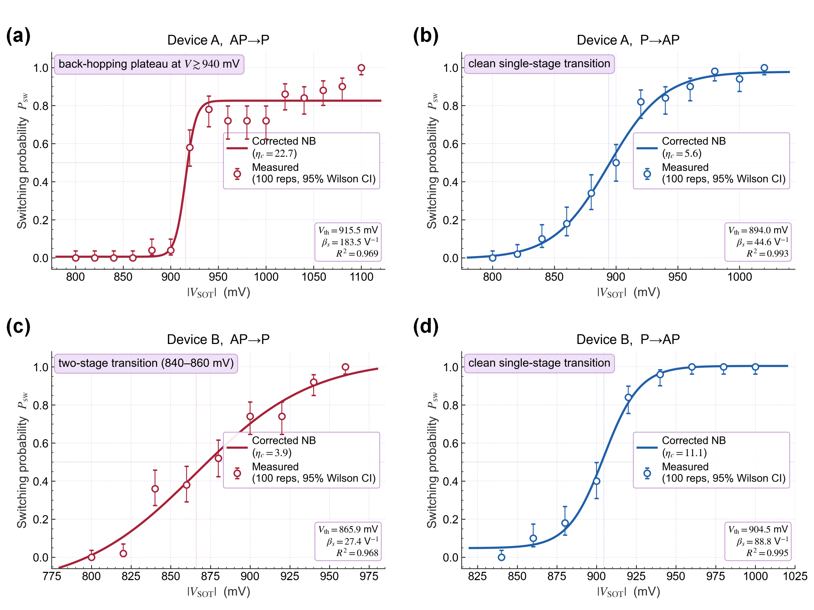

**图2.13** sMTJ器件在不同脉冲宽度下的写入特性、Néel-Brown联合概率模型与宏自旋跨脉宽迁移核验。(a)$$t_w = 0.75\,\mathrm{ns}$$、$$1\,\mathrm{ns}$$、$$2\,\mathrm{ns}$$、$$5\,\mathrm{ns}$$条件下测得Device A的电阻-脉冲电压滞回回线，随脉冲持续时间缩短翻转电压窗口逐渐展宽。(b)临界翻转电压$$V_{\mathrm{th}\pm}$$随脉冲宽度的对数依赖关系，空心符号为实验数据点，实线为对数线性拟合$$V = a\mp b\ln(t_w/\mathrm{ns})$$；内嵌注释给出由$$\tau_0 = 1\,\mathrm{ns}$$先验反推得到的两方向Néel-Brown参数$$(\Delta, V_{c0}, \tau_{\mathrm{ret}})$$。(c)基于反推NB参数构建的二维联合翻转概率分布$$P_{\mathrm{sw}}(V, t_w)$$热力图(AP→P方向)，紫色等概率轮廓在低概率区可读，白色等概率轮廓在高概率区可读，黑色虚线为50%等概率轨迹即$$V_{\mathrm{th}}(t_w)$$；空心圆(Device A)与三角(Device B)标示两器件的滞回提取点，与50%轨迹吻合。(d)跨脉宽迁移核验(P→AP方向)，红色空心圆为以0.75 ns单点标定$$\theta_{\mathrm{SH}}$$的宏自旋仿真50%阈值(Cayley积分器、自热开启，误差棒为$$1\sigma$$统计分辨率)，青色虚线与方块为(b)的实验对数线性律及其测量脉宽，琥珀色星号为0.75 ns Sigmoid标定锚点，红色实线为仿真数据自身的对数线性拟合；仿真对数斜率$$87\,\mathrm{mV}$$约为实验$$175\,\mathrm{mV}$$之半，阈值偏差随脉宽增至$$+40.5\%$$。

---

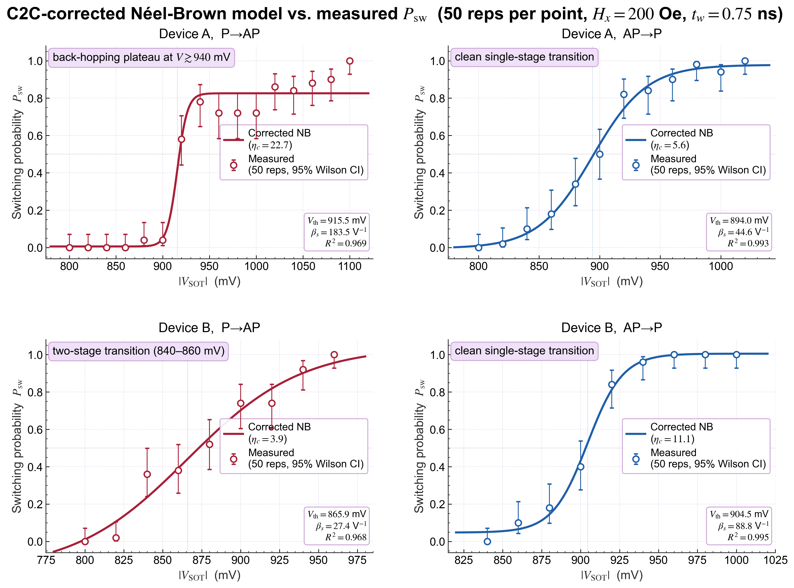

**图2.14** $$t_w = 0.75\,\mathrm{ns}$$、$$H_x = 200\,\mathrm{Oe}$$条件下100次重复Sigmoid测量与C2C-修正后的Néel-Brown模型对比。(a)Device A AP→P：实测在$$V \gtrsim 940\,\mathrm{mV}$$出现back-hopping回跳平台。(b)Device A P→AP：干净单段过渡($$R^2 > 0.99$$)，作为主基准曲线。(c)Device B AP→P：840–860 mV附近出现两段过渡。(d)Device B P→AP：干净单段过渡($$R^2 > 0.99$$)。空心符号为实验数据点(误差线为二项分布的Wilson 95%置信区间)，实线为C2C-修正NB曲线 (数学上等价于四参数Sigmoid拟合)，各面板内嵌注释给出$$\eta_c = \beta_s/\beta^{\mathrm{NB}}$$与该曲线的物理特征。Sigmoid拟合对四条曲线的$$V_{\mathrm{th}}$$预测精度均优于+7.4%，但未修正NB预测的斜率(约8 V⁻¹)普遍低于实测数倍，必须以$$\eta_c$$因子作C2C修正方能重现实测分布陡度。

---

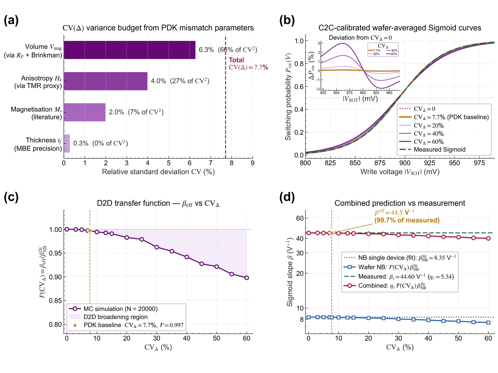

**图2.15** Device A 与 Device B 两个器件的Néel-Brown参数一致性对比。(a)正向(AP→P)临界翻转电压$$V_{\mathrm{th}+}$$随脉冲宽度$$t_w$$的对数线性依赖；Device A (红色圆点) 与Device B (紫色三角) 数据点近似落在同一条对数直线上，两器件的$$\Delta$$与$$V_{c0}$$拟合值在5%–15%范围内一致。(b)以$$\tau_0 = 1\,\mathrm{ns}$$先验反推得到的两方向热稳定性因子$$\Delta$$柱状图，AP→P (红色) 与P→AP (蓝色) 方向在同一器件上数值接近(器件A的两方向$$\Delta$$分别为5.15与4.91、器件B分别为4.46与4.95)，对应零温临界电压$$V_{c0}$$分别为884 mV (器件A) 与876 mV (器件B)，证实sMTJ作为概率单元具备良好的器件间均匀性，为后续阵列级建模与工艺容差分析提供同批次基线参考。

### 2.3.3 Néel-Brown模型参数的反推

前述$$V_{\mathrm{th}}$$对数线性依赖关系与前文建立的Néel-Brown翻转概率模型在数学上严格等价，可由实验系数反推底层物理参数。取线性势垒近似$$n=1$$，翻转概率满足

$$
P_{\mathrm{sw}}(t_w, V) = 1 - \exp\!\left[-\frac{t_w}{\tau_0}\exp\!\left(-\Delta\left(1-\frac{V}{V_{c0}}\right)\right)\right]
$$

其中$$\tau_0$$为尝试频率倒数、$$\Delta = E_b/k_BT$$为热稳定性因子、$$V_{c0}$$为零温临界电压。令$$P_{\mathrm{sw}}(t_w, V_{\mathrm{th}}) = 0.5$$解得

$$
V_{\mathrm{th}}(t_w) = V_{c0}\left[1 - \frac{1}{\Delta}\ln\!\left(\frac{t_w}{\tau_0\ln 2}\right)\right] = \underbrace{\left[V_{c0} + \frac{V_{c0}}{\Delta}\ln(\tau_0\ln 2)\right]}_{a} - \underbrace{\frac{V_{c0}}{\Delta}}_{b}\ln(t_w)
$$

比对实验拟合$$V_{\mathrm{th}} = a - b\ln(t_w)$$的两个系数可建立$$(\tau_0,\Delta, V_{c0})$$与$$(a,b)$$之间的映射关系。

**模型无关的物理可观测量。** 实验对数线性拟合提供两个独立约束，可直接转换为两个不依赖$$\tau_0$$先验假设的物理量。对数斜率$$b = V_{c0}/\Delta$$给出脉宽每增加一个$$e$$倍所需降低的写入电压，是器件翻转灵敏度的量纲化度量。令$$V_{\mathrm{th}}(t^*) = 0$$即可解得速率律外推至零驱动处名义的50%自发翻转时间$$t^* = \exp(a/b)$$，由此定义零驱动保持时间
$$
\tau_{\mathrm{ret}} \equiv \tau_0\, e^{\Delta} = \frac{t^*}{\ln 2} = \frac{1}{\ln 2}\exp\!\left(\frac{a}{b}\right).
$$

该量仅由拟合截距与斜率共同决定，无需假设$$\tau_0$$。Device A两方向的提取结果如表2.7所示。

**表2.7** Device A模型无关物理可观测量

| 方向 | 对数斜率$$b = V_{c0}/\Delta$$ | $$t^*$$ | 零驱动保持时间$$\tau_{\mathrm{ret}}$$ |
|:---:|:---:|:---:|:---:|
| AP→P | 172 mV | 120 ns | 172 ns |
| P→AP | 175 mV | 94 ns | 135 ns |

表2.7的$$\tau_{\mathrm{ret}}$$处于百纳秒量级且存在方向差异，远低于传统存储MRAM所要求的年量级保持时间[^note-retention-delta]。需要明确其口径：该量是纳秒写入区对数线性律在$$V_{\mathrm{th}}\to0$$处的外推值，承载的是$$200\,\mathrm{Oe}$$面内偏置下热辅助进动交叉区的动态有效势垒，而非器件在零驱动下的实际驻留时间——后者由准静态滞回与慢速读出的稳定性可知远长于此[^note-tauret-freerun]。作为拟合系数$$(a,b)$$的模型无关组合，$$\tau_{\mathrm{ret}}$$刻画写入窗口内热激活的等效时间尺度；低势垒概率采样单元[^ref-camsari-pbits]所要求的百纳秒级物理驻留，则对应2.4节把有效各向异性进一步压低后的设计目标，而非本器件的现状；当$$\Delta$$取器件的内禀势垒时，$$\tau_0 e^{\Delta}$$仍是物理驻留时间的正确表达式，2.4节即在该意义下将其用于势垒压低后的目标器件。
[^note-retention-delta]: 存储MRAM典型$$\tau_{\mathrm{ret}}>10\,\mathrm{yr}$$对应$$\Delta>60$$。
[^note-tauret-freerun]: 以2.2节标定参数集 (零驱动内禀热稳定因子约48.5，即图2.7(c)平衡采样所用的势阱深度) 做零驱动自由演化直接核验：面内偏置$$50\,\mathrm{Oe}$$与$$200\,\mathrm{Oe}$$两档、各5个独立种子共$$10\,\mu\mathrm{s}$$，磁化始终未越过$$|m_z|=0.5$$滞回阈值 (零翻转)；若$$\tau_{\mathrm{ret}}\approx135\,\mathrm{ns}$$为物理驻留时间，同窗内期望翻转约74次。外推值与实际驻留的量级脱节，源于线性势垒近似只在$$V\to V_{c0}$$的写入工作区成立，向$$V\to0$$外推时丢失了势垒的非线性增长。

**热稳定性因子与零温临界电压。** Néel-Brown模型含三个自由参数而对数线性拟合仅提供两个约束，系统欠定，存在一族以$$\tau_0$$为参数的合法解，族内所有解给出相同的$$\tau_{\mathrm{ret}}$$和$$V_{c0}/\Delta$$。若要进一步分离$$\Delta$$与$$V_{c0}$$的绝对数值需引入$$\tau_0$$的先验约束。对于CoFeB/MgO基自由层，文献中报道的尝试频率$$f_0 = 1/\tau_0$$处于1–10 GHz量级[^ref-brown-thermal]，本文采用$$\tau_0 = 1\,\mathrm{ns}$$作为标准假设值，得器件Néel-Brown模型参数如表2.8所示。

**表2.8** 反推得到的Device A Néel-Brown模型参数($$\tau_0 = 1\,\mathrm{ns}$$)

| 参数 | AP→P | P→AP | 单位 | 物理含义 |
|:---:|:---:|:---:|:---:|:---|
| $$\tau_0$$ | 1.0 | 1.0 | ns | 尝试频率倒数(先验假设) |
| $$\Delta$$ | 5.15 | 4.91 | — | 热稳定性因子 |
| $$V_{c0}$$ | 884 | 857 | mV | 零温临界电压 |
| $$E_b = \Delta k_BT$$ | 133 | 127 | meV | 能垒高度(300 K) |
| $$\tau_{\mathrm{ret}}$$ | 172 | 135 | ns | 零驱动保持时间 |
| $$\beta_s^{\mathrm{NB}} = 2\Delta\ln 2/V_{c0}$$ | 8.08 | 7.94 | V⁻¹ | NB模型预测的Sigmoid斜率 |

表2.8给出的$$\Delta$$处于sMTJ概率工作区间：能垒足以避免完全无控的热漂移，又显著低于存储MRAM，从而支持纳秒级热激活响应。后续分析把这些参数作为同批次器件的热激活基线。

**映射至有效各向异性场。** 反推得到的$$\Delta_0$$可进一步映射至器件微观物理量以验证其物理合理性。在PMA构型的宏自旋近似下，自由层能垒满足$$E_b = K_{\mathrm{eff}}V_{\mathrm{mag}} = \frac{1}{2}\mu_0 H_k^{\mathrm{eff}} M_s V_{\mathrm{mag}}$$，其中$$K_{\mathrm{eff}}$$为有效单轴各向异性能密度、$$H_k^{\mathrm{eff}}$$为有效各向异性场、$$M_s$$为饱和磁化强度、$$V_{\mathrm{mag}}$$为自由层磁性体积。反解得

$$
H_k^{\mathrm{eff}} = \frac{2\Delta_0 k_BT}{\mu_0 M_s V_{\mathrm{mag}}}
$$

将表2.8的$$\Delta$$映射回$$H_k^{\mathrm{eff}}$$后，可得到与低势垒SOT-MTJ定位一致的有效各向异性场。该量低于存储型MRAM并不矛盾：本章提取的是带面内破对称场、纳秒写入条件下的动态能垒，而准静态矫顽场描述的是另一种测量配置。该交叉检查的目的，是确认行为级反推参数没有偏离合理磁学量级。

### 2.3.4 Sigmoid实测与NB外推的定量比较

将前节反推得到的Néel-Brown参数代入NB阈值公式，外推至$$t_w = 0.75\,\mathrm{ns}$$概率测量点，可对NB模型在跨观测量一致性方面进行严格检验。Sigmoid斜率由$$\beta_s^{\mathrm{NB}} = 2\Delta\ln 2/V_{c0}$$给出，仅取决于反推的$$\Delta$$与$$V_{c0}$$而与$$t_w$$无关[^note-nb-slope]。四条曲线的NB外推值与Sigmoid拟合结果逐项对比列于表2.9。
[^note-nb-slope]: 线性势垒近似下$$\beta_s^{\mathrm{NB}} = 2\Delta\ln 2/V_{c0}$$只取决于$$\Delta$$与$$V_{c0}$$，与$$t_w$$无关。

**表2.9** $$t_w = 0.75\,\mathrm{ns}$$下NB外推与Sigmoid实测的逐项对比

| 器件 | 方向 | $$V_{\mathrm{th}}^{\mathrm{NB}}$$ | $$V_{\mathrm{th}}^{\mathrm{meas}}$$ | $$V_{\mathrm{th}}$$偏差 | $$\beta_s^{\mathrm{NB}}$$ | $$\beta_s^{\mathrm{meas}}$$ | $$\eta_c = \beta_s^{\mathrm{meas}}/\beta_s^{\mathrm{NB}}$$ |
|:---:|:---:|:---:|:---:|:---:|:---:|:---:|:---:|
| A | AP→P | 870 mV | 915.5 mV | +5.2% | 8.08 V⁻¹ | 183.5 V⁻¹ | 22.7 |
| A | P→AP | 843 mV | 894.0 mV | +6.0% | 7.94 V⁻¹ | 44.6 V⁻¹ | 5.6 |
| B | AP→P | 861 mV | 865.9 mV | +0.6% | 7.06 V⁻¹ | 27.4 V⁻¹ | 3.9 |
| B | P→AP | 842 mV | 904.5 mV | +7.4% | 8.02 V⁻¹ | 88.8 V⁻¹ | 11.1 |

表2.9表明NB模型能够正确预测$$V_{\mathrm{th}}$$，却系统性低估了实测Sigmoid斜率。前者说明脉宽扫描反推出的热激活参数是可信的；后者说明单畴NB-Gumbel分布不能直接解释循环间概率分布的宽度。本文将二者分开处理，把阈值标度归入热激活势垒$$\Delta_{\mathrm{pulse}}$$，把分布形态差异归入C2C收窄因子$$\eta_c = \beta_s^{\mathrm{meas}}/\beta_s^{\mathrm{NB}}$$。

主基准曲线 (Device A、P→AP) 实测$$\eta_c > 1$$的主体可由热辅助进动区的动力学相干性解释，这一归因经2.2节宏自旋求解器直接核验：在标定工作点对过渡区做加密Monte Carlo扫描并以同一四参数Sigmoid拟合，sLLG给出斜率$$\beta_s^{\mathrm{sLLG}} = 33.8\pm13.5\,\mathrm{V^{-1}}$$ (95%置信区间)，显著高于NB外推的$$7.94\,\mathrm{V^{-1}}$$，与实测$$44.6\,\mathrm{V^{-1}}$$在区间内一致，按对数计弥合了$$\eta_c$$差距的约84%[^note-eta-sllg]。$$t_w = 0.75\,\mathrm{ns}$$位于纯热激活 (长脉宽、低电压) 与纯进动翻转 (短脉宽、高电压) 之间的机制交叉区，翻转事件获得部分相干性，C2C分布因此窄于纯热激活Gumbel极限；该收窄在单畴图像内即可产生，Néel-Brown解析式之所以未能刻画，是因为速率律只保留了能垒统计而丢弃了进动动力学。就主基准曲线而言，亚畴协同跃迁等超出宏自旋自由度的机制只需解释残余的少部分斜率差；表2.9中$$\eta_c$$更高的其余三条曲线能否同样归因，尚待逐条仿真核验。AP→P方向同时出现回跳平台与两段过渡而P→AP方向基本不出现的事实，则可能提示参考层杂散场对正反两方向翻转动力学的非对称调制，留待在求解器中以方向敏感的杂散场注入检验。
[^note-eta-sllg]: 核验设置与表2.9的$$\eta_c$$口径一致：Device A、P→AP、$$t_w=0.75\,\mathrm{ns}$$、保模长Cayley积分器、自热开启，过渡区13个电压点、每点$$10^3$$条独立轨迹，四参数logistic拟合 ($$R^2=0.995$$)，区间取拟合协方差的95%置信半宽。斜率阶梯为$$\beta_s^{\mathrm{NB}}=7.94\to\beta_s^{\mathrm{sLLG}}=33.8\to\beta_s^{\mathrm{meas}}=44.6\,\mathrm{V^{-1}}$$，对数份额$$\ln(33.8/7.94)/\ln(44.6/7.94)\approx0.84$$，置信下界对应约0.55。同一扫描还复核了图2.11过驱平台的存在及其稳健性：$$0.97$$–$$1.24\,\mathrm{V}$$区间仿真$$P_{\mathrm{sw}}$$平坦于$$0.70$$–$$0.78$$，抽检$$1.09/1.55\,\mathrm{V}$$两点对脉后判定窗$$3.25/10/50\,\mathrm{ns}$$不敏感，$$1.55\,\mathrm{V}$$处平台约$$0.81$$，与图2.11在更宽电流范围报告的$$0.75$$–$$0.85$$平台在统计区间内一致，说明平台源于脉冲期间的过驱进动随机化而非读出判定口径；实测P→AP至其数据上限$$\approx1.02\,\mathrm{V}$$已饱和至1，仿真平台反而与实测AP→P方向的回跳平台形态相近，该模型-实验分歧与正文方向非对称问题同源，留待杂散场注入实验一并澄清。

NB反推参数的物理口径还可用同一求解器做跨脉宽闭环核验：固定0.75 ns单点标定的$$\theta_{\mathrm{SH}}$$，对全部实测脉宽及两个内插脉宽 (1.5/3 ns) 仿真50%阈值，再做与实验完全相同的对数线性反推 (图2.13(d))。结果分为两层：标定锚点本身精确复现，$$V_{\mathrm{th}}^{\mathrm{sim}}(0.75\,\mathrm{ns})=893.3\,\mathrm{mV}$$与实测$$894.0\,\mathrm{mV}$$偏差$$0.7\,\mathrm{mV}$$、小于单点MC统计分辨率约$$8\,\mathrm{mV}$$；且内禀势垒约48.5的宏自旋在纳秒驱动下确实自发给出远浅于内禀值的有效势垒 ($$\Delta_{\mathrm{pulse}}^{\mathrm{sim}}\approx10.2$$)，2.3.3节动态有效势垒的图像由此获得动力学依据。但迁移只是部分成立：仿真对数斜率$$b^{\mathrm{sim}}\approx87\,\mathrm{mV}$$只有实验$$175\,\mathrm{mV}$$的一半，$$V_{\mathrm{th}}^{\mathrm{sim}}$$相对实验对数线性律的偏差从0.75 ns处的$$+5.7\%$$ (该本底对应表2.9中Sigmoid口径相对滞回外推口径的既有偏差+6.0%，两处参照线相差$$\ln2$$项) 单调增至5 ns处的$$+40.5\%$$[^note-e1-transfer]。这为行为级标定划出适用边界：$$\theta_{\mathrm{SH}}=0.066$$是0.75 ns工作点的有效参数，本文下游各章调用的写入概率接口均固定于该工作点、处于标定闭环之内；跨脉宽外推则须按目标脉宽重新标定，或引入超出单一$$\theta_{\mathrm{SH}}$$标量的机制修正。
[^note-e1-transfer]: 核验设置沿用图2.11口径 (Cayley积分器、自热开启、P→AP，每脉宽9–18个电压点、每点200条轨迹，3/5 ns因阈值高于按实验线预估的窗口中心而另行补充重新定中心的电压窗口)。50%阈值取原始$$P_{\mathrm{sw}}=0.5$$穿越点，与实验滞回/Sigmoid的50%点同口径；四参数logistic中点因过驱平台压低幅度参数而系统性偏低，仅作次要口径。逐脉宽$$V_{\mathrm{th}}^{\mathrm{sim}}=893.3/853.2/808.5/789.0/762.4/721.5\,\mathrm{mV}$$ ($$t_w=0.75/1/1.5/2/3/5\,\mathrm{ns}$$)，相对实验线偏差$$+5.7\%/+7.3\%/+11.7\%/+17.1\%/+26.5\%/+40.5\%$$；对仿真阈值做同式对数线性反推得$$(a,b,\Delta_{\mathrm{pulse}},V_{c0})^{\mathrm{sim}}=(856\,\mathrm{mV},\,87\,\mathrm{mV},\,10.2,\,888\,\mathrm{mV})$$ ($$\tau_0=1\,\mathrm{ns}$$)，对照实验值$$(795\,\mathrm{mV},\,175\,\mathrm{mV},\,4.91,\,857\,\mathrm{mV})$$。仿真$$V_{\mathrm{th}}(\ln t_w)$$在长脉宽端偏离严格线性 (分段斜率自约$$139\,\mathrm{mV}$$经约$$110\,\mathrm{mV}$$降至$$65$$–$$80\,\mathrm{mV}$$)，提示有效$$\theta_{\mathrm{SH}}$$随脉宽漂移，单标量集总在跨脉宽外推时失效 (与2.2.4节标定试错中5 ns与0.75 ns两靶点分别要求$$\theta_{\mathrm{SH}}\approx0.07$$与$$0.04$$的记录相印证；终值仅锚定0.75 ns，5 ns点的早期吻合不随之保留)；这也构成一次负结果——实验前设定的迁移验收判据 (各脉宽偏差$$\le5\%$$、$$b^{\mathrm{sim}}$$与实验同量级$$\pm30\%$$) 均未通过。

### 2.3.5工艺波动对晶圆平均概率曲线的影响

前节确定了同一器件内部C2C分布相对NB Gumbel基线的收窄因子$$\eta_c$$，该量描述单器件层面的概率响应陡度。概率计算阵列由多个独立的Bernoulli采样单元构成，单器件实测特性能否在阵列层面统计地保持，取决于器件间(D2D)参数离散对晶圆平均概率响应的展宽幅度。从工程视角看，热稳定因子的相对涨落$$\mathrm{CV}(\Delta) \equiv \sigma_\Delta/\mu_\Delta$$是连接foundry失配数据与阵列级随机计算精度的关键传递参数。在固定写入电压下，$$\Delta$$的D2D离散直接转化为阵列内Bernoulli概率的器件间偏离，进而以二阶矩形式进入网络等效噪声方差，影响推断精度上界。

热稳定因子由几何体积、界面各向异性与饱和磁化共同决定，将$$\mathrm{CV}(\Delta)$$按物理来源分解便于明确工艺优化的优先级：若主要方差贡献来自几何刻蚀，则提升线宽控制的边际收益超过磁性材料优化；反之亦然。该分解不依赖于具体器件结构的微观参数细节，仅利用foundry PDK中直接可得的局部失配参数与隧穿电学模型即可完成。下文从sMTJ PDK中的电学失配出发，经Brinkman隧穿模型反推为几何与界面失配，进而合成$$\mathrm{CV}(\Delta)$$的物理基线，并定量评估该基线对晶圆平均概率响应的影响幅度。

**基于PDK失配参数的$$\mathrm{CV}(\Delta)$$反推。** 驰拓300 mm sMTJ PDK针对局部失配定义三个独立的Gaussian扰动参数，节选自器件模型process block如下：

```spectre
parameters Rsot_mis = 1
parameters Rp_mis   = 1
parameters TMR_mis  = 1
statistics {
    process {
        vary Rsot_mis dist = gauss std = 0.07
        vary Rp_mis   dist = gauss std = 0.07
        vary TMR_mis  dist = gauss std = 0.04
    }
}
```

这些扰动以乘法方式作用于标称值，构成从foundry PDK进入概率模型的原始失配入口。

平行态MTJ电阻可写为$$R_P = (R\cdot A)/A$$，其中$$R\cdot A$$主要反映势垒特性，$$A = \pi D^2/4$$反映几何面积。利用Brinkman低偏压近似[^ref-brinkman-bdr]，可把$$R_P$$失配拆分为势垒涨落与面积涨落两部分，再将面积涨落映射为直径涨落。中间灵敏度和数值预算集中列于表2.10。

**方差合成与变异系数的几何加和规则。** 自由层磁性体积、界面各向异性和饱和磁化共同决定$$\Delta$$。其中几何体积项由直径失配主导，界面各向异性以TMR失配作为代理，$$M_s$$涨落取CoFeB材料典型量级。由$$\Delta \propto H_k M_s V_{\mathrm{mag}}$$对小相对扰动展开，$$\delta\Delta/\Delta = \delta H_k/H_k + \delta M_s/M_s + \delta V_{\mathrm{mag}}/V_{\mathrm{mag}} + \mathcal{O}(\mathrm{CV}^2)$$。诸误差项相互独立，方差线性可加而标准差按平方和的平方根合成：
$$
\mathrm{CV}^2(\Delta) = \mathrm{CV}^2(H_k) + \mathrm{CV}^2(M_s) + \mathrm{CV}^2(V_{\mathrm{mag}}),
$$

$$
\mathrm{CV}(\Delta) = \sqrt{0.040^2 + 0.020^2 + 0.063^2} = \sqrt{0.00598} \approx 7.7\%.
$$

各物理源对$$\mathrm{CV}^2(\Delta)$$的份额见表2.10。该表给出的关键结论是几何体积项占主导，因此提升线宽和有效面积控制比等比例改善磁性材料参数更能降低$$\Delta$$离散，这一判断可直接服务于工艺优化优先级。

**表2.10** $$\mathrm{CV}(\Delta)$$方差预算分解 (独立来源平方和合成) 

| 贡献源 | 相对标准差CV | $$\mathrm{CV}^2$$贡献 | 占总方差比例 |
|:---|:---:|:---:|:---:|
| 几何体积$$V_{\mathrm{mag}}$$ (由$$\mathrm{CV}(R_P)$$经Brinkman模型分解，含直径与厚度合成扰动) | 6.3% | 0.0040 | 66% |
| 界面各向异性$$H_k$$ (由$$\mathrm{CV}(\mathrm{TMR})$$作为界面质量代理) | 4.0% | 0.0016 | 27% |
| 饱和磁化$$M_s$$ (CoFeB成分涨落，取自文献典型值) | 2.0% | 0.0004 | 7% |
| 平方和合成$$\mathrm{CV}(\Delta) = \sqrt{\sum\mathrm{CV}_i^2}$$ | 7.7% | 0.0060 | 100% |

注：$$V_{\mathrm{mag}}$$的6.3%已由$$\mathrm{CV}(V_{\mathrm{mag}}) = \sqrt{[2\mathrm{CV}(D)]^2 + \mathrm{CV}^2(t_f)}$$合成，几何上由$$\mathrm{CV}(D) \approx 3.1\%$$主导，厚度涨落$$\mathrm{CV}(t_f) \approx 0.3\%$$对$$\mathrm{CV}^2(V_{\mathrm{mag}})$$的相对贡献仅约0.2%，本预算中不再单列。

**翻转概率对$$\Delta$$扰动的解析灵敏度。** 工艺波动对晶圆平均概率响应的影响幅度并不直接由$$\mathrm{CV}(\Delta)$$本身决定，而由$$\mathrm{CV}(\Delta)$$与$$P_{\mathrm{sw}}$$对$$\Delta$$灵敏度的乘积控制。NB双指数函数形式使该灵敏度具有简洁的解析表达，可在Monte Carlo仿真之前给出工艺裕度的解析估计。

记$$f(V) = (t_w/\tau_0)\exp[-\Delta(1-V/V_{c0})]$$，则$$P_{\mathrm{sw}} = 1 - \exp(-f)$$。对$$\Delta$$求偏导得

$$
\frac{\partial P_{\mathrm{sw}}}{\partial \Delta} = (1 - P_{\mathrm{sw}})\, f \cdot \left(\frac{V}{V_{c0}} - 1\right)
$$

该表达式在NB$$P_{\mathrm{sw}} = 0.5$$点取得简洁形式：此处$$\exp(-f) = 1/2$$给出$$f = \ln 2$$、$$1 - P_{\mathrm{sw}} = 0.5$$，并由NB阈值条件$$V_{\mathrm{th}}/V_{c0} = 1 - \ln(t_w/(\tau_0 \ln 2))/\Delta$$得

$$
\left.\frac{\partial P_{\mathrm{sw}}}{\partial \Delta}\right|_{V_{\mathrm{th}}} = -\frac{\ln 2}{2}\cdot\frac{1}{\Delta}\ln\!\left(\frac{t_w}{\tau_0 \ln 2}\right)
$$

灵敏度仅取决于无量纲组合$$\xi(t_w) \equiv \ln(t_w/(\tau_0\ln 2))/\Delta$$，即工作脉宽相对零驱动保持时间$$\tau_{\mathrm{ret}} = \tau_0 e^\Delta$$的对数距离。极限行为有清晰的物理对应。$$t_w \to \tau_0\ln 2$$时$$\xi \to 0$$，灵敏度趋零，此即确定性翻转极限$$V_{\mathrm{th}} \to V_{c0}$$。$$t_w \to \tau_{\mathrm{ret}}$$时$$\xi \to 1$$，灵敏度趋$$\ln 2/2 \approx 0.35$$，此即完全热激活极限。

代入Device A、P→AP、$$t_w = 0.75\,\mathrm{ns}$$、$$\tau_0 = 1\,\mathrm{ns}$$、$$\Delta = 4.91$$：$$\ln(0.75/0.693) \approx 0.0792$$，$$\xi = 0.0792/4.91 \approx 0.0161$$，故

$$
\left.\frac{\partial P_{\mathrm{sw}}}{\partial \Delta}\right|_{V_{\mathrm{th}}} \approx -5.6 \times 10^{-3}
$$

由该灵敏度可估计工艺扰动传入$$P_{\mathrm{sw}}$$的幅度。对本文的纳秒工作点而言，灵敏度很小，因为器件被驱动到接近确定性翻转边界，写入概率主要由电压相对$$V_{c0}$$的位置决定，而非$$\Delta$$的微小扰动。

与传统存储MRAM相比，差异来自工作点而非公式本身。存储器把十年保持作为目标，概率对$$\Delta$$极为敏感；本文器件工作在纳秒激活区，$$\Delta$$扰动被压低为二阶问题。因此同样的工艺离散在存储可靠性中严苛，在纳秒概率采样接口中却可被容忍。

**Monte Carlo数值验证与工艺裕度。** 对$$\Delta \sim \mathcal{N}(\mu_\Delta, \sigma_\Delta^2)$$的器件集合，晶圆级平均概率曲线为
$$
\bar{P}_{\mathrm{sw}}(V, t_w) = \int P_{\mathrm{sw}}(V, t_w \mid \Delta)\, f_\Delta(\Delta)\,\mathrm{d}\Delta
$$

对该平均曲线重新进行Sigmoid拟合得等效斜率$$\beta_{\mathrm{eff}}$$。定义D2D传递函数$$\mathcal{F}(\mathrm{CV}_\Delta) \equiv \beta_{\mathrm{eff}}/\beta_{\mathrm{NB}}^{\mathrm{fit}}$$，其中$$\beta_{\mathrm{NB}}^{\mathrm{fit}}$$为$$\mathrm{CV}_\Delta = 0$$极限下NB单器件曲线用logistic函数拟合得到的斜率(Device A、P→AP、$$t_w = 0.75\,\mathrm{ns}$$条件下约8.35 V$$^{-1}$$)。对$$\mathrm{CV}_\Delta \in \{0, 3\%, \ldots, 60\%\}$$每个值生成$$N = 2 \times 10^4$$个Gaussian样本计算晶圆平均曲线并拟合，得$$\mathcal{F}(\mathrm{CV}_\Delta)$$的数值函数。

由Jensen不等式与NB双指数函数对$$\Delta$$的凸性可严格证明$$\mathcal{F}(\mathrm{CV}_\Delta) \leq 1$$对所有$$\mathrm{CV}_\Delta \geq 0$$成立。D2D离散单调展宽阵列平均曲线，与前节解析灵敏度$$\partial P_{\mathrm{sw}}/\partial \Delta < 0$$给出的方向一致。考虑前节确定的C2C收窄因子$$\eta_c = 5.34$$[^note-eta-fit]后，阵列级Sigmoid斜率的联合预测为
[^note-eta-fit]: 5.34为Monte Carlo数值拟合所得Device A、P→AP方向值；以表2.8解析参数代入$$\beta_s^{\mathrm{meas}}/\beta_s^{\mathrm{NB,\,analytic}} = 44.6/7.94 = 5.62$$，两者差异源于MC实现对NB拟合的轻度有限$$N$$偏差，不影响下游分析结论。

$$
\beta^{\mathrm{eff}}(\mathrm{CV}_\Delta) = \eta_c \cdot \mathcal{F}(\mathrm{CV}_\Delta) \cdot \beta_{\mathrm{NB}}^{\mathrm{fit}}
$$

图2.16验证了上述解析判断：在PDK基线下，D2D展宽对单器件Sigmoid斜率的修正很弱，C2C收窄因子仍是决定实测斜率的主导项。PDK-Brinkman反推、解析灵敏度估计与Monte Carlo平均曲线三者给出一致方向。

工艺裕度评估见表2.11：只要工艺$$\mathrm{CV}_\Delta$$维持在PDK基线附近，阵列平均Sigmoid斜率基本保持；即便工艺显著恶化，斜率退化也缓慢。

**表2.11** 工艺裕度：阵列$$\beta^{\mathrm{eff}}$$相对单器件$$\beta_s$$的保持度与所需$$\mathrm{CV}_\Delta$$上限(Device A、P→AP、$$t_w = 0.75\,\mathrm{ns}$$)

| $$\beta^{\mathrm{eff}}/\beta_s^{\mathrm{meas}}$$目标 | 所需$$\mathrm{CV}_\Delta$$上限 |
|:---:|:---:|
| $$\geq 99\%$$ | 15.4% |
| $$\geq 95\%$$ | 36.5% |
| $$\geq 90\%$$ | 58.6% |

在仅将工艺失配投影为$$\Delta$$单参数扰动的NB传递函数中，PDK基线对应单器件$$\beta_s$$保持率99.7%。这说明热稳定因子离散本身对该纳秒工作点的晶圆平均斜率退化较弱；若进一步讨论固定端电压写入，则还需把$$R_{\mathrm{SOT}}$$引起的电压到电流换算漂移以及磁性参数对动力学阈值的共同影响纳入器件级求解。故工艺优化不能仅凭$$\Delta$$单参数图判断实测Sigmoid局部形状，仍需结合下述宏自旋失配仿真与C2C分布形态的器件级稳定性 (即$$\eta_c$$的器件间均匀性) 共同评估。

本节基于PDK标称失配参数推导得到的$$P_{\mathrm{sw}}$$响应是一条统计意义下的等效Sigmoid曲线，其形状由$$(\mathrm{CV}_\Delta, \eta_c)$$两个标量参数决定，无法刻画实测中观察到的back-hopping平台、两段过渡等单器件级畸变。换言之，实测$$P_{\mathrm{sw}}$$相对PDK推导基线存在的局部漂变要大于PDK单参数化所给出的展宽幅度。2.2节的sLLG求解器可再现其中的动力学畸变——back-hopping平台与C2C斜率主体已在2.3.4节经仿真核验；亚畴协同跃迁超出宏自旋自由度，两段过渡亦未在仿真中再现，此类器件级畸变在系统仿真前端以实测曲线为准注入，其微观归因留待微磁分析。


---

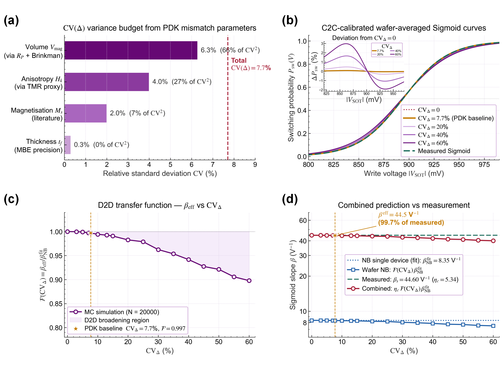

**图2.16** 工艺波动对sMTJ概率响应的综合影响，基于PDK失配的方差预算与Monte Carlo验证，以Device A、P→AP、$$t_w = 0.75\,\mathrm{ns}$$实测为基准。(a)$$\mathrm{CV}(\Delta) = 7.7\%$$方差预算分解，$$V_{\mathrm{mag}}$$中由横向面积失配引入的份额贡献约66%方差、$$H_k$$约27%、$$M_s$$约7%，自由层厚度$$t_f$$单独贡献约0.2%；红色虚线标示按平方和合成法则得到的总$$\mathrm{CV}(\Delta) = 7.7\%$$位置[^note-variance-sum]。(b)不同$$\mathrm{CV}_\Delta$$下的C2C校准晶圆平均Sigmoid曲线族，CV=0按构造等于实测 (青色虚线)，PDK基线$$\mathrm{CV}_\Delta = 7.7\%$$ (琥珀色) 与实测几乎完全重合，CV扩展至60%以体现极端工艺条件下的微弱展宽；插图给出各曲线相对CV=0的偏差$$\Delta P_{\mathrm{sw}}$$ (单位%)，呈现典型的双叶结构 (过渡区前后符号相反，对应Sigmoid斜率减缓)，PDK基线偏差<0.3%、CV=60%偏差达约$$\pm 3\%$$，与解析灵敏度$$\partial P_{\mathrm{sw}}/\partial \Delta \approx -5.6 \times 10^{-3}$$的预测一致。(c)D2D传递函数$$\mathcal{F}(\mathrm{CV}_\Delta) = \beta_{\mathrm{eff}}/\beta_{\mathrm{NB}}^{\mathrm{fit}}$$的Monte Carlo数值，PDK基线处$$\mathcal{F} = 0.997$$ (琥珀色星号)，$$\mathrm{CV}_\Delta = 60\%$$时降至约0.90，单调下降反映Jensen不等式的渐进生效。(d)四组参考的联合对比 (对数y轴)，蓝色虚线为NB单器件拟合斜率 (约8.35 V$$^{-1}$$) 、蓝色方块为晶圆NB预测$$\mathcal{F}\cdot\beta_{\mathrm{NB}}^{\mathrm{fit}}$$、青色虚线为实测$$\beta_s = 44.6\,\mathrm{V^{-1}}$$、红色圆线为联合预测$$\eta_c\mathcal{F}\beta_{\mathrm{NB}}^{\mathrm{fit}}$$；PDK基线处联合预测44.5 V$$^{-1}$$为实测99.7%，验证双层分解框架的定量自洽性。曲线在面板内挤压程度小这一点本身即是物理结果：$$t_w = 0.75\,\mathrm{ns}$$工作点($$V_{\mathrm{th}}/V_{c0} \approx 0.984$$)已接近NB确定性极限，对$$\Delta$$扰动的灵敏度本身较低，因此即便$$\mathrm{CV}_\Delta$$高至60%，阵列平均斜率退化也仅10%量级。
[^note-variance-sum]: 该合成值小于诸单源CV代数和12.3%，原因在于独立随机变量按方差而非标准差线性叠加：$$\sqrt{\mathrm{Var}(X+Y)} = \sqrt{\mathrm{Var}(X)+\mathrm{Var}(Y)}\leq\sqrt{\mathrm{Var}(X)}+\sqrt{\mathrm{Var}(Y)}$$。

为检验上述$$\Delta$$单参数投影是否遗漏端电压驱动下的器件级展宽，本工作进一步将同一PDK失配预算注入宏自旋求解器：由$$R_P$$残余失配采样$$D$$与$$D_{\mathrm{elec}}$$，由$$t_f$$、$$M_s$$与TMR代理采样自由层厚度、饱和磁化和各向异性参数，并将$$R_{\mathrm{SOT}}$$失配映射到$$R_W$$。该设置在固定$$|V_{\mathrm{SOT}}|$$下尤其关键，因为$$R_W$$变化会同步改变每个样本实际获得的$$|I_{\mathrm{SOT}}|$$与SOT自热功率。图2.17显示标称器件在实测阈值附近仍保留清晰的Sigmoid上升段，而工艺失配平均曲线因D2D阈值横向散布而变浅。由此可见，图2.16给出的“PDK基线下$$\Delta$$扰动展宽较弱”结论成立于NB单参数传递函数；若观察固定端电压下的宏自旋响应，则磁性参数漂移与$$R_{\mathrm{SOT}}$$电压-电流换算漂移仍会对晶圆平均$$P_{\mathrm{sw}}$$曲线产生可见展宽。

---

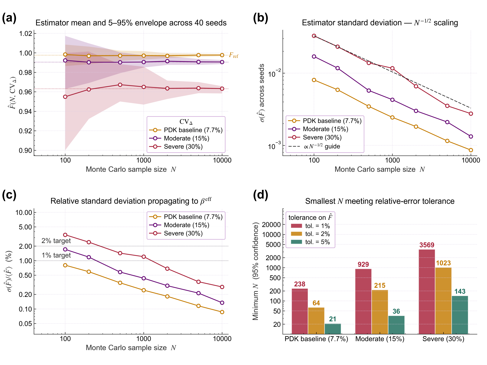

**图2.17** 工艺失配下的端电压写入概率Monte Carlo曲线，$$t_p = 0.75\,\mathrm{ns}$$、$$V_{\mathrm{MTJ}} = 0$$。主图将图2.11的$$|I_{\mathrm{SOT}}| = 300\text{-}3500\,\mu\mathrm{A}$$宽谱扫描按标称$$R_W$$映射为固定$$|V_{\mathrm{SOT}}|$$轴，插图放大$$800\text{-}1400\,\mu\mathrm{A}$$阈值窗口对应的电压区间。蓝色圆线为标称宏自旋曲线，红色方线为PDK失配样本的晶圆平均，阴影为Wilson 95%区间，绿色虚线为同批次实测$$V_{\mathrm{th}} = 894\,\mathrm{mV}$$参考线；工艺样本采用6个D2D失配器件、每点8次热噪声试验。插图中标称曲线在阈值附近仍呈Sigmoid上升，失配平均曲线变浅则反映不同器件阈值横向散布以及$$R_{\mathrm{SOT}}$$引起的端电压到驱动电流换算漂移，而非单器件Sigmoid特征消失。

### 2.3.6采样数对概率估计精度的影响

联合写入概率模型涉及两种采样，必须分开讨论。建模端采样用$$N$$个虚拟器件估计D2D传递函数$$\mathcal{F}(\mathrm{CV}_\Delta)$$，目标是减少仿真时间；硬件端采样用$$K$$次真实写入-读取估计$$p = P_{\mathrm{sw}}(V,t_w)$$，目标是权衡每个概率输出的能耗、延迟和精度。

**建模端：$$\hat{\mathcal{F}}(N, \mathrm{CV}_\Delta)$$估计量对MC采样数$$N$$的敏感度。** 2.3.5节以$$N = 20000$$次Gaussian采样作为建模基线，确保$$\mathcal{F}(\mathrm{CV}_\Delta)$$的一次性标定精度。但若将该双层框架嵌入电路级行为仿真、PBNN训练前端的器件mismatch注入、或硬件在环工艺校准回路，$$\mathcal{F}(\cdot)$$可能需反复求值成百上千次，此时$$N$$直接决定总体仿真时间。以此视角，$$N$$越小越好，但需量化有限$$N$$引入的估计方差是否可接受，并给出与PDK工艺工况匹配的最小采样数建议。

固定操作点为主基准Device A, P→AP, $$t_w = 0.75\,\mathrm{ns}$$；选取PDK基线、中等恶化和严重恶化三档$$\mathrm{CV}_\Delta$$作为工艺代表，并在对数网格上重复估计

$$
\hat{\mathcal{F}}(N,\mathrm{CV}_\Delta) = \frac{\hat\beta_{\mathrm{eff}}(N, \mathrm{CV}_\Delta)}{\beta_{\mathrm{NB}}^{\mathrm{fit}}},\qquad \hat\beta_{\mathrm{eff}} = \mathrm{Sigmoid\,fit\,of}\ \frac{1}{N}\sum_{i=1}^N P_{\mathrm{sw}}(V\mid\Delta_i),\ \Delta_i\sim\mathcal{N}(\mu_\Delta, \sigma_\Delta^2)
$$

以$$N_{\mathrm{ref}} = 50000$$的单次估计作为参考真值$$\mathcal{F}_{\mathrm{ref}}$$，记录$$\hat{\mathcal{F}}$$在不同$$N$$下的均值(偏差指标)与种子间标准差(方差指标)。晶圆平均曲线$$\bar P_{\mathrm{sw}}(V) = N^{-1}\sum_i P_{\mathrm{sw}}(V\mid\Delta_i)$$在每个电压点$$V$$上是$$N$$个独立随机变量的算术平均，由中心极限定理其标准误按$$N^{-1/2}$$衰减；Sigmoid拟合将该逐点噪声映射到斜率参数$$\hat\beta_{\mathrm{eff}}$$，继承相同的$$N^{-1/2}$$标度。采样数敏感性仿真结果汇总于表2.12、图示于图2.18。

**表2.12** 不同$$(\mathrm{CV}_\Delta, N)$$组合下的估计量性能($$R = 40$$次独立种子，$$\mathcal{F}_{\mathrm{ref}}$$由$$N_{\mathrm{ref}} = 50000$$给出)

| $$\mathrm{CV}_\Delta$$ | $$N$$ | $$\mathcal{F}_{\mathrm{ref}}$$ | $$\langle\hat{\mathcal{F}}\rangle$$ | 偏差 | $$\sigma(\hat{\mathcal{F}})$$ | $$\sigma/\langle\hat{\mathcal{F}}\rangle$$ | $$P[\text{rel.err.}<2\%]$$ |
|:---:|:---:|:---:|:---:|:---:|:---:|:---:|:---:|
| 7.7% (PDK基线) | 100 | 0.9973 | 0.9983 | +0.10% | 0.0080 | 0.81% | 100.0% |
| 7.7% | 1000 | 0.9973 | 0.9971 | −0.02% | 0.0024 | 0.24% | 100.0% |
| 7.7% | 10000 | 0.9973 | 0.9977 | +0.04% | 0.0009 | 0.09% | 100.0% |
| 15% (中等) | 100 | 0.9901 | 0.9923 | +0.22% | 0.0170 | 1.71% | 80.0% |
| 15% | 200 | 0.9901 | 0.9904 | +0.03% | 0.0117 | 1.18% | 87.5% |
| 15% | 10000 | 0.9901 | 0.9906 | +0.05% | 0.0013 | 0.13% | 100.0% |
| 30% (严重) | 100 | 0.9629 | 0.9549 | −0.82% | 0.0328 | 3.43% | 30.0% |
| 30% | 2000 | 0.9629 | 0.9635 | +0.06% | 0.0066 | 0.69% | 100.0% |
| 30% | 10000 | 0.9629 | 0.9633 | +0.04% | 0.0028 | 0.28% | 100.0% |

图2.18和表2.12说明，$$\hat{\mathcal{F}}$$近似无偏，方差按$$N^{-1/2}$$下降，并随$$\mathrm{CV}_\Delta$$增大而放大。因此推荐采样数不需要固定为保守的大常数，而可随工艺离散水平自适应调整。PDK基线下的MC预算可大幅压缩；当工艺监控显示$$\mathrm{CV}_\Delta$$恶化时，再按图2.18(d)提高$$N$$即可[^note-mc-budget]。
[^note-mc-budget]: 此处推荐的$$N$$值以"在统计意义下恢复理想$$P_{\mathrm{sw}}(V)$$曲线全形态"作为评判基准，即要求$$\hat{\mathcal{F}}$$在95%置信度内逼近$$N\rightarrow\infty$$的连续概率响应。在第三章伊辛节点退火与第四章PBNN训练等下游应用中，算法仅依赖工作区内$$P_{\mathrm{sw}}$$的局部线性灵敏度而非全形态精度，所需采样次数可进一步压缩至更小量级，相关定量结果将在对应章节给出。

---


**图2.18** D2D传递函数$$\hat{\mathcal{F}}(N,\mathrm{CV}_\Delta)$$估计量对Monte Carlo采样数$$N$$的敏感度($$R = 40$$独立种子，Device A, P→AP, $$t_w = 0.75\,\mathrm{ns}$$；$$\mathcal{F}_{\mathrm{ref}}$$由$$N_{\mathrm{ref}} = 50000$$给出)。(a)$$\hat{\mathcal{F}}$$的种子平均值与5至95%分位带随$$N$$的变化，三条水平点线为对应$$\mathcal{F}_{\mathrm{ref}}$$，PDK基线(琥珀)分位带最窄、严重工况(红)最宽但均围绕各自参考值收敛。(b)种子间标准差$$\sigma(\hat{\mathcal{F}})$$对数-对数图，三条实线与$$\propto N^{-1/2}$$参考虚线(黑)斜率相同，验证中心极限定理标度。(c)相对标准差$$\sigma(\hat{\mathcal{F}})/\langle\hat{\mathcal{F}}\rangle$$(百分比)映射到$$\beta^{\mathrm{eff}}$$预测的相对误差，两条横向点线标示1%与2%精度目标；PDK基线在$$N\geq 100$$即可持续低于1%水平。(d)不同精度容差(1%, 2%, 5%)下满足95%置信度的最小$$N$$柱状图，数值由$$N^{-1/2}$$标度拟合与持久单调二分搜索精确迭代得到，整数精度；PDK基线下2%精度仅需$$N = 57$$，5%精度全部三档工况均可压缩至$$N\leq 143$$。

**硬件端：sMTJ作为Bernoulli随机源的运行时采样数。** 硬件端每次采样对应器件的一次物理写入-读取循环，受限于能耗0.78 pJ/次、延迟0.75 ns/次与器件耐久性。在概率表征阶段$$K$$决定$$P_{\mathrm{sw}}$$曲线拟合的置信度(2.3.2节采用$$K = 100$$)，在随机比特流算术中$$K$$决定数值精度与比特流长度，在PBNN推断中$$K$$决定单次前向传播中每个节点的采样次数，$$K$$的压缩直接映射到每概率输出的能耗与吞吐率。与建模端不同，硬件采样问题存在可解析的精确解：$$\hat p_K = K^{-1}\sum_{i=1}^K X_i$$中的$$X_i\sim\mathrm{Ber}(p)$$独立同分布，$$K\hat p_K\sim\mathrm{Bin}(K, p)$$，覆盖率可由Binomial CDF直接求出。下面并列对比三条分析路径(精确Binomial、Monte Carlo、CLT近似)以明确各自的有效性边界。

对任意容差$$\varepsilon > 0$$与置信度$$1-\alpha$$，Binomial精确覆盖率为

$$
\mathrm{cov}(K, p, \varepsilon) \equiv P\!\left(|\hat p_K - p| < \varepsilon\right) = F_{\mathrm{Bin}(K,p)}(k_{\mathrm{hi}}) - F_{\mathrm{Bin}(K,p)}(k_{\mathrm{lo}} - 1)
$$

其中$$k_{\mathrm{lo}} = \lfloor K(p-\varepsilon)\rfloor + 1$$、$$k_{\mathrm{hi}} = \lceil K(p+\varepsilon)\rceil - 1$$为严格不等式$$|\hat p_K - p| < \varepsilon$$对应的整数界，此路径无任何抽样噪声。Monte Carlo路径则对$$(K, p, \varepsilon)$$执行$$M$$次独立Bernoulli(K, p)采样得$$\hat{\mathrm{cov}}_{\mathrm{MC}}$$，本身为Binomial(M, cov)/M型估计量、RMSE按$$M^{-1/2}$$缩放。CLT近似路径给出$$\mathrm{cov} \approx 2\Phi(\varepsilon\sqrt{K/(p(1-p))}) - 1$$以及样本复杂度$$K_{\mathrm{CLT}} = z_{\alpha/2}^2 p(1-p)/\varepsilon^2$$，$$z_{\alpha/2} = 1.960$$对应95%置信度、最坏情况$$p = 0.5$$时$$K_{\mathrm{CLT}}\leq z^2/(4\varepsilon^2)$$。图2.19(a)通过$$K\in\{5, 20, 100, 500\}$$的Binomial PMF直观展示Sigmoid中段的离散性：$$K = 5$$时可达频率集合$$\{0, 0.2, 0.4, 0.6, 0.8, 1.0\}$$中无任何值落入$$\varepsilon = 0.05$$窗口$$(0.45, 0.55)$$、覆盖率为$$0\%$$，这是CLT连续近似完全失效的极端离散区。

CLT公式仅为渐近近似，在$$K$$较小的区间内Binomial覆盖率呈显著的离散阶梯结构：每当$$K$$跨过某个整数阈值使新的可达频率$$k/K$$进入或离开误差带$$(p-\varepsilon, p+\varepsilon)$$时覆盖率发生阶跃，阶梯局部可能出现短暂倒退(即$$K$$增大反而覆盖率下降1至2个百分点；图2.19(c)在$$\varepsilon = 0.02$$、$$K\in[200]$$范围锯齿振幅最大达$$\pm 10\%$$)。简单的网格搜索或单点阈值判定容易在此类局部涨落处给出偏小的$$K$$估计而在实际部署中无法持续满足精度要求。为获得对后续运行持续可靠的采样数下限，定义持久单调阈值

$$
K_{\mathrm{req}}(p, \varepsilon, \alpha) = \min\!\left\{K^*\in\mathbb{N}: \mathrm{cov}(K', p, \varepsilon)\geq 1-\alpha\quad\forall K'\geq K^*\right\}
$$

即从$$K^*$$起覆盖率始终不再跌破目标置信度$$1-\alpha$$的最小整数。该定义下$$K_{\mathrm{req}}$$是真正的安全下限；求解算法为两步迭代：首先以CLT估计值的四倍为初始上界$$K_{\mathrm{hi}}$$并倍增扩展直至稳定合格，其次对$$[1, K_{\mathrm{hi}}]$$逐点计算覆盖率、自右向左取后缀最小值$$\mathrm{cov}_{\min}(K) \equiv \min_{K\leq K'\leq K_{\mathrm{hi}}}\mathrm{cov}(K')$$，$$\{K: \mathrm{cov}_{\min}(K)\geq 1-\alpha\}$$的最小元即$$K_{\mathrm{req}}$$。基于SciPy `binom.cdf`的精确数值评估下典型工作点总运行时间毫秒级。同一算法可平行作用于$$\hat{\mathrm{cov}}_{\mathrm{MC}}$$得到MC版本$$\hat K_{\mathrm{req}}^{\mathrm{MC}}$$，后者由于MC估计量的随机涨落既可能高估也可能低估真实$$K_{\mathrm{req}}$$。

将上述框架应用于主基准Sigmoid($$V_{\mathrm{th}} = 894\,\mathrm{mV}$$，$$\beta_s = 44.6\,\mathrm{V}^{-1}$$)，选取代表性工作点$$p\in\{0.1, 0.5, 0.9\}$$；由$$V(p) = V_{\mathrm{th}} + \beta_s^{-1}\ln[p/(1-p)]$$得对应偏置电压分别为844.7 mV、894.0 mV、943.3 mV，覆盖Sigmoid的低、中、高概率区。精确、MC、CLT三种估计器的并列求解结果见表2.13。

**表2.13** 不同工作点$$p$$与精度$$\varepsilon$$组合下三种估计器的$$K_{\mathrm{req}}$$对比(95%置信度，MC以$$M = 2\times 10^4$$计算)

| 工作点$$p$$ | 精度$$\varepsilon$$ | $$K_{\mathrm{req}}^{\mathrm{exact}}$$ | $$K_{\mathrm{req}}^{\mathrm{MC}}$$ | $$K_{\mathrm{CLT}}$$ | MC偏差 | CLT偏差 |
|:---:|:---:|:---:|:---:|:---:|:---:|:---:|
| 0.1 | 0.02 | **892** | 916 | 864.3 | +2.7% | −3.1% |
| 0.1 | 0.05 | **147** | 147 | 138.3 | 0.0% | −5.9% |
| 0.1 | 0.10 | **41** | 41 | 34.6 | 0.0% | −15.6% |
| 0.5 | 0.02 | **2451** | 2472 | 2400.9 | +0.9% | −2.0% |
| 0.5 | 0.05 | **399** | 410 | 384.1 | +2.8% | −3.7% |
| **0.5** | **0.10** | **106** | 101 | 96.0 | **−4.7%** | −9.4% |
| 0.9 | 0.02 | **901** | 901 | 864.3 | 0.0% | −4.1% |
| 0.9 | 0.05 | **147** | 147 | 138.3 | 0.0% | −5.9% |
| 0.9 | 0.10 | **41** | 41 | 34.6 | 0.0% | −15.6% |

表2.13和图2.19给出运行时$$K$$的设计规则。精确Binomial解保留离散覆盖率阶梯，因此比CLT近似更适合亚百采样区；MC路径可用于验证趋势，但自身噪声可能低估安全阈值，不宜直接作为部署下限。物理上，Sigmoid中段最耗采样，因为$$p(1-p)$$在$$p=0.5$$处最大；饱和区可显著减少重复次数。于是，2.3.2节采用的$$K = 100$$足以支撑曲线表征，而在PBNN推断中还可按节点工作点进行异构采样调度：判决边界附近给更多样本，两端饱和区压缩样本数，把同一精度目标转化为更低能耗。

---

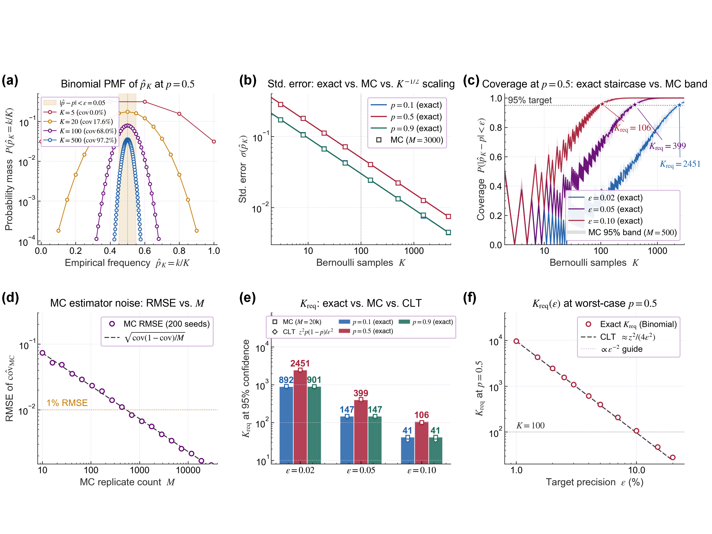

**图2.19** sMTJ硬件Bernoulli采样可靠性分析(Binomial精确解与MC、CLT对照，Device A, P→AP, $$t_w = 0.75\,\mathrm{ns}$$主基准工作点)。六个子面板按两行三列排列。(a)$$p = 0.5$$工作点下$$\hat p_K$$的Binomial概率质量函数在$$K\in\{5, 20, 100, 500\}$$时的离散分布，琥珀阴影带标示$$\varepsilon = 0.05$$误差带，$$K = 5$$时覆盖率为0%、$$K = 500$$达97.2%接近Gaussian极限。(b)$$\sigma(\hat p_K) = \sqrt{p(1-p)/K}$$对数-对数图，三条实线为Binomial精确值、正方形为$$M = 3000$$次MC实测，$$p = 0.1$$与$$p = 0.9$$曲线因对称性完全重合，MC markers与精确线吻合于$$K\geq 3$$全区间。(c)$$p = 0.5$$下精确覆盖率的离散阶梯曲线(三条$$\varepsilon$$水平)与$$M = 500$$的MC 95%置信带叠加，清晰展示局部非单调的阶梯倒退，五角星标示持久单调算法求解的精确$$K_{\mathrm{req}}$$。(d)MC覆盖率估计器在$$(K, p, \varepsilon) = (100, 0.5, 0.10)$$(真值$$\mathrm{cov}_{\mathrm{exact}} = 0.9431$$)的RMSE随replicate数$$M$$的衰减，200次独立seed测得的RMSE与理论$$\sqrt{\mathrm{cov}(1-\mathrm{cov})/M}$$完全吻合，1% RMSE目标对应$$M\approx 500$$。(e)三工作点$$\times$$三精度下三种估计器的$$K_{\mathrm{req}}$$对比(实心柱为精确Binomial、空心正方为MC $$M = 2\times 10^4$$、空心菱形为CLT近似)，MC与精确解符合至$$\pm 5\%$$以内而CLT全区间系统性低估、在$$K\leq 100$$区偏差达15%以上。(f)$$p = 0.5$$下精确$$K_{\mathrm{req}}(\varepsilon)$$从$$\varepsilon = 0.01$$至0.20的双对数曲线，紫色点线标示$$\propto\varepsilon^{-2}$$参考标度，水平点线标示2.3.2节的$$K = 100$$位置。

## 2.4 低势垒sMTJ的随机电报噪声与储备池节点模型

前三节建立的写入概率模型面向脉冲写入：给定宽度$$t_w$$的写入脉冲，器件以概率$$P_{\mathrm{sw}}(V,t_w)$$完成一次$$\pm z$$跃迁，可作为无记忆的Bernoulli采样接口。在自由层能垒充分降低的器件设计下 (目标是把零驱动内禀势垒从数十压低至个位数量级，即2.3.4节动态口径$$\Delta$$所处的量级，使零驱动驻留时间进入百纳秒量级)，器件无需外加写入脉冲即可在热涨落驱动下于两态间连续往复跳变，形成随机电报噪声 (random telegraph noise, RTN)。本节将RTN写成连续时间两态Markov过程，并把低势垒sMTJ抽象为具有$$\tanh$$转移函数和电压可调衰落记忆的随机节点。该节点可作为储备池计算 (reservoir computing) 处理时序任务的候选器件基元[^ref-jaeger-haas][^ref-grollier-neuromorphic]；同族方案中，自旋力矩纳米振荡器已完成首个自旋电子储备池演示[^ref-torrejon-rc]，电压调控的超顺磁系综亦被用于低功耗储备池计算[^ref-welbourne-rc]。以下先给出单节点的两态动力学、稳态非线性、关联时间和精确传播子，再用sLLG全动力学验证该抽象并标定其参数，最后给出节点群构成储备池的最小验证。式中偏置$$V$$是调制双阱倾斜的唯象有效量，2.4.2节给出其与纵向场标定的最简关系；到$$V_{\mathrm{MTJ}}$$、$$I_{\mathrm{SOT}}$$端口变量的完整映射留给后续器件-电路联合标定。

### 2.4.1 低势垒RTN节点的两态模型

低势垒下，磁化主要在两个易轴极小附近停留，并以热激活方式越过中间势垒。将易轴投影离散为二值态$$s\in\{-1,+1\}$$ (分别对应$$m_z\approx\mp1$$的双势阱极小)，偏置$$V$$表示双阱倾斜的唯象调控量；小偏置下，一侧势垒抬高、另一侧压低，对应两个方向相反的热激活逃逸速率

$$
r_{\uparrow}(V) = \frac{1}{\tau_0}\exp\!\big[-\Delta(1 - V/V_{c0})\big],\qquad
r_{\downarrow}(V) = \frac{1}{\tau_0}\exp\!\big[-\Delta(1 + V/V_{c0})\big],
$$

其中$$r_{\uparrow}$$驱动$$-1\!\to\!+1$$、$$r_{\downarrow}$$驱动$$+1\!\to\!-1$$，$$\Delta$$、$$V_{c0}$$沿用2.3.3节由实测反推的热稳定因子与零温临界电压，$$\tau_0$$为attempt time。$$r_{\uparrow}$$即2.3.3节的Néel-Brown速率，$$r_{\downarrow}$$为其在$$V\!\to\!-V$$下的镜像，二者共同刻画偏置对两态占据的细致平衡调制。线性反对称势垒只在$$|V|\ll V_{c0}$$下成立；速率指数取$$\max[\Delta(1\mp V/V_{c0}),\,0]$$下截 (与2.3.3节$$P_{\mathrm{sw}}$$同一约定)，使逃逸速率不超过尝试频率$$1/\tau_0$$。$$|V|=V_{c0}$$处一侧势垒消失，越过后双阱图像失效、器件确定性钉扎于单态，故$$|V|<V_{c0}$$为本模型的物理有效域[^note-rtn-clip]。
[^note-rtn-clip]: 2.4节RTN模型的数值实现初版未对速率指数下截，在$$|V|>V_{c0}$$处给出超过尝试频率$$1/\tau_0$$的非物理逃逸速率 ($$\tau_0=1\,\mathrm{ns}$$、$$\Delta=5.15$$时$$V=1.2\,\mathrm{V}$$处$$r_{\uparrow}\approx6.3/\tau_0$$)。经与2.3.3节$$P_{\mathrm{sw}}$$统一采用$$\max[\cdot,0]$$下截后修正：越过$$V_{c0}$$即封顶于$$1/\tau_0$$并按单态确定性钉扎处理。

由两速率可直接得到稳态占据。记$$p_{\uparrow}(t)$$为处于$$+1$$态的概率，二态主方程为$$\dot p_{\uparrow} = r_{\uparrow}p_{\downarrow} - r_{\downarrow}p_{\uparrow}$$ ($$p_{\downarrow}=1-p_{\uparrow}$$)，其稳态解为$$p_{\uparrow}^{\infty}(V) = r_{\uparrow}/(r_{\uparrow}+r_{\downarrow})$$，相应的时域均值为

$$
\langle s\rangle_{\infty}(V) = p_{\uparrow}^{\infty}-p_{\downarrow}^{\infty}
= \frac{r_{\uparrow}-r_{\downarrow}}{r_{\uparrow}+r_{\downarrow}}
= \tanh\!\Big(\frac{\Delta V}{V_{c0}}\Big).
$$

代入速率表达式后，公共因子$$\tau_0^{-1}\exp(-\Delta)$$相消，分子、分母分别约化为$$\exp(\Delta V/V_{c0})\mp\exp(-\Delta V/V_{c0})$$，即得双曲正切。该$$\tanh$$型转移函数把输入电压平滑映射到时域均值$$[-1,1]$$ (图2.20(a))，零偏置斜率为$$\mathrm{d}\langle s\rangle/\mathrm{d}V|_{0}=\Delta/V_{c0}$$，构成储备池节点的输入—状态非线性来源，与概率比特 (p-bit) 的可调随机响应同构[^ref-camsari-pbits]。

同一主方程还给出记忆时间。二态Markov过程的状态自关联函数随时间指数衰减，其关联 (弛豫) 时间为两速率之和的倒数

$$
\tau(V) = \frac{1}{r_{\uparrow}+r_{\downarrow}},
$$

在零偏置处取极大$$\tau_{\max}=\tau_0\exp(\Delta)/2$$ (恰为2.3.4节保持时间$$\tau_{\mathrm{ret}}=\tau_0\exp(\Delta)$$的一半)，并随$$|V|$$增大而单调缩短、趋于$$\tau_0$$ (图2.20(b))。器件当前状态对$$\tau$$时间之前输入的依赖按$$\exp(-t/\tau)$$衰减，构成储备池所需的衰落记忆 (fading memory)。

偏置同时调制非线性强度与记忆深度，二者构成此消彼长的权衡[^ref-dambre-ipc]：小$$|V|$$下$$\tau$$长、记忆强，$$\langle s\rangle$$近线性、非线性弱；大$$|V|$$下$$\tanh$$饱和、非线性强，$$\tau\to\tau_0$$、记忆弱。该权衡直接锚定于器件物理量$$(\Delta,V_{c0},\tau_0)$$：在默认$$\Delta=5.15$$下$$\tanh$$于$$|V|\approx0.3\,\mathrm{V}$$即趋饱和，可用的非线性—记忆窗口较窄，储备池工作点宜取更低$$\Delta$$ (如$$\Delta\approx3.8$$对应$$\tau_{\max}\approx22\,\mathrm{ns}$$)。把单节点用于时序任务，还需为各节点施加相异的输入投影并训练线性读出，使节点群张成高维状态空间；单个物理节点亦可经掩码输入与延迟反馈时间复用为虚拟节点群[^ref-appeltant-delay]，两种构造的最小验证见2.4.3节。数值模拟中，给定步长$$\mathrm{d}t$$，节点状态可由两态过程的传播子逐步推进：

$$
P\big(s_{t+\mathrm{d}t}=+1\,\big|\,s_t\big)
= p_{\uparrow}^{\infty} + \big(\mathbb{1}[s_t=+1]-p_{\uparrow}^{\infty}\big)\,\exp(-\mathrm{d}t/\tau),
$$

即下一步处于$$+1$$态的概率由稳态值$$p_{\uparrow}^{\infty}$$与当前态按$$\exp(-\mathrm{d}t/\tau)$$的指数弛豫线性插值得到。该传播子在步内$$V$$恒定 (分段常数输入) 时对任意$$\mathrm{d}t$$严格成立 ($$\mathrm{d}t$$无需小于$$\tau$$)，对步内时变输入则退化为绝热近似，需$$\mathrm{d}t$$相对输入变化时标足够小；其分段常数形式使大规模节点群的Monte Carlo演化可在常规平台上高效并行，图2.20(c)的电报轨迹样本即由该传播子生成。这样，低势垒sMTJ可在器件层被描述为一个由偏置驱动、具可调非线性与衰落记忆的连续时间随机节点。

---

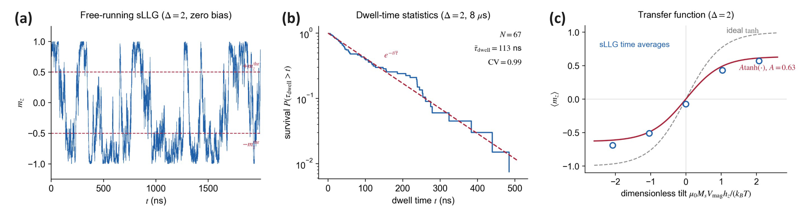

**图2.20** 低势垒sMTJ RTN节点的物理特性 (Device A参数系，$$V_{c0}=0.884\,\mathrm{V}$$、$$\tau_0=1\,\mathrm{ns}$$)。(a) 稳态平均$$\langle s\rangle_{\infty}=\tanh(\Delta V/V_{c0})$$随偏置的变化，$$\Delta\in\{2,\,3.8,\,5.15\}$$三条曲线，灰色区标示$$|V|>V_{c0}$$的模型失效域 (势垒消失、确定性钉扎)；(b) 关联时间$$\tau(V)$$半对数曲线，零偏置处取极大$$\tau_{\max}=\tau_0\exp(\Delta)/2$$，随$$|V|$$增大单调缩短并趋于$$\tau_0$$ (点线)，与(a)构成记忆—非线性权衡的两翼；(c) $$\Delta=3.8$$下三个偏置点的电报轨迹样本 (600 ns窗口，$$\mathrm{d}t=1\,\mathrm{ns}$$传播子采样)：$$V=0$$时两态近对称往复，$$V=0.10\,\mathrm{V}$$时正态占优，$$V=0.25\,\mathrm{V}$$时正态占据约九成、仅偶发回跳。

### 2.4.2 sLLG自由演化验证与参数标定

上述两态模型是对连续磁化动力学的约化抽象。为检验其统计特征，并标定不能由Néel-Brown先验直接沿用的参数，这里采用2.2节的sLLG宏自旋引擎模拟低势垒自由演化。目标势垒不直接任意指定，而是由有效各向异性能反解界面各向异性，使形状退磁项被一并计入；相关标定细节见[^note-rtn-bridge-pitfall]。器件在零SOT电流下仅由热涨落驱动，双阱倾斜以纵向场注入，其无量纲标定与2.4.1节$$\tanh$$宗量同构。驻留时间以滞回阈值提取，避免把赤道附近抖动误记为翻转。
[^note-rtn-bridge-pitfall]: 该反解关系本身来自一次实现教训。桥接验证初版按"纯PMA"图像直接把$$K_i$$压低两个数量级以求低$$\Delta$$，忽略形状项后$$K_U^{\mathrm{eff}}$$变负、易轴翻至面内，$$m_z(t)$$表现为赤道扩散而非双态电报；且若以$$\mathrm{sign}(m_z)$$的原始翻转计数驻留，赤道抖动会被误计为越垒、给出非物理的亚纳秒$$\tau_0$$。改为含去磁项反解$$K_i$$并采用滞回阈值后方得到2.4.2节的统计。

低势垒自由演化呈指数驻留，支持两态Markov抽象；但有效attempt time不能直接沿用2.3.3节的文献先验 (图2.21(b)、表2.14)。由于两态模型中的保持时间、最大记忆窗和储备池时间常数都与$$\tau_0$$成比例，接入具体器件时必须用自由演化仿真或RTN谱测量重新标定这一时间尺度。

**表2.14** 低势垒自由演化sLLG的驻留统计与attempt time反推 (滞回阈值$$|m_z|>0.5$$，$$t_{\mathrm{step}}=4\,\mathrm{ps}$$，$$\tau_0=\bar\tau_{\mathrm{dwell}}/\exp(\Delta)$$)

| $$\Delta$$ | 演化时长 | 翻转数 | $$\bar\tau_{\mathrm{dwell}}$$ (ns) | 驻留CV | $$\tau_0$$ (ns) |
|:---:|:---:|:---:|:---:|:---:|:---:|
| 1.5 | 4.8 μs | 40 | 121.8 | 0.89 | 27.2 |
| 2.0 | 4.8 μs | 31 | 146.4 | 1.05 | 19.8 |
| 2.0 | 8 μs | 68 | 112.8 | 0.99 | 15.3 |
| 2.5 | 4.8 μs | 26 | 174.8 | 0.85 | 14.4 |

图2.21(c)说明，转移函数在形状上复现$$\tanh$$，但读出摆幅受到热涨落压缩。本文因此把两态抽象写成带幅度因子$$A$$的形式：$$\tau_0$$决定时间轴，$$A$$决定可读出的模拟摆幅。指数驻留与$$\tanh$$形状两项签名均在全动力学中成立，说明该抽象足以作为器件级RTN模型；其数值参数仍应随目标器件重新标定。

---


**图2.21** sLLG自由演化对两态RTN统计的验证 ($$\Delta=2$$，$$t_{\mathrm{step}}=4\,\mathrm{ps}$$，固定种子可复现)。(a) 零偏置自由演化的$$m_z(t)$$轨迹 (2 μs片段)：双态电报跳变叠加阱内热抖动，红色虚线为驻留提取的滞回阈值$$\pm0.5$$；(b) 8 μs主运行67段驻留时间的幸存函数 (阶梯线) 与指数律$$e^{-t/\bar\tau}$$ (虚线) 对照，$$\bar\tau_{\mathrm{dwell}}=113\,\mathrm{ns}$$、变异系数0.99；(c) 时间平均$$\langle m_z\rangle$$随无量纲倾斜量的变化 (圆点，每点$$4.8\,\mu\mathrm{s}\times2$$种子)：形状与$$\tanh$$一致但幅度压缩，最小二乘拟合$$A=0.63$$ (实线)，理想$$\tanh$$ (灰虚线) 为对照。

### 2.4.3 节点群储备池的最小验证

单个RTN节点只提供一条$$\tanh$$转移与一个可调时标，承担时序任务还须由节点群张成高维状态空间。最小构造为：标量输入经随机权重投影到各节点 ($$V_j = a_{\mathrm{in}} w_j u + b_j$$，$$w_j\in\{\pm1\}$$、偏移$$b_j$$均匀散布)，节点取异质势垒$$\Delta_j\sim U(0.5,4)$$以铺开衰落记忆时标，节点状态按2.4.1节传播子的期望态 (平均场) 演化，读出为洗出期后对状态设计矩阵训练的岭回归。输入投影是该构造的必要环节：若全部节点接收同一偏置，各节点便是同一随机变量的独立实现，节点群均值退化为单条低通$$\tanh$$信号，线性记忆容量实测仅0.58且与节点数无关 (图2.22(a)灰线)。

异质输入投影把低势垒节点群变成一组可叠加的衰落滤波器，显著优于广播同质基线；独立节点的线性记忆终受基函数秩限制，单纯增加节点数不能无限提高容量；环形延迟线把容量转向线性记忆却牺牲非线性处理能力，Mackey-Glass混沌预测上的构型排序随之反转 (延迟反馈最优、环形延迟线最差；图2.22(a)(b)、表2.15)。由此，储备池设计的核心不在于堆节点数，而在于按任务在记忆深度和非线性之间分配结构。

**表2.15** 三种最小储备池构型的基准容量 ($$n=100$$节点/虚拟节点，平均场态，固定种子)

| 构型 | MC | IPC (一阶+二阶) | parity-2/3/4 |
|:---|:---:|:---:|:---:|
| 异质$$W_{\mathrm{in}}$$节点群 (滤波器组) | 7.9 | 6.6 (5.0+1.6) | 1.00 / 1.00 / 0.91 |
| 单节点延迟反馈 (时间复用) | 5.6 | 6.8 (3.7+3.1) | 1.00 / 1.00 / 0.92 |
| 均质环形延迟线 ($$\Delta=1$$，单点注入) | 32.6 | 10.1 (10.1+0.0) | 0.53 / 0.49 / 0.48 |

硬件化的主要代价在于：平均场态的连续$$\tanh$$均值在真实器件中只能由有限二值样本近似，散粒噪声迅速吞掉容量收益 (图2.22(c))。给定器件总预算$$B=n\times R$$时，节点维度$$n$$和每节点平均深度$$R$$不能同时最大化；在当前单步二值读出条件下，降噪优先于扩维。这一结论把2.3节Bernoulli采样的精度—能耗问题延伸到RTN储备池，也指向后续需要更长时间平均或对二值态更稳健的读出。

---

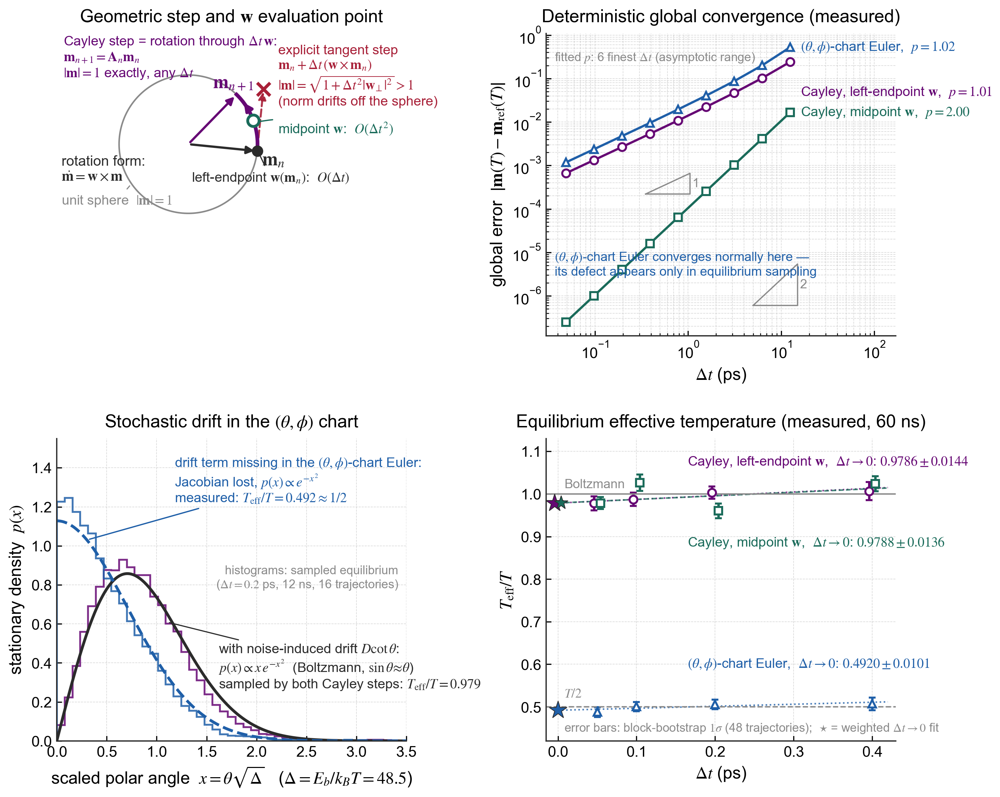

**图2.22** RTN节点群储备池的最小验证 (平均场态，固定种子)。(a) 逐延迟记忆容量$$\mathrm{MC}_k$$：异质$$W_{\mathrm{in}}$$节点群 ($$n=100$$，蓝) 对比广播同质基线 (灰)，后者无论节点数多少都坍缩到$$\mathrm{MC}=0.58$$；(b) 总记忆容量随节点数的变化：异质滤波器组 (蓝圆) 在$$n\approx100$$后饱和于秩上限，均质环形延迟线 ($$\Delta=1$$、单点注入，绿三角) 持续增长至37；(c) 二值器件态下每节点平均$$R$$个器件的记忆容量 (红)，对照平均场极限 (蓝虚线)——器件平均是硬件化的主要开销。

## 2.5 本章小结

本章构建了sMTJ的器件模型，并将其封装为后续仿真可以调用的概率物理接口。这样，后续章节不必重复展开底层磁学，而可直接调用$$(u_{\mathrm{th}},\beta_s)$$、五参数行为模型与$$(\Delta,V_{c0},\tau_0,A)$$等接口参数。

在理论层面，本章将Néel-Brown外推与实测Sigmoid之间的矛盾拆开处理：阈值随脉宽的变化仍可用热激活势垒解释，但实测斜率不能被简单等同为热稳定因子。脉宽法得到的$$\Delta_{\mathrm{pulse}}$$用于承载热力学势垒，循环间收窄因子$$\eta_c$$用于描述C2C分布相对理想模型的展宽；D2D工艺失配则通过PDK-Brinkman链路进入阵列平均曲线。这个双层分解让实验拟合参数、器件物理和阵列统计各守其位，避免把斜率异常误读为能垒异常。

在工艺层面，本章的主结论是纳秒概率写入对$$\Delta$$扰动本身低灵敏。几何、界面和材料涨落仍会进入$$\Delta$$预算，在本文工作点上主要表现为有限的阵列横向展宽。运行时采样则由精确Binomial覆盖率决定：Sigmoid中段需要更多重复写入，饱和区可以压缩样本数；这一规则直接服务于后续PBNN和概率权重调度。

低势垒RTN把同一器件物理扩展到时间计算。两态Markov模型把稳态$$\tanh$$非线性和指数衰落记忆写成可标定参数，sLLG自由演化验证其统计形状，同时提醒$$\tau_0$$与读出摆幅必须按目标器件重标定。节点群验证进一步表明，输入投影、异质时间常数和耦合拓扑共同决定记忆—非线性配比；真实二值读出的散粒噪声是硬件化储备池必须正面处理的成本。

然而本章仍有明确局限：实测样本只覆盖少量同批次单器件，工艺源独立性仍依赖PDK假设，宏自旋模型无法替代完整微磁分析，RTN储备池也还停留在最小网络验证。后续章节将在这些边界内使用本章模型：第三章把Sigmoid sMTJ接入伊辛自旋，第四章把它接入概率二值权重，RTN参数则为第五章的低势垒时序节点保留入口。


## 文献

[^ref-akerman-tmr]: J. J. Akerman, J. M. Slaughter, R. W. Dave, and I. K. Schuller, "Tunneling criteria for magnetic-insulator-magnetic structures," *Applied Physics Letters*, vol. 79, pp. 3104-3106, 2001. DOI: [10.1063/1.1415412](https://doi.org/10.1063/1.1415412).
[^ref-appeltant-delay]: L. Appeltant et al., "Information processing using a single dynamical node as complex system," *Nature Communications*, vol. 2, Art. no. 468, 2011. DOI: [10.1038/ncomms1476](https://doi.org/10.1038/ncomms1476).
[^ref-ascher-petzold]: U. M. Ascher and L. R. Petzold, *Computer Methods for Ordinary Differential Equations and Differential-Algebraic Equations*. SIAM, 1998. DOI: [10.1137/1.9781611971392](https://doi.org/10.1137/1.9781611971392).
[^ref-berger-stt]: L. Berger, "Emission of spin waves by a magnetic multilayer traversed by a current," *Physical Review B*, vol. 54, pp. 9353-9358, 1996. DOI: [10.1103/PhysRevB.54.9353](https://doi.org/10.1103/PhysRevB.54.9353).
[^ref-bloch-law]: F. Bloch, "Zur Theorie des Ferromagnetismus," *Zeitschrift fur Physik*, vol. 61, pp. 206-219, 1930. DOI: [10.1007/BF01339661](https://doi.org/10.1007/BF01339661).
[^ref-brinkman-bdr]: W. F. Brinkman, R. C. Dynes, and J. M. Rowell, "Tunneling conductance of asymmetrical barriers," *Journal of Applied Physics*, vol. 41, pp. 1915-1921, 1970. DOI: [10.1063/1.1659141](https://doi.org/10.1063/1.1659141).
[^ref-brown-thermal]: W. F. Brown Jr., "Thermal fluctuations of a single-domain particle," *Physical Review*, vol. 130, pp. 1677-1686, 1963. DOI: [10.1103/PhysRev.130.1677](https://doi.org/10.1103/PhysRev.130.1677).
[^ref-callen-callen]: H. B. Callen and E. Callen, "The present status of the temperature dependence of magnetocrystalline anisotropy, and the l(l+1)/2 power law," *Journal of Physics and Chemistry of Solids*, vol. 27, pp. 1271-1285, 1966. DOI: [10.1016/0022-3697(66)90012-1](https://doi.org/10.1016/0022-3697(66)90012-1).
[^ref-callen-welton]: H. B. Callen and T. A. Welton, "Irreversibility and generalized noise," *Physical Review*, vol. 83, pp. 34-40, 1951. DOI: [10.1103/PhysRev.83.34](https://doi.org/10.1103/PhysRev.83.34).
[^ref-camsari-pbits]: K. Y. Camsari, R. Faria, B. M. Sutton, and S. Datta, "Stochastic p-bits for invertible logic," *Physical Review X*, vol. 7, 031014, 2017. DOI: [10.1103/PhysRevX.7.031014](https://doi.org/10.1103/PhysRevX.7.031014).
[^ref-dambre-ipc]: J. Dambre, D. Verstraeten, B. Schrauwen, and S. Massar, "Information Processing Capacity of Dynamical Systems," *Scientific Reports*, vol. 2, Art. no. 514, 2012. DOI: [10.1038/srep00514](https://doi.org/10.1038/srep00514).
[^ref-daquino-midpoint]: M. d'Aquino, C. Serpico, and G. Coppola, "Midpoint numerical technique for stochastic Landau-Lifshitz-Gilbert dynamics," *Journal of Applied Physics*, vol. 99, 08B905, 2006. DOI: [10.1063/1.2169472](https://doi.org/10.1063/1.2169472).
[^ref-dieny-pma-review]: B. Dieny and M. Chshiev, "Perpendicular magnetic anisotropy at transition metal/oxide interfaces and applications," *Reviews of Modern Physics*, vol. 89, 025008, 2017. DOI: [10.1103/RevModPhys.89.025008](https://doi.org/10.1103/RevModPhys.89.025008).
[^ref-garcia-palacios-sllg]: J. L. Garcia-Palacios and F. J. Lazaro, "Langevin-dynamics study of the dynamical properties of small magnetic particles," *Physical Review B*, vol. 58, pp. 14937-14958, 1998. DOI: [10.1103/PhysRevB.58.14937](https://doi.org/10.1103/PhysRevB.58.14937).
[^ref-gilbert-damping]: T. L. Gilbert, "A phenomenological theory of damping in ferromagnetic materials," *IEEE Transactions on Magnetics*, vol. 40, pp. 3443-3449, 2004. DOI: [10.1109/TMAG.2004.836740](https://doi.org/10.1109/TMAG.2004.836740).
[^ref-grimaldi-sot-mtj]: E. Grimaldi et al., "Single-shot dynamics of spin-orbit torque and spin transfer torque switching in three-terminal magnetic tunnel junctions," *Nature Nanotechnology*, vol. 15, pp. 111-117, 2020. DOI: [10.1038/s41565-019-0607-7](https://doi.org/10.1038/s41565-019-0607-7).
[^ref-grollier-neuromorphic]: J. Grollier, D. Querlioz, K. Y. Camsari, K. Everschor-Sitte, S. Fukami, and M. D. Stiles, "Neuromorphic spintronics," *Nature Electronics*, vol. 3, pp. 360-370, 2020. DOI: [10.1038/s41928-019-0360-9](https://doi.org/10.1038/s41928-019-0360-9).
[^ref-ikeda-pma]: S. Ikeda et al., "A perpendicular-anisotropy CoFeB-MgO magnetic tunnel junction," *Nature Materials*, vol. 9, pp. 721-724, 2010. DOI: [10.1038/nmat2804](https://doi.org/10.1038/nmat2804).
[^ref-iserles-lie-group]: A. Iserles, H. Z. Munthe-Kaas, S. P. Norsett, and A. Zanna, "Lie-group methods," *Acta Numerica*, vol. 9, pp. 215-365, 2000. DOI: [10.1017/S0962492900002154](https://doi.org/10.1017/S0962492900002154).
[^ref-jaeger-haas]: H. Jaeger and H. Haas, "Harnessing Nonlinearity: Predicting Chaotic Systems and Saving Energy in Wireless Communication," *Science*, vol. 304, pp. 78-80, 2004. DOI: [10.1126/science.1091277](https://doi.org/10.1126/science.1091277).
[^ref-julliere-tmr]: M. Julliere, "Tunneling between ferromagnetic films," *Physics Letters A*, vol. 54, pp. 225-226, 1975. DOI: [10.1016/0375-9601(75)90174-7](https://doi.org/10.1016/0375-9601(75)90174-7).
[^ref-kim-mtj-spice]: J. Kim et al., "A technology-agnostic MTJ SPICE model with user-defined dimensions for STT-MRAM scalability studies," *IEEE Custom Integrated Circuits Conference*, pp. 1-4, 2015. DOI: [10.1109/CICC.2015.7338407](https://doi.org/10.1109/CICC.2015.7338407).
[^ref-kittel-domain]: C. Kittel, "Physical theory of ferromagnetic domains," *Reviews of Modern Physics*, vol. 21, pp. 541-583, 1949. DOI: [10.1103/RevModPhys.21.541](https://doi.org/10.1103/RevModPhys.21.541).
[^ref-kloeden-platen]: P. E. Kloeden and E. Platen, *Numerical Solution of Stochastic Differential Equations*. Springer, 1992. DOI: [10.1007/978-3-662-12616-5](https://doi.org/10.1007/978-3-662-12616-5).

[^ref-krizakova-sot-review]: V. Krizakova, M. Perumkunnil, S. Couet, P. Gambardella, and K. Garello, "Spin-orbit torque switching of magnetic tunnel junctions for memory applications," *Journal of Magnetism and Magnetic Materials*, vol. 562, 169692, 2022. DOI: [10.1016/j.jmmm.2022.169692](https://doi.org/10.1016/j.jmmm.2022.169692).
[^ref-landau-lifshitz]: L. Landau and E. Lifshitz, "On the theory of the dispersion of magnetic permeability in ferromagnetic bodies," in *Perspectives in Theoretical Physics*. Pergamon, pp. 51-65, 1992. DOI: [10.1016/B978-0-08-036364-6.50008-9](https://doi.org/10.1016/B978-0-08-036364-6.50008-9).
[^ref-li-jiang-vcma-sot]: S. Li and Y. Jiang, "Field-free switching model of spin-orbit torque (SOT)-MTJ device with thermal effect based on voltage-controlled magnetic anisotropy (VCMA)," *AIP Advances*, vol. 13, 025030, 2023. DOI: [10.1063/9.0000426](https://doi.org/10.1063/9.0000426).
[^ref-li-zhang-thermal]: Z. Li and S. Zhang, "Thermally assisted magnetization reversal in the presence of a spin-transfer torque," *Physical Review B*, vol. 69, 134416, 2004. DOI: [10.1103/PhysRevB.69.134416](https://doi.org/10.1103/PhysRevB.69.134416).
[^ref-liu-chl]: E. Liu, W. Yang, *et al.* (S. He), "A Novel Channel-less SOT-MRAM with 115% TMR, 2 ns Switching, and High Bit Yield (>99.9%)," *IEEE International Electron Devices Meeting (IEDM)*, 2024. DOI: [10.1109/IEDM50854.2024.10873500](https://doi.org/10.1109/IEDM50854.2024.10873500).
[^ref-liu-sot-prl]: L. Liu, O. J. Lee, T. J. Gudmundsen, D. C. Ralph, and R. A. Buhrman, "Current-induced switching of perpendicularly magnetized magnetic layers using spin torque from the spin Hall effect," *Physical Review Letters*, vol. 109, 096602, 2012. DOI: [10.1103/PhysRevLett.109.096602](https://doi.org/10.1103/PhysRevLett.109.096602).
[^ref-liu-spin-hall]: L. Liu et al., "Spin-torque switching with the giant spin Hall effect of tantalum," *Science*, vol. 336, pp. 555-558, 2012. DOI: [10.1126/science.1218197](https://doi.org/10.1126/science.1218197).
[^ref-manchon-sot]: A. Manchon and S. Zhang, "Theory of nonequilibrium intrinsic spin torque in a single nanomagnet," *Physical Review B*, vol. 78, 212405, 2008. DOI: [10.1103/PhysRevB.78.212405](https://doi.org/10.1103/PhysRevB.78.212405).
[^ref-miron-sot]: I. M. Miron et al., "Perpendicular switching of a single ferromagnetic layer induced by in-plane current injection," *Nature*, vol. 476, pp. 189-193, 2011. DOI: [10.1038/nature10309](https://doi.org/10.1038/nature10309).
[^ref-moodera-tmr]: J. S. Moodera, L. R. Kinder, T. M. Wong, and R. Meservey, "Large magnetoresistance at room temperature in ferromagnetic thin film tunnel junctions," *Physical Review Letters*, vol. 74, pp. 3273-3276, 1995. DOI: [10.1103/PhysRevLett.74.3273](https://doi.org/10.1103/PhysRevLett.74.3273).
[^ref-nozaki-vcma]: T. Nozaki et al., "Understanding voltage-controlled magnetic anisotropy effect at Co/oxide interface," *Scientific Reports*, vol. 13, 10640, 2023. DOI: [10.1038/s41598-023-37422-4](https://doi.org/10.1038/s41598-023-37422-4).
[^ref-nozaki-vcma-feb]: T. Nozaki et al., "Voltage-induced magnetic anisotropy changes in an ultrathin FeB layer sandwiched between two MgO layers," *Applied Physics Express*, vol. 6, 073005, 2013. DOI: [10.7567/APEX.6.073005](https://doi.org/10.7567/APEX.6.073005).
[^ref-slonczewski-stt]: J. C. Slonczewski, "Current-driven excitation of magnetic multilayers," *Journal of Magnetism and Magnetic Materials*, vol. 159, pp. L1-L7, 1996. DOI: [10.1016/0304-8853(96)00062-5](https://doi.org/10.1016/0304-8853(96)00062-5).
[^ref-stoner-wohlfarth]: E. C. Stoner and E. P. Wohlfarth, "A mechanism of magnetic hysteresis in heterogeneous alloys," *Philosophical Transactions of the Royal Society A*, vol. 240, pp. 599-642, 1948. DOI: [10.1098/rsta.1948.0007](https://doi.org/10.1098/rsta.1948.0007).
[^ref-torrejon-rc]: J. Torrejon et al., "Neuromorphic computing with nanoscale spintronic oscillators," *Nature*, vol. 547, pp. 428-431, 2017. DOI: [10.1038/nature23011](https://doi.org/10.1038/nature23011).
[^ref-weinan-wang]: W. E and X.-P. Wang, "Numerical methods for the Landau-Lifshitz equation," *SIAM Journal on Numerical Analysis*, vol. 38, pp. 1647-1665, 2000. DOI: [10.1137/S0036142999352199](https://doi.org/10.1137/S0036142999352199).
[^ref-welbourne-rc]: A. Welbourne et al., "Voltage-controlled superparamagnetic ensembles for low-power reservoir computing," *Applied Physics Letters*, vol. 118, 202402, 2021. DOI: [10.1063/5.0048911](https://doi.org/10.1063/5.0048911).
[^ref-yang-300mm]: W. Yang, E. Liu, *et al.* (S. He), "Achieving High Yield of Perpendicular SOT-MTJ Manufactured on 300 mm Wafers," *IEEE Transactions on Electron Devices*, vol. 71, p. 2095, 2024. DOI: [10.1109/TED.2024.3360664](https://doi.org/10.1109/TED.2024.3360664).
[^ref-zhang-vgsot]: K. Zhang, D. Zhang, C. Wang, L. Zeng, Y. Wang, and W. Zhao, "Compact modeling and analysis of voltage-gated spin-orbit torque magnetic tunnel junction," *IEEE Access*, vol. 8, pp. 50792-50800, 2020. DOI: [10.1109/ACCESS.2020.2980073](https://doi.org/10.1109/ACCESS.2020.2980073).
