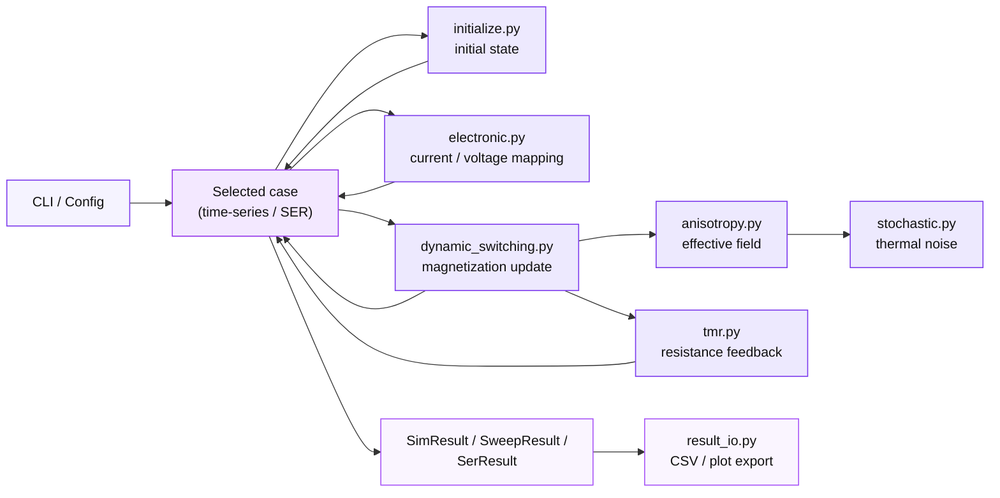

## Information flow



This separates **physics kernels**, **experiment orchestration**, and **output
utilities**, so the package is usable both as a CLI simulator and as a reusable
Python library.

## Project structure

The package is organised in three layers: **physics kernels**, **simulation
cases / configurations**, and **CLI / result export**. The public API is then
re-exported through `__init__.py`. The current code-level structure is:

```text
vgsot_sim/
    __init__.py                  # package public API: re-export configs, cases, kernels, IO helpers
    __main__.py                  # `python -m vgsot_sim` entry, forwards to `cli.main()`

    # ── Low-level physics kernels ───────────────────────────────────────────
    constants.py                 # singleton-style accessor (get_constants / set_constants / reset_constants)
    stochastic.py                # FDT-correct Gaussian thermal-noise sampler (i.i.d. N(0,1) per axis)
    initialize.py                # initial MTJ state, Rayleigh-θ Monte-Carlo seed, BDR R_P
    electronic.py                # terminal-voltage → (I_SOT, V_MTJ) electrical conversion
    anisotropy.py                # effective-field builder: PMA + VCMA + demag + thermal + H_ex
    demag.py                     # thin-disk and oblate-ellipsoid demagnetisation tensors
    dynamic_switching.py         # one-step spherical-Euler LLG update (θ, φ)
    dynamic_switching_vector.py  # one-step Cayley-rotation LLG update (vector form, norm-preserving)
    tmr.py                       # MTJ resistance feedback from V_MTJ and m_z (Lorentzian / PDK model + R_series toggle)
    thermal.py                   # self-heating RC network: q_mtj, q_sot, RC step, closed-form steady state
    material_temperature.py      # M_s(T), K_i(T), η(T), K_U^eff(T) closed-form scalings

    # ── Experiment definitions ──────────────────────────────────────────────
    configs.py                   # dataclass configs (PhysicalConstantsConfig + 8 case configs)
    time_series_cases.py         # piecewise drivers + 6 time-domain case wrappers; the `SimResult` / `SweepResult` dataclasses
    ser_cases.py                 # Monte-Carlo SER case (`SerResult`); also hosts `variability_sweep` / `VariabilitySweepResult`
    temperature_cases.py         # `sweep_material_temperature`, `tmr_voltage_sweep`, `thermal_transient`
    cases.py                     # unified case registry, aggregated `ALL_CASES`

    # ── Analysis sub-package (new in 2026-05) ───────────────────────────────
    analysis/
        __init__.py              # re-exports nb_fit / sigmoid_fit / variability / sampling / materials
        nb_fit.py                # Néel-Brown log-linear fit from hysteresis loops
        sigmoid_fit.py           # 4-parameter Sigmoid fit + Wilson CI + η_c calibration vs NB
        variability.py           # Brinkman-decomposed PDK variability budget + D2D MC
        sampling.py              # Wilson interval, exact binomial coverage, MC sampling-size sensitivity

    # ── RTN node sub-package (new in 2026-06) ───────────────────────────────
    rtn/
        __init__.py              # re-exports the telegraph node API
        telegraph.py             # free-running 2-state RTN node: tanh(ΔV/Vc0) mean, τ(V) fading memory,
                                 #   exact propagator, from_nb_fit factory. A single CANDIDATE reservoir
                                 #   *node* primitive (not a reservoir; see scripts/10_rtn_reservoir/)
        bridge.py                # sLLG↔RTN bridge: drives the macrospin engine free-running at low Δ
                                 #   (ki_for_delta incl. demag), extracts dwell/PSD/⟨m_z⟩, calibrates τ0
                                 #   and bias→V. Validation script: scripts/10_rtn_reservoir/
        reservoir.py             # the reservoir layer: W_in input projection + heterogeneous
                                 #   fading-memory nodes + ridge readout; memory_capacity / NARMA-10
                                 #   benchmarks. Mean-field (fast) + stochastic device modes.

    # ── User interface / output ─────────────────────────────────────────────
    cli.py                       # CLI dispatcher (`vgsot-sim <case>`)
    result_io.py                 # ensure_result_dir, build_stem, CSV export, single/two/three-panel plot helpers
```

### Module responsibilities

- **Low-level physics modules**: `constants.py`, `stochastic.py`,
  `initialize.py`, `electronic.py`, `anisotropy.py`, `demag.py`,
  `dynamic_switching.py`, `dynamic_switching_vector.py`, `tmr.py`,
  `thermal.py`, `material_temperature.py`.
- **Experiment definition layer**: `configs.py`, `time_series_cases.py`,
  `ser_cases.py`, `temperature_cases.py`, `cases.py`.
- **Analysis layer**: `analysis/` sub-package (NB / Sigmoid / variability /
  sampling utilities, used by both `ser_cases.variability_sweep` and the
  chapter scripts 06/07/08).
- **User-interface / output layer**: `cli.py`, `result_io.py`, `__main__.py`,
  `__init__.py`.

### Runtime dependency

- `cli.py` parses the case name, instantiates a config dataclass, runs a case
  through `cases.py`, and writes CSV / PNG outputs through `result_io.py`.
- `cases.py` combines two families of cases:
  - `time_series_cases.py`: deterministic waveform-driven simulations
    returning `SimResult` / `SweepResult`.
  - `ser_cases.py`: Monte-Carlo SER simulations returning `SerResult` /
    `VariabilitySweepResult`.
- `time_series_cases.py` is the main orchestration layer. It:
  - reads constants from the per-config `PhysicalConstantsConfig`,
  - initialises the device state via `initialize.py` (with optional `rng=` for
    reproducibility),
  - optionally converts terminal voltages to `I_SOT` / `V_MTJ` via
    `electronic.py`,
  - optionally advances `T(t)` through `thermal.self_heating_step` and feeds
    `M_s(T)` / `K_i(T)` from `material_temperature.py` back into the field
    builder,
  - dispatches the LLG step to either `dynamic_switching.switching` (default
    spherical-Euler, scalar `(θ, φ)`) or `dynamic_switching_vector.switching_vector`
    (Cayley rotation, Cartesian, `sigma_SH` as runtime 3-vector) depending on
    `integrator=`,
  - updates resistance through `tmr.tmr` (with optional `include_series=True`
    for `R_series`).
- `anisotropy.field()` calls `demag.py` for the demagnetisation tensor and
  `stochastic.stochastic()` for thermal noise; both accept an optional `rng=`
  so the full chain is byte-reproducible end-to-end.
- `ser_cases.ser_sot_no_vcma_thermal` repeatedly invokes
  `run_piecewise_direct_excitation()` to estimate switching error rate. The
  per-trial seed is derived from `_trial_seed(seed, i_sot, trial_idx)` shared
  across `rng_mode="legacy"` (`np.random.seed`) and `rng_mode="generator"`
  (`np.random.default_rng`) — same seed stream, different generator.
- `ser_cases.variability_sweep` wraps
  `vgsot_sim.analysis.variability.transfer_function_F` to regenerate the
  chapter §2.3.5 figures from a single Python call.

### Public API surface

The top-level `vgsot_sim` package re-exports everything most callers need:

```python
from vgsot_sim import (
    # Configs
    PhysicalConstantsConfig,
    TerminalVoltageControlConfig, SotOnlyConstantCurrentConfig,
    SotSwitchingNoVcmaConfig, SerSotNoVcmaThermalConfig,

    # Result types
    SimResult, SweepResult, SerResult,

    # Cases
    terminal_voltage_control, sot_only_constant_current,
    sot_switching_no_vcma, ser_sot_no_vcma_thermal,

    # Low-level kernels
    run_piecewise_terminal_voltage, run_piecewise_direct_excitation,

    # IO helpers
    ensure_result_dir, build_stem, config_to_params,
    save_grouped_timeseries_csv, save_timeseries_csv, save_xy_csv,
    save_single_plot, save_two_panel_plot, save_three_panel_plot,

    # Misc
    ALL_CASES, get_constants, set_constants, reset_constants,
)
```

> **2026-05 pruning.** The VCMA-assisted (`vcma_assisted_switching_{isot,vmtj}_sweep`)
> and two-pulse VGSOT (`optimized_vgsot_switching`, `ser_optimized_vgsot`,
> `run_two_pulse_optimized`) cases and their configs were removed because they
> had no counterpart in the chapter §2.3.3 Device A measurements that the
> package is now calibrated against. The CLI surface is now four cases:
> `terminal_voltage_control`, `sot_only_constant_current`,
> `sot_switching_no_vcma`, `ser_sot_no_vcma_thermal`.

`variability_sweep` and the `analysis` sub-package are intentionally not
top-level re-exports because they target a more specialised audience; import
them directly:

```python
from vgsot_sim.ser_cases import variability_sweep, VariabilitySweepResult
from vgsot_sim.analysis import nb_fit, sigmoid_fit, variability, sampling
```
