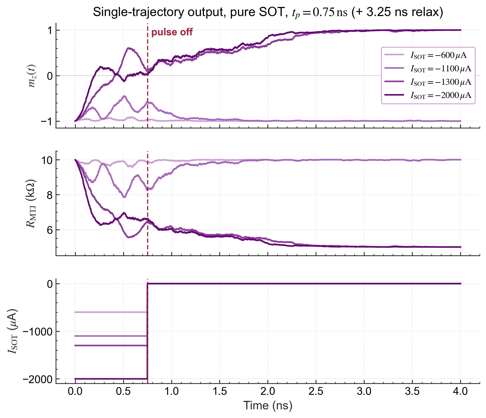
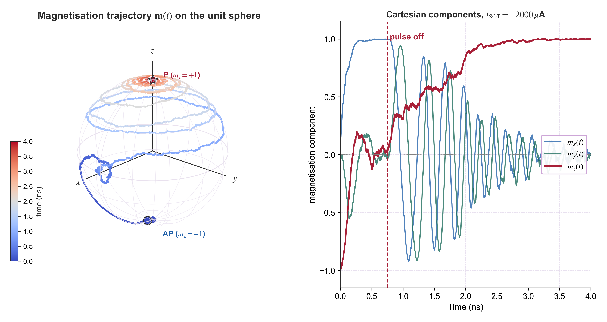
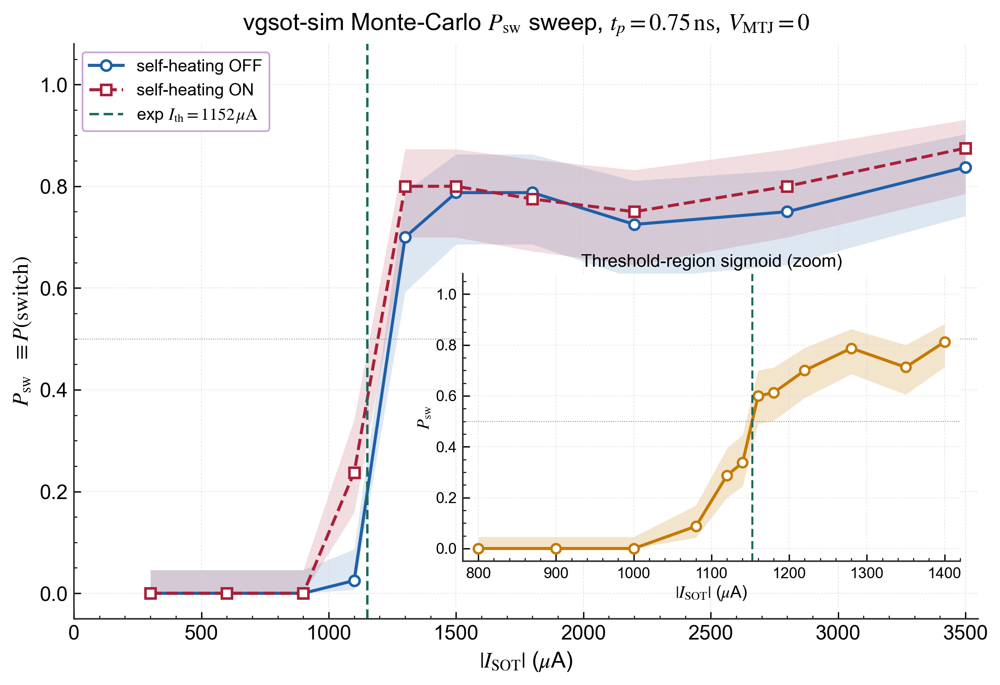

# `scripts/09_simulation_figures/` — vgsot-sim chapter figures

This directory is the latest research output: a small driver bundle that runs
the calibrated `vgsot_sim` library through the §2.3.3 detailed-P_sw protocol
(write pulse `t_w = 0.75 ns`, `V_MTJ = 0`, P→AP) and renders the chapter §2.3
figures that close the loop between simulation and Device A measurements.

The §2.3.4 calibration that selected `theta_SH = 0.04` as the package default
also lives here — `calibrate_to_experiment.py` is the scan that produced the
calibration table.

## Files

| File | Output | Purpose |
|---|---|---|
| `plot_single_trajectory.py` | `Chapter02_local_08.png` | Single-trajectory `(m_z, R_MTJ, I_SOT)` for sub- / marginal / just-above / super-threshold `I_SOT` ∈ {−600, −1100, −1300, −2000} µA, self-heating ON, 0.75 ns write + 3.25 ns relax |
| `plot_3d_trajectory.py` | `Chapter02_local_09.png` | Magnetisation vector `m(t)` on the unit sphere with time-encoded colour (cool→warm), plus Cartesian `m_x, m_y, m_z` time series for a super-threshold pulse |
| `plot_ser_mc.py` | `Chapter02_local_10.png` | Monte-Carlo P_sw vs `\|I_SOT\|` sweep at 0.75 ns with **Wilson 95 % CI**, self-heating OFF vs ON, and a threshold-region zoom inset around the experimental `I_th ≈ 1152 µA` |
| `calibrate_to_experiment.py` | stdout | `theta_SH` scan that picks the default; reports `V_th(0.75 ns)` and slope `β_s` per candidate, ranked by closeness to Device A P→AP target `V_th = 894 mV` |

Each script also `shutil.copy`-mirrors its PNG into
`../../article/00_chapter_drafts/figs/` so the manuscript and the code stay
in lock-step. Delete that trailing copy block if you only want the local file.

### Generated figures

The latest rendered outputs (also under `../../article/00_chapter_drafts/figs/`):

#### `Chapter02_local_08.png`

`(m_z, R_MTJ, I_SOT)` time series for four representative `I_SOT` values
spanning the threshold zone at 0.75 ns, self-heating ON.



#### `Chapter02_local_09.png`

Magnetisation vector `m(t)` traced on the unit sphere for the super-threshold
`I_SOT = −2 mA` pulse, plus Cartesian components vs time. Time is encoded by
the cool→warm colour gradient.



#### `Chapter02_local_10.png`

Monte-Carlo `P_sw(|I_SOT|)` at `t_w = 0.75 ns`, self-heating OFF vs ON, with
Wilson 95 % CI bands. The inset zooms the threshold region around the
experimental `I_th = 1152 µA` (teal dashed line).



## Quick start

From the repository root, after `pip install -e .`:

```bash
# All three chapter figures
python scripts/09_simulation_figures/plot_single_trajectory.py
python scripts/09_simulation_figures/plot_3d_trajectory.py
python scripts/09_simulation_figures/plot_ser_mc.py

# Calibration scan (re-derive theta_SH default)
python scripts/09_simulation_figures/calibrate_to_experiment.py
```

The MC SER plot is the slow one (~10 minutes on a single core for the default
sweep × 80 trials × {OFF, ON} × {wide, inset}). The two single-shot trajectory
plots finish in seconds.

## `plot_ser_mc.py` CLI flags

`plot_ser_mc.py` exposes the new physics toggles via the command line so the
figure can be re-rendered under different reproducibility / integrator regimes
without editing source:

| Flag | Default | Effect |
|---|---|---|
| `--metric={psw,ser}` | `psw` | Y-axis: switching success probability (chapter convention) or legacy SER = 1 − P_sw |
| `--rng-mode={legacy,generator}` | `legacy` | Per-trial RNG: `np.random.seed(...)` (chapter-figure bit-stream) vs `np.random.default_rng(...)` (multiprocessing-friendly). Both share `_trial_seed(seed, i_sot, idx)`. |
| `--integrator={euler_spherical,cayley}` | `euler_spherical` | LLG step type. Cayley is norm-preserving with explicit `σ̂_SH` but reports a ~10 % higher threshold at 0.75 ns; the chapter calibration targets the Euler default. |

Example: regenerate the SER figure under the multiprocessing-friendly RNG mode
with the norm-preserving stepper, reporting SER directly instead of P_sw:

```bash
python scripts/09_simulation_figures/plot_ser_mc.py \
    --metric=ser --rng-mode=generator --integrator=cayley
```

## Calibration target

`calibrate_to_experiment.py` benchmarks each candidate against the same-batch
Device A P→AP @ 0.75 ns operating point (chapter §2.3.3 Sigmoid fit):

| Quantity | Target |
|---|---|
| Pulse width `t_w` | 0.75 ns |
| Pulse polarity | P → AP |
| Threshold voltage `V_th` | 894 mV |
| Implied current threshold `I_th = V_th / R_W` | ≈ 1152 µA  (R_W ≈ 776 Ω) |
| Sigmoid slope `β_s` | 44.6 V⁻¹ |

The current package default `theta_SH = 0.04` reproduces `V_th` to within ~1 %.
For bare-material studies, override the constant explicitly:

```python
from vgsot_sim.configs import PhysicalConstantsConfig
cc = PhysicalConstantsConfig(theta_SH=0.25)   # literature β-W
```

## See also

- [`docs/maintenance/IMPLEMENTATION_STATUS.md`](../../docs/maintenance/IMPLEMENTATION_STATUS.md) — feature coverage map (entries marked "2026-05" describe the new opt-in toggles exercised here)
- [`docs/technical_details.md` §2.3](../../docs/technical_details.md) — calibration story behind `theta_SH = 0.04`
- [`docs/maintenance/version_notes.md`](../../docs/maintenance/version_notes.md) — release-by-release physics changes
- [`scripts/06_psw_t_fitting/`](../06_psw_t_fitting/) and [`scripts/07_process_variability/`](../07_process_variability/) — wafer-measurement and PDK-mismatch processing that produces the calibration target above
